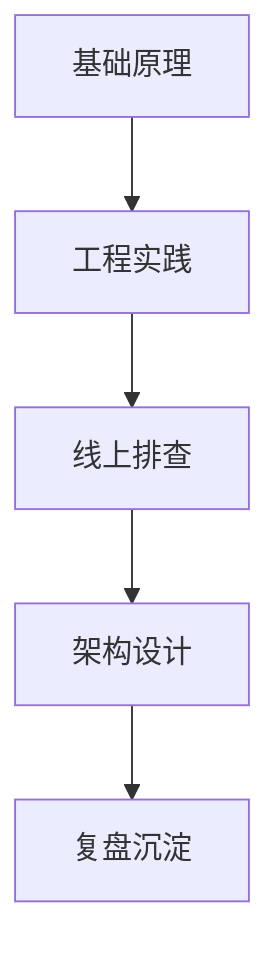

# 学习路线与建设计划

> 这份 roadmap 用来回答两个问题：怎么复习，以及这个知识库接下来怎么继续沉淀。

## 一、能力分层



| 层级 | 能力 | 代表内容 |
| --- | --- | --- |
| 基础原理 | 能讲清机制 | Go、OS、MySQL、Redis、MQ |
| 工程实践 | 能写好服务 | 连接池、超时、重试、幂等、测试、发布 |
| 线上排查 | 能定位问题 | 高 CPU、OOM、慢 SQL、消息积压、网络抖动 |
| 架构设计 | 能做取舍 | 高并发、高可用、一致性、成本、复杂度 |
| 复盘沉淀 | 能形成方法 | 事故复盘、项目复盘、面试表达、Runbook |

## 二、三个月复习路线

### 第 1 阶段：基础和中间件

目标：把高频基础题回答稳定。

```text
01-go-language
02-os
03-mysql
04-redis
05-message-queue
```

重点输出：

- 每个核心问题能 2 分钟讲清。
- 每个中间件至少掌握 3 个线上坑。
- 能说清 Go 服务里连接池、超时、重试、幂等的边界。

### 第 2 阶段：分布式和系统设计

目标：能回答资深后端系统设计题。

```text
06-distributed
07-microservice
08-architecture
10-system-design
11-cdn
```

重点输出：

- 能做容量估算。
- 能画核心链路。
- 能讲清一致性、可用性、成本、复杂度取舍。
- 能把 Redis、MQ、MySQL、CDN、搜索、对象存储组合起来。

### 第 3 阶段：项目复盘和表达

目标：把个人经历讲成“问题、动作、结果、沉淀”。

```text
13-engineering
14-projects
99-meta
12-ai
```

重点输出：

- 每个项目准备 2 个技术难点。
- 每个线上问题准备一套排查路径。
- 每个系统设计题准备一个 10 分钟版本和 30 分钟版本。
- 使用 AI 辅助整理复盘、生成检查清单和模拟追问。

## 三、面试前一周冲刺

### Day 1：Go + OS

- Go 并发、GMP、GC、内存逃逸、pprof。
- OS 进程线程、虚拟内存、IO、epoll、高 CPU、高内存排查。

### Day 2：MySQL

- 索引、事务、锁、MVCC、日志、主从复制、慢 SQL。
- 重点看线上案例、分库分表、订单系统设计。

### Day 3：Redis + MQ

- Redis 数据结构、缓存一致性、分布式锁、热点 key、大 key。
- MQ 可靠性、顺序、重复消费、事务消息、积压治理。

### Day 4：分布式

- CAP、Raft、分布式事务、幂等、限流、熔断、降级。
- 重点练“为什么这样选”的表达。

### Day 5：系统设计

- 短链、秒杀、Feed、IM、直播、支付、库存。
- 每题按“需求、容量、链路、存储、瓶颈、治理”复述。

### Day 6：项目复盘

- 准备 STAR。
- 准备线上事故。
- 准备性能优化案例。
- 准备失败经验和改进。

### Day 7：模拟面试

- 计时回答。
- 录音复盘。
- 用 AI 做追问。
- 修正表达里的空话和不确定点。

## 四、目录建设优先级

### 已经比较完整

- [02-os](02-os/)
- [03-mysql](03-mysql/)
- [10-system-design](10-system-design/)
- [11-cdn](11-cdn/)
- [12-ai](12-ai/)

### 下一步优先补强

| 优先级 | 目录 | 建议补强 |
| --- | --- | --- |
| P0 | [01-go-language](01-go-language/) | runtime、GC、pprof、database/sql、net/http、工程实践 |
| P0 | [04-redis](04-redis/) | 线上案例、热 key、大 key、缓存一致性、集群故障 |
| P0 | [05-message-queue](05-message-queue/) | 消息积压、重复消费、事务消息、顺序消息、死信 |
| P1 | [06-distributed](06-distributed/) | 分布式事务案例、限流熔断实战、幂等治理 |
| P1 | [13-engineering](13-engineering/) | Git、CI/CD、灰度发布、压测、监控告警 |
| P1 | [14-projects](14-projects/) | 简历项目复盘、STAR、线上问题沉淀 |
| P2 | [07-microservice](07-microservice/) | RPC、注册发现、配置中心、网关、服务治理 |
| P2 | [08-architecture](08-architecture/) | 架构演进、单体到微服务、高可用模式 |

## 五、每个专题的标准结构

建议每个文件尽量包含：

```text
1. 一句话定位
2. 核心原理
3. 架构图或流程图
4. 高频面试题
5. 线上坑和排查
6. 场景案例
7. 面试表达模板
```

不是所有文件都必须一样，但至少要避免只写概念，不写场景。

## 六、长期沉淀方式

每次遇到一个线上问题，按这个格式补进仓库：

```text
背景：
现象：
影响：
排查路径：
根因：
止血：
长期治理：
可复用经验：
面试表达：
```

每次做一个系统设计题，按这个格式沉淀：

```text
需求澄清：
容量估算：
核心链路：
数据模型：
架构设计：
一致性：
高可用：
热点治理：
监控告警：
降级预案：
```

