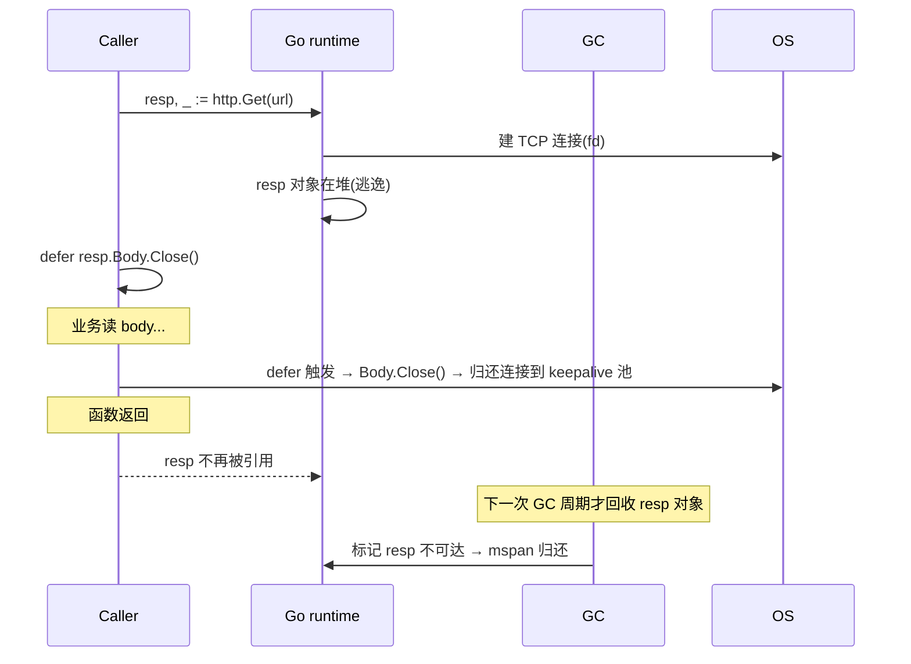

# Go 语言对比与设计哲学

> 面试里问 Go 和 Java/C++ 的区别，不是考语法表格，而是考语言设计取舍：复杂抽象、运行时、并发、错误处理和工程效率。

## 〇、一句话总结（背诵版）

Go 的设计哲学是**简单显式 + 组合优于继承 + 原生并发 + 工程效率优先**，刻意减少语言核心复杂度（无继承、无泛型异常、无重载）。和 Java/C++ 的本质差异不在语法，而在"是否愿意为了团队协作和编译速度，牺牲语言表达力"——Go 选择更小的语言核心，把复杂度留给业务而不是语言本身。

## 〇、面试如何回答（口语模板）

**Q1：Go 和 Java 最大的区别是什么？**

A：三点。第一，Go 没有 class 和继承，只有 struct 和组合，通过 interface 隐式实现来做多态；第二，Go 用 error 返回值代替异常，错误处理是显式的而不是隐藏在调用栈里；第三，Go 原生支持 goroutine 和 channel，并发是语言级特性而不是库。本质上 Go 是为"大团队 + 快编译 + 简单部署"设计的，Java 是为"企业级框架 + JVM 生态"设计的。

**Q2：Go 是面向对象语言吗？**

A：不完全是。Go 有面向对象的"接口 + 方法"，但没有 OOP 的"继承 + class"。Go 的做法是用 struct embedding 做组合，用 interface 隐式实现做多态——封装、组合、多态三个能力都有，但刻意去掉了继承。设计者认为继承是大型项目的复杂度来源，组合更灵活也更显式。

**Q3：Go 为什么没有继承？**

A：因为继承会带来"父子类紧耦合 + 多继承菱形问题 + 重写覆盖难追踪"等复杂度，而这些问题在大型项目里成本极高。Go 用 struct embedding（组合）+ interface 隐式实现来覆盖继承的两个核心场景：代码复用用组合，多态用接口。这样既保留了能力，又避免了继承层级带来的耦合。

**Q4：Go 适合什么场景，不适合什么？**

A：适合**高并发后端服务、云原生基础设施（Docker/K8s/etcd）、CLI 工具、微服务**——这些场景需要简单部署、快速编译、原生并发。不适合**复杂业务建模（缺泛型表达力，1.18 之后改善但仍弱）、GUI 桌面应用、高性能数值计算（不如 C++）、需要 JVM 生态的企业应用**。一句话：Go 是"系统编程的简化版 + Web 后端的现代版"。

## 一、一句话总结

```text
C++：追求极致性能和底层控制，提供复杂抽象能力，但复杂度高。
Java：追求面向对象、JVM 生态和企业级工程，框架能力强。
Go：追求简单、显式、组合、并发和工程效率，刻意减少语言复杂度。
```

## 二、核心差异总表

| 维度 | C++ | Java | Go |
| --- | --- | --- | --- |
| 编程范式 | 多范式，OOP + 泛型 + RAII | OOP 为主 | 过程式 + 组合 + 接口 |
| 对象模型 | class、继承、虚函数、多继承 | class、继承、interface | struct、method、interface、embedding |
| 继承 | 支持，甚至多继承 | 单继承 + 多接口 | 无 class 继承，用组合替代 |
| 多态 | 虚函数、模板 | 继承/interface 动态派发 | interface 隐式实现 |
| 内存管理 | 手动/RAII/智能指针 | JVM GC | Go runtime GC |
| 错误处理 | 返回码/异常混用 | 异常 | error 返回值 |
| 并发 | thread、future、协程库 | Thread、线程池、CompletableFuture | goroutine + channel |
| 部署 | native binary | JVM + jar | native binary |
| 工程风格 | 灵活但复杂 | 框架重、生态强 | 工具统一、语法克制 |

## 三、为什么会有封装、继承、多态

OOP 三大特性最初是为了解决大型软件复杂度。

### 1. 封装

目标：

```text
隐藏内部实现，只暴露稳定接口。
```

好处：

- 降低调用方理解成本。
- 内部实现可以替换。
- 保护不变量。
- 避免外部随意修改状态。

C++ / Java：

```java
class Account {
    private int balance;

    public void deposit(int amount) {
        if (amount <= 0) throw new IllegalArgumentException();
        balance += amount;
    }
}
```

Go：

```go
type Account struct {
    balance int
}

func (a *Account) Deposit(amount int) error {
    if amount <= 0 {
        return errors.New("invalid amount")
    }
    a.balance += amount
    return nil
}
```

Go 也有封装，只是用：

- 包级可见性。
- 首字母大小写控制导出。
- struct 字段是否导出。

### 2. 继承

目标：

```text
复用父类代码，并表达 is-a 关系。
```

Java：

```java
class Dog extends Animal {
}
```

问题：

- 父类和子类强耦合。
- 层级越深越难理解。
- 父类改动可能影响所有子类。
- 继承容易被滥用成代码复用工具。

Go 刻意没有 class 继承。

Go 更推荐：

```text
组合优于继承。
```

```go
type Logger struct{}

func (Logger) Info(msg string) {}

type UserService struct {
    logger Logger
}

func (s *UserService) CreateUser() {
    s.logger.Info("create user")
}
```

Go 也有 embedding：

```go
type BaseService struct{}

func (BaseService) Log(msg string) {}

type UserService struct {
    BaseService
}
```

但 embedding 不是继承，它更像语法层面的字段提升。Go 没有父子类型替换关系。

### 3. 多态

目标：

```text
调用方依赖抽象，而不是依赖具体实现。
```

Java：

```java
interface Payment {
    void Pay(int amount);
}

class Alipay implements Payment {}
class WechatPay implements Payment {}
```

Go：

```go
type Payment interface {
    Pay(amount int) error
}

type Alipay struct{}

func (Alipay) Pay(amount int) error {
    return nil
}
```

Go 的关键差异：

```text
接口是隐式实现。
一个类型只要方法集匹配，就自动满足接口。
```

这使得 Go 的接口更适合“使用方定义”：

```go
type OrderService struct {
    payment interface {
        Pay(amount int) error
    }
}
```

## 四、Go 为什么弱化继承

Go 不是“不支持面向对象”，而是拒绝复杂的继承体系。

原因：

- 深继承层级难维护。
- 多继承容易产生菱形问题。
- 继承把复用和多态绑在一起。
- 大型框架容易依赖隐式魔法。
- Go 更重视代码可读性和显式依赖。

Go 的替代方案：

| OOP 目标 | Go 做法 |
| --- | --- |
| 封装 | package + 大小写导出规则 |
| 代码复用 | struct 组合 / embedding |
| 多态 | interface |
| 扩展能力 | 小接口 + 依赖注入 |
| 生命周期管理 | 显式构造函数 |

## 五、Go 的对象模型

Go 没有 class，但有对象式能力：

```go
type User struct {
    ID   int64
    Name string
}

func (u *User) Rename(name string) {
    u.Name = name
}
```

这说明：

- struct 承载数据。
- method 承载行为。
- interface 承载抽象。
- package 承载边界。

Go 的设计更像：

```text
数据 + 方法 + 小接口 + 显式组合
```

而不是：

```text
类层级 + 继承树 + 框架注入
```

## 六、Go 和 Java 的核心区别

### 1. 接口实现方式

Java：

```text
显式 implements
```

Go：

```text
隐式满足接口
```

影响：

- Java 类型关系更明确。
- Go 解耦更自然。
- Go 更适合小接口。

### 2. 错误处理

Java：

```text
异常可能隐藏控制流。
```

Go：

```text
error 是返回值，调用方显式处理。
```

### 3. 框架风格

Java 常见：

```text
Spring / 注解 / AOP / 反射 / 运行时代理
```

Go 常见：

```text
显式构造 / 明确依赖 / 少魔法
```

### 4. 并发模型

Java：

```text
线程池 + Future + CompletableFuture
```

Go：

```text
goroutine + channel + context
```

Go 并发轻，但也更需要注意：

- goroutine 泄漏。
- context 取消。
- channel 阻塞。
- 共享内存加锁。

## 七、Go 和 C++ 的核心区别

### 1. 内存管理

C++：

- 手动管理。
- RAII。
- 智能指针。
- 析构函数。

Go：

- GC。
- 逃逸分析。
- runtime 管理堆。

取舍：

```text
C++ 控制力更强，复杂度更高。
Go 开发效率更高，牺牲部分底层控制。
```

### 2. 泛型和模板

C++ 模板非常强大，可以元编程，但复杂。

Go 泛型比较克制，主要解决：

- 容器。
- 通用算法。
- 类型安全工具函数。

Go 不鼓励把业务代码写成复杂类型体操。

### 3. 性能和部署

C++：

- 极致性能。
- 适合系统底层、游戏引擎、交易系统、数据库内核。

Go：

- 性能足够好。
- 开发效率和部署简单。
- 适合微服务、网关、云原生、基础设施。

## 八、对象生命周期对比(C / C++ / Go)

> 这一节解释**为什么 Go 程序员"不用关心内存,但要关心 goroutine 和 Close"**——本质是三种语言在"什么时候释放"上选了完全不同的取舍。

### 8.1 一句话定位

| 语言 | 释放策略 | 心智模型 |
| --- | --- | --- |
| **C** | **手动 `free`** | 全靠纪律,UAF / leak / double-free 全靠人盯 |
| **C++** | **RAII + 智能指针(析构是确定的)** | 对象出作用域,**编译期插入析构调用** |
| **Go** | **GC(内存)+ defer(资源)** | 内存不用管;**外部资源仍要 `defer xxx.Close()`** |

> **关键认知**:Go 是"**用 GC 解放程序员管内存,但不解放程序员管资源**"——文件 / 锁 / 连接 / goroutine **不会被 GC 兜底释放**。

### 8.2 多维度对比表

| 维度 | C | C++ | **Go** |
| --- | --- | --- | --- |
| 栈/堆决策 | 程序员显式(`Widget w` vs `malloc`) | 程序员显式(`Widget w` vs `new`) | **编译器逃逸分析自动决定** |
| 内存释放 | 手动 `free` | 析构函数 / `unique_ptr` / `shared_ptr` | **三色标记并发 GC** |
| 释放时机 | 显式调用那一刻 | **确定性**(作用域 `}` 那一刻) | **不确定**(下一次 GC 周期) |
| 异常 / panic 安全 | goto cleanup 手写 | **栈展开自动调析构** | **defer 自动执行**(panic 也走 defer) |
| 外部资源 | 自己 fopen/fclose | RAII 包一层 → 自动 | **`defer Close()` 手动**(GC 不管) |
| 所有权语义 | 文档约定 | **类型系统**(unique/shared/weak) | **无所有权**,全部共享 + GC 兜底 |
| 共享所有权 | refcount 自己写 | `shared_ptr`(atomic refcount) | **GC 自然支持** |
| 循环引用 | 自己防 | `shared_ptr` 循环会泄漏 → `weak_ptr` | **GC 标记可达性,循环引用不泄漏** |
| 并发安全 | 自觉 | 自觉 | **race detector + channel 范式** |
| 性能开销 | **0**(最快) | **0**(零成本抽象) | **GC 暂停 < 1ms + 写屏障开销** |
| 心智成本 | 中(全是坑) | **重**(move / Rule of 5 / 模板) | **轻**(GC + defer 两板斧) |
| 典型 bug | UAF / 泄漏 / double-free | 循环引用 / 析构抛异常 / `new[]` 配 `delete` | **goroutine 泄漏** / channel 不关 |

### 8.3 同一个场景三种写法

**场景**:打开文件 → 读内容 → 自动释放

```c
// C — 手动配对 + goto cleanup
int read_file(const char *path) {
    FILE *f = fopen(path, "r");
    if (!f) return -1;
    char *buf = malloc(4096);
    if (!buf) { fclose(f); return -1; }
    // ... 业务 ...
    free(buf);
    fclose(f);
    return 0;
}
```

```cpp
// C++ — RAII,出作用域自动释放(异常也安全)
int read_file(const std::string& path) {
    std::ifstream f(path);              // 析构关闭
    std::vector<char> buf(4096);        // 析构 free
    // ... 业务 ...
    return 0;
}   // }  ← buf 析构 → f 析构(逆序)
```

```go
// Go — defer 显式注册,函数返回时执行
func ReadFile(path string) error {
    f, err := os.Open(path)
    if err != nil { return err }
    defer f.Close()                     // 必须手写;GC 不会及时关 fd
    buf := make([]byte, 4096)           // GC 管,不用 free
    // ... 业务 ...
    return nil
}
```

**对比要点**:
- C 显式三步,异常路径要 goto
- C++ 零代码,作用域结束**确定性**析构
- Go 中间路线:**内存自动**(`buf` 不用 free),**资源显式**(`f.Close()` 必须 defer)

### 8.4 协作时序(典型 HTTP 请求里的生命周期)



**关键**:**fd / TCP 连接由 `Close()` 立刻释放**(同步),**resp 结构体内存由 GC 异步回收**(可能延迟几百 ms)。把这两件事混为一谈是 Go 内存泄漏的最常见根源。

### 8.5 缺一不可:Go 为什么不能只靠 GC

假设 Go **只有 GC 没有 defer**:

| 场景 | 后果 |
| --- | --- |
| `os.Open` 后不调 Close | fd 累积 → `too many open files`(GC 触发不及时,可能几秒后才 finalizer) |
| `mu.Lock()` 后不 Unlock | 锁永久持有,其他 G 卡死(GC 看不到 mu 引用语义) |
| `db.Conn` 不归还 | 连接池打满,后续请求阻塞 |
| HTTP body 不 Close | 连接泄漏 + 后台 G 泄漏 |

→ **GC 解决不了"资源时效性"问题**。`runtime.SetFinalizer` 看似能兜底,但**触发时机完全不确定**(可能永不触发),官方明确"不要依赖"。

### 8.6 怎么选(语言层面)

| 业务诉求 | 选谁 |
| --- | --- |
| 极致性能 + 极致控制(OS 内核、嵌入式、HFT)| **C / Rust** |
| 复杂业务 + 性能敏感 + 团队能驾驭 RAII | **C++ / Rust** |
| 后端服务 + 微服务 + 云原生 + **工程效率优先** | **Go**(GC 心智成本最低) |
| 编译期内存安全 + 零成本抽象 | **Rust**(borrow checker 取代 GC) |

### 8.7 资深表达

> "Go 的对象生命周期是**三层协作**:
>
> 1. **逃逸分析(编译期)**——决定栈/堆,栈分配几乎零成本
> 2. **GC(运行时)**——三色标记 + 写屏障,STW < 1ms,但**释放时机不确定**
> 3. **defer + ctx(程序员)**——外部资源(fd / 锁 / 连接 / goroutine)必须显式释放
>
> 和 C++ 对比:**C++ RAII 的析构是确定性的**(作用域 `}` 那一刻),**Go GC 是不确定性的**(下一次周期)——这就是为什么 Go 仍需要 `defer Close()`,而 C++ 可以让 `unique_ptr` 一统江湖。
>
> **Go 最常见的'生命周期 bug'不是内存泄漏**(GC 兜底),**而是 goroutine 泄漏**——channel 不关、ctx 不传、select 没退出分支是三大元凶。每个 `go func()` 都必须想清楚怎么退出。
>
> 三种语言的取舍可以概括为:**C 给你刀,什么都能切但容易切到手;C++ 给你刀套,栈出口自动归鞘;Go 给你 GC 园丁,但水管子还是要自己关。**"

### 8.8 一句话总结

> **C 手动 / C++ RAII 确定性析构 / Go GC + defer**——三条路线代表了"控制力 vs 心智成本"光谱上的三个点;
>
> - **C++ 的 RAII 是确定性的**(作用域结束析构),**Go 的 GC 是不确定性的**(下一次周期)
> - **Go GC 只管内存**,fd / 锁 / 连接 / goroutine 必须 `defer Close()`
> - **goroutine 泄漏比内存泄漏更常见**,这是 Go 独有的生命周期问题
> - 详见 [../03-runtime/escape-analysis.md](../03-runtime/escape-analysis.md) / [gc.md](../03-runtime/gc.md) / [goroutine-leak.md](../03-runtime/goroutine-leak.md)

---

## 九、常见面试题

### Go 是面向对象语言吗？

可以说：

```text
Go 支持面向对象的部分思想，比如封装、方法和接口，但它不是传统 class-based OOP 语言。
Go 没有 class 和继承，主要通过 struct + method 表达对象，通过 interface 实现多态，通过组合替代继承。
```

### Go 为什么没有继承？

```text
Go 认为继承容易导致强耦合和复杂层级，所以用组合和接口替代。
代码复用用组合，多态用 interface，两者分开，比继承更简单清晰。
```

### Go 如何实现多态？

```text
Go 通过 interface 实现多态。一个类型不需要显式声明 implements，只要方法集满足接口，就自动实现。
这让接口可以由使用方定义，更利于解耦和测试。
```

### Go 的封装怎么做？

```text
Go 通过 package 和标识符首字母大小写做封装。
大写导出，小写包内可见。struct 字段也遵循这个规则。
```

### Go 和 Java 最大区别？

```text
Java 更偏传统 OOP 和 JVM/Spring 生态，Go 更偏简单、显式、组合、原生并发和单二进制部署。
Java 依赖框架和注解较多，Go 更强调少魔法和可读性。
```

### Go 和 C++ 最大区别？

```text
C++ 追求底层控制和极致性能，支持复杂 OOP、模板和手动内存管理。
Go 更关注工程效率、简单语法、GC、goroutine 并发和部署便利。
```

## 九、常见坑

- 把 Go interface 当成 Java interface 用，提前定义大接口。
- 为了复用滥用 embedding。
- 用 Java/Spring 思维写 Go，搞复杂依赖注入和注解式框架。
- 把 panic 当异常用。
- 过度抽象，导致 Go 代码不直观。

## 十、面试表达

```text
我理解 Go 的核心不是“没有面向对象”，而是选择了更简单的对象模型。
C++ 和 Java 通过 class、继承、多态来组织复杂系统，Go 保留了封装和多态，但去掉了继承树，改用组合和隐式接口。
这样做牺牲了一些传统 OOP 的表达方式，但换来更低的复杂度、更清晰的依赖和更好的工程可读性。
所以写 Go 时，我会优先用小接口、组合、显式构造和错误返回，而不是照搬 Java 的继承和框架思维。
```

