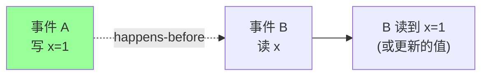
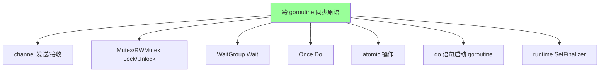

# Go 内存模型

> happens-before / 数据竞争 / 原子操作 / atomic / race detector / Go 1.19 对齐 C++ / sync 的同步保证

## 一、核心原理

### 1.1 为什么需要内存模型

现代 CPU + 编译器会**乱序执行**和**缓存可见性延迟**：

```go
// goroutine A
x = 1
done = true

// goroutine B
if done {
    print(x)  // 可能打印 0！
}
```

原因：
- **编译器重排**：认为 `x=1` 和 `done=true` 无依赖，可能调换顺序
- **CPU 乱序**：store buffer、cache line 导致其他核看到的顺序不同
- **缓存一致性延迟**：A 核写了内存，B 核的 cache 可能还没更新

**内存模型 = 告诉你：什么情况下一个 goroutine 写的数据，另一个 goroutine 能读到**。

### 1.2 happens-before 关系

> **如果事件 A happens-before 事件 B，那么 A 的结果对 B 可见**



没有 happens-before 关系 → **数据竞争**（data race）→ 结果未定义。

### 1.3 单 goroutine 内：程序顺序

同一个 goroutine 内，**源码顺序 = happens-before 顺序**（读写单个变量的视角上）。

```go
x := 1        // A
y := x + 1    // B
// A happens-before B，B 能看到 x=1
```

但这只是**本 goroutine 视角**。跨 goroutine 看不一定是这个顺序。

### 1.4 跨 goroutine 的同步原语

Go 内存模型规定**哪些操作建立 happens-before**：



## 二、具体同步保证（Go 官方内存模型）

### 2.1 channel

```go
// 规则 1: 在 channel 上的一次发送 happens-before 对应的接收完成
var a string
var c = make(chan int, 10)

func f() {
    a = "hello"       // A
    c <- 0            // B: send
}

func g() {
    <-c               // C: receive
    print(a)          // D: 保证打印 "hello"
}
// A hb B hb C hb D → A hb D
```

```go
// 规则 2: channel 关闭 happens-before 所有收到零值的接收
var a string
var c = make(chan int)

func f() {
    a = "hello"
    close(c)
}

func g() {
    <-c            // 收到零值 (channel 已关)
    print(a)       // 保证看到 "hello"
}
```

```go
// 规则 3: 无缓冲 channel 的 receive happens-before send 完成
// （反直觉！）
var a string
var c = make(chan int)

func f() {
    a = "hello"
    <-c           // 接收 (B)
}

func main() {
    go f()
    c <- 0        // 发送 (A)，A 完成意味着 B 已接收
    print(a)      // 打印 "hello"
}
```

**总结**：
| 操作 | happens-before |
| --- | --- |
| 第 k 次发送 | 第 k 次接收完成 |
| close(c) | 从 c 收到零值 |
| 无缓冲 c 的接收完成 | 对应发送完成 |
| 第 k 次接收 | 缓冲容量 C 时第 (k+C) 次发送完成 |

### 2.2 Mutex / RWMutex

```go
var mu sync.Mutex
var a string

func f() {
    mu.Lock()
    a = "hello"         // A
    mu.Unlock()         // B
}

func g() {
    mu.Lock()           // C
    print(a)            // D: 保证打印 "hello"
    mu.Unlock()
}
// B hb C → A hb D
```

**规则**：第 n 次 Unlock happens-before 第 (n+1) 次 Lock。

**RWMutex**：第 n 次 Unlock happens-before 之后的 Lock；第 n 次 RUnlock happens-before 之后的 Lock。

### 2.3 Once

```go
var once sync.Once
var conn *Conn

func getConn() *Conn {
    once.Do(func() {
        conn = newConn()  // 只执行一次
    })
    return conn
}
```

**规则**：`once.Do(f)` 中 f 的返回 happens-before 所有 `once.Do` 的返回。

保证：所有 goroutine 看到的 `conn` 都是初始化好的。

### 2.4 WaitGroup

```go
var wg sync.WaitGroup
var a string

wg.Add(1)
go func() {
    a = "hello"  // A
    wg.Done()    // B
}()
wg.Wait()        // C
print(a)         // D: 保证打印 "hello"
// B hb C → A hb D
```

**规则**：`Done` happens-before 从 `Wait` 返回（且计数归零）。

### 2.5 go 语句

```go
var a string

func main() {
    a = "hello"      // A
    go func() {      // B: 启动 goroutine
        print(a)     // C: 保证打印 "hello"
    }()
}
// A hb B hb C
```

**规则**：`go f()` 语句 happens-before f 的执行开始。

**反过来不成立**：goroutine 的结束**不**和任何事件建立 happens-before，除非用同步原语。

### 2.6 atomic（Go 1.19+）

Go 1.19 引入明确的 atomic 内存模型（对齐 C++ sequentially consistent）：

```go
// Go 1.19+ 保证：
// atomic 操作等价于 sync/channel 提供的 happens-before
var flag atomic.Bool
var data string

// goroutine A
data = "hello"          // 1
flag.Store(true)        // 2 atomic store

// goroutine B
for !flag.Load() {}     // 3 atomic load
print(data)             // 4 保证打印 "hello"
```

**Go 1.19 之前**：atomic 的同步语义不明确，大家靠"看起来可以"；1.19+ 明确等价于 sync 操作的同步。

## 三、八股速记

- **内存模型 = 跨 goroutine 读写的可见性 + 顺序规则**
- **happens-before** 是核心抽象：A hb B → A 的结果对 B 可见
- **单 goroutine 内程序顺序就是 hb 顺序**（写后读能看到）
- **跨 goroutine 必须用同步原语**：channel / mutex / atomic / WaitGroup / Once / go 语句
- **channel 发送 hb 接收完成**；**关闭 hb 收到零值**
- **Unlock hb 下一次 Lock**
- **Done hb Wait 返回**
- **once.Do(f) 里 f 的完成 hb 所有 once.Do 返回**
- **`go f()` hb f 开始执行**（反向不成立）
- **atomic 从 Go 1.19 起提供明确 hb 保证**（等价 sync）
- **没有 hb 关系 = 数据竞争 = 未定义行为**
- **用 race detector** `go test -race` 发现数据竞争

## 四、面试真题

**Q1：什么是 happens-before？**

A：Go 内存模型里的**偏序关系**：若 A happens-before B，则 A 的写对 B 可见（B 能读到 A 写的新值或更新的值）。

没有 hb 关系 → 不保证可见 → 数据竞争。

**Q2：什么是数据竞争？后果是什么？**

A：两个 goroutine 并发访问同一变量，至少一个是写，且**没有用同步原语建立 hb**。

后果：
- 值不一致（读到中间态）
- 程序行为**未定义**（Go spec 原话 "undefined behavior"）
- 可能表现为：崩溃、死循环、数据错乱、偶发 bug

不是"大概率没事"，是**未定义**。

**Q3：怎么检测数据竞争？**

A：Go 自带 race detector：

```bash
go run -race main.go
go test -race ./...
go build -race
```

原理：编译时插桩每个内存访问，运行时用 **vector clock** 检测是否有不经过同步原语的并发读写。

代价：内存 5-10 倍，CPU 2-20 倍。**生产别开**，测试/CI 必开。

**Q4：`i++` 是原子的吗？**

A：**不是**。

```go
var n int
// 1000 个 goroutine 各 i++ 1000 次
// 最后 n 可能是 ≈ 几十万，不是 100 万
```

`i++` 拆解为 load + add + store 三步，并发下会丢写。

**修复**：
- `atomic.AddInt64(&n, 1)` （最轻量）
- `mu.Lock(); n++; mu.Unlock()` （适合复合操作）
- 用 channel 串行化

**Q5：atomic 的内存序保证是什么？**

A：Go 1.19+ 规定 atomic 操作**等价于 sequentially consistent**（顺序一致性）：

- 所有 goroutine 看到的 atomic 操作顺序一致
- atomic 操作前后的普通读写**不会被重排跨过** atomic
- 提供与 channel/Mutex 同等的 hb 保证

Go 1.19 之前靠约定俗成，1.19 之后写进 spec。

**Q6：channel 能代替 Mutex 吗？**

A：从功能看可以，但各有适用：

| 场景 | 推荐 |
| --- | --- |
| 保护共享状态（读写字段） | Mutex |
| 传递数据、所有权转移 | channel |
| 一次性事件广播 | close(channel) |
| 引用计数、标志位 | atomic |
| 复杂协作 | channel + select |

**Go 格言**："通过通信共享内存，不要通过共享内存通信"，但 Mutex 也是正确工具，不要所有场景硬套 channel。

**Q7：双重检查锁定（DCL）在 Go 里怎么写？**

A：**用 sync.Once**，别手写 DCL：

```go
// ❌ 手写 DCL：容易错（Go 1.19 前 atomic 语义不明）
if instance == nil {
    mu.Lock()
    if instance == nil {
        instance = newInstance()
    }
    mu.Unlock()
}

// ✅ 用 Once
var once sync.Once
var instance *T
func Get() *T {
    once.Do(func() { instance = newInstance() })
    return instance
}
```

sync.Once 内部已经正确处理了内存序。

**Q8：goroutine 的启动/结束和 hb 的关系？**

A：
- **启动**：`go f()` 语句 happens-before f 开始执行（调用方的写对新 goroutine 可见）
- **结束**：**不**建立 hb。goroutine 返回不意味着其他 goroutine 能看到它的写。

想等 goroutine 结束看到其写，必须用 **WaitGroup / channel / context**：

```go
// ❌ 反例
done := false
go func() {
    data = "hello"
    done = true       // 没保证可见
}()
for !done {}          // 可能永远循环
print(data)

// ✅ 用 WaitGroup
var wg sync.WaitGroup
wg.Add(1)
go func() {
    data = "hello"
    wg.Done()
}()
wg.Wait()
print(data)           // 保证 "hello"
```

**Q9：无缓冲 channel 的"接收 hb 发送完成"怎么理解？**

A：无缓冲 channel 是**同步会合**：发送必须等接收方就绪。

```go
ch := make(chan int)
// A
go func() {
    x = 1      // (a)
    <-ch       // (b) 接收完成
}()
ch <- 0        // (c) 发送完成
print(x)       // (d) 保证 x=1
```

直觉上"发送先完成才接收"，但 Go spec 定义是**接收 hb 发送完成**。因为：
- 发送必须等接收方到场才返回
- 发送"完成"时刻 = 接收方已经处理了本次传输
- 所以 (b) hb (c) → (a) hb (d)

有缓冲 channel 是另一套规则（发送 hb 接收完成）。

**Q10：volatile 在 Go 里对应什么？**

A：**Go 没有 volatile 关键字**。

Java/C 的 volatile 保证可见性 + 禁止重排。在 Go 里对应：
- **atomic 包**：`atomic.Load/Store/Add` 提供原子 + hb 保证
- **Mutex 保护的普通读写**：Lock/Unlock 提供 hb

所以 Go 里**不存在"加个 volatile 就行"的快捷方式**，必须用 sync 或 atomic。

## 五、手写实现

### 5.1 用 atomic 实现单生产单消费无锁队列（进阶）

```go
// 单生产者单消费者环形队列
type SPSCQueue struct {
    buf  []interface{}
    mask uint64
    head atomic.Uint64  // 生产者写
    tail atomic.Uint64  // 消费者读
}

func New(cap uint64) *SPSCQueue {
    // cap 必须是 2 的幂
    return &SPSCQueue{buf: make([]interface{}, cap), mask: cap - 1}
}

func (q *SPSCQueue) Push(v interface{}) bool {
    h := q.head.Load()
    t := q.tail.Load()
    if h-t >= uint64(len(q.buf)) {
        return false  // full
    }
    q.buf[h&q.mask] = v
    q.head.Store(h + 1)  // 发布写
    return true
}

func (q *SPSCQueue) Pop() (interface{}, bool) {
    t := q.tail.Load()
    h := q.head.Load()  // 观察到的 head
    if t == h {
        return nil, false  // empty
    }
    v := q.buf[t&q.mask]
    q.tail.Store(t + 1)
    return v, true
}
```

**为什么能工作**：`atomic.Store(head)` happens-before `atomic.Load(head)`，保证 `buf[h]` 的写对消费者可见。

### 5.2 发布-订阅（类似 java 的 volatile 发布）

```go
type Config struct {
    // ... 大对象
    Version int
}

var current atomic.Pointer[Config]

// 发布端（单个 goroutine）
func UpdateConfig(c *Config) {
    c.Version++
    current.Store(c)  // atomic 发布
}

// 订阅端（多个 goroutine）
func GetConfig() *Config {
    return current.Load()  // atomic 读
}
```

`atomic.Pointer[T]` 是 Go 1.19+ 泛型原子指针，典型无锁热更新配置。

## 六、踩坑与最佳实践

### 坑 1：用 bool 做"完成"标志不带同步

```go
// ❌
done := false
go func() { done = true }()
for !done {}  // 可能永远不退出

// ✅
done := make(chan struct{})
go func() { close(done) }()
<-done

// 或
var done atomic.Bool
go func() { done.Store(true) }()
for !done.Load() {}
```

### 坑 2：sync.Map 不等于"所有场景更快"

sync.Map 适合 **write-once-read-many**。频繁写反而比 Mutex + map 慢 5-10 倍。

**建议**：除非明确读多写少（如缓存、注册表），否则用普通 map + RWMutex。

### 坑 3：复制 Mutex

```go
// ❌
type Counter struct {
    mu sync.Mutex
    n  int
}

func bug(c Counter) {  // 值传递 → 复制了 Mutex
    c.mu.Lock()
    c.n++
    c.mu.Unlock()
}

// ✅
func good(c *Counter) { ... }
```

`go vet` 能检测这类错误。

### 坑 4：atomic 地址未对齐

Go 1.19 之前 32 位平台上 `atomic.AddInt64` 要求 8 字节对齐：

```go
// ❌ 32 位平台可能崩
type T struct {
    a int32
    b int64  // 未对齐
}

// ✅ 大字段在前
type T struct {
    b int64
    a int32
}
```

Go 1.19+ 的新 `atomic.Int64/Uint64` 类型自动对齐，**优先用新 API**。

### 坑 5：误以为 range channel 保证顺序

```go
ch := make(chan int, 100)
go func() { for i := 0; i < 10; i++ { ch <- i }; close(ch) }()
go func() { for i := 10; i < 20; i++ { ch <- i }; close(ch) }()  // 还会 panic（重复 close）

for v := range ch {
    // v 的顺序是两个 goroutine 交错
}
```

多生产者时 **只能有一个 close**，通常由"最后一个生产者"或专门的 coordinator 做。

### 坑 6：认为 `x = y` 对任意类型都是原子的

**不是**。Go 只保证机器字大小（64 位平台 8 字节）的普通指针/int 写**不会撕裂**，但**不保证其他 goroutine 立即可见**。

接口、slice、string、map 都**不是**单机器字，普通赋值可能被其他 goroutine 看到中间态。

```go
// ❌ 接口并发写读
var h Handler
go func() { h = NewHandlerA() }()
x := h  // 可能读到半更新的接口（type 指针和 data 指针不一致）
```

**修复**：用 `atomic.Value` 或 `atomic.Pointer[T]`。

### 最佳实践

```
□ 并发读写共享变量必须同步（mutex / atomic / channel）
□ CI 必跑 go test -race
□ 单例初始化用 sync.Once，不要手写 DCL
□ 热更新配置用 atomic.Pointer
□ 标志位用 atomic.Bool，不用 bool
□ 锁临界区越短越好，禁止持锁调外部
□ Mutex 不可复制（go vet 会告警）
□ 优先 Go 1.19+ 新 atomic API（类型安全 + 自动对齐）
□ 不要在 channel 上做多次 close（panic）
□ goroutine 结束不等于写可见，必须配合 wg/ctx/channel 同步
```

## 七、面试加分点

- **happens-before 是可见性 + 顺序的统一抽象**（偏序关系）
- Go 内存模型明确了**哪些同步原语建立 hb**（channel/sync/atomic/go 语句）
- **go 语句启动 hb 开始执行，但结束不 hb 任何事件**
- **Go 1.19 起 atomic 明确等价于 sync**（顺序一致性）
- **`go test -race` 是生产实战发现数据竞争的关键工具**（CI 必开）
- **单例用 sync.Once**，不要手写 DCL
- **sync.Map 只适合写少读多**（错用反而慢）
- **Mutex 不可复制**，接口/slice 不是原子的
- 数据竞争在 Go spec 里是**未定义行为**，不是"偶发 bug"
- **atomic.Pointer[T]** 是 Go 1.19+ 热更新配置利器
- 标准工作模式 **`for-select-ctx.Done()`** + 同步原语保护共享状态
