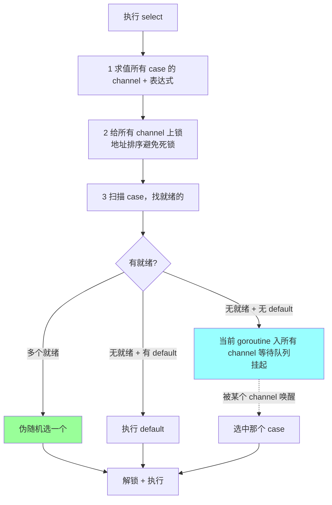

# select

> 多路复用：编译器随机化、default、空 select、nil channel、典型并发模式

## 一、核心原理

### 1.1 select 是什么

`select` 是 Go 的**多路复用语句**，从多个 channel 操作中选一个就绪的执行：

```go
select {
case v := <-ch1:
    // ch1 可读
case ch2 <- x:
    // ch2 可写
case <-time.After(time.Second):
    // 超时
default:
    // 都不就绪
}
```

### 1.2 核心规则



**关键三点**：
1. **多个就绪时随机选**（避免饥饿）
2. **没就绪 + 没 default → 阻塞**
3. **没就绪 + 有 default → 立即执行 default**（非阻塞）

### 1.3 底层实现

```go
// runtime/select.go 核心
func selectgo(cas0 *scase, order0 *uint16, ncases int) (int, bool) {
    // 1. 生成两套乱序：pollOrder（轮询顺序）+ lockOrder（加锁顺序）
    pollorder := order0[:ncases]
    lockorder := order0[ncases:]
    // pollOrder 用 fastrand 打乱 → 这就是"随机选择"的来源

    // 2. 按 lockOrder 给所有 channel 加锁（地址排序）

    // 3. 第一轮：按 pollOrder 扫描所有 case，找就绪的
    //    找到就执行；没找到 + 有 default 就走 default

    // 4. 没就绪：把当前 g 包装成 sudog 入所有 channel 等待队列，gopark

    // 5. 被唤醒：执行对应 case，从其他队列摘除自己
}
```

**性能要点**：
- 编译器对 1 个 case + default 优化为 `runtime.selectnbsend/selectnbrecv`（非阻塞收发）
- 多 case 走完整 `selectgo`，开销主要在加锁和遍历
- N 个 case 时间复杂度 O(N)

### 1.4 case 类型

| case 形式 | 含义 |
| --- | --- |
| `v := <-ch` | 接收（含值） |
| `<-ch` | 接收（丢弃值） |
| `v, ok := <-ch` | 接收 + 判断 channel 是否关闭 |
| `ch <- v` | 发送 |
| `default` | 都不就绪时执行 |

## 二、八股速记

- **多路复用**：从多个 channel 选一个就绪操作执行
- **多就绪伪随机选**（pollOrder 用 fastrand 打乱）
- **没就绪没 default → 阻塞**，所有 channel 任一就绪即唤醒
- **没就绪有 default → 立即走 default**（非阻塞模式）
- **空 select `select {}` 永久阻塞**（main 守护场景）
- **nil channel 永远不就绪**，`case <-nilCh` 永不被选中（动态屏蔽 case 的技巧）
- **关闭的 channel 接收立即就绪**（返回零值 + ok=false），常用作广播退出信号
- **每次执行 select 都重新求值 case 表达式**
- **加锁顺序按 channel 地址排序**，避免不同 select 之间死锁

## 三、面试真题

**Q1：select 多个 case 同时就绪选哪个？**

A：**伪随机选一个**。runtime 用 `fastrand` 打乱 pollOrder，避免饥饿。

加分：不能假设固定顺序。如果业务需要优先级，要嵌套 select 实现（先单独 select 高优先级 case + default，default 里再 select 全部 case）。

**Q2：select 没有 case 就绪也没 default 会怎样？**

A：**当前 goroutine 阻塞**。runtime 把 g 包成 sudog 加到所有 channel 的等待队列，调用 `gopark` 让出 P。任一 channel 操作就绪 → 唤醒 → 选中那个 case → 从其他队列摘除自己。

**Q3：`select {}` 是什么？**

A：**空 select，永久阻塞**当前 goroutine。常用于：
- main 函数守护（启动若干 goroutine 后不退出）
- 后台服务等系统信号

```go
func main() {
    go server()
    select {}  // main 永久阻塞，等服务退出
}
```

**Q4：nil channel 在 select 里的行为？**

A：**永不就绪，永不被选中**。可以用来**动态屏蔽某个 case**：

```go
var dataCh chan int = make(chan int)
var doneCh chan struct{}  // nil

for {
    select {
    case v := <-dataCh:
        process(v)
    case <-doneCh:  // 当 doneCh 是 nil 时此分支永不触发
        return
    }
}

// 想启用 doneCh 时:
doneCh = make(chan struct{})
close(doneCh)
```

**反向用法**：发送也一样，`nilCh <- v` 永远阻塞。

**Q5：怎么实现超时控制？**

A：用 `time.After` 或 `context.Done()`：

```go
select {
case v := <-ch:
    return v, nil
case <-time.After(time.Second):
    return zero, errors.New("timeout")
}
```

**坑**：`time.After` 每次都创建一个新 Timer，**循环里用会内存泄漏**直到超时。修复：

```go
timer := time.NewTimer(time.Second)
defer timer.Stop()
for {
    select {
    case v := <-ch:
        // ...
    case <-timer.C:
        return
    }
}
```

或直接用 `context.WithTimeout`。

**Q6：怎么用 select 做非阻塞收发？**

A：加 `default`：

```go
// 非阻塞发送
select {
case ch <- v:
    sent = true
default:
    sent = false  // 缓冲满，丢弃
}

// 非阻塞接收
select {
case v := <-ch:
    handle(v)
default:
    // 没数据，跳过
}
```

**典型场景**：丢弃式日志、状态采样、metrics 上报。

**Q7：关闭的 channel 在 select 里行为？**

A：**接收 case 立即就绪**，返回 `(零值, false)`。常用于**广播退出**：

```go
done := make(chan struct{})

go func() {
    for {
        select {
        case <-done:  // close 后立即就绪
            return
        case v := <-data:
            process(v)
        }
    }
}()

// 主动停止
close(done)  // 一次 close，所有 select 都能收到
```

注意：**发送到已关闭 channel 会 panic**，所以 select 里不要写已关闭 channel。

**Q8：select 性能怎么样？case 多了会不会慢？**

A：
- 编译器对 1 case + default 特殊优化（直接走非阻塞路径）
- 多 case 走 `selectgo`，开销主要是**全部加锁** + **O(N) 扫描**
- N < 10 性能足够，几十 case 也能扛
- 极端高频场景可以**手动拆 select**：高优先级一个 select、剩下一个 select

**Q9：select 怎么实现优先级？**

A：select 本身不支持优先级，要用**嵌套 select** 模拟：

```go
for {
    // 第一层：优先 high
    select {
    case v := <-high:
        handleHigh(v)
        continue
    default:
    }

    // 第二层：high 没就绪才看 low
    select {
    case v := <-high:
        handleHigh(v)
    case v := <-low:
        handleLow(v)
    case <-done:
        return
    }
}
```

注意 **busy loop 风险**：如果 high 持续不就绪 + low 也没数据，第二个 select 会阻塞，没问题；但如果 high 一直来，永远不处理 low → **饥饿**。

**Q10：select 在 for 循环里的常见模式？**

A：标准模式 `for-select-done`：

```go
func worker(in <-chan Job, done <-chan struct{}) {
    for {
        select {
        case <-done:
            return
        case job := <-in:
            process(job)
        }
    }
}
```

要点：
- `done` 通常是 `<-chan struct{}` 单向（明确意图）
- `done` 优先放前面（不影响选中概率，但可读性好）
- 通常配合 `context.Context` 用 `<-ctx.Done()` 替代

## 四、手写实现 / 典型模式

### 4.1 fan-in 合并多个 channel

```go
func merge(chs ...<-chan int) <-chan int {
    out := make(chan int)
    var wg sync.WaitGroup
    wg.Add(len(chs))
    for _, ch := range chs {
        go func(c <-chan int) {
            defer wg.Done()
            for v := range c {
                out <- v
            }
        }(ch)
    }
    go func() { wg.Wait(); close(out) }()
    return out
}
```

或者用 select 直接合并（channel 数固定时）：

```go
func merge2(a, b <-chan int) <-chan int {
    out := make(chan int)
    go func() {
        defer close(out)
        for a != nil || b != nil {
            select {
            case v, ok := <-a:
                if !ok { a = nil; continue }  // 关闭后置 nil 屏蔽该 case
                out <- v
            case v, ok := <-b:
                if !ok { b = nil; continue }
                out <- v
            }
        }
    }()
    return out
}
```

**关键技巧**：channel 关闭后**置 nil 屏蔽该 case**，避免 `case <-closedCh` 反复立即就绪导致 busy loop。

### 4.2 限时收集 N 个结果

```go
func collect(ctx context.Context, in <-chan int, n int) []int {
    var result []int
    for len(result) < n {
        select {
        case v := <-in:
            result = append(result, v)
        case <-ctx.Done():
            return result  // 超时返回已收集的
        }
    }
    return result
}
```

### 4.3 心跳 + 超时

```go
func heartbeat(ctx context.Context) {
    ticker := time.NewTicker(time.Second)
    defer ticker.Stop()

    timeout := time.NewTimer(10 * time.Second)
    defer timeout.Stop()

    for {
        select {
        case <-ticker.C:
            sendHeartbeat()
            timeout.Reset(10 * time.Second)
        case <-timeout.C:
            log.Println("no event for 10s")
            return
        case <-ctx.Done():
            return
        }
    }
}
```

### 4.4 限速 / 漏桶（基于 time.Tick）

```go
func rateLimit(reqs <-chan Req) {
    limiter := time.Tick(200 * time.Millisecond)  // 5 QPS
    for r := range reqs {
        <-limiter  // 每 200ms 放过一个
        process(r)
    }
}
```

## 五、踩坑与最佳实践

### 坑 1：`time.After` 在 for-select 里内存泄漏

```go
// ❌ 反例
for {
    select {
    case v := <-ch:
        // ...
    case <-time.After(time.Second):  // 每次循环创建新 Timer
        // 即使 case 命中，Timer 也要等 1 秒才被 GC
    }
}
```

**修复**：复用 `time.NewTimer` + `Reset`，或用 `context.WithTimeout`。

### 坑 2：default 导致 busy loop

```go
// ❌ 反例
for {
    select {
    case v := <-ch:
        process(v)
    default:
        // ch 没数据时疯狂空转，CPU 100%
    }
}
```

**修复**：去掉 default 让 select 阻塞；或加 `time.Sleep` / `<-ticker.C`。

### 坑 3：select case 表达式有副作用

```go
// ❌ 反例
select {
case ch <- compute():  // 每次 select 都调用 compute，即使 case 没选中
case <-done:
    return
}
```

`select` 启动时**所有 case 表达式都求值**，即使最后没选中。耗时函数要先算好结果。

### 坑 4：忘记关闭 channel 的 case 处理

```go
// ❌ 反例
select {
case v := <-ch:
    process(v)  // 不判断 ok，channel 关了后疯狂收 0 值
}
```

**修复**：

```go
select {
case v, ok := <-ch:
    if !ok {
        return  // channel 关闭，退出
    }
    process(v)
}
```

### 坑 5：select 嵌套实现优先级时的饥饿

```go
for {
    select {
    case v := <-high: handle(v); continue
    default:
    }
    select {
    case v := <-high: handle(v)
    case v := <-low: handle(v)
    }
}
```

如果 high 持续高速到来，**low 永远不被处理**。修复：限制每轮处理 high 的次数，强制让出。

### 坑 6：循环内变量捕获

```go
// ❌ Go 1.21 之前
for _, ch := range chs {
    go func() {
        for v := range ch { ... }  // ch 是循环变量，可能捕获到错的
    }()
}
```

Go 1.22 改了语义（每轮独立变量），1.22 之前要 `go func(c chan){...}(ch)` 显式传参。

### 坑 7：用 select 做超时但不退出 goroutine

```go
// ❌ 反例
select {
case v := <-ch:
    return v
case <-time.After(time.Second):
    return zero  // 超时返回，但 ch 那个 goroutine 可能还在跑 → 泄漏
}
```

**修复**：发送方也要监听 ctx 主动退出，或用 buffered channel + select 非阻塞发送让发送方不阻塞。

### 最佳实践

```
□ for-select-done 是并发循环标准范式
□ done 用 chan struct{} 表达"信号"语义
□ 优先 ctx.Done() 替代手写 done channel
□ time.After 在循环里要换 NewTimer + Reset
□ 关闭的 channel 置 nil 屏蔽 case
□ default 慎用，容易 busy loop
□ case 表达式无副作用（不调耗时函数）
□ 收到关闭信号后用 v, ok 判断
□ select 不能保证顺序，业务需要优先级要嵌套
□ 性能极致场景拆多个 select 减少加锁开销
```

## 六、面试加分点

- **多就绪伪随机** 防止饥饿（fastrand 打乱 pollOrder）
- **空 select `select {}` 永久阻塞**，main 守护标配
- **nil channel 永不就绪** → 动态屏蔽 case 的关键技巧
- **关闭 channel 立即就绪 + 返回零值 false** → 广播退出
- **select 启动时所有 case 表达式求值**，耗时操作要预先算
- **`time.After` 在循环里内存泄漏**，换 `NewTimer + Reset` 或 `ctx`
- **default 实现非阻塞收发**，但要防 busy loop
- **优先级模拟用嵌套 select**，注意饥饿
- **fan-in 合并多 channel** 是 select 经典用法
- **关闭后置 nil** 屏蔽 case，避免反复触发
- 标准范式：**`for-select-ctx.Done()`** 几乎覆盖所有并发循环
