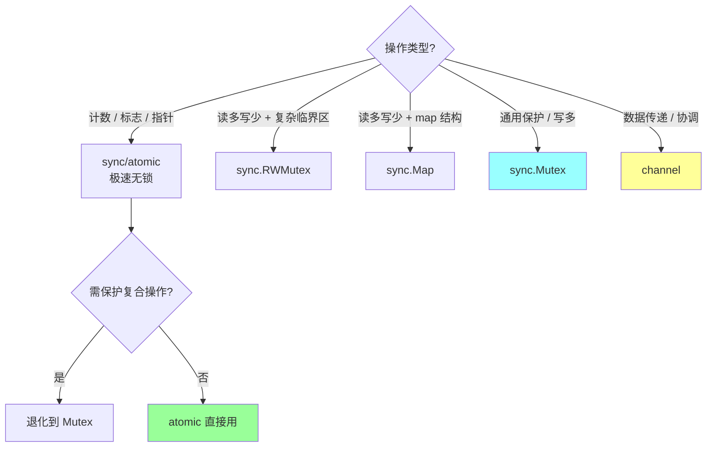

# sync 包

> Go 标准库并发原语：Mutex / RWMutex / WaitGroup / Once / Pool / Map / Cond / atomic

## 〇、多概念对比：5 大同步原语（D 模板）

### 一句话定位

| 原语 | 一句话定位 |
| --- | --- |
| **sync.Mutex** | **互斥锁**，同一时刻仅 1 个 goroutine 持锁，**正常模式 + 饥饿模式**自适应，最通用 |
| **sync.RWMutex** | **读写锁**，多读并发 + 写独占 + **写优先**，读多写少场景比 Mutex 快 |
| **sync/atomic** | **CPU 原子指令**（CAS / LOAD / STORE / ADD），**无锁 + 极快**，但只能操作基础类型 |
| **channel** | **CSP 通信原语**（"通信代替共享"），适合数据传递 / 协调，比锁更安全但有调度开销 |
| **sync.Map** | **读写分离**的并发 map（read map + dirty map），**读多写少 + key 集合稳定**时碾压 map+Mutex |

### 多维度对比（17 维度，必背）

| 维度 | sync.Mutex | sync.RWMutex | sync/atomic | channel | sync.Map |
| --- | --- | --- | --- | --- | --- |
| **本质** | 互斥锁 | 读写锁 | CPU 原子指令 | CSP 通道 | 并发安全 map |
| **底层实现** | runtime semaphore + 自旋 | RMutex + writerSem | CPU LOCK 前缀指令（CAS）| chan struct（lock + sendq + recvq）| read + dirty 双 map + atomic |
| **典型耗时（无竞争）** | ~25ns | ~30ns | **~5ns**（最快）| ~50-100ns | ~25ns |
| **典型耗时（高竞争）** | 100-1000ns | 100-2000ns | 200-1000ns（重试）| 500-5000ns | 100-500ns（读）|
| **是否阻塞** | 是 | 是 | **否**（不阻塞，CAS 失败重试）| 是（满 / 空时）| 否（读）/ 是（写竞争）|
| **支持数据类型** | 任意（保护临界区）| 任意 | **仅基础类型**（int32/64/uint32/64/uintptr/Pointer）| 任意（chan T）| key + value 任意 |
| **使用方式** | Lock / Unlock | RLock/RUnlock / Lock/Unlock | atomic.AddInt64 / CompareAndSwap | <- / -> / select | Store / Load / Delete |
| **嵌套锁** | ❌ **会死锁**（不可重入）| ❌ 会死锁 | 不需要 | 不需要 | 不需要 |
| **公平性** | 正常模式不公平 + 饥饿模式 FIFO | **写优先**（饿读 ok）| 无序（CPU 仲裁）| FIFO（按 sendq / recvq）| - |
| **defer 释放** | **必须 defer**（防 panic 不解锁）| 必须 defer | 不需要 | 不需要 | 不需要 |
| **零值可用** | ✅ | ✅ | ✅ | ❌（必须 make）| ✅ |
| **复制风险** | ❌ **不可复制**（会死锁）| ❌ 不可复制 | ✅ 可复制 | 不能复制（值类型 chan 本身是引用）| ❌ 不可复制 |
| **典型场景** | 通用保护临界区 | 读多写少 | 计数器 / 标志位 / 指针交换 | 数据传递 / 协调 / 信号 | 读多写少 + key 集合稳定 |
| **典型陷阱** | 死锁 / 复制 / 忘记 unlock | 写饿死（读多优先时）| 操作复合类型不安全 | nil chan 永久阻塞 / 关 closed chan panic | 写多场景比 Mutex 慢 |
| **性能 vs Mutex（基准）** | 1x | 0.5-2x（看读写比）| **5-10x**（无竞争）| 0.3-0.5x | 1-3x（读多）|
| **应用场景** | 90% 互斥场景 | 配置 / 缓存 / 元数据 | 计数 / 限流 / 引用计数 | 任务队列 / 信号 / 协调 | 全局缓存 / 注册中心 |
| **代码侵入度** | 低 | 中 | 极低 | 中（要设计 chan 拓扑）| 低 |

### 协作时序对比（10 个 goroutine 并发 counter++）

```mermaid
sequenceDiagram
    participant G1 as Goroutine 1
    participant G2 as Goroutine 2
    participant Lock as Mutex / atomic / chan
    participant Mem as 共享变量

    Note over G1,Mem: Mutex 方式
    G1->>Lock: Lock()
    Lock-->>G1: 持锁
    G1->>Mem: counter++
    G1->>Lock: Unlock()
    G2->>Lock: Lock()（等待）
    Lock-->>G2: 持锁
    G2->>Mem: counter++
    G2->>Lock: Unlock()
    Note over Lock: 串行，~25ns / 次

    Note over G1,Mem: atomic 方式
    G1->>Mem: atomic.AddInt64(&c, 1)
    Note over Mem: CPU LOCK; INCQ 指令<br/>硬件保证原子
    G2->>Mem: atomic.AddInt64(&c, 1)
    Note over Mem: 同上，并行 CAS<br/>无阻塞，~5ns / 次

    Note over G1,Mem: channel 方式（worker 串行处理）
    G1->>Lock: ch <- 1
    G2->>Lock: ch <- 1
    Note over Lock: worker goroutine 从 chan 接收
    Lock->>Mem: counter++
    Lock->>Mem: counter++
    Note over Mem: 串行 + 调度开销，~100ns / 次
```

### 性能数据（生产参考）

```
go test -bench=. -benchmem 实测对比（counter++ 100w 次）:

单线程基线: 1.5 ms

无竞争（1 goroutine 串行）:
  Mutex:    25 ns/op
  RWMutex:  30 ns/op
  atomic:   5 ns/op   ← 最快
  channel:  100 ns/op
  sync.Map: 25 ns/op

8 goroutine 竞争:
  Mutex:    250 ns/op
  RWMutex:  200 ns/op  ← 读多场景更优
  atomic:   60 ns/op   ← 仍最快
  channel:  800 ns/op  ← 调度开销大
  sync.Map: 120 ns/op  ← 读多优势

高写竞争（写 > 50%）:
  Mutex:    300 ns/op
  RWMutex:  600 ns/op  ← 比 Mutex 还慢（写优先 + 唤醒读）
  atomic:   200 ns/op
  channel:  1000 ns/op
  sync.Map: 800 ns/op  ← 写场景比 map+Mutex 慢
```

### 内部实现深度对比

```
sync.Mutex（runtime 信号量）:
  state: int32
    [waiterShift|starving|woken|locked]
  
  Lock():
    1. CAS 设置 locked 位 → 成功直接返回（25ns）
    2. 失败 → 自旋几次（CPU 空转）
    3. 仍失败 → runtime_SemacquireMutex 挂起
    4. 唤醒 → 重试 / 接管锁
  
  两种模式:
    正常模式: 新 goroutine 可以"插队"抢锁（throughput 高）
    饥饿模式: 等待 > 1ms → 切换 FIFO（防饿死）

sync.RWMutex（基于 Mutex + 信号量）:
  w        Mutex   ← 写锁，独占
  writerSem uint32 ← 写等待信号
  readerSem uint32 ← 读等待信号
  readerCount int32 ← 读者计数
  
  RLock():
    atomic.AddInt32(&readerCount, 1) → 检查是否有 writer
    没有 → 直接返回（30ns）
    有 → 阻塞读
  
  Lock():
    1. 先获取 w Mutex（互斥写）
    2. readerCount -= max（让新读阻塞）
    3. 等所有现有读者退出
    → 写优先（设计选择）

sync/atomic（CPU 指令）:
  AddInt64: LOCK; ADDQ
  CompareAndSwapInt64: LOCK; CMPXCHGQ
  LoadInt64: 一般 MOV（x86 天然原子读）
  StoreInt64: 一般 MOV（x86 天然原子写）
  
  关键: 锁的是 CPU 总线 / 缓存行（数十周期 vs 锁的几百周期）
  → 比 Mutex 快 5-10x

channel（runtime hchan）:
  hchan struct {
    qcount   uint        // 当前元素数
    dataqsiz uint        // 缓冲大小
    buf      unsafe.Ptr  // 缓冲数组
    sendx    uint        // 发送索引
    recvx    uint        // 接收索引
    recvq    waitq       // 接收等待队列（goroutine）
    sendq    waitq       // 发送等待队列
    lock     mutex       // 内部锁
  }
  
  send: 加锁 → 找 recvq 等待者直接传 → 没等待者 + 有缓冲 → 入 buf → 没缓冲 → 入 sendq 挂起

sync.Map（读写分离）:
  read   atomic.Value  // 只读 map（无锁读）
  dirty  map[any]*entry // 写时才有
  misses int            // 读 miss 计数
  
  Load(key):
    1. 读 read map（无锁）→ 命中返回
    2. miss → 加锁查 dirty
    3. miss 太多 → 提升 dirty 为 read
  
  关键: 读路径完全无锁（atomic.Value 读 + 指针）
  → 读多写少时碾压 map+Mutex
```

### 缺一不可分析

| 假设 | 后果 |
| --- | --- |
| **没 Mutex** | 任意结构保护退化为手撸 CAS 或粗粒度锁 |
| **没 RWMutex** | 读多写少场景必须 Mutex 串行（性能损失 2-5x）|
| **没 atomic** | 计数器 / 标志位 / 引用计数没有 5ns 级方案 |
| **没 channel** | Go 失去 CSP 模型 → 失去 "Don't communicate by sharing memory"|
| **没 sync.Map** | 高并发全局 map 必须自实现 sharded map 或读写分离 |

### 选择哲学："Don't communicate by sharing memory"

```
Go 官方建议:
  "Don't communicate by sharing memory; share memory by communicating."
  
  → 优先用 channel（数据流动 = 所有权转移）
  → 实在需要共享内存才用 Mutex / RWMutex / atomic

实战修正:
  - channel 适合"消息传递" / "任务队列" / "信号同步"
  - 高频热点（计数器 / 缓存）用 Mutex / atomic 更快
  - 共享状态（连接池 / 配置）用 RWMutex / sync.Map

不要教条:
  - "channel 是 Go 的灵魂" ≠ "所有场景都用 channel"
  - Go 标准库内部大量用 Mutex（runtime / net / database/sql）
  - 选最适合场景的工具
```

### 怎么选（决策树）



**实战推荐**：

| 场景 | 推荐 | 备注 |
| --- | --- | --- |
| 计数器 / QPS 统计 | **sync/atomic** | 5ns 级 |
| 单例 / 初始化 | **sync.Once** | 原子保证只执行一次 |
| 等待多 goroutine | **sync.WaitGroup** | 标准模式 |
| 通用对象保护 | **sync.Mutex** | 默认选择 |
| 配置 / 缓存（读多写少）| **sync.RWMutex** / **sync.Map** | 看是不是 map 结构 |
| 任务队列 / 信号 | **channel** | CSP 模型 |
| 对象池减 GC | **sync.Pool** | 自动 GC 友好 |
| 协调 / 通知 | **sync.Cond** / **channel** | Cond 比较底层 |

### 反模式

```
❌ Mutex 嵌套（不可重入）→ 死锁
❌ Mutex 被复制（值传递）→ 失去保护，竞争状态
❌ atomic 操作复合类型（如 string）→ 不安全（需用 atomic.Value）
❌ channel close 后再 send → panic
❌ nil channel send / recv → 永久阻塞
❌ RWMutex 在写多场景用 → 比 Mutex 还慢（写优先 + 唤醒读）
❌ sync.Map 在写多场景用 → 比 map+Mutex 慢
❌ sync.Pool 存关键状态 → 对象会被 GC 随时回收
❌ defer 之外释放锁 → panic 时不解锁 → 死锁
❌ 用 channel 做计数器 → 100ns vs 5ns（atomic）→ 性能浪费
```

### 一句话总结（D 模板专属）

> 5 大同步原语的核心是 **"性能 vs 通用性 vs 编程范式"取舍**：
> **sync/atomic**（5ns，仅基础类型）→ **sync.Mutex**（25ns，通用）→ **sync.RWMutex**（读多写少）→ **sync.Map**（读多 + map 结构）→ **channel**（CSP，数据传递）。
> **缺一不可**：atomic 替代不了 channel 的 CSP 范式，channel 替代不了 atomic 的 5ns 性能，Mutex 是通用兜底。
> **选择哲学**：Go 官方推荐 channel，但生产中**热点用 atomic / Mutex，通信用 channel**。
> **关键事实**：RWMutex / sync.Map 在写多场景**比 Mutex 还慢**（不要无脑用）；atomic 是 CPU 指令级（LOCK 前缀）。

---

## 〇、核心提炼（5 段式）

### 核心机制（4 条必背）

1. **Mutex 两种模式** - 正常模式（FIFO 但允许新 goroutine 插队抢锁）+ 饥饿模式（等待 > 1ms 切换到严格 FIFO 防饿死）
2. **RWMutex 读写分离** - 多读不互斥，读写互斥，**写优先**（防读饿写）
3. **sync.Pool** - 协程本地缓存 + victim cache，**减少 GC 压力**，但**对象会被随时回收**（不能存关键状态）
4. **sync.Map vs map+Mutex** - 读多写少 + key 集合稳定时 sync.Map 更优（无锁读）；写多场景 map+Mutex 更快

### 核心本质（必懂）

> sync 包的本质是 **"在 Go 语言层提供高效并发原语，避免开发者重复造轮子"**：
>
> - **Mutex 不是普通锁**：底层是**信号量 + 自旋 + Goroutine 调度**的混合（不是 OS Mutex）
>   - 短时争用 → 自旋（避免 G 切换）
>   - 长时争用 → 挂起到 sema 等待队列（避免 CPU 浪费）
> - **RWMutex 是 Mutex + 计数器**：读用 atomic 计数，写需要等所有读完成
> - **sync.Pool 是 GC 友好的对象池**：本地缓存 + victim cache，每次 GC 清空 victim
> - **sync.Map 是为特定场景优化**：不是通用替代品
>
> **关键事实**：
> - Mutex 不可重入（vs Java ReentrantLock）→ 同 G 重复 Lock 必死锁
> - Mutex / RWMutex 不可复制（值拷贝会导致状态分裂）
> - sync.Pool 对象**不保证存活**（可能下次 GC 就没了）
> - sync.Map 不是 map 的并发版（API 不同，**性能也只在特定场景占优**）

### 完整流程（面试必背）

```
sync.Mutex Lock 流程:

1. Fast Path（无竞争）:
   CAS 把 state 从 0 改成 1
   成功 → 直接获得锁

2. Slow Path（有竞争）:
   - 检查是否能自旋（多核 + 短时间）
   - 自旋等待: PAUSE 指令几次 → 重试 CAS
   - 自旋失败 → 进入排队

3. 排队等待:
   - 把当前 G 加入 sema 等待队列
   - park G（G 让出 M，进入 waiting 状态）
   - 被唤醒 → 尝试拿锁

4. 饥饿模式触发:
   - 某个 G 等待 > 1ms 还没拿到锁
   - 切换到饥饿模式: 锁交给队首 G
   - 新来的 G 不能插队抢锁
   - 队首 G 拿到锁后队列空 / 等待 < 1ms → 切回正常模式

sync.RWMutex Lock 流程:

读锁 (RLock):
  - atomic 增加 readerCount
  - 如果 < 0（有写锁等待）→ 排队等
  - 否则 → 直接进入临界区

写锁 (Lock):
  - 获取底层 Mutex（写写互斥）
  - readerCount -= rwmutexMaxReaders（让后续读阻塞）
  - 等待所有现有读完成（readerWait 计数到 0）
  - 进入临界区

写优先逻辑:
  写锁等待时，新的 readerCount 会被记到 readerWait
  → 已有读完成才让写进 → 新读必须等写完
  → 防读饿写

sync.Pool Get/Put 流程:

Get:
  1. 取 P 私有对象 → 没有则
  2. 取 P 本地共享队列 → 没有则
  3. 偷其他 P 的共享队列 → 没有则
  4. 检查 victim cache（上次 GC 留的）→ 没有则
  5. New() 创建新对象

Put:
  1. 放回 P 私有 → 满了则
  2. 放回 P 本地共享队列

GC 时:
  - 把 local（P 本地）转移到 victim
  - 清空原 victim（即上次留的对象被回收）
  → 对象最多存活 2 个 GC 周期
```

### 4 条核心机制 - 逐点讲透

#### 1. Mutex 两种模式（防饥饿）

```
正常模式（默认）:
  锁释放时 → 唤醒等待队列首部 G
  但新到来的 G 也能 CAS 抢锁（"插队"）
  → 新 G 通常在 CPU 上 → 容易抢到 → 性能好
  ✗ 等待队列里的老 G 可能长时间饿死

饥饿模式（Go 1.9+）:
  某 G 等待超过 1ms → 切换到饥饿模式
  - 锁直接交给队首 G（不能被插队）
  - 新 G 不能 CAS 抢，直接进队尾
  → 严格 FIFO

切换回正常模式:
  - 队首 G 拿到锁后队列空
  - 队首 G 等待时间 < 1ms
  → 切回正常模式（性能优先）

性能对比:
  正常模式: 吞吐高，可能饿死
  饥饿模式: 公平，吞吐略降
```

#### 2. RWMutex（写优先）

```
4 个核心字段:
  w             Mutex          写写互斥
  writerSem     信号量          写等待信号量
  readerSem     信号量          读等待信号量
  readerCount   int32          读者计数（写时为负）
  readerWait    int32          写等待时还要等多少读完成

读优先 vs 写优先:
  Go 选择写优先（防读饿写）

  RLock 时:
    if readerCount < 0:  // 有写锁等待
      → 当前读必须等
    else:
      readerCount++ → 进入临界区

  Lock 时:
    获取 w（写写互斥）
    readerCount -= rwmutexMaxReaders（让后续读阻塞）
    readerWait = readerCount  // 还要等多少现有读
    等所有现有读完成 → 进入临界区

性能特点:
  读多写少 → RWMutex 显著优于 Mutex
  写多 → RWMutex 反而不如 Mutex（额外原子操作）
```

#### 3. sync.Pool（GC 友好的对象池）

```
设计目标:
  减少高频小对象的 GC 压力
  例: HTTP request handler 复用 buffer

数据结构（P 维度）:
  每个 P 一个 poolLocal:
    private:  本地私有（无锁，最快）
    shared:   双端队列（可被其他 P 偷）
  victim:     上次 GC 留下的（被 GC 前的备份）

为什么 victim cache:
  没 victim → 每次 GC 全清空 → 命中率骤降
  有 victim → 平滑过渡（对象最多存活 2 个 GC 周期）
  → 显著减少 New() 调用

适用场景:
  ✓ 高频分配的临时对象（buffer、解析器中间结构）
  ✓ 对象状态可以重置（Put 前 Reset）
  ✗ 对象数量需要严格控制
  ✗ 对象不能丢（Pool 不保证存活）

常见反模式:
  Pool 中存 *bytes.Buffer
  Get 后忘记 Reset → 携带上次的数据 → 数据污染
```

#### 4. sync.Map（特定场景的并发 map）

```
适用场景（官方明确）:
  1. 读多写少（key 集合稳定）
  2. 多 G 操作不相交的 key 集合
  → 不是通用 map 替代品

数据结构:
  read map (atomic.Value): 只读副本，无锁访问
  dirty map (普通 map):    需要 Mutex 保护
  misses 计数:             累计 read miss 次数

读流程:
  1. 查 read map (无锁) → 命中直接返回
  2. miss → 查 dirty map (加锁) → misses++
  3. misses > len(dirty) → dirty 提升为 read

写流程:
  - read 中已存在 + 值非 nil → atomic 更新
  - 否则 → 加锁，写 dirty

性能特征:
  读密集 + 稳定 key: 比 map+RWMutex 快 5-10x
  写密集 / key 频繁变化: 比 map+Mutex 慢 2-3x
  → 选择前必须明确场景

业内实践:
  缓存场景 ✓
  计数器场景 ✗ (用 atomic 更快)
  通用并发 map ✗ (用 map+Mutex)
```

### 一句话总结

> sync 包的核心是：**Mutex 两种模式（正常 / 饥饿）+ RWMutex 写优先 + sync.Pool 二级缓存 + sync.Map 场景化优化**，
> 本质是**Go 语言层的高效并发原语**：Mutex 不是 OS Mutex（混合自旋 + sema + G 调度）。
> **Mutex 不可重入 + 不可复制**（vs Java ReentrantLock），**sync.Pool 对象不保证存活**（GC 会清），
> **sync.Map 不是通用替代**（只适合读多写少 + 稳定 key）。
> 高频场景能用 **atomic** 就别用 Mutex（无 G 切换开销）。

---

## 一、核心原理

### 1.1 sync.Mutex

```go
type Mutex struct {
    state int32   // bit 0=locked, 1=woken, 2=starving, 高位=等待者数
    sema  uint32  // 信号量, runtime_Semacquire/Semrelease
}
```

**两种模式**：
- **正常模式**：自旋几次抢锁，抢不到入队 FIFO 等待。新来的 g 优先（吞吐高，但可能饿死队尾）
- **饥饿模式**：等待 > 1ms 触发，Unlock 直接交给队首 g，新来的 g 排队尾

切换条件：等待时间 > 1ms 进饥饿，等到的 g 拿锁后等待时间 < 1ms 退出饥饿。

**自旋条件**（仅多核）：
- 锁是 locked 状态
- 没人在饥饿
- 自旋次数 < 4
- P 数量 > 1 且当前 g 不是 P 上唯一可运行 g

不可重入；禁止值拷贝（带 mu 的 struct 用指针传）。

### 1.2 sync.RWMutex

```go
type RWMutex struct {
    w           Mutex   // 写锁互斥
    writerSem   uint32  // 写者等待信号量
    readerSem   uint32  // 读者等待信号量
    readerCount int32   // 当前读者数(负值表示有写者等待)
    readerWait  int32   // 写者等待结束的读者数
}
```

- **RLock**：原子加 readerCount，<0 说明有写者等待，挂起
- **Lock**：先抢 w（写者互斥），再让 readerCount = -maxReaders，等所有当前读者退出
- **写者优先**：Lock 后续的 RLock 排队等待，避免写者饿死

### 1.3 sync.WaitGroup

```go
type WaitGroup struct {
    state atomic.Uint64  // 高 32 位 counter, 低 32 位 waiter count
    sema  uint32
}
```

- `Add(n)`：counter += n
- `Done()`：counter -= 1，归零时唤醒所有 waiter
- `Wait()`：counter > 0 时挂起

**规则**：`Add` 必须在 `Wait` 之前，且不能在 g 内 Add（应在 g 启动前）。Add 进负数 panic。

### 1.4 sync.Once

```go
type Once struct {
    done atomic.Uint32
    m    Mutex
}

func (o *Once) Do(f func()) {
    if o.done.Load() == 0 {
        o.doSlow(f)
    }
}

func (o *Once) doSlow(f func()) {
    o.m.Lock()
    defer o.m.Unlock()
    if o.done.Load() == 0 {
        defer o.done.Store(1)
        f()
    }
}
```

**双重检查锁**经典实现。注意 `done.Store(1)` 用 defer 保证 f panic 时也设置（其实是 store 之前 panic 会让下次再尝试，看版本）。

### 1.5 sync.Pool

```go
type Pool struct {
    local     unsafe.Pointer  // 每 P 一个 poolLocal
    localSize uintptr
    victim    unsafe.Pointer  // 上一轮 GC 的 local (二级缓存)
    New       func() any
}

type poolLocal struct {
    private any        // 当前 P 独占, 无锁
    shared  poolChain  // 双向链表, 可被其他 P 偷
}
```

**Get 顺序**：private → shared 队首 → 偷其他 P 的 shared 队尾 → victim → New

**Put**：放 private（满了放 shared 队首）

**GC 行为**：每轮 GC 把 local → victim，victim → 丢弃。所以对象**最多存活两轮 GC**。不是持久缓存。

### 1.6 sync.Map

```go
type Map struct {
    mu     Mutex
    read   atomic.Pointer[readOnly]  // 无锁读
    dirty  map[any]*entry            // 写需要 mu
    misses int                       // read miss 次数
}
```

**两层**：read（atomic 读，几乎无锁）+ dirty（写）

**Load**：先查 read（无锁），不命中查 dirty（加锁），miss 多了把 dirty 提升到 read。

**适用场景**（官方明确）：
1. 一旦写入就只读（如配置）
2. 不同 g 操作不相交的 key 集合（如分片缓存）

写多场景**比 RWMutex+map 慢**。

### 1.7 sync.Cond

条件变量，用于"等待某条件成立"。

```go
type Cond struct {
    L Locker  // 通常是 *Mutex
    // ...
}

func (c *Cond) Wait()    // 等待: 释放 L, 阻塞, 被唤醒后重新拿 L
func (c *Cond) Signal()  // 唤醒一个
func (c *Cond) Broadcast() // 唤醒所有
```

实战中**很少用**，channel 通常更清晰。仅在条件复杂或需要广播大量等待者时考虑。

### 1.8 sync/atomic

无锁原子操作：Load/Store/Add/Swap/CompareAndSwap。

Go 1.19 引入类型化原子（`atomic.Int64`/`atomic.Pointer[T]`），强制对齐 + 不可值拷贝，比裸函数安全。

## 二、八股速记

- **Mutex** 不可重入、禁止值拷贝、有正常/饥饿两模式
- **RWMutex** 写者优先，读多写少时比 Mutex 快
- **WaitGroup** Add 在 Wait 之前调；不能在 g 里 Add
- **Once** 双重检查锁，`Do` 只执行一次（panic 也算一次？看版本）
- **Pool** 每 P 缓存 + GC 清理，**只用作临时对象复用**，不是持久缓存
- **Map** 适合"写一次读多次"或"key 不相交"，写多用 RWMutex+map
- **atomic.Int64** 等类型化原子（Go 1.19+）比裸函数安全
- 一切 sync 类型**禁止值拷贝**，go vet 会报警

## 三、面试真题

**Q1：Mutex 是公平锁吗？**
**默认非公平**（正常模式）：新来的 g 可以"插队"抢锁，吞吐高但队尾可能饿死。当某个 g 等待 > 1ms，进入**饥饿模式**变成 FIFO 公平，等队尾追上来再退出饥饿。设计平衡了吞吐和延迟尾部。

**Q2：RWMutex 什么时候比 Mutex 慢？**
读临界区**极短**时（如读一个 int），RWMutex 自身的原子操作开销超过保护的工作。简单读用 atomic 或 Mutex；复杂读路径才用 RWMutex。

**Q3：sync.Once 会重复执行吗？panic 怎么办？**
正常情况只执行一次。如果 f 中 panic：
- Go 1.x（旧）：done 未置位，下次 Do 会重试
- 现在（设 done 在 panic 前）：标记完成，下次直接跳过
**实际生产代码**：Once.Do 里的 f 应该自己 recover 处理 panic，不要依赖外层重试。

**Q4：sync.Pool 为什么对象会丢？**
两个原因：
1. **每轮 GC 清理**：local → victim，victim 丢弃
2. **每 P 独立**，Put 到 P1 的对象，Get 时若在 P2 可能拿到 New 的新对象

实践：放进 Pool 前**重置状态**，Get 后**不要假设 Put 过的内容**。

**Q5：sync.Map 比 map+RWMutex 强在哪？**
- read 字段是 `atomic.Pointer`，**Load 无锁**
- 适合读远多于写的场景（如全局配置缓存）
- 适合 key 集合很少变化的场景

弱在哪：
- 写需要 mu，**写多比 RWMutex+map 慢**
- 接口是 any，**类型断言开销 + 装箱**
- API 不如普通 map 灵活（没有 len、不支持 range 中删除）

**Q6：WaitGroup Add 在 g 里调用为什么不行？**

```go
var wg sync.WaitGroup
for _, t := range tasks {
    go func(t Task) {
        wg.Add(1)  // 错: 主 g 可能已经 wg.Wait() 了
        defer wg.Done()
        t.Run()
    }(t)
}
wg.Wait()  // 可能在 Add 之前就发现 counter==0 直接返回
```

正确：

```go
for _, t := range tasks {
    wg.Add(1)
    go func(t Task) {
        defer wg.Done()
        t.Run()
    }(t)
}
wg.Wait()
```

**Q7：atomic 操作能保证什么？**
- 操作的**原子性**：Load/Store/Add 不会被部分写入打断
- **顺序一致性**（Go 内存模型保证）：atomic 之间形成 happens-before
不能保证：复合操作的整体原子性（如"读+判断+写"要 CAS）。

**Q8：怎么实现一个并发安全的单例？**

```go
var (
    instance *Singleton
    once     sync.Once
)

func GetInstance() *Singleton {
    once.Do(func() {
        instance = &Singleton{...}
    })
    return instance
}
```

或更直接：包级 init 函数。

## 四、手写实现

**1. 基于 atomic 的并发计数器：**

```go
type Counter struct {
    n atomic.Int64
}
func (c *Counter) Inc()     { c.n.Add(1) }
func (c *Counter) Get() int64 { return c.n.Load() }
```

**2. 自旋锁（演示，生产用 Mutex）：**

```go
type SpinLock struct {
    state atomic.Int32
}
func (s *SpinLock) Lock() {
    for !s.state.CompareAndSwap(0, 1) {
        runtime.Gosched()  // 让出 P,避免空转
    }
}
func (s *SpinLock) Unlock() { s.state.Store(0) }
```

**3. 限频器（基于 channel + Pool 思路）：**

```go
type Limiter struct {
    tokens chan struct{}
}
func NewLimiter(n int) *Limiter {
    l := &Limiter{tokens: make(chan struct{}, n)}
    for i := 0; i < n; i++ { l.tokens <- struct{}{} }
    return l
}
func (l *Limiter) Acquire() { <-l.tokens }
func (l *Limiter) Release() { l.tokens <- struct{}{} }
```

**4. sync.Once 的等价实现：**

```go
type MyOnce struct {
    done atomic.Uint32
    m    sync.Mutex
}
func (o *MyOnce) Do(f func()) {
    if o.done.Load() == 1 { return }
    o.m.Lock()
    defer o.m.Unlock()
    if o.done.Load() == 0 {
        defer o.done.Store(1)
        f()
    }
}
```

**5. 用 Pool 复用 buffer：**

```go
var bufPool = sync.Pool{
    New: func() any { return new(bytes.Buffer) },
}

func getBuf() *bytes.Buffer { return bufPool.Get().(*bytes.Buffer) }
func putBuf(b *bytes.Buffer) {
    b.Reset()
    bufPool.Put(b)
}
```

## 五、踩坑与最佳实践

### 坑 1：Mutex 值拷贝

```go
type S struct {
    mu sync.Mutex
}
func (s S) Foo() {  // s 是副本! mu 也是副本
    s.mu.Lock()
    // ...
}
```

**修复**：改 `*S` 接收者。`go vet` 直接报。

### 坑 2：Mutex 重入死锁

```go
func (s *S) Foo() {
    s.mu.Lock()
    defer s.mu.Unlock()
    s.Bar()  // Bar 也 Lock → 死锁
}
func (s *S) Bar() {
    s.mu.Lock()
    defer s.mu.Unlock()
    // ...
}
```

Go 不支持可重入锁。**修复**：拆出无锁版本 `barLocked`，调用方自己 Lock。

### 坑 3：RWMutex 写者饿死（旧版本）

老 Go 版本 RLock 持续到来，Lock 永远抢不到。现在的 RWMutex 已经实现"写者到来后阻塞新 RLock"修复，但仍要避免长时间持读锁。

### 坑 4：Pool 放大对象阻止内存回收

```go
type bigBuf struct{ data [10*1024*1024]byte }
var pool = sync.Pool{New: func() any { return new(bigBuf) }}
```

每次 GC 把 local 转 victim，victim 仍占内存，下次 GC 才丢。大对象用 Pool 反而**抬升常驻内存**。建议 ≤ 几十 KB 才用 Pool。

### 坑 5：atomic 操作非对齐字段

32 位平台上 `atomic.AddInt64` 要求 8 字节对齐。结构体字段顺序错可能崩溃。
**修复**：用 Go 1.19+ 的 `atomic.Int64`（自动对齐），或把 64 位字段放结构体首位。

### 坑 6：sync.Map 当通用 map 用

```go
m := &sync.Map{}
for i := 0; i < 1e6; i++ {
    m.Store(i, val)  // 写多场景比 map+Mutex 慢
}
```

sync.Map 是**专用工具**，不是普通 map 的并发版本。

### 最佳实践

- **简单计数用 atomic**，超过单变量考虑 Mutex
- 临界区**尽量小**，IO 不在锁内
- 锁的粒度选择：粗（少且简单）vs 细（多但提高并发度）
- defer Unlock 是默认选择，除非热路径需要手动 Unlock 减少 defer 开销
- 用 `go vet` + `-race` 检测锁拷贝和数据竞争
- 高并发场景考虑分片：`type ShardedMap struct { shards [N]*sync.Mutex; data [N]map[...]... }`
- 优先 channel 表达"通信"，sync 表达"保护共享状态"
