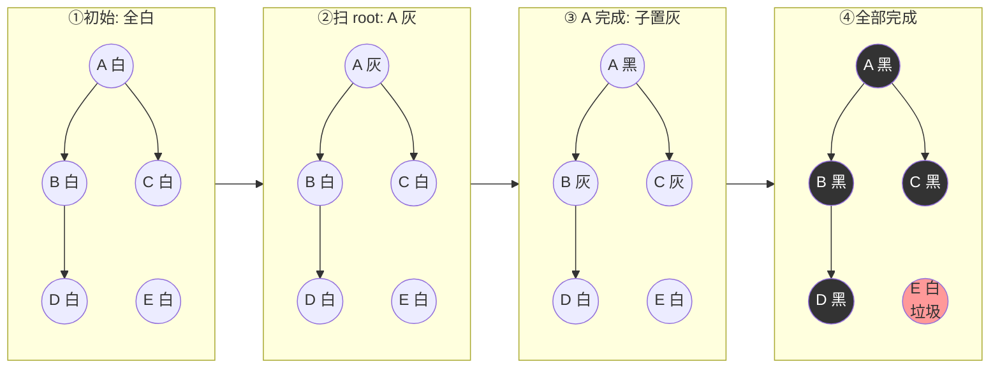

# 垃圾回收 (GC)

> 并发三色标记 + 混合写屏障，STW < 1ms，吞吐换延迟的代表设计

## 〇、核心提炼（5 段式）

### 核心机制（4 条必背）

1. **并发三色标记** - 白（待回收）/ 灰（待扫描）/ 黑（已扫描），从根对象出发标记，**与用户程序并发执行**
2. **混合写屏障**（Go 1.8+）- 同时启用 Dijkstra（保证新分配的对象不被错回收）+ Yuasa（保证被删除引用的对象不被错回收）
3. **GC Pacer** - 控制 GOGC（默认 100，触发阈值 = 上次存活 × 2），动态调整 GC 频率与速度
4. **STW 极短** - 只有"标记开始"和"标记结束"两次 STW，各 < 1ms，标记和清扫都与用户并发

### 核心本质（必懂）

> Go GC 的本质是 **"吞吐换延迟"** 的设计选择：
>
> - **不是分代 GC**（vs JVM）：Go 用并发标记 + 混合写屏障，**不区分新老代**
> - **不追求吞吐最优**：Java G1 / ZGC 在吞吐上更优，Go 选择"延迟稳定"
> - **目标 STW < 1ms**：对延迟敏感的服务（API / RPC）更友好
>
> **三色 + 写屏障的本质**：
> - 三色不变性是为了**对象不被错误回收**：黑对象不能直接指向白对象
> - 写屏障是为了**用户程序修改对象引用时维护不变性**
> - 没有写屏障 → 并发标记必然漏标 → 错误回收存活对象
>
> **关键事实**：
> - **不分代是优势也是代价**：每次都全堆扫描 → 大堆性能下降
> - **Go 1.19 GOMEMLIMIT** 解决"内存爆炸"：可设硬上限，触发更激进 GC
> - **GC 不会主动 free 给 OS**（5min 后才返还），用 `debug.FreeOSMemory()` 强制

### 完整流程（面试必背）

```
Go GC 完整流程（并发三色标记）:

0. 初始状态:
   - 所有对象 = 白色
   - 根对象（栈变量、全局变量）= GC 时初始为灰色

1. GC 触发（条件之一）:
   - 堆大小达到 GOGC 阈值（默认 100，即上次存活的 2 倍）
   - 距上次 GC > 2 分钟（强制）
   - runtime.GC() 主动调用
   - GOMEMLIMIT 软限制（1.19+）

2. STW 1: 标记开始（< 1ms）:
   - 启用写屏障
   - 扫描根对象 → 灰色
   - 解除 STW

3. 并发标记阶段（与用户并发）:
   while 灰色队列非空:
     取一个灰色对象 g
     扫描 g 的所有引用 → 标记为灰色
     g 自己 → 标记为黑色

   期间用户程序的修改:
   - 写屏障捕获引用变更
   - 新分配对象 → 黑色（混合写屏障的一部分）
   - 被覆盖的旧引用 → 灰色（防漏标）

4. STW 2: 标记结束（< 1ms）:
   - 处理剩余灰色对象
   - 关闭写屏障
   - 计算下次 GC 阈值
   - 解除 STW

5. 并发清扫阶段（与用户并发）:
   - 遍历堆，回收白色对象
   - 释放内存到 mspan / 内存池（不立即还给 OS）
   - 黑色对象重置为白色（为下次 GC）

6. 内存返还（5min 后）:
   - sysmon 周期检查
   - 长时间未用的 mspan → madvise(MADV_FREE) 提示 OS 可回收
```

### 4 条核心机制 - 逐点讲透

#### 1. 三色标记（为什么是三色不是两色）

```
两色（朴素标记）:
  扫描中 / 已扫描 → 只能 STW 全程
  → STW 太长，无法接受

三色:
  白色（White）= 待回收（初始 / 终态：所有对象初始白，最后未被标记的白色 = 垃圾）
  灰色（Gray） = 待扫描（已发现但子对象未扫描）
  黑色（Black）= 已扫描（自己 + 子对象都已扫描）

不变性（关键）:
  强三色不变性: 黑色对象不能引用白色对象（被引用前要变灰）
  弱三色不变性: 黑色可引用白色，但白色必须能通过灰色路径到达

并发标记的根本问题:
  用户程序修改引用 → 可能违反不变性 → 漏标存活对象
  → 必须用"写屏障"维护
```

#### 2. 混合写屏障（Go 1.8+）

```
写屏障的两种方案:

Dijkstra（插入屏障，保证强三色不变性）:
  写 obj.field = ptr 前:
    if ptr 是白色: mark ptr 为灰色
  → 防止"黑色对象插入指向白色"

Yuasa（删除屏障，保证弱三色不变性）:
  写 obj.field = ptr 前:
    if obj.field（旧值）是白色: mark 旧值为灰色
  → 防止"白色对象失去最后一条灰色路径"

混合写屏障（Go 1.8+ = Dijkstra + Yuasa）:
  插入和删除都处理
  栈对象不需要写屏障（Go 1.7 前需要 → 栈再扫描很慢）
  → 标记结束不需要重新扫描栈
  → STW 显著降低（之前 1-10ms → 现在 < 1ms）

代价:
  每次指针赋值都有屏障开销（CPU 10-20%）
  → 但换来"延迟稳定"
```

#### 3. GC Pacer（自适应调速）

```
触发条件:
  下次 GC 阈值 = 上次存活 × (1 + GOGC/100)
  GOGC=100（默认）: 阈值 = 上次存活 × 2

例子:
  上次 GC 后存活 1GB
  → 下次 GC 触发: 堆涨到 2GB
  → 期间用户分配 1GB 内存

调节 GOGC:
  GOGC=50 → 阈值 1.5x → GC 更频繁，内存占用低，CPU 占用高
  GOGC=200 → 阈值 3x → GC 更少，内存占用高，CPU 占用低
  GOGC=off → 完全关闭 GC

Pacer 还做什么:
  - 估算 GC 完成时间（标记速度 vs 分配速度）
  - 决定后台 GC worker 数量
  - 必要时让用户 goroutine 协助标记（assist GC）→ "P 借给 GC"
```

#### 4. GOMEMLIMIT（Go 1.19+）

```
问题（GOGC 的局限）:
  GOGC 只看比例，不看绝对值
  → 上次存活 10GB → 下次触发 20GB
  → 可能 OOM

解决: GOMEMLIMIT（软内存上限）
  GOMEMLIMIT=8GiB
  → 接近 8GB 时 GC 更激进
  → 不强制 OOM，但优先回收

用法:
  GOMEMLIMIT=8GiB GOGC=off go run ...
  → 完全按内存上限调度 GC

适用:
  - 容器内（K8s 限内存）
  - 大堆服务（Cache / 大数据）
  - 容易 OOM 的场景
```

### 一句话总结

> Go GC 的核心是：**并发三色标记 + 混合写屏障 + GC Pacer + STW < 1ms**，
> 本质是 **"吞吐换延迟"** 的设计选择：不分代、全堆扫描，目标"延迟稳定"。
> 三色不变性 + 写屏障保证"并发标记不错回收"，混合写屏障让栈不需要重新扫描（STW 大幅下降）。
> **GOGC** 控制 GC 频率（默认 100 = 2x 阈值），**GOMEMLIMIT**（1.19+）解决内存上限。
> 适合延迟敏感服务（API / RPC），大堆 + 吞吐优先场景考虑 Java ZGC / Shenandoah。

---

## 一、核心原理

### 1.1 算法演进

| 版本 | 算法 | STW |
| --- | --- | --- |
| Go 1.3 | 标记-清除（STW 全程） | 数百 ms |
| Go 1.5 | 并发三色标记 + 插入写屏障（Dijkstra） | 数十 ms |
| Go 1.8 | 三色标记 + 混合写屏障（Yuasa+Dijkstra） | < 1ms |
| Go 1.12+ | 调优 + Pacer 改进 | 微秒级 |

### 1.2 三色标记法

每个对象三种颜色：
- **白**：未访问，候选垃圾
- **灰**：已访问但子节点未扫完
- **黑**：自己和子节点都扫完

流程：
1. 初始所有对象白色
2. 从 GC roots（栈、全局变量、寄存器）出发，roots 直接引用的对象置灰，roots 自身黑
3. 取一个灰对象 → 子对象置灰 → 自己置黑
4. 重复直到无灰
5. 剩下的白对象 = 垃圾，回收

**三色标记演进图：**



> 最终所有可达对象变黑，未被引用的 E 仍为白色 → 回收。

### 1.3 为什么需要写屏障？

并发场景下用户代码同时跑会破坏三色不变性：

> **三色不变性**：黑色对象不能直接引用白色对象（否则白色会被漏标 → 误回收）

**漏标场景图示：**

```mermaid
sequenceDiagram
    participant GC as GC 标记线程
    participant App as 用户线程
    participant A as A (黑)
    participant B as B (灰)
    participant C as C (白, 应存活)

    Note over A,C: 初始: A 黑, B 灰, C 白; B→C
    GC->>B: 扫描 B
    App->>A: A.ref = C (新指针)
    App->>B: B.ref = nil (断开)
    GC->>B: B 变黑(没有 C 的引用了)
    Note over A,C: 此时 A→C 但 A 是黑, 不会再扫 C
    GC->>C: 标记结束: C 仍白 → 误回收!

    rect rgb(255, 220, 220)
    Note over GC,C: BUG: C 被错误回收
    end
```

写屏障 = **指针赋值时的 hook**，保证不变性。

### 1.4 写屏障演进

**Dijkstra 插入写屏障**：写指针时把**新指向的对象**置灰
- 缺点：栈对象不能用屏障（性能太差），所以最后还得 STW 重扫栈

**Yuasa 删除写屏障**：写指针时把**原来指向的对象**置灰
- 缺点：浮动垃圾偏多

**Go 1.8 混合写屏障**：
1. GC 开始时把所有栈对象**黑色化**（视为 reachable）
2. 写屏障同时做插入和删除：
   - 新指针指向的对象置灰
   - 被覆盖的旧指针指向的对象置灰
3. 栈不再需要 STW 重扫 → STW 时间大幅下降

> 代价：每次指针写入多两条指令；浮动垃圾（应该被回收但本轮没回收的对象）略增。

### 1.5 GC 阶段

```
1. STW (Sweep Termination)   - 收尾上一轮清扫
2. Mark (并发)               - 三色标记, 写屏障开启
3. STW (Mark Termination)    - 完成标记, 关闭写屏障
4. Sweep (并发)              - 清扫白色对象
   ↓
   分配器并发使用清扫好的内存
```

两次 STW 加起来通常 < 1ms。Mark 阶段会占用 25% 的 CPU（GOGC 默认配置）。

**GC 阶段时间线：**

```mermaid
gantt
    title GC 阶段时序 (一次完整 GC 周期)
    dateFormat X
    axisFormat %s

    section 用户代码
    业务运行(分配/写指针)              :u1, 0, 100
    用户继续(写屏障开启)               :u2, 100, 800
    用户继续(写屏障关闭)               :u3, 850, 1000

    section GC 工作
    STW Sweep Term                     :crit, s1, 100, 5
    并发 Mark + 写屏障                 :active, m1, 105, 700
    Mark Assist (用户协助)              :a1, 200, 600
    STW Mark Term                      :crit, s2, 805, 5
    并发 Sweep                         :active, sw1, 810, 1000
```



> 关键：两次 STW 极短（通常微秒到 ms 级），Mark 与 Sweep 都和用户代码**并发**。Mark 占 ~25% CPU。

### 1.6 GC 触发时机

1. **堆分配触发**：当前堆大小达到上次 GC 后存活堆 × (1 + GOGC/100)
   - GOGC 默认 100 → 堆翻倍触发
   - GOGC=off 关闭自动 GC（极少用）
2. **定时触发**：超过 2 分钟没 GC，sysmon 强触发
3. **手动**：`runtime.GC()`（同步等待，慎用）

### 1.7 GC Pacer

目标：让 GC 在堆达到目标大小**之前**完成。Pacer 动态调节：
- mark 进度
- 用户分配速率
- 辅助标记（mutator assist）

如果用户分配过快导致快撞到目标，会强制让分配的 g 帮忙 mark（assist GC），所谓"借债还工"。

### 1.8 GOMEMLIMIT（Go 1.19+）

软内存上限。即使 GOGC 还没触发，接近 GOMEMLIMIT 时也会强制 GC。容器化部署强烈推荐设置：
```
GOMEMLIMIT=1800MiB  # 留些余量给 stack/runtime
```
配合 `GOGC=off` 或 `GOGC=200` 可以让 GC 更"懒"，只在内存压力时触发。

## 二、八股速记

- 算法：**并发三色标记 + 混合写屏障 + 并发清扫**
- 三色：白(垃圾候选) / 灰(扫描中) / 黑(已扫完)
- 不变性：黑不指向白
- Go 1.8+ 混合写屏障：**栈黑色化 + 插入+删除双屏障**，STW < 1ms
- 触发：堆翻倍（GOGC=100）或 2 分钟定时
- 阶段：STW → Mark(并发) → STW → Sweep(并发)
- GOGC 越大 GC 越少（占内存换 CPU），越小 GC 越频繁
- GOMEMLIMIT 是软上限（Go 1.19+），容器化必备
- GC 占用约 25% CPU（默认 pacer）
- GC 不整理内存，可能产生碎片（实际 size class 设计已经缓解）

## 三、面试真题

**Q1：Go 用什么 GC 算法？为什么不用分代/复制？**
**并发标记-清除 + 三色 + 混合写屏障**。
不用分代：Go 编译器做了**逃逸分析**，大部分短命对象在栈上分配（栈跟随 g 自动回收），堆上对象生命周期分布不像 Java 那样明显两极化，分代收益有限。
不用复制：Go 直接暴露指针给用户代码，移动对象代价大；标记-清除的内存碎片用 size class 分配器缓解。

**Q2：什么是 STW？Go 的 STW 在哪几个点？**
Stop-The-World：暂停所有用户 g。Go 现在只在两处 STW：
1. **GC 开启**（Sweep Termination → Mark Setup）
2. **Mark 结束**（Mark Termination：开启 sweep 前）
两次加起来通常几十微秒到 1ms。早期版本还在重扫栈时 STW，1.8 用混合屏障消除了。

**Q3：GOGC=100 具体什么意思？**
GC 完成后存活堆 100MB → 堆涨到 200MB 触发下次 GC。比例计算：`目标堆 = 存活堆 × (1 + GOGC/100)`。
- GOGC=200：堆涨到 300MB 触发 → GC 少 + 内存高
- GOGC=50：堆涨到 150MB 触发 → GC 多 + 内存低
- GOGC=off：禁用，仅用于特殊场景

**Q4：写屏障是什么？为什么需要？**
指针写入时插入的代码（编译器生成）。作用：维持三色不变性，防止漏标。Go 1.8 用混合写屏障：写 `*p = ptr` 时，把旧 `*p` 和新 `ptr` 都置灰。代价：每次指针赋值多几条指令，约 5~10% 写性能开销。

**Q5：GC 调优有哪些手段？**
1. **`GOGC`**：调高减少 GC 频率（吞吐型服务）
2. **`GOMEMLIMIT`**：设软上限，配合 GOGC=off/大值，避免 OOM 同时减少 GC
3. **减少堆分配**：sync.Pool 复用、预分配 slice/map、减少接口包装、字符串拼接用 strings.Builder
4. **逃逸分析**：`go build -gcflags="-m"` 看哪些变量逃逸到堆，优化掉
5. **大对象池化**：避免频繁分配大对象（>32KB 走 mheap 直分配）

**Q6：什么是浮动垃圾？**
GC 标记完成后才"死"的对象（标记时还活着，标记后 mutator 把引用断了，但本轮不回收，下轮才扫）。混合写屏障会让浮动垃圾略多于纯 Dijkstra，但下轮就清掉，对总体内存影响小。

**Q7：GC 影响延迟的根本原因？**
1. **STW**：所有 g 暂停（< 1ms 但仍存在）
2. **mutator assist**：分配快的 g 被强制做 mark 工作，业务请求延迟变高
3. **CPU 抢占**：mark 阶段占 25% CPU，在线服务的 P99 受影响
治理：减分配、设 GOMEMLIMIT、必要时调大 GOGC。

**Q8：sync.Pool 为什么能减少 GC 压力？**
对象复用，减少堆分配 → 减少 GC 标记和清扫量。每个 P 有本地 pool 副本（无锁访问），GC 时本地 pool 会被清空（每轮 GC 清一次，所以不能当持久缓存）。适合**临时对象复用**（buffer、解析中间态）。

## 四、手写实现

GC 没法手写，写一个**降低 GC 压力**的实战 demo：

**1. sync.Pool 复用 buffer：**

```go
var bufPool = sync.Pool{
    New: func() any {
        b := make([]byte, 0, 4096)
        return &b
    },
}

func process(r io.Reader) error {
    bp := bufPool.Get().(*[]byte)
    buf := (*bp)[:0]
    defer func() {
        *bp = buf[:0]
        bufPool.Put(bp)
    }()

    _, err := io.ReadFull(r, buf[:cap(buf)])
    // ... 用 buf
    return err
}
```

> 注意：放进 Pool 的对象大小不应过大（超过几十 KB），否则可能阻止内存归还 OS。

**2. 预分配避免扩容：**

```go
// 差: 不知道最终大小, 多次扩容产生临时垃圾
result := []int{}
for v := range stream {
    result = append(result, v)
}

// 好: 已知 hint
result := make([]int, 0, expectedN)
```

**3. 逃逸分析检查：**

```bash
go build -gcflags="-m=2" ./...
# 输出形如:
# ./main.go:10:6: moved to heap: x
# ./main.go:15:13: ... argument does not escape
```

返回局部变量地址、传 interface{} 都可能让对象逃逸到堆。

## 五、踩坑与最佳实践

### 坑 1：容器内 OOM Killed

进程内存 RSS 超过 cgroup limit 直接被 kill，没有任何 Go 报错。原因：
- GOGC 触发条件是堆翻倍，但堆基数小时翻倍也快；基数大时 GC 启动晚 → 撞 limit
- 不设 GOMEMLIMIT 时 runtime 不知道 cgroup 边界

**修复**：Go 1.19+ 设 `GOMEMLIMIT=容器内存的 80~90%`。

### 坑 2：sync.Pool 当缓存用

```go
// 错: 期待 Get 总能拿到上次 Put 的对象
session := pool.Get().(*Session)
```

Pool **每轮 GC 清空**，可能拿到 New 创建的新对象。Pool 只用于无状态的临时对象复用。

### 坑 3：interface 包装让对象逃逸

```go
func log(v any) { fmt.Println(v) }  // any 让 v 必逃逸
log(1)  // 1 被装箱到堆
```

热路径用具体类型，避免 interface 装箱。

### 坑 4：定时 runtime.GC()

```go
ticker := time.NewTicker(10 * time.Second)
go func() {
    for range ticker.C {
        runtime.GC()  // 同步 STW + Mark + Sweep, 严重影响延迟
    }
}()
```

`runtime.GC` 是阻塞的，且会"立即"完整跑一次。让 runtime 自己决定就行。

### 坑 5：大量小对象导致 mark 慢

mark 时间和**对象数量**成正比，不只和总内存。100MB 全是 byte slice 比 100MB 全是几字节小 struct mark 慢得多。

**优化**：合并小对象到 struct 数组、避免大量 `*int` `*string` 这种小指针对象。

### 最佳实践

- 容器化必设 `GOMEMLIMIT`
- 默认 GOGC=100 通常足够；只有在 GC CPU 占比 > 30% 才考虑调大
- 监控指标：
  - `go_gc_duration_seconds`（GC 耗时分布）
  - `go_memstats_next_gc_bytes` 与 `go_memstats_heap_inuse_bytes`
  - GC CPU 占比 = pause_total / time_window
- 性能优化先 pprof heap 定位分配热点，再决定是否池化
- `runtime/metrics`（Go 1.16+）比 `runtime.MemStats` 更准更全
