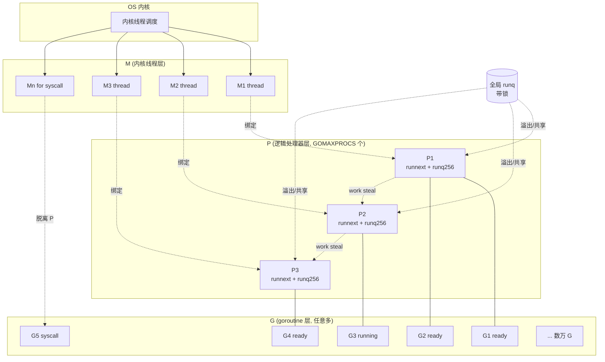
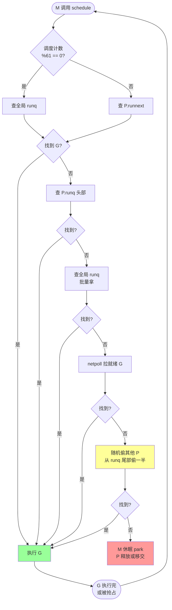
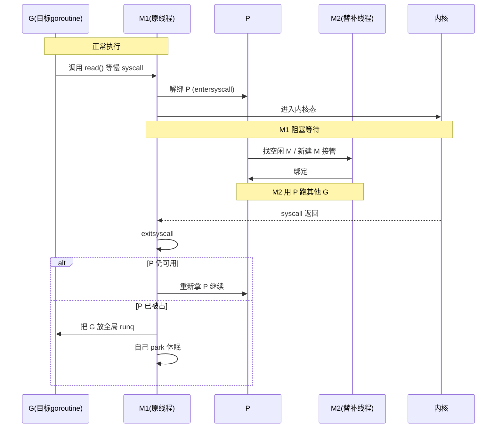
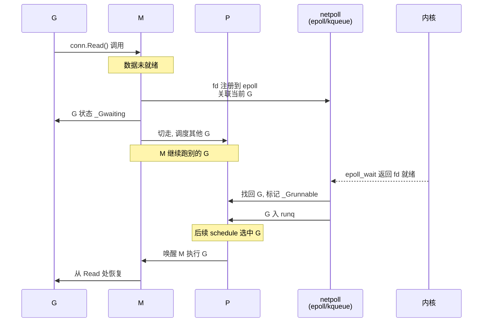

# GMP 调度器

> Go 调度的灵魂：G(协程) - M(内核线程) - P(逻辑处理器) 三角关系，work-stealing + 抢占式调度

## 〇、核心提炼（5 段式）

### 核心机制（4 条必背）

1. **G-M-P 三角模型** - G（协程）/ M（内核线程）/ P（逻辑处理器），**G 绑 P 上才能跑、P 数 = GOMAXPROCS**
2. **本地队列 + 全局队列 + Work-Stealing** - P 自己有本地 runq（256 容量），空闲时偷其他 P 的一半 G
3. **协作式 + 抢占式调度** - 1.14+ 基于信号的异步抢占（之前是函数序言协作式，循环卡死无解）
4. **netpoll + 系统调用解耦** - 阻塞系统调用 M 与 P 解绑（P 转给其他 M），netpoll 让 net I/O 不阻塞 M

### 核心本质（必懂）

> Go 调度器的本质是 **"用户态线程调度，把昂贵的内核态线程切换换成廉价的用户态切换"**：
>
> - **G 是廉价对象**：默认 2KB 栈，可创建百万个（vs 内核线程 2MB 栈）
> - **M 是内核线程**：与 OS 线程一一对应，切换昂贵（陷入内核 + 寄存器保存）
> - **P 是逻辑处理器**：把 G 调度到 M 的"运行许可证"，数量等于 GOMAXPROCS
>
> **为什么需要 P**（Go 1.1 引入）：
> - 解决多线程访问全局队列的锁竞争
> - 让 G 有本地队列（无锁访问）
> - 让 Work-Stealing 有边界（在 P 之间偷）
>
> **关键事实**：
> - GMP 不是"线程池"，是"调度器"：M 数量动态变化，可远超 P
> - 阻塞系统调用 → M 阻塞 → P 转给其他 M → 不浪费 P
> - 网络 I/O 走 netpoll → M 不阻塞 → G 挂起到 netpoll → 就绪后重新入队

### 完整流程（面试必背）

```
go func() {} 完整流程:

1. 创建 G:
   - runtime.newproc(fn)
   - 分配 G 结构（2KB 栈）
   - 加入当前 P 的本地 runq 队尾

2. M 寻找 G 执行（schedule loop）:
   for {
     g := findRunnable()  // 找 G 顺序:
                          // ① P 本地 runq
                          // ② 全局 runq（每 61 次调度查一次）
                          // ③ 偷其他 P 的一半 G（work-stealing）
                          // ④ netpoll 就绪的 G
                          // ⑤ 还没有 → M 进入 idle 状态
     execute(g)           // 切换栈、寄存器到 G 上
   }

3. G 执行中:
   - 协作式抢占（1.14 前）: 函数序言检查 stackguard，触发让出
   - 异步抢占（1.14+）: sysmon 监控到 G 跑超 10ms → 信号 SIGURG → G 立刻让出
   - 主动让出: runtime.Gosched() / select 阻塞 / channel 操作

4. 系统调用:
   - 同步阻塞调用（如 read 文件）:
     * 进入 syscall 前 M 与 P 解绑
     * P 转给其他空闲 M（或新建 M）继续调度其他 G
     * 系统调用返回后 M 尝试拿回原 P，失败则把 G 放全局队列
   - 网络 I/O（netpoll）:
     * G 阻塞 → 注册到 netpoll
     * M 不阻塞，继续调度其他 G
     * netpoll 就绪 → G 重新入队

5. G 结束:
   - 释放 G 资源（栈回收）
   - M 继续 schedule loop 找下一个 G
```

### 4 条核心机制 - 逐点讲透

#### 1. G-M-P 三角（为什么这样设计）

```
没有 P 时（Go 1.0 老调度）:
  G + M 直接关系
  所有 G 在全局 runq → M 抢锁取 G
  → 多 M 时锁竞争严重 → 多核扩展性差

引入 P（Go 1.1+）:
  每个 P 一个本地 runq（无锁）
  M 必须绑 P 才能跑 G
  P 数 = GOMAXPROCS（默认 CPU 核数）
  → 锁竞争降到几乎为 0

数据:
  G: ~2KB 栈（按需增长，最大 1GB）
  M: ~8KB OS 线程（一对一对应内核线程）
  P: 固定数量 = GOMAXPROCS

  典型: 1 万 G + 8 P + 10 M（含 syscall 用的扩展 M）
```

#### 2. Work-Stealing（负载均衡）

```
本地 runq 满了:
  P 的本地 runq 容量 256
  满了 → 转一半到全局 runq

本地 runq 空了:
  P 找不到 G 时:
  ① 检查全局 runq → 拿一些
  ② 偷其他 P 的一半 G（work-stealing）
  ③ 检查 netpoll
  ④ 都没有 → M park（休眠）

偷的策略:
  随机选一个 P，偷一半 G 到自己的 runq
  → 实现负载均衡
  → 减少 P 空闲

为什么偷一半:
  少了不够吃，多了又抢走太多
  一半是经验值（Go-Java-C# 都用这个）
```

#### 3. 协作式 vs 抢占式（1.14 改进）

```
Go 1.14 前（协作式）:
  G 必须主动让出（runtime.Gosched / 函数调用）
  函数序言（prologue）检查 stackguard → 触发让出

  问题: 不调用函数的 G 永远卡死调度
    for {} // 死循环，永远不让出
    → GOMAXPROCS=1 时整个程序卡死

Go 1.14+（基于信号的异步抢占）:
  sysmon 监控 G 执行时间
  超 10ms 的 G → 发 SIGURG 信号给 M
  M 的信号处理器 → 修改 G 的 pc 寄存器
  → G 在任何位置都能被抢占

  彻底解决: 即使纯计算循环也能调度
```

#### 4. netpoll + 系统调用解耦

```
同步阻塞系统调用（read 文件、Sleep）:
  G 在 M 上执行系统调用
  → M 陷入内核态，被 OS 阻塞
  → M 与 P 解绑（entersyscall）
  → P 转给其他 M（或新建 M）继续跑其他 G
  → 不浪费 P

  返回后:
  - 优先拿回原 P → 继续
  - 拿不到 → G 放全局队列，M park

网络 I/O（netpoll）:
  Go 自实现 epoll/kqueue 封装
  net.Read() → 没数据 → G 挂起到 netpoll
  → M 不阻塞，继续调度其他 G
  → 数据就绪 → netpoll 唤醒 G → G 重新入队

  → "百万连接"靠这个机制
  → M 数量 ≈ GOMAXPROCS，不会爆炸
```

### 一句话总结

> GMP 调度器的核心是：**G/M/P 三角模型 + 本地队列 + Work-Stealing + 异步抢占 + netpoll 解耦**，
> 本质是**用户态线程调度，把内核态切换换成用户态切换**：G 廉价（2KB）可百万、M 是内核线程、P 是调度许可证（=GOMAXPROCS）。
> P 解决全局锁竞争，Work-Stealing 解决负载均衡，1.14 异步抢占解决纯计算卡死，netpoll 解决百万连接 M 不爆炸。
> Go 调度不是线程池，是把"线程调度"从内核搬到用户态的协程调度器。

---

## 一、核心原理

### 1.1 三个角色

| | 含义 | 数量 |
| --- | --- | --- |
| **G** (goroutine) | 用户协程，含 PC/SP/栈/状态 | 任意多 |
| **M** (machine) | OS 线程，真正执行体 | 默认上限 10000 |
| **P** (processor) | 逻辑处理器，持有可运行 G 的本地队列 | `GOMAXPROCS`（默认 = CPU 核数） |

**关系**：M 必须**绑定一个 P** 才能执行 G；P 是 M 与 G 之间的中介，承载本地 runq 和 mcache。

**GMP 关系图：**



> **关键点**：M 和 P 是 1:1 绑定关系（执行 Go 代码时），G 通过 P 的本地队列被 M 取走执行；P 的数量决定**并行度**，M 的数量随 syscall 动态变化。

### 1.2 队列结构

```
全局: sched.runq (lock 保护, 全局可运行 G)
每个 P:
  - runnext: 1 个高优先级 G (最近 go 出来的, 局部性优化)
  - runq:    256 长度的环形 G 队列 (无锁)
每个 M: 当前正在执行的 g, mcache, 本地状态
```

### 1.3 调度循环 schedule()

M 进入 `schedule()` 函数找 G 执行，顺序：

1. **每 61 次调度**强制查一次全局 runq（防全局队列饥饿）
2. P 的 **runnext**
3. P 的 **runq**
4. **全局 runq**（拿一批到本地）
5. **netpoll**：检查就绪的网络 G
6. **work-stealing**：随机选另一个 P 偷一半 G 过来
7. 还没有 → M 进入休眠（park），P 移交或挂起

**调度循环流程图：**



### 1.4 抢占机制演进

- **Go 1.13 及之前**：协作式抢占，函数序言里检查 `stackguard0`，纯计算无函数调用的 G 会一直占用 M（出名的 "for{}" 卡死）
- **Go 1.14+**：**异步抢占**，基于信号（Linux 上是 SIGURG）。M 收到信号后保存现场入队
- 抢占触发：G 占用 P 超过 **10ms**（sysmon 监控）

### 1.5 系统调用处理

G 进入系统调用时（如读文件、syscall）：
- **快速 syscall**（如 nanosleep、futex）：M 不放手 P，回来继续
- **慢 syscall**（阻塞型）：M 与 P 解绑，P 找其他 M（或新建 M）继续跑别的 G。M 系统调用回来后没 P 了，把 G 放回全局 runq，自己进入休眠

**慢 syscall 流程图：**



### 1.6 netpoll（网络轮询）

Go 把所有 fd 注册到 epoll/kqueue。G 读网络阻塞时不是真阻塞 M，而是：
1. G 状态 → `_Gwaiting`，离开 P
2. fd 注册到 netpoll
3. M 继续从 P 拿别的 G 跑
4. sysmon 或 schedule 周期性 `netpoll()` 拉就绪 fd
5. 把对应 G 标记 `_Grunnable`，放回 runq

这就是为什么 Go 可以"同步代码写异步性能"——网络阻塞不阻塞线程。

**netpoll 流程图：**



### 1.7 sysmon（系统监控线程）

独立的 M（不绑定 P），每 20μs ~ 10ms 巡检：
- 触发抢占（G 跑超过 10ms）
- 收回长时间 syscall 中 M 的 P
- 触发 netpoll
- 强制 GC（2 分钟没 GC 时）
- 归还闲置内存给 OS

## 二、八股速记

- **G-M-P** 三件套：G 是协程，M 是线程，P 是调度器局部队列+缓存
- P 数量 = GOMAXPROCS，决定**并行度**
- 调度循环优先级：runnext → 本地 runq → 全局 runq → netpoll → 偷
- **work-stealing**：本地空了去偷别人**一半**
- **异步抢占**（Go 1.14+）基于信号，10ms 时间片
- **netpoll** 用 epoll/kqueue 让网络 IO 不阻塞 M
- **sysmon** 后台 M 负责抢占、netpoll、GC 触发
- 慢 syscall 时 M-P 解绑，避免 P 闲置
- 快 syscall M 保留 P，回来继续

## 三、面试真题

**Q1：为什么需要 P 这个中间层？**
早期 Go（1.0）只有 G 和 M，M 共享一个全局 runq + 全局锁，伸缩性差。引入 P 后：
- 每个 P 有本地 runq（无锁访问），减少争用
- M-P 解耦，让 syscall 阻塞时 P 可以被其他 M 接管
- 限制并行度（GOMAXPROCS），避免线程泛滥
- mcache 挂在 P 上，内存分配也无锁

**Q2：GOMAXPROCS 应该设多少？**
默认 = CPU 核数。一般场景**不要改**。容器化环境注意：
- Go 1.5~1.20 看不到 cgroup CPU limit，会拿到宿主机核数 → 用 [`uber-go/automaxprocs`](https://github.com/uber-go/automaxprocs) 自动按 limit 调整
- Go 1.25+ runtime 默认感知 cgroup（GOMAXPROCS=auto）
设小：单 G 任务跑慢；设大：调度抖动 + 锁争用变多

**Q3：work-stealing 怎么偷？**
M 当前 P 空了，随机选一个目标 P，**从目标 runq 尾部偷一半到自己 runq**。从尾偷是为了避免和目标 P 自己取（runq 头部）冲突。还顺带可能偷 timer。

**Q4：goroutine 阻塞时 M 一定会休眠吗？**
不一定。看阻塞原因：
- chan/锁/sleep 阻塞：G 进 `_Gwaiting`，M 继续跑别的 G（不休眠）
- 网络 IO：netpoll 接管，M 继续跑别的 G
- 慢 syscall：M 暂时放弃 P，可能休眠或抢别的活
- 没活可干：M park 休眠（pthread_cond_wait）

**Q5：runtime.Gosched() 做什么？**
当前 G 主动让出 P，进 P 的 runq 尾部，schedule 重新选 G。**不是 sleep**，立即可被再次调度。一般不需要主动调，runtime 自动抢占已经够用。

**Q6：异步抢占怎么实现？**
sysmon 发现某 G 占用 P 超过 10ms → 给绑定的 M 发信号（SIGURG on Linux）→ 信号 handler 修改 G 的 PC 跳到 `asyncPreempt` → asyncPreempt 保存所有寄存器（不只调用约定保存的）→ 进入 schedule。代价：保存全部寄存器比协作式重，但能抢占任何代码点。

**Q7：CGO 调用对调度有什么影响？**
CGO 调用相当于一次 syscall：
- M 与 P 解绑（C 代码可能阻塞任意时间）
- 其他 M 可以继续用这个 P
- C 代码运行在 M 上，**不能并行 GC**（GC 必须等 C 调用返回）
- 频繁 CGO 调用会创建大量 M，开销不小

**Q8：怎么观察调度行为？**
- `GODEBUG=schedtrace=1000` 每秒打印调度状态
- `GODEBUG=scheddetail=1` 打印每个 P/M/G 详情
- `runtime/trace` 包 + `go tool trace` 可视化

## 四、手写实现

调度器没法手写完整版，列几个**演示其核心思想**的小代码。

**1. 演示 GOMAXPROCS=1 时的协作式让出：**

```go
func main() {
    runtime.GOMAXPROCS(1)
    go func() {
        for i := 0; i < 5; i++ {
            fmt.Println("g1", i)
            runtime.Gosched()  // 让出
        }
    }()
    for i := 0; i < 5; i++ {
        fmt.Println("main", i)
        runtime.Gosched()
    }
    time.Sleep(100 * time.Millisecond)
}
// 不调 Gosched 时, GOMAXPROCS=1 会让 main 把全部 5 个跑完才轮到 g1
// (因为没有抢占点, 直到 main 退出循环)
```

**2. 简化的 work-stealing 队列（思想演示）：**

```go
type WorkQueue[T any] struct {
    mu    sync.Mutex
    items []T
}

func (q *WorkQueue[T]) PushHead(v T) {
    q.mu.Lock()
    q.items = append([]T{v}, q.items...)  // 真实 runq 是环形,这里简化
    q.mu.Unlock()
}

func (q *WorkQueue[T]) PopHead() (v T, ok bool) {
    q.mu.Lock()
    defer q.mu.Unlock()
    if len(q.items) == 0 { return }
    v, q.items = q.items[0], q.items[1:]
    return v, true
}

// 偷: 从尾部拿, 减少与本地 PopHead 的冲突
func (q *WorkQueue[T]) StealTail() (v T, ok bool) {
    q.mu.Lock()
    defer q.mu.Unlock()
    n := len(q.items)
    if n == 0 { return }
    v = q.items[n-1]
    q.items = q.items[:n-1]
    return v, true
}
```

## 五、踩坑与最佳实践

### 坑 1：容器里 GOMAXPROCS 错配

8 核物理机上的 1 核容器跑 Go 服务，runtime 默认 GOMAXPROCS=8 → 频繁切换 + GC 抖动 + 看似 CPU 没满负载但实际被 throttle。

**修复**：
- Go ≤1.24：`go.uber.org/automaxprocs` 在 `init()` 里读 cgroup
- Go ≥1.25：runtime 自带 cgroup 感知

### 坑 2：纯计算 G 卡死调度（老版本）

Go ≤1.13：

```go
go func() { for {} }()  // 老版本可能让其他 G 永久饿死
```

升级 Go 1.14+ 后基本不用担心，sysmon 能强抢。

### 坑 3：CGO 频繁调用导致 M 暴涨

每次 cgo 调用 M 与 P 解绑，并发场景下 M 数量飙升。监控 `runtime.NumThread()`，如果远大于 GOMAXPROCS 要警惕。

**优化**：
- 减少 cgo 调用频率（批量化）
- 设 `GOMAXPROCS` 与 cgo 并发数匹配
- 极端情况评估是否值得保留 CGO

### 坑 4：依赖 G 调度顺序

```go
go A()
go B()
// 假设 A 先跑 → 错!
```

调度顺序由 P 的 runq + steal + netpoll 决定，**没有任何顺序保证**。需要顺序就用 channel/锁。

### 坑 5：长时间 syscall 没准备好资源

阻塞 syscall 时 P 移交，但 M 不会自动销毁。如果你有上万个 g 同时跑阻塞 syscall（比如老式同步 DNS），会瞬间起几千个 M，超过 `debug.SetMaxThreads`（默认 10000）就 crash。

### 最佳实践

- 默认信任 runtime，不要乱调 GOMAXPROCS
- 容器场景必上 automaxprocs（或升级到 1.25+）
- 关注 `GODEBUG=schedtrace` 输出，观察 runqueue 长度和 idleprocs
- CPU 密集型用 `runtime.LockOSThread` + 调小 GOMAXPROCS 把热点固定到核
- 性能问题先看 trace（`go tool trace`），调度问题非常直观
