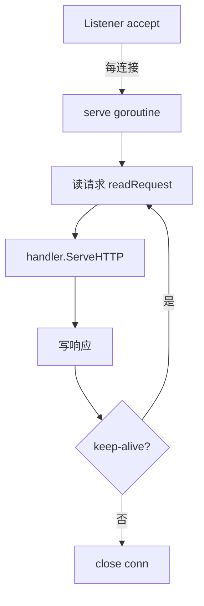

# net/http

> Go 内置 HTTP 库：Server / Client、Transport 连接池、ServeMux 路由、中间件惯用法、超时矩阵

## 一、核心原理

### 1.1 Server 模型

```go
http.ListenAndServe(":8080", handler)
```

底层流程：
1. `net.Listen("tcp", addr)` 拿到 listener
2. 主 goroutine 循环 `Accept()`
3. 每个连接起一个 **`serve` goroutine**
4. `serve` g 循环读请求 → 调用 handler → 写响应（HTTP keep-alive 时复用连接）

**模型**：每连接一 g，靠 Go 调度器和 netpoll 撑高并发。



### 1.2 ServeMux 路由

`http.ServeMux` = 简单前缀匹配 map：
- `/users/` 匹配 `/users/`、`/users/1`（前缀）
- `/users` 仅匹配 `/users`（精确）
- 最长前缀优先

Go 1.22+ 增强：支持 `GET /users/{id}` 方法 + 路径参数。

生产级路由通常用 `gin` / `chi` / `echo`，标准库 ServeMux 太简陋。

### 1.3 Handler 接口

```go
type Handler interface {
    ServeHTTP(ResponseWriter, *Request)
}

// HandlerFunc 是函数适配器
type HandlerFunc func(ResponseWriter, *Request)
func (f HandlerFunc) ServeHTTP(w ResponseWriter, r *Request) { f(w, r) }
```

**中间件惯用法**：包装 Handler 返回新 Handler。

```go
func WithLog(next http.Handler) http.Handler {
    return http.HandlerFunc(func(w http.ResponseWriter, r *http.Request) {
        start := time.Now()
        next.ServeHTTP(w, r)
        log.Printf("%s %s %v", r.Method, r.URL.Path, time.Since(start))
    })
}
```

### 1.4 Client / Transport / 连接池

```
http.Client → http.Transport → TCP 连接池
```

**Transport** 是核心，管理：
- **idle conn pool**（按 host 分桶）
- 连接复用（keep-alive）
- TLS handshake
- HTTP/2 自动协商
- 重定向
- 超时

```go
client := &http.Client{
    Timeout: 5 * time.Second,
    Transport: &http.Transport{
        MaxIdleConns:        100,
        MaxIdleConnsPerHost: 10,
        MaxConnsPerHost:     50,
        IdleConnTimeout:     90 * time.Second,
    },
}
```

> **`http.DefaultClient`** / **`http.DefaultTransport`** 是全局单例，生产环境**慎用**（无超时、池配置不可控）。

### 1.5 HTTP/2

Go 1.6+ 默认对 HTTPS 启用 HTTP/2（自动 ALPN 协商）。HTTP/2 特点：
- 多路复用（一个 TCP 连接并行多请求）
- header 压�� (HPACK)
- 服务端推送

`Transport.ForceAttemptHTTP2 = true` 强制 HTTP/2。

### 1.6 超时矩阵（关键）

| 超时项 | 位置 | 作用 |
| --- | --- | --- |
| `Server.ReadHeaderTimeout` | Server | 读 header 时间，防 slowloris |
| `Server.ReadTimeout` | Server | 读完整请求(含 body) |
| `Server.WriteTimeout` | Server | 写响应 |
| `Server.IdleTimeout` | Server | keep-alive idle 时长 |
| `Client.Timeout` | Client | 整次请求总时长(含连接+读响应) |
| `Transport.DialTimeout` | Client | 拨号 |
| `Transport.TLSHandshakeTimeout` | Client | TLS 握手 |
| `Transport.ResponseHeaderTimeout` | Client | 等响应 header |
| `Transport.IdleConnTimeout` | Client | 空闲连接保留 |
| `Transport.ExpectContinueTimeout` | Client | 100-continue |
| `context.WithTimeout` | Request | 通过 ctx 控制单次请求 |

**没设超时 = 给攻击/慢节点开后门**。生产代码必须设。

## 二、八股速记

- **每连接一 goroutine**，netpoll 让阻塞 read 不阻塞线程
- **Handler** 是接口，`HandlerFunc` 适配普通函数
- **中间件**链式包装 Handler
- **Client = Transport + 配置**，Transport 管连接池和复用
- **HTTP/2** 在 HTTPS 下默认开启
- **超时必须配**：Server 4 个 + Client 几个 + ctx
- `http.DefaultClient` 没超时，**生产禁用**
- `r.Body.Close()` 必须，**否则连接不能复用**
- Server 优雅停机用 `srv.Shutdown(ctx)`
- 大量请求用 `MaxIdleConnsPerHost` 保证连接复用

## 三、面试真题

**Q1：Go HTTP server 高并发模型？**
每个连接一个 goroutine。看似浪费，实际：
- goroutine 极轻量（2KB 栈起步）
- netpoll 让 IO 不阻塞 OS 线程
- 一个 Go 服务轻松撑 10w+ 并发连接

vs Java 的 thread-per-request：线程上限几千。
vs Nginx/Node 的 event loop：性能更高但代码非阻塞写起来痛。Go 折中得很好。

**Q2：Client 不复用连接的常见原因？**
- 没 `defer resp.Body.Close()` → 连接停留在"待读" 状态，不会回到 idle pool
- 没 `io.Copy(io.Discard, resp.Body)` 把 body 读完 → 同上
- `Transport.DisableKeepAlives = true`
- `MaxIdleConnsPerHost = 0`（或太小）→ 复用上限低
- 每次创建新 Client（不共享 Transport）

**修复**：

```go
defer resp.Body.Close()
io.Copy(io.Discard, resp.Body)  // 必须读完
```

**Q3：HTTP server 怎么优雅停机？**

```go
srv := &http.Server{Addr: ":8080", Handler: mux}
go srv.ListenAndServe()

// 收到信号
ctx, cancel := context.WithTimeout(context.Background(), 30*time.Second)
defer cancel()
srv.Shutdown(ctx)  // 停止接新请求,等存量请求完成
```

`Shutdown` 会：
1. 关闭 listener（不再 accept）
2. 等所有 idle conn 关闭
3. 等所有 active conn 完成请求

到 ctx 超时还没完就强制返回。

**Q4：Server 的几个超时分别防什么？**
- `ReadHeaderTimeout`：防 slowloris 攻击（连接打开但慢慢发 header）
- `ReadTimeout`：防大 body 上传慢
- `WriteTimeout`：防响应写慢（客户端故意慢读）
- `IdleTimeout`：keep-alive 空闲连接占用

**最低要求**：`ReadHeaderTimeout` + `WriteTimeout` 必设。

**Q5：Client.Timeout 包含哪些时间？**
**整个请求生命周期**：DNS + TCP + TLS + 写请求 + 读响应 header + 读响应 body���

到时间 → 强制 close 连接，返回 timeout error。

如果想更细控制，用 `Transport.DialTimeout` / `Transport.ResponseHeaderTimeout` 等。

**Q6：怎么传 ctx 控制单次请求？**

```go
req, _ := http.NewRequestWithContext(ctx, "GET", url, nil)
resp, err := client.Do(req)
```

ctx cancel 会中断请求（已读到的 body 不丢，但读不到的部分立即返回 ctx.Err()）。

**Q7：HTTP/2 和 HTTP/1.1 在 Go 里怎么切换？**
- 默认 HTTPS 自动协商（ALPN）
- HTTP（明文）默认 HTTP/1.1
- 强制 HTTP/2：`Transport.ForceAttemptHTTP2 = true`
- 禁用 HTTP/2：清空 `TLSNextProto`：`tr.TLSNextProto = make(map[string]func(...))`（老办法）或 `GODEBUG=http2client=0`

**Q8：handler 里怎么获取真实客户端 IP？**

```go
// 直连
r.RemoteAddr  // "1.2.3.4:5678"

// 经过反向代理(Nginx/CDN)要看 header
ip := r.Header.Get("X-Real-IP")
if ip == "" { ip = r.Header.Get("X-Forwarded-For") }  // 可能多个,取第一个
if ip == "" { ip, _, _ = net.SplitHostPort(r.RemoteAddr) }
```

**生产风险**：`X-Forwarded-For` 可被伪造，必须确认信任入口（如只从 LB 进来）。

**Q9：怎么限制单连接 body 大小？**

```go
r.Body = http.MaxBytesReader(w, r.Body, 1<<20)  // 1MB
if err := json.NewDecoder(r.Body).Decode(&v); err != nil {
    http.Error(w, "body too large", 413)
    return
}
```

防止恶意大 body 打爆内存。

**Q10：长连接下游连接数怎么控制？**

```go
tr := &http.Transport{
    MaxIdleConns:        100,   // 全局空闲上限
    MaxIdleConnsPerHost: 10,    // 每 host 空闲上限(默认 2!)
    MaxConnsPerHost:     50,    // 每 host 总上限(含使用中)
    IdleConnTimeout:     90 * time.Second,
}
```

**默认 `MaxIdleConnsPerHost=2` 几乎肯定要调大**，否则高并发时大量连接被开关，不复用。

## 四、手写实现

**1. 标准 Server 骨架（带超时和优雅停机）：**

```go
func main() {
    mux := http.NewServeMux()
    mux.HandleFunc("/health", func(w http.ResponseWriter, r *http.Request) {
        w.WriteHeader(200)
    })

    srv := &http.Server{
        Addr:              ":8080",
        Handler:           mux,
        ReadHeaderTimeout: 5 * time.Second,
        ReadTimeout:       10 * time.Second,
        WriteTimeout:      10 * time.Second,
        IdleTimeout:       90 * time.Second,
        MaxHeaderBytes:    1 << 16,
    }

    // 异步启动
    go func() {
        if err := srv.ListenAndServe(); err != nil && err != http.ErrServerClosed {
            log.Fatalf("listen: %v", err)
        }
    }()

    // 等信号
    ctx, stop := signal.NotifyContext(context.Background(), syscall.SIGINT, syscall.SIGTERM)
    defer stop()
    <-ctx.Done()

    // 优雅停机
    shutdownCtx, cancel := context.WithTimeout(context.Background(), 30*time.Second)
    defer cancel()
    if err := srv.Shutdown(shutdownCtx); err != nil {
        log.Printf("shutdown: %v", err)
    }
}
```

**2. 中间件链：**

```go
type Middleware func(http.Handler) http.Handler

func Chain(h http.Handler, mws ...Middleware) http.Handler {
    for i := len(mws) - 1; i >= 0; i-- {
        h = mws[i](h)
    }
    return h
}

// 使用
handler := Chain(mux, Recovery, Logging, RateLimit, Auth)
```

**3. 高性能 Client：**

```go
var httpClient = &http.Client{
    Timeout: 5 * time.Second,
    Transport: &http.Transport{
        MaxIdleConns:        200,
        MaxIdleConnsPerHost: 50,
        MaxConnsPerHost:     100,
        IdleConnTimeout:     90 * time.Second,
        TLSHandshakeTimeout: 5 * time.Second,
        DialContext: (&net.Dialer{
            Timeout:   3 * time.Second,
            KeepAlive: 30 * time.Second,
        }).DialContext,
    },
}

func Get(ctx context.Context, url string) ([]byte, error) {
    req, err := http.NewRequestWithContext(ctx, "GET", url, nil)
    if err != nil { return nil, err }
    resp, err := httpClient.Do(req)
    if err != nil { return nil, err }
    defer resp.Body.Close()

    if resp.StatusCode >= 400 {
        // 仍然要读完 body 让连接回 pool
        io.Copy(io.Discard, resp.Body)
        return nil, fmt.Errorf("status %d", resp.StatusCode)
    }
    return io.ReadAll(resp.Body)
}
```

**4. recover 中间件：**

```go
func Recovery(next http.Handler) http.Handler {
    return http.HandlerFunc(func(w http.ResponseWriter, r *http.Request) {
        defer func() {
            if rec := recover(); rec != nil {
                log.Printf("panic %s: %v\n%s", r.URL.Path, rec, debug.Stack())
                http.Error(w, "internal error", 500)
            }
        }()
        next.ServeHTTP(w, r)
    })
}
```

## 五、踩坑与最佳实践

### 坑 1：忘记关 Body

```go
resp, _ := http.Get(url)
data, _ := io.ReadAll(resp.Body)
// 没 Close → 连接不能 keep-alive 复用 → 高并发下 conn 暴涨
```

**修复**：`defer resp.Body.Close()`。即使报错也要尝试 close。

### 坑 2：Body 没读完

```go
resp, _ := http.Get(url)
defer resp.Body.Close()
// 只读了一部分,直接 return → 连接也不能复用
```

读完才能放回 idle pool。错误路径用 `io.Copy(io.Discard, resp.Body)` 排干。

### 坑 3：DefaultClient 没超时

```go
http.Get(url)  // 用的是 DefaultClient, Timeout=0 = 永不超时
```

下游慢挂会导致这边 g 泄漏 + 内存堆积。**强制规则**：业务代码不准用 `http.Get/Post`，自己定义有超时的 client。

### 坑 4：MaxIdleConnsPerHost 默认太小

默认 2。同 host 高并发时连接频繁开关：
- TCP 三次握手 + TLS 握手成本
- TIME_WAIT 端口耗尽

**修复**：根据 QPS 和平均 RT 估算并发连接数，调到 50~200。

### 坑 5：在 handler 里启动 goroutine 用 r.Context()

```go
http.HandlerFunc(func(w http.ResponseWriter, r *http.Request) {
    go func() {
        slowJob(r.Context())  // 请求结束后 ctx 立即取消, slowJob 报错
    }()
    w.WriteHeader(200)
})
```

`r.Context()` 在请求结束后 cancel。需要后台跑长任务用独立 ctx：

```go
go slowJob(context.Background())  // 或继承业务 ctx 但不绑定 r
```

Go 1.21+ 可用 `context.WithoutCancel(r.Context())` 保留 value 去掉 cancel。

### 坑 6：响应写之后再设 header

```go
w.Write([]byte("hello"))
w.Header().Set("X-Foo", "bar")  // 不生效, header 已经发出
```

`Write` 第一次会触发 header 发送。要设 header 必须**写之前**。

### 坑 7：handler panic 整个进程崩溃

如果没有 recover 中间件，handler panic 仅崩溃当前 g？**不**，整个进程崩溃（panic 不跨 g 但会让进程退出）。**所有服务必须挂 recovery 中间件**。

实际上 Go 1.x 的 net/http 默认有内置 recover：`net/http` server.go 里 `serverHandler.ServeHTTP` 的 caller 会 recover 一层，仅打印错误。**但**通常我们要自己的 recovery 来做：日志格式、metrics 上报、统一 5xx 响应。

### 坑 8：大文件下载占内存

```go
data, _ := io.ReadAll(resp.Body)  // 全读到内存
```

下载几 GB 文件时 OOM。改流式：

```go
io.Copy(file, resp.Body)
```

### 最佳实践

- **必设超时**：Server 4 个、Client 1 个、req ctx 1 个，至少这 6 项
- **永远 `defer resp.Body.Close()`** + 错误路径排干
- **共享 Client**：Client 是并发安全的，全局一个就够
- **MaxIdleConnsPerHost** 调到 50~200（按 QPS）
- **`http.MaxBytesReader`** 限制请求 body
- **统一 recovery + logging + metrics 中间件**
- **优雅停机** `srv.Shutdown(ctx)` 是标配
- **生产环境用真路由**（gin/chi）而不是 ServeMux
- pprof 路径 `/debug/pprof` 别暴露公网，要鉴权或仅内网
