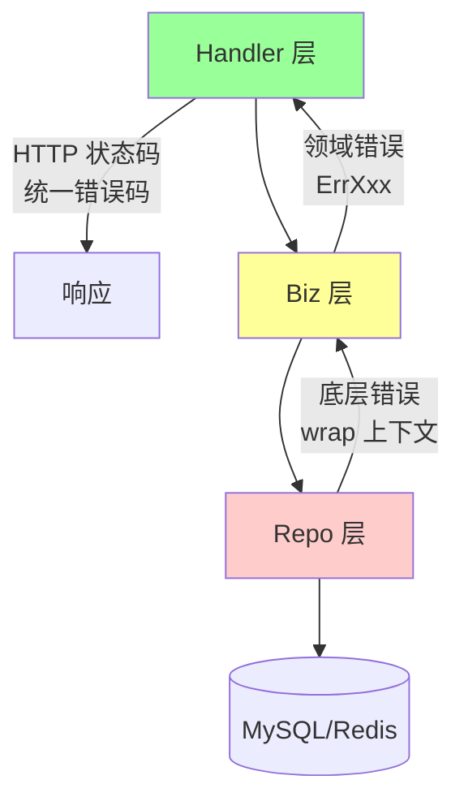

# 错误处理 (error handling)

> 工程层面的错误处理实践：分层错误模型、wrap 链路、栈追踪、统一错误响应、监控告警

> 本篇重在**工程实践**，语法层（接口、Is/As、panic/recover）见 `01-syntax/error.md`

## 一、核心原理

### 1.1 分层错误模型



**约定**：
- **Repo 层**：返回原始错误（DB error、network error），用 `fmt.Errorf("get user %d: %w", id, err)` 加上下文
- **Biz 层**：把底层错误转成**领域错误**（`ErrUserNotFound`、`ErrInsufficientBalance`）
- **Handler 层**：把领域错误转成 **HTTP/gRPC 响应**（status code + 业务 code）

### 1.2 sentinel error vs 自定义类型

**sentinel**（推荐）：

```go
package biz

var (
    ErrUserNotFound  = errors.New("user not found")
    ErrUserBanned    = errors.New("user banned")
    ErrInsufficient  = errors.New("insufficient balance")
)

// 调用方
if errors.Is(err, biz.ErrUserNotFound) { ... }
```

**自定义类型**（需要携带字段）：

```go
type CodedError struct {
    Code int
    Msg  string
    Err  error
}

func (e *CodedError) Error() string { return fmt.Sprintf("[%d] %s: %v", e.Code, e.Msg, e.Err) }
func (e *CodedError) Unwrap() error { return e.Err }

// 调用方
var ce *CodedError
if errors.As(err, &ce) {
    log.Printf("code=%d", ce.Code)
}
```

### 1.3 错误码体系

REST/gRPC 服务通常有统一的业务错误码：

```go
type APIError struct {
    Code    int    `json:"code"`     // 业务码 (10001, 10002, ...)
    Message string `json:"message"`  // 用户可见消息
    Detail  string `json:"detail,omitempty"`  // 调试信息
    cause   error                    // 内部, 不暴露
}

func (e *APIError) Error() string { return e.Message }
func (e *APIError) Unwrap() error { return e.cause }

// 预定义
var (
    ErrInvalidParam = &APIError{Code: 40001, Message: "invalid parameter"}
    ErrNotLogin     = &APIError{Code: 40101, Message: "not logged in"}
    ErrInternal     = &APIError{Code: 50000, Message: "internal error"}
)

// 包装
func NewAPIError(base *APIError, cause error) *APIError {
    e := *base
    e.cause = cause
    return &e
}
```

### 1.4 wrap 上下文

**沿调用链每层加自己的上下文**：

```go
// repo
func (r *userRepo) Get(ctx context.Context, id int64) (*User, error) {
    var u User
    err := r.db.QueryRowContext(ctx, "...", id).Scan(&u.ID, &u.Name)
    if errors.Is(err, sql.ErrNoRows) {
        return nil, biz.ErrUserNotFound
    }
    if err != nil {
        return nil, fmt.Errorf("get user %d: %w", id, err)
    }
    return &u, nil
}

// biz
func (uc *UserUseCase) Login(ctx context.Context, id int64) error {
    u, err := uc.repo.Get(ctx, id)
    if err != nil {
        return fmt.Errorf("login: %w", err)
    }
    if u.Banned { return biz.ErrUserBanned }
    return nil
}

// handler
func (s *Server) Login(...) {
    err := s.uc.Login(ctx, id)
    switch {
    case errors.Is(err, biz.ErrUserNotFound):
        http.Error(w, "user not found", 404)
    case errors.Is(err, biz.ErrUserBanned):
        http.Error(w, "banned", 403)
    case err != nil:
        log.Printf("login: %+v", err)  // 含完整 wrap 链
        http.Error(w, "internal error", 500)
    }
}
```

### 1.5 栈追踪

标准库 `errors` **不带栈**。生产推荐：

| 库 | 特点 |
| --- | --- |
| `pkg/errors` | 老牌, `Wrap` 自动加栈, 但已停止维护 |
| `cockroachdb/errors` | 现代, 兼容 1.13 wrap, 带栈 + 编码 |
| `pingcap/errors` | TiDB 出品, 带 stack |
| 标准库 + runtime.Callers | 自己实现 |

简版自带栈的 wrap：

```go
type tracedError struct {
    err   error
    stack []uintptr
}

func WithStack(err error) error {
    if err == nil { return nil }
    var pcs [32]uintptr
    n := runtime.Callers(2, pcs[:])
    return &tracedError{err: err, stack: pcs[:n]}
}

func (e *tracedError) Error() string { return e.err.Error() }
func (e *tracedError) Unwrap() error { return e.err }
func (e *tracedError) StackTrace() []runtime.Frame {
    frames := runtime.CallersFrames(e.stack)
    var out []runtime.Frame
    for {
        f, more := frames.Next()
        out = append(out, f)
        if !more { break }
    }
    return out
}
```

### 1.6 错误日志策略

**反模式**：每层都 log

```go
// repo
log.Printf("db error: %v", err); return err
// biz
log.Printf("biz error: %v", err); return err
// handler
log.Printf("handler error: %v", err); return 500
```

一次错误打印 3 次。

**推荐**：**只在错误的 "处理者" 打印**。

- 中间层只 wrap 上下文
- Handler 决定 log 还是返回（5xx 必 log，4xx 通常不 log）
- log 一次，含完整 wrap 链：`log.Printf("%+v", err)`

### 1.7 panic 处理

业务**不要 panic 当错误用**。但要在系统边界 recover：

```go
// HTTP middleware
func Recovery(next http.Handler) http.Handler {
    return http.HandlerFunc(func(w http.ResponseWriter, r *http.Request) {
        defer func() {
            if rec := recover(); rec != nil {
                stack := debug.Stack()
                log.Printf("panic [%s %s]: %v\n%s", r.Method, r.URL.Path, rec, stack)
                metrics.PanicCount.Inc()
                http.Error(w, "internal error", 500)
            }
        }()
        next.ServeHTTP(w, r)
    })
}

// goroutine 入口
func GoSafe(f func()) {
    go func() {
        defer func() {
            if rec := recover(); rec != nil {
                log.Printf("g panic: %v\n%s", rec, debug.Stack())
                metrics.PanicCount.Inc()
            }
        }()
        f()
    }()
}
```

### 1.8 监控

错误指标：
- **总错误率**：5xx / total
- **按错误码**：err_count{code="40001"}
- **按 endpoint**：err_count{path="/login"}
- **panic 次数**：panic_total
- **慢请求**：slow_request_total（也是一种错误）

## 二、八股速记

- **分层错误模型**：repo (原始) → biz (领域) → handler (HTTP/响应)
- **每层 wrap 上下文**：`fmt.Errorf("xxx: %w", err)`
- sentinel 用 `errors.Is`，自定义类型用 `errors.As`
- **错误码体系**：业务统一 code，前后端协议
- **栈追踪**：标准库不带，用 cockroachdb/errors 等
- **log 一次原则**：只在处理者打印
- panic 在**系统边界 recover**：HTTP 中间件、goroutine 入口
- **监控指标**：错误率 + 错误码分布 + panic count

## 三、面试真题

**Q1：业务错误码体系怎么设计？**

```
4xxxx: 客户端错误
  40001 invalid param
  40101 not logged in
  40301 forbidden
  40401 not found
5xxxx: 服务端错误
  50000 internal
  50301 db error
  50302 cache error
  50401 downstream timeout
```

约定：
- 前两位对应 HTTP 类别
- 后三位是具体业务
- 错误码全局唯一，文档化
- 禁止 200 + body 里 code=500 这种反模式（除非客户端明确支持）

**Q2：Repo 层错误怎么传到 Handler？**

```go
// repo: 转换 sql.ErrNoRows 为领域错误
if errors.Is(err, sql.ErrNoRows) { return nil, biz.ErrNotFound }

// biz: wrap 上下文,不改变错误身份
return nil, fmt.Errorf("login user %d: %w", id, err)

// handler: 按错误身份决定响应
switch {
case errors.Is(err, biz.ErrNotFound): // 404
case errors.Is(err, biz.ErrPermission): // 403
default: // 500 + log
}
```

**Q3：错误日志只打一次怎么落地？**

约定：
- **中间层只 wrap，不 log**：`return fmt.Errorf("xxx: %w", err)`
- **顶层（handler/main）log**：拿到 err 后判断是否 log
- 只 log **5xx 类**（系统问题），4xx 用户错误一般只统计不 log

```go
// handler
err := uc.Do(ctx)
if err != nil {
    if isSystemError(err) {  // 5xx
        log.Printf("[%s] %+v", reqID, err)
    }
    writeError(w, err)
}
```

**Q4：怎么实现"错误带栈"？**
方法 1：`pkg/errors` 或 `cockroachdb/errors`：

```go
import "github.com/pkg/errors"

err := someFunc()
return errors.Wrap(err, "xxx")  // 自动加栈

log.Printf("%+v", err)  // 打印含栈
```

方法 2：自己实现（见 1.5）：在 wrap 时用 `runtime.Callers` 采集 PC。

方法 3：log 时手动打栈：

```go
log.Printf("error: %v\n%s", err, debug.Stack())
```

**Q5：panic 和 error 的边界？**

| 用 panic | 用 error |
| --- | --- |
| 不可恢复（启动配置错） | 业务可处理（用户没找到） |
| 程序员 bug（空指针、越界） | 用户输入、外部依赖 |
| 内部不变量被破坏 | 网络/DB 失败 |
| 第三方库约定（json marshal 循环引用） | 几乎所有业务路径 |

业务代码 **99% 用 error**。

**Q6：goroutine 里的 panic 会怎样？**
**整个进程崩溃**。panic 不跨 g 传播，主 g 的 recover 救不到子 g。

**铁律**：**每个 goroutine 入口必加 recover**。统一用 `GoSafe` 包装。

**Q7：errors.Is 失效的常见场景？**
1. **没用 wrap (`%w`)**：`fmt.Errorf("xxx: %v", err)` 用 `%v` 不传递 wrap 链
2. **错误自定义类型未实现 Unwrap**
3. **跨进程序列化丢失类型**（gRPC 错误传过来变成 status）
4. **多重 wrap 时类型擦除**

**Q8：分布式系统的错误传播怎么搞？**
单进程：error wrap 链
跨进程：
- gRPC：`status.Error(codes.NotFound, "user not found")` → 客户端 `status.FromError(err)` 解析
- HTTP：业务 code + message + detail
- 链路追踪 ID：错误日志带 trace_id，跨服务 join

```go
// gRPC 服务端
return nil, status.Error(codes.NotFound, "user 123 not found")

// gRPC 客户端
if st, ok := status.FromError(err); ok {
    if st.Code() == codes.NotFound { ... }
}
```

**Q9：HTTP 错误响应推荐格式？**

```json
{
  "code": 40401,
  "message": "user not found",
  "detail": "user_id=123",
  "trace_id": "abc-123"
}
```

或 RFC 7807 Problem Details：

```json
{
  "type": "https://api.example.com/errors/not-found",
  "title": "User Not Found",
  "status": 404,
  "detail": "user 123 does not exist",
  "instance": "/users/123"
}
```

约定后前端统一处理。

**Q10：错误监控告警怎么做？**
1. **指标**：Prometheus 计数 by error code / endpoint / status
2. **日志**：所有 5xx 进 ELK / Loki，按 trace_id 聚合
3. **告警**：错误率超阈值（如 1%）报警
4. **panic**：单独 metric + 高优先级告警
5. **dashboard**：Grafana 错误率趋势 + Top error code

## 四、手写实现

**1. 业务错误类型 + helper：**

```go
package errs

type Error struct {
    Code    int
    Message string
    cause   error
}

func (e *Error) Error() string {
    if e.cause != nil {
        return fmt.Sprintf("[%d] %s: %v", e.Code, e.Message, e.cause)
    }
    return fmt.Sprintf("[%d] %s", e.Code, e.Message)
}

func (e *Error) Unwrap() error { return e.cause }

func New(code int, msg string) *Error {
    return &Error{Code: code, Message: msg}
}

func Wrap(base *Error, cause error) *Error {
    e := *base
    e.cause = cause
    return &e
}

// 预定义
var (
    NotFound     = New(40400, "not found")
    Unauthorized = New(40100, "unauthorized")
    Internal     = New(50000, "internal error")
)
```

**2. 统一响应封装：**

```go
type Response struct {
    Code    int    `json:"code"`
    Message string `json:"message"`
    Data    any    `json:"data,omitempty"`
    TraceID string `json:"trace_id,omitempty"`
}

func WriteOK(w http.ResponseWriter, data any) {
    json.NewEncoder(w).Encode(Response{Code: 0, Data: data})
}

func WriteError(w http.ResponseWriter, err error) {
    var e *errs.Error
    if !errors.As(err, &e) {
        e = errs.Internal
    }
    httpStatus := e.Code / 100  // 40400 → 404
    w.WriteHeader(httpStatus)
    json.NewEncoder(w).Encode(Response{Code: e.Code, Message: e.Message})
}
```

**3. 全局错误中间件：**

```go
func ErrorMiddleware(next http.Handler) http.Handler {
    return http.HandlerFunc(func(w http.ResponseWriter, r *http.Request) {
        defer func() {
            if rec := recover(); rec != nil {
                metrics.PanicTotal.Inc()
                log.Printf("panic %s %s: %v\n%s", r.Method, r.URL.Path, rec, debug.Stack())
                WriteError(w, errs.Internal)
            }
        }()
        next.ServeHTTP(w, r)
    })
}
```

**4. errgroup 错误聚合：**

```go
import "golang.org/x/sync/errgroup"

func parallelFetch(ctx context.Context, ids []int64) ([]*User, error) {
    g, ctx := errgroup.WithContext(ctx)
    g.SetLimit(10)  // 限并发

    users := make([]*User, len(ids))
    for i, id := range ids {
        i, id := i, id
        g.Go(func() error {
            u, err := getUser(ctx, id)
            if err != nil { return fmt.Errorf("get user %d: %w", id, err) }
            users[i] = u
            return nil
        })
    }
    if err := g.Wait(); err != nil { return nil, err }
    return users, nil
}
```

## 五、踩坑与最佳实践

### 坑 1：用 `%v` 而不是 `%w`

```go
return fmt.Errorf("xxx: %v", err)  // 链断, errors.Is 失效
return fmt.Errorf("xxx: %w", err)  // 正确
```

### 坑 2：每层都 log

每层 log 一次，一个错误日志爆炸 5 行。**修复**：log 一次原则。

### 坑 3：把所有错误转 500

```go
if err != nil { return 500 }
```

吞掉了 4xx 信息。**修复**：用错误类型分发。

### 坑 4：goroutine 没 recover

```go
go doWork()  // panic 进程死
```

必须 GoSafe / 显式 recover。

### 坑 5：错误码不全局唯一

```
biz1: 40001 = "invalid param"
biz2: 40001 = "user not found"  // 冲突
```

需要全局唯一表，文档化。

### 坑 6：把 nil 指针当 error 返回

```go
type MyErr struct{}
func (*MyErr) Error() string { return "x" }

func do() error {
    var e *MyErr  // nil
    return e       // 装入 error 接口非 nil
}
```

调用方 `err == nil` 失败。**修复**：显式 `return nil`。

### 坑 7：暴露内部错误细节

```json
{"error": "pq: relation \"users\" does not exist"}
```

把 DB 错误直接返给前端，泄漏 schema。**修复**：转成业务错误码。

### 坑 8：忽略错误

```go
data, _ := os.ReadFile(path)
```

除非真的不关心，否则必处理。`errcheck` 工具扫。

### 最佳实践

- **分层错误**：repo 原始、biz 领域、handler 响应
- **统一错误码 + Response 格式**：前后端约定，文档化
- **每层 wrap 上下文**：`fmt.Errorf("xxx: %w", err)`
- **log 一次原则**：处理者 log，中间层只 wrap
- **panic 边界 recover**：HTTP 中间件 + GoSafe
- **生产用带栈库**：cockroachdb/errors 或自实现
- **监控**：错误率 / 错误码分布 / panic count
- **trace_id**：请求链路 ID 写入 log，跨服务 join
- **错误码全局唯一表**：内部文档维护
