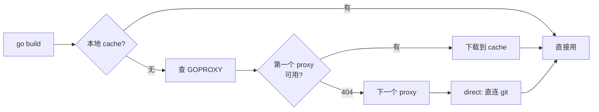

# go modules

> Go 依赖管理：MVS（最小版本选择）+ semver + go.sum 校验；replace / vendor / private 是工程必备技巧

## 一、核心原理

### 1.1 文件结构

```
go.mod          # 声明模块路径、Go 版本、依赖列表
go.sum          # 依赖的精确 hash, 防篡改
vendor/         # 可选, 把依赖代码进库
```

```go
// go.mod
module github.com/foo/myapp

go 1.22

require (
    github.com/gin-gonic/gin v1.9.1
    github.com/go-redis/redis/v9 v9.0.5
    google.golang.org/grpc v1.60.0
)

require (
    // 间接依赖, 自动管理
    github.com/cespare/xxhash/v2 v2.2.0 // indirect
)

replace github.com/foo/internal => ../internal  // 本地开发覆盖
exclude github.com/bad/lib v1.0.0                // 排除某版本
retract v1.0.1                                    // 撤回自己发布的版本
```

### 1.2 版本语义（semver）

```
v1.2.3       正式版
v1.2.3-beta  预发布
v0.x.x       不稳定 (1.0 前不保证兼容)
v2+          需要 import path 加 /v2
```

**重要规则**：
- `v0` 和 `v1` 共用 `module github.com/foo/bar`
- `v2+` 必须改 module path：`module github.com/foo/bar/v2`
- import 也要改：`import "github.com/foo/bar/v2"`

> Go 把 v2+ 当成不同包对待（避免 diamond dependency）

### 1.3 MVS（Minimal Version Selection）

Go 选最低能满足约束的版本，与 npm/cargo 等"最新满足"策略相反。

举例：
- A 依赖 lib v1.2.0
- B 依赖 lib v1.3.0
- Go 选 v1.3.0（满足两者最小）

不会选 v1.4.0 即使存在。**好处**：可重现构建，升级有意识。

### 1.4 go.sum

每个依赖的内容 hash + go.mod hash：

```
github.com/gin-gonic/gin v1.9.1 h1:4idEAncQnU5cB7BeOkPtxjfCSye0AAm1R0RVIqJ+Jmg=
github.com/gin-gonic/gin v1.9.1/go.mod h1:...
```

`go mod download` / `build` 会校验 hash。被篡改 → 报错。

**必须 commit 进库**（包括 go.mod 和 go.sum）。

### 1.5 GOPROXY

```bash
GOPROXY=https://proxy.golang.org,direct  # 默认
GOPROXY=https://goproxy.cn,direct        # 国内
GOPROXY=off                              # 禁用代理
```

工作流程：



`direct` 是最后兜底：直接 git clone。

### 1.6 私有库

私有 git（公司 GitLab 等）需要：

```bash
# 跳过 proxy
GOPRIVATE=*.company.com,github.com/myorg/*

# 跳过 sumdb (公司私有库不在 sum.golang.org)
GONOSUMCHECK=*.company.com
GONOSUMDB=*.company.com   # 老版本

# git auth
git config --global url."git@github.com:".insteadOf "https://github.com/"
# 或 ~/.netrc / GIT_TERMINAL_PROMPT=1
```

`GOPRIVATE` 同时含义：跳过 GOPROXY + 跳过 sumdb 校验。

### 1.7 replace（本地开发常用）

```go
require github.com/foo/lib v1.0.0

replace github.com/foo/lib => ../lib  // 指向本地路径
// 或
replace github.com/foo/lib => github.com/myfork/lib v1.0.1-fix
```

**用途**：
- 本地联调多个模块
- 临时 fork 修复 bug
- 测试上游 PR

⚠️ replace 不传递。只在当前模块生效。**生产构建前去掉 replace**。

### 1.8 工作区模式 (Go 1.18+)

替代多 module 间用 replace 的复杂场景：

```bash
go work init ./svc-a ./svc-b ./shared
```

生成 `go.work`：

```
go 1.22
use (
    ./svc-a
    ./svc-b
    ./shared
)
```

工作区内的模块自动相互可见，**不需要 replace**。仅本地有效，不影响 module 依赖关系。

### 1.9 vendor

```bash
go mod vendor    # 把依赖复制到 ./vendor
go build -mod=vendor  # 用 vendor 构建
```

**用途**：
- 内网构建（无 proxy）
- 离线 CI
- 严格审计依赖代码

代价：仓库变大（几 MB ~ 几百 MB）、PR 噪声多。

### 1.10 常用命令

```bash
go mod init github.com/foo/myapp        # 初始化
go mod tidy                              # 整理 go.mod (移除未用, 添加缺失)
go mod download                          # 下载所有依赖到 cache
go mod vendor                            # 进 vendor
go mod why github.com/x/y                # 为什么需要这个包
go mod graph                             # 依赖图
go list -m all                           # 列所有模块
go list -m -u all                        # 显示可升级版本
go get -u                                # 升级所有依赖
go get pkg@v1.2.3                        # 指定版本
go get pkg@latest                        # 最新
go get pkg@none                          # 移除
```

## 二、八股速记

- **go.mod + go.sum** 必须 commit
- **MVS**：最小版本选择，与 npm 反着来
- **v2+ 改 module path**：`github.com/foo/bar/v2`
- **go.sum** 含 hash 防篡改
- **GOPROXY** 默认 proxy.golang.org，国内用 goproxy.cn
- **GOPRIVATE** 跳过 proxy + sumdb，私有库必设
- **replace** 本地开发用，**生产前去掉**
- **go work** (Go 1.18+) 替代多 module replace
- **vendor** 仅在离线/审计需要时用
- 升级用 `go get -u`，整理用 `go mod tidy`
- `go mod why` 排查"为什么有这个依赖"

## 三、面试真题

**Q1：MVS 是什么？为什么这么设计？**
**Minimal Version Selection**：Go 选满足所有约束的**最低版本**。

为什么：
- **可重现构建**：今天和明天都得到相同版本（除非显式升级）
- **升级有意识**：依赖升级要 `go get -u` 主动触发
- **避免供应链突袭**：上游发新版不会自动被引入

vs npm "latest satisfying" 策略，每次构建可能拿到不同版本。

**Q2：v2+ 为什么要改 module path？**
Go 把不同主版本视为**不同模块**（避免 diamond dependency）：

```
A 依赖 lib v1
B 依赖 lib v2
```

如果 v1/v2 共用 path，就出现冲突。改 path 后两者可共存：

```go
import (
    libv1 "github.com/foo/lib"
    libv2 "github.com/foo/lib/v2"
)
```

**Q3：go.sum 的作用？要不要 commit？**
**作用**：每个依赖的内容哈希。`go build` 时校验，被篡改报错。
**必须 commit**：保证团队和 CI 拿到的依赖完全一致。

go.sum 不是 lock 文件（go.mod 已经锁版本），它是**校验文件**。

**Q4：怎么处理"上游发新版破坏 API"？**
1. **go.mod 锁版本**：保持当前版本不变（不 `go get -u`）
2. **fork 修复**：`replace github.com/x/y => github.com/myfork/y v1.x.y-fix`
3. **exclude**：排除特定版本

```go
exclude github.com/x/y v1.5.0  // 强制不用这版
```

或临时 retract 自己的 buggy 版本：

```go
retract v1.0.1  // 自己发的有 bug, 撤回
```

**Q5：私有库怎么配置？**
```bash
# 1. 设 GOPRIVATE
go env -w GOPRIVATE=*.company.com,github.com/myorg/*

# 2. git 用 ssh
git config --global url."git@github.com:".insteadOf "https://github.com/"

# 3. 或 .netrc (HTTPS + token)
echo "machine github.com login mytoken" >> ~/.netrc
```

`GOPRIVATE` 让 Go 跳过 proxy（直连 git）+ 跳过 sumdb 校验。

**Q6：replace 什么时候用？什么时候删？**

**用**：
- 本地联调（多 module 同时改）
- 临时绕过上游 bug（指向 fork）
- 测试 PR

**删**：
- 提交前确认本地路径不进库（CI 拿不到 `../lib`）
- release 前用真实版本

**坑**：replace 不传递。如果你的库被别人 import，你 replace 的内容他用不到，他自己得 replace。

**Q7：`go mod tidy` 做什么？**
- 移除 go.mod 中**未被代码 import** 的依赖
- 添加代码中 import 但 go.mod 缺的依赖
- 整理为最小可重现集合

**养成习惯**：commit 前 `go mod tidy`。CI 也跑 `go mod tidy && git diff --exit-code` 检查。

**Q8：vendor 还有必要吗？**
大部分项目**不需要**。需要的场景：
- 内网构建机无外网
- 离线 CI（如 air-gapped 环境）
- 监管要求依赖代码必须在仓库
- 极致快速构建（跳过 proxy 网络）

代价：仓库膨胀、PR 噪声、维护麻烦。

**Q9：为什么 go.mod 里有 `// indirect`？**
间接依赖：你的代码没直接 import，但你的依赖 import 了。Go 1.17+ 会全部列在 go.mod（之前只列直接依赖）。

```go
require (
    github.com/gin-gonic/gin v1.9.1   // 直接
)
require (
    github.com/cespare/xxhash/v2 v2.2.0 // indirect (gin 依赖)
)
```

`go mod tidy` 自动管理。

**Q10：依赖冲突怎么排查？**

```bash
# 看为什么有这个包
go mod why github.com/x/y

# 看依赖图
go mod graph | grep '/y@'

# 看实际选用版本
go list -m github.com/x/y
go list -m all | grep '/y'
```

发现冲突：
- 升级有兼容版本的库
- replace 强制指定版本
- 联系上游升级

## 四、手写实现

**1. 标准 go.mod 模板：**

```go
module github.com/foo/myapp

go 1.22

require (
    github.com/gin-gonic/gin v1.9.1
    github.com/go-sql-driver/mysql v1.7.1
    github.com/redis/go-redis/v9 v9.3.0
    go.uber.org/zap v1.26.0
    golang.org/x/sync v0.5.0
    google.golang.org/grpc v1.60.0
)

require (
    // ... indirect deps
)
```

**2. 私有库 + 多 proxy：**

```bash
go env -w GOPROXY=https://goproxy.cn,https://proxy.golang.org,direct
go env -w GOPRIVATE=*.company.com,github.com/myorg/*
go env -w GOSUMDB=sum.golang.org
go env -w GONOSUMCHECK=*.company.com
```

**3. 工作区开发（Go 1.18+）：**

```bash
mkdir workspace && cd workspace
git clone https://github.com/foo/svc-a
git clone https://github.com/foo/svc-b
git clone https://github.com/foo/shared

go work init ./svc-a ./svc-b ./shared
# 在 svc-a 里 import "github.com/foo/shared" 直接用本地代码
```

`.gitignore` 加 `go.work`（个人开发文件，不进库）。

**4. 升级依赖工作流：**

```bash
# 看可升级
go list -m -u all

# 升级特定包到最新次版本
go get -u github.com/gin-gonic/gin

# 升级到最新主版本(注意 path 改变)
go get github.com/foo/lib/v2

# 升级所有
go get -u ./...

# 整理
go mod tidy

# 测试
go test ./...
```

**5. fork + replace 临时修复：**

```bash
# 1. fork 上游 repo
# 2. clone 到本地, 改 bug, push 到自己的 fork

# 3. go.mod 加 replace
echo 'replace github.com/x/y => github.com/myfork/y v1.0.1-fix' >> go.mod

# 4. 等上游 merge 后, 升级到正式版
go get github.com/x/y@v1.0.2
# 删 replace
```

**6. 检查依赖安全：**

```bash
# 内置 vuln check (Go 1.22+)
govulncheck ./...

# nancy / snyk 等三方工具
go list -json -deps | nancy sleuth
```

## 五、踩坑与最佳实践

### 坑 1：忘记 commit go.sum

不 commit go.sum，CI 每次重新校验下载，慢且不一致。**必 commit**。

### 坑 2：replace 进生产

```go
replace github.com/foo/lib => ../lib  // CI 找不到 ../lib
```

**修复**：release 前删 replace，用 ��式版本。

### 坑 3：v2+ 升级忘改 import

```go
// go.mod
require github.com/foo/lib v2.0.0  // 错: 没 /v2

// 实际要写
require github.com/foo/lib/v2 v2.0.0
import "github.com/foo/lib/v2"
```

### 坑 4：私有库网络问题

```
fatal: could not read Username for 'https://github.com'
```

git auth 没配。GOPRIVATE 设了但 git 拿不到代码。**修复**：ssh key 或 token + .netrc。

### 坑 5：sum 校验失败

```
verifying github.com/x/y@v1.0.0/go.mod: checksum mismatch
```

可能：
- 真被篡改（极罕见）
- proxy 缓存了旧版（清 cache：`go clean -modcache`）
- 私有库没设 GOPRIVATE 但走了 sumdb（设 GOPRIVATE）

### 坑 6：循环 module 依赖

```
A imports B imports A  // 不允许
```

Go 不允许 module 之间循环依赖。**修复**：抽出公共部分到 C。

### 坑 7：`go get` 拉错版本

```bash
go get github.com/x/y@master  # 拉最新 master commit, 可能是 v0.0.0-...
```

非 release 提交会得到 pseudo version `v0.0.0-20240101120000-abc12345`，不稳定。建议用 release tag。

### 坑 8：vendor 和 go.sum 不同步

```bash
go mod vendor          # 复制依赖
# 改 go.mod
go build -mod=vendor   # 报错: vendor 落后
```

**修复**：每次改依赖都 `go mod tidy && go mod vendor`，重新提交。

### 最佳实践

- **go.mod + go.sum 必 commit**
- **`go mod tidy` 频繁运行**，commit 前必跑
- **CI 加** `go mod tidy && git diff --exit-code` 检查
- **GOPROXY 设国内镜像**：`https://goproxy.cn,direct`
- **GOPRIVATE 私有库必设**：跳过 proxy + sumdb
- **replace 仅本地用**，commit 前移除
- **多 module 联调用 go work**，比 replace 简洁
- **升级要测试**：`go test ./...` 确认
- **govulncheck** 定期跑，发现已知漏洞
- **vendor 谨慎**，仅离线/审计需要
- **v2+ 必 /v2**，否则 Go 不当不同模块
