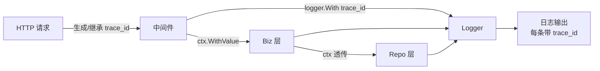

# 日志 (logging)

> 生产级日志：结构化（JSON）+ 分级 + 上下文注入（trace_id）+ 异步刷盘 + 采样降级

## 一、核心原理

### 1.1 库选型

| 库 | 特点 | 性能 |
| --- | --- | --- |
| `log` (标准库) | 简单, 无结构化 | 中 |
| `log/slog` (Go 1.21+) | 标准库结构化 | 中高 |
| `uber-go/zap` | 高性能, API 略复杂 | **极高** |
| `rs/zerolog` | 零分配, 链式 API | 极高 |
| `sirupsen/logrus` | 老牌, API 友好但反射开销 | 中 |

**生产推荐**：
- 新项目首选 **slog**（标准化）
- 极致性能选 **zap** 或 **zerolog**
- 老项目延续不必折腾

### 1.2 结构化日志（必须）

```go
// 错: 字符串拼接
log.Printf("user %d login at %s", userID, time.Now())
// → "user 123 login at 2024-01-01 12:00:00"

// 对: 结构化
logger.Info("login", zap.Int64("user_id", 123), zap.Time("at", time.Now()))
// → {"level":"info","msg":"login","user_id":123,"at":"2024-..."}
```

**好处**：
- ELK / Loki / Splunk 可直接按字段查询
- 字段类型保留（数字仍是数字）
- 易聚合分析

### 1.3 日志级别

```
DEBUG  开发调试用, 生产关闭
INFO   关键业务事件, 默认级别
WARN   异常但不影响流程, 需关注
ERROR  错误, 必看
FATAL  致命, 退出进程(慎用)
```

**生产规范**：
- 默认 INFO，DEBUG 留给排障开关
- 5xx 错误 ERROR
- 4xx 用户错误一般不打日志，统计即可
- 大量重复日志要采样

### 1.4 上下文注入（trace_id / request_id）



实现：

```go
// 中间件: 取/创建 trace_id, 写入 ctx 和 logger
func TraceMiddleware(next http.Handler) http.Handler {
    return http.HandlerFunc(func(w http.ResponseWriter, r *http.Request) {
        tid := r.Header.Get("X-Trace-Id")
        if tid == "" { tid = uuid.NewString() }

        l := logger.With(zap.String("trace_id", tid))
        ctx := context.WithValue(r.Context(), loggerKey{}, l)

        next.ServeHTTP(w, r.WithContext(ctx))
    })
}

// 业务层取出
func FromContext(ctx context.Context) *zap.Logger {
    if l, ok := ctx.Value(loggerKey{}).(*zap.Logger); ok { return l }
    return zap.L()
}

// 使用
log := FromContext(ctx)
log.Info("user login", zap.Int64("user_id", uid))
// → {"level":"info","msg":"user login","user_id":1,"trace_id":"abc-..."}
```

### 1.5 异步刷盘

zap 默认同步写。高吞吐场景：
- 大量 log 拖慢业务
- 同步写盘抖动会传染请求

**异步方案**：
- zap 用 `BufferedWriteSyncer`（自带缓冲）
- 自己封一层 channel + 后台 goroutine

```go
ws := zapcore.AddSync(&zapcore.BufferedWriteSyncer{
    WS:            zapcore.AddSync(file),
    Size:          256 * 1024,
    FlushInterval: time.Second,
})
```

**��舍**：异步的代价是 crash 时丢日志（buffer 没刷盘）。重要场景同步写。

### 1.6 采样降级

热点错误 1 分钟打 100 万条 → 磁盘满 + ES 卡死。**采样**：

```go
// zap 自带 Sampler
core := zapcore.NewSamplerWithOptions(
    baseCore,
    time.Second,  // 时间窗口
    100,          // 每窗口前 100 条全打
    100,          // 之后每 100 条采 1 条
)
```

或自实现：相同 message + 字段命中频率 > 阈值时跳过。

### 1.7 日志切割

容器化：直接写 stdout，让 docker / k8s 收集。
传统部署：用 `lumberjack` 按大小/时间切割：

```go
import "gopkg.in/natefinch/lumberjack.v2"

w := zapcore.AddSync(&lumberjack.Logger{
    Filename:   "/var/log/app.log",
    MaxSize:    100,  // MB
    MaxBackups: 7,
    MaxAge:     30,   // days
    Compress:   true,
})
```

### 1.8 性能对比（zap.Info）

| 库 | ns/op | allocs |
| --- | --- | --- |
| zap | ~700 ns | 0~1 |
| zerolog | ~600 ns | 0 |
| logrus | ~5000 ns | 20+ |
| log | ~1000 ns | 2 |

zap/zerolog 几乎 **零分配**，所以高 QPS 场景必选。

## 二、八股速记

- **结构化日志**是生产必备（JSON），便于 ELK/Loki 查询
- **slog**（Go 1.21+ 标准库）是新项目首选
- **zap / zerolog** 高性能，热路径用
- **trace_id** 注入 ctx + logger，跨服务关联
- 级别：DEBUG < INFO < WARN < ERROR，默认 INFO
- **5xx 必 log，4xx 不 log**（统计即可）
- **采样**防热点错误打爆磁盘
- 异步刷盘换吞吐，crash 可能丢
- 容器写 stdout，传统部署用 lumberjack 切割
- **每条 log 带 trace_id + 关键字段**

## 三、面试真题

**Q1：为什么生产必须用结构化日志？**
1. **可查询**：ES/Loki 按字段索引，`user_id=123` 直接查
2. **可聚合**：count by error_code, sum by latency_ms
3. **类型保留**：数字仍是数字，可做数学运算
4. **机器可读**：监控/告警系统直接消费

非结构化日志靠正则解析，脆弱且慢。

**Q2：log/slog vs zap 怎么选？**
- **新项目** Go 1.21+：**slog**（标准库，无外部依赖）
- **老项目** 已用 zap：继续 zap，性能更好
- **极致性能**：zerolog（零分配）
- 不要选 logrus（性能差）

**Q3：trace_id 怎么贯穿整条调用链？**
1. **HTTP 入口中间件**：从 header 取或新建
2. **写入 ctx**：所有下游函数从 ctx 取
3. **写入 logger**：`logger.With("trace_id", tid)` 后续所有 log 自动带
4. **跨服务传递**：HTTP header `X-Trace-Id` / gRPC metadata
5. **DB/Redis**：在 query log 也带上

```go
ctx = context.WithValue(ctx, "trace_id", tid)
logger := zap.L().With(zap.String("trace_id", tid))
// 所有 logger.Info/.Error 都自动带
```

**Q4：日志级别怎么用？**

```
DEBUG: 开发排障(局部变量, SQL, 详细流程), 生产关闭
INFO:  业务事件(请求开始/结束、关键状态变更)
WARN:  异常但可继续(重试成功、降级、配置缺失用默认)
ERROR: 失败(5xx、外部依赖错、业务规则违反但属系统问题)
FATAL: 启动失败、不可恢复, 调用 os.Exit
```

**4xx 不打 ERROR**，不是系统问题。

**Q5：日志会成为性能瓶颈吗？**
会。常见原因：
- **同步写盘**：fsync 阻塞业务 g
- **字符串格式化**：fmt.Sprintf 反射 + 分配
- **大量字段反射**：logrus 等用反射的库
- **磁盘 IOPS 打满**：高 QPS 写日志

排查：pprof 看是否 `runtime.write` / `fmt.Sprintf` 占大头。

修复：
- 换 zap/zerolog/slog
- 异步写
- 采样
- 减少 INFO 内容

**Q6：日志爆炸怎么办？**
现象：磁盘满、ES 卡死、log 进程占大量 CPU。

应对：
1. **采样**：相同 key 高频时采样 1/N
2. **限速**：rate.Limiter 限制每秒条数
3. **降级**：动态调级（只输出 ERROR）
4. **链路缩减**：DEBUG 默认关
5. **快速发现**：监控 log_lines/s 突增告警

```go
// zap 采样配置
zap.NewProductionConfig().Sampling = &zap.SamplingConfig{
    Initial:    100,   // 每秒前 100 条全打
    Thereafter: 100,   // 之后每 100 条采 1
}
```

**Q7：日志收集架构？**
**容器化**：

```
应用 → stdout → docker/k8s → fluentd/fluent-bit → Kafka → Logstash → ES/Loki → Kibana/Grafana
```

**传统**：

```
应用 → 本地文件 → filebeat → Kafka/Redis → Logstash → ES → Kibana
```

要点：
- 应用本身只**写本地**（文件或 stdout）
- 收集解耦异步，应用不阻塞
- 日志中间件高可用 + 落盘缓冲

**Q8：怎么查问题用日志？**
1. **trace_id 串链路**：从入口到所有下游
2. **关键字段索引**：user_id / order_id / error_code 必加 ES index
3. **分级查看**：先看 ERROR 找异常，再看 WARN/INFO 还原过程
4. **聚合定位**：error_code 分布、latency 直方图

**Q9：开发期间打太多 DEBUG 影响性能怎么办？**

```go
if logger.Core().Enabled(zap.DebugLevel) {  // 先判断
    logger.Debug("xxx", expensiveFields()...)  // 才计算字段
}
```

或用 zap 的 `Sugar` 时只会按需求值。

zerolog 的链式 API 天然 lazy：

```go
log.Debug().Int("count", expensiveCount()).Msg("...")
// 如果 debug 关闭, expensiveCount ��会被调
```

**Q10：日志格式怎么定？**
通用建议：

```json
{
  "ts": "2024-01-01T12:00:00.123Z",
  "level": "info",
  "msg": "user login",
  "trace_id": "abc-123",
  "user_id": 1,
  "ip": "1.2.3.4",
  "caller": "service/login.go:42"
}
```

字段：
- `ts`: 时间戳（ISO8601 或 epoch）
- `level`: 级别
- `msg`: 主消息（短）
- `trace_id`: 链路 ID
- 业务字段
- `caller`: 文件:行号（zap 自带 `AddCaller()`）
- 错误时加 `error` + `stack`

## 四、手写实现

**1. 标准 zap 配置（生产）：**

```go
package logger

import (
    "go.uber.org/zap"
    "go.uber.org/zap/zapcore"
    "gopkg.in/natefinch/lumberjack.v2"
)

func New(env string) *zap.Logger {
    var cfg zap.Config
    if env == "prod" {
        cfg = zap.NewProductionConfig()
    } else {
        cfg = zap.NewDevelopmentConfig()
    }
    cfg.EncoderConfig.TimeKey = "ts"
    cfg.EncoderConfig.EncodeTime = zapcore.ISO8601TimeEncoder
    cfg.EncoderConfig.CallerKey = "caller"
    cfg.OutputPaths = []string{"stdout"}  // 容器化首选
    cfg.Sampling = &zap.SamplingConfig{Initial: 100, Thereafter: 100}

    l, _ := cfg.Build(zap.AddCaller(), zap.AddStacktrace(zapcore.ErrorLevel))
    return l
}

// 替换全局
zap.ReplaceGlobals(New("prod"))
```

**2. ctx-aware logger：**

```go
type ctxKey struct{}

func With(ctx context.Context, fields ...zap.Field) context.Context {
    l := FromContext(ctx).With(fields...)
    return context.WithValue(ctx, ctxKey{}, l)
}

func FromContext(ctx context.Context) *zap.Logger {
    if l, ok := ctx.Value(ctxKey{}).(*zap.Logger); ok { return l }
    return zap.L()
}

// 使用
ctx = logger.With(ctx, zap.String("trace_id", tid))
log := logger.FromContext(ctx)
log.Info("xxx")  // 自动带 trace_id
```

**3. HTTP 中间件：**

```go
func LoggingMiddleware(next http.Handler) http.Handler {
    return http.HandlerFunc(func(w http.ResponseWriter, r *http.Request) {
        start := time.Now()
        tid := r.Header.Get("X-Trace-Id")
        if tid == "" { tid = uuid.NewString() }
        w.Header().Set("X-Trace-Id", tid)

        ctx := logger.With(r.Context(), zap.String("trace_id", tid))
        sw := &statusWriter{ResponseWriter: w, status: 200}

        next.ServeHTTP(sw, r.WithContext(ctx))

        logger.FromContext(ctx).Info("request",
            zap.String("method", r.Method),
            zap.String("path", r.URL.Path),
            zap.Int("status", sw.status),
            zap.Duration("latency", time.Since(start)),
            zap.String("ip", r.RemoteAddr),
        )
    })
}

type statusWriter struct {
    http.ResponseWriter
    status int
}
func (s *statusWriter) WriteHeader(code int) {
    s.status = code
    s.ResponseWriter.WriteHeader(code)
}
```

**4. slog 等价（Go 1.21+）：**

```go
import "log/slog"

logger := slog.New(slog.NewJSONHandler(os.Stdout, &slog.HandlerOptions{
    Level: slog.LevelInfo,
    AddSource: true,
}))
slog.SetDefault(logger)

slog.Info("user login", "user_id", 1, "ip", "1.2.3.4")
// {"time":"...","level":"INFO","msg":"user login","user_id":1,"ip":"1.2.3.4"}

// ctx-aware: slog 1.21+ 没原生支持, 用 group/with 模拟
log := slog.With("trace_id", tid)
log.Info("xxx")
```

## 五、踩坑与最佳实践

### 坑 1：`log.Printf` 当结构化用

```go
log.Printf("user_id=%d action=%s", uid, "login")
```

字符串里塞 key=value，要 ELK 解析正则脆弱。**修复**：用结构化库。

### 坑 2：日志放 lock 内

```go
mu.Lock()
log.Info("xxx", zap.Any("v", bigStruct))  // log 写盘 ms 级
mu.Unlock()
```

锁 hold 时间被日志放大。**修复**：log 出 lock。

### 坑 3：`Fatal` 在中间件

```go
if err != nil { log.Fatal(err) }  // 进程退出, 整个服务挂
```

只在 main 启动错误用 Fatal。中间层用 Error + return。

### 坑 4：日志包含敏感信息

```go
log.Info("login", "password", req.Password)  // ❌
```

密码、token、银行卡都不能进 log。脱敏：

```go
log.Info("login", "user_id", uid, "ip", ip)  // 不打 password
```

### 坑 5：循环里没采样

```go
for _, item := range millionItems {
    log.Debug("processing", "id", item.ID)  // 100 万行
}
```

热路径 Debug 也可能拖慢。**修复**：循环里少 log，或加 sampling。

### 坑 6：日志格式化太重

```go
log.Info("data", "json", string(mustMarshal(bigStruct)))  // 序列化大对象
```

每条 log 都做 JSON encoding，CPU 占用高。**修复**：选择性序列化或截断。

### 坑 7：没做日志轮转

```go
logger := zap.New(file)  // 写一个文件, 永远不切
```

文件无限大。容器化用 stdout（k8s 处理），传统部署用 lumberjack。

### 坑 8：trace_id 没传到下游

```go
// service A 有 trace_id
http.Get("http://svc-b/api")  // 没传 header, B 自己生成新的
```

跨服务调用要把 trace_id 写 header。

### 最佳实践

- **结构化日志**：JSON，字段类型保留
- **slog（Go 1.21+）/ zap / zerolog** 三选一
- **trace_id 必须**：入口生成，ctx + logger 透传，跨服务带 header
- **采样防爆**：高频热点必采样
- **容器化写 stdout**，传统部署用 lumberjack
- **5xx ERROR，4xx 不 log**
- **ERROR 带 stack**：`zap.AddStacktrace(zap.ErrorLevel)`
- **caller 字段**：定位代码位置
- **不打敏感信息**：password/token/卡号等
- **生产关闭 DEBUG**，留动态开关排障
- **监控 log_lines/s**：突增告警
