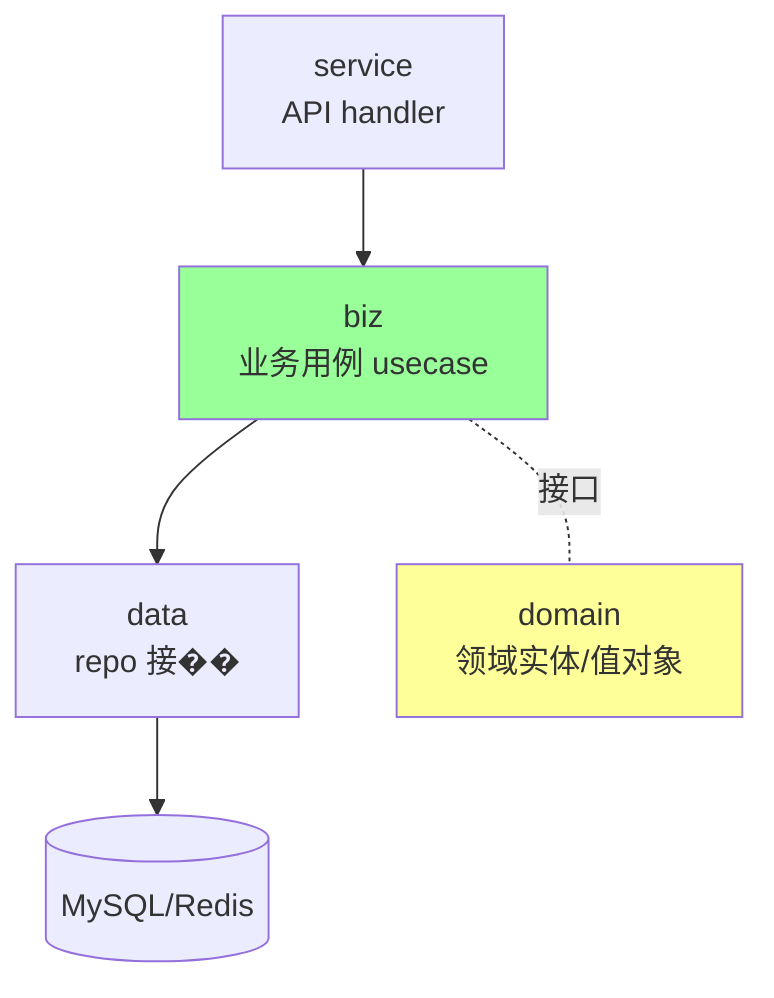

# 项目结构 (project layout)

> Go 没有官方强制结构，社区共识 `golang-standards/project-layout`；中型服务推荐 DDD 风格分层

## 一、核心原理

### 1.1 社区惯用结构

```
myapp/
├── cmd/                # main 入口, 每个二进制一个子目录
│   ├── server/main.go
│   └── worker/main.go
├── internal/           # 私有包, Go 编译器强制只能本模块导入
│   ├── biz/            # 领域服务/业务逻辑
│   ├── data/           # 数据层(DB/缓存)
│   ├── service/        # API 层 (HTTP/gRPC handler)
│   └── conf/           # 配置加载
├── pkg/                # 公开可复用包(对外暴露)
│   └── logger/
├── api/                # API 定义(proto/openapi/swagger)
│   └── v1/
├── configs/            # 配置文件(yaml/toml/env)
├── deployments/        # docker-compose / k8s / helm
├── scripts/            # 构建/部署/工具脚本
├── third_party/        # vendored 第三方
├── docs/               # 文档
├── test/               # 集成测试 / e2e
├── go.mod
├── go.sum
├── Makefile
└── README.md
```

### 1.2 internal 机制

`internal/` 是 Go 编译器**特殊处理**的目录：

```
github.com/foo/myapp/
├── internal/
│   └── biz/  ← 只有 github.com/foo/myapp/... 下的包能 import
```

**任何路径包含 `internal/` 的包，只能被其父目录的代码 import**。

```
github.com/foo/myapp/cmd/server  ✓ 可导 internal/biz
github.com/foo/myapp/pkg/logger  ✓ 可导 internal/biz
github.com/bar/other            ❌ 不可导
```

用途：模块内部包，**不打算公开 API**，避免外部依赖。

### 1.3 cmd 模式

每个二进制一个子目录：

```
cmd/server/main.go  → 编译出 server 二进制
cmd/worker/main.go  → 编译出 worker 二进制
cmd/cli/main.go     → CLI 工具
```

`go build ./cmd/server` 编译指定二进制。

`main.go` 通常**只做初始化和组装**：读配置 → 创建依赖 → 启动 server → 等信号。业务逻辑放 internal。

### 1.4 分层（DDD 风格）

中型服务常用的分层：



- **service**：HTTP/gRPC handler，参数校验，调用 biz
- **biz**：业务用例编排（Use Case），事务边界，依赖 repo 接口
- **data**：repo 接口的具体实现（MySQL/Redis）
- **domain**（可选）：领域实体、值对象、领域服务

**依赖方向**：上层依赖下层抽象，下层不知道上层。

### 1.5 包命名

- **小写、单词、不要下划线/驼峰**：`user`、`httpx`、`logger`
- **不要 util / common / base**：太泛，缺乏意义。改为具体名
- **避免重名 stdlib**：不要写 `package log`、`package time`
- **包名表达单一职责**：`user.Repository` 比 `user.UserRepository` 更地道（避免 stutter）

### 1.6 多 module 还是单 module？

- **单 module**：默认选择，简单
- **多 module**：仅在以下情况：
  - 大型 monorepo，模块版本独立演进
  - 公开库 + 私有 demo 分开
  - 不同部分依赖差异大

绝大多数项目**一个 module 就够**。

### 1.7 配置组织

```
configs/
├── config.yaml          # 公共
├── config.dev.yaml
├── config.prod.yaml
└── config.example.yaml  # 模板, .gitignore 真实文件
```

配置加载放 `internal/conf/`。常用库：viper、kong、koanf、env-decode。

## 二、八股速记

- **cmd/** 放 main 入口，多二进制多子目录
- **internal/** 是编译器强制私有目录
- **pkg/** 放公开可复用包
- **api/** 放 proto/openapi 定义
- **分层**：service → biz → data，依赖方向自上而下
- 包名**小写单词**，不要 util/common
- 默认**单 module**
- main.go 只做组装，业务在 internal
- 项目大就分层细，项目小就两三个目录够用，**不要为了规范而过度结构化**
- 参考：`golang-standards/project-layout`、`go-kratos`、`go-zero` 模板

## 三、面试真题

**Q1：Go 项目有官方结构吗？**
没有。`golang-standards/project-layout` 是**社区惯例**而非官方。Go 团队明确说"不要把它当成官方标准"。但因为流行被广泛采纳。

实际：根据项目大小灵活调整。10 个文件的小工具不需要 cmd/internal/pkg。

**Q2：internal 目录的作用？**
Go 编译器特殊处理：路径含 `internal/` 的包**只能被其父目录的子树 import**。用来表达"这是模块内部 API，不对外公开"。

```
foo/
├── internal/biz/  ← 只能被 foo/... 导入
└── api/v1/         ← 公开
```

**Q3：cmd 和 pkg 的区别？**
- **cmd**：可执行入口，每个子目录一个 main 包
- **pkg**：库代码（可被外部模块 import）

`pkg` 不是必须的；很多项目把所有内部代码放 `internal/`，对外不暴露任何 pkg。

**Q4：业务代码应该放哪？**
**不放 main**，main 只组装。业务放：
- 简单项目：项目根目录或 `internal/<domain>/`
- 中型项目：`internal/biz/`、`internal/service/`、`internal/data/` 分层
- DDD：`internal/<bounded-context>/{biz, data, service}/`

**Q5：怎么避免循环依赖？**
- **依赖单向**：service → biz → data，不反向
- **接口提取**：biz 定义 `type UserRepo interface`，data 实现；biz 不 import data
- **公共类型放最底层**：domain 模块没 import 任何业务模块

`go list -deps ./...` 可看完整依赖图。

**Q6：什么时候用多 module？**
- 大型 monorepo（如 google internal）
- 多个独立可发布的库
- 主项目和 example/demo 想独立版本

**90% 项目单 module 就够**。多 module 增加 go.mod / version 管理复杂度。

**Q7：包命名有什么讲究？**
1. **小写单词**：`logger` 而不是 `Logger` / `logger_pkg`
2. **避免 util/common**：太泛
3. **避免 stutter**：`user.User` 不如 `user.Profile`；`http.HTTPClient` 不如 `httpc.Client`
4. **不要和标准库重名**：`package log` 会让 import 别扭

**Q8：`vendor/` 还有必要吗？**
Go 1.11+ 有 modules，正常情况不需要 vendor。仍可能用：
- 内网构建（无法访问 proxy）
- 严格审计（依赖代码进库）
- 离线 CI

`go mod vendor` 生成；`go build -mod=vendor` 用 vendor。

**Q9：API 定义放哪？**
- **REST**：`api/v1/openapi.yaml` 或代码注释（swag）
- **gRPC**：`api/v1/*.proto`
- **生成代码**：`internal/pb/` 或 `api/v1/*.pb.go`

API 定义独立目录，方便其他语言客户端 import。

**Q10：Makefile 用来做什么？**
统一构建/测试/部署命令：

```makefile
.PHONY: build test lint

build:
	go build -o bin/server ./cmd/server

test:
	go test -race -cover ./...

lint:
	golangci-lint run

proto:
	protoc -I api --go_out=. api/v1/*.proto
```

避免 README 里写一堆 `go build...`，新人 `make build` 即可。

## 四、手写实现

**1. 标准中型服务结构示例：**

```
order-service/
├── cmd/
│   └── server/
│       └── main.go              # 启动入口
├── internal/
│   ├── conf/
│   │   └── conf.go              # 配置加载
│   ├── service/                 # API 层
│   │   └── order_handler.go
│   ├── biz/                     # 业务用例
│   │   ├── order.go             # OrderUseCase
│   │   └── repo.go              # 接口定义
│   ├── data/                    # 数据层
│   │   ├── data.go              # DB/Redis 初始化
│   │   ├── order_repo.go        # 实现 biz.OrderRepo
│   │   └── ent/                 # ORM 生成代码
│   └── pkg/                     # 内部小工具
│       └── idgen/
├── api/
│   └── v1/
│       └── order.proto
├── configs/
│   └── config.yaml
├── deployments/
│   └── docker-compose.yaml
├── go.mod
├── Makefile
└── README.md
```

**2. main.go 标准模板（依赖注入）：**

```go
package main

import (
    "context"
    "log"
    "os/signal"
    "syscall"

    "github.com/foo/order/internal/conf"
    "github.com/foo/order/internal/biz"
    "github.com/foo/order/internal/data"
    "github.com/foo/order/internal/service"
)

func main() {
    // 1. 配置
    cfg, err := conf.Load("configs/config.yaml")
    if err != nil { log.Fatal(err) }

    // 2. 数据层
    db, err := data.NewDB(cfg.DB)
    if err != nil { log.Fatal(err) }
    defer db.Close()
    repo := data.NewOrderRepo(db)

    // 3. 业务层
    uc := biz.NewOrderUseCase(repo)

    // 4. 服务层
    srv := service.NewServer(cfg.HTTP, uc)

    // 5. 启动 + 优雅停机
    ctx, stop := signal.NotifyContext(context.Background(), syscall.SIGINT, syscall.SIGTERM)
    defer stop()

    go func() {
        if err := srv.Start(); err != nil { log.Fatal(err) }
    }()
    <-ctx.Done()
    srv.Shutdown(context.Background())
}
```

**3. 接口定义在使用方（biz 定义 repo 接口）：**

```go
// internal/biz/repo.go
package biz

type OrderRepo interface {
    Get(ctx context.Context, id int64) (*Order, error)
    Create(ctx context.Context, o *Order) error
}

// internal/biz/order.go
package biz

type OrderUseCase struct {
    repo OrderRepo  // 依赖接口, 不依赖具体实现
}

func NewOrderUseCase(r OrderRepo) *OrderUseCase {
    return &OrderUseCase{repo: r}
}

// internal/data/order_repo.go
package data

type orderRepo struct{ db *sql.DB }

func NewOrderRepo(db *sql.DB) biz.OrderRepo {
    return &orderRepo{db: db}
}
func (r *orderRepo) Get(...) {...}
```

**4. 简化的小项目结构**：

```
small-tool/
├── main.go
├── handler.go
├── client.go
├── go.mod
└── README.md
```

不到 10 个文件根本不需要分层。

## 五、踩坑与最佳实践

### 坑 1：过度结构化

```
hello-world/
├── cmd/server/main.go
├── internal/biz/
├── internal/data/
├── internal/service/
├── api/v1/
├── pkg/
└── ...
```

50 行业务代码搞一堆空目录。**反模式**。

**修复**：项目小就 3~5 个文件平铺；超过 30 个文件再考虑分层。

### 坑 2：循环依赖

```
biz/order.go: import "data"
data/order_repo.go: import "biz"  // ❌ 循环
```

**修复**：接口定义在使用方（biz），data 实现 biz 的接口。biz 不 import data。

### 坑 3：把 internal 当 private

internal 不是访问控制，是**模块隔离**。同一模块下任何包都能 import internal，包括 cmd 和 pkg。`internal` 防的是**外部模块**。

### 坑 4：包名 stutter

```go
import "myapp/user"
u := user.UserService{}     // 啰嗦
u := user.Service{}         // 简洁
```

包名已经是 user，类型名不要再带 User。

### 坑 5：cmd 里写业务

```go
// cmd/server/main.go (200 行业务逻辑)
func main() {
    // ... 业务代码
}
```

**修复**：main 仅初始化和启动；业务进 internal。

### 坑 6：盲目用 pkg/

很多人把所有代码塞 pkg，这样**任何外部 import 你的模块都能用**。除非你确实想暴露公共库，否则用 internal。

### 坑 7：所有东西放 utils

```
utils/
├── string.go
├── time.go
├── http.go
└── ...
```

util 包很容易变成"大杂烩"。**修复**：按职责拆 `stringx/`、`timex/`、`httpx/`。

### 坑 8：环境配置耦合到代码

```go
const DB_HOST = "127.0.0.1:3306"  // 硬编码
```

**修复**：配置文件 + env override。`viper` / `koanf` 都可以做。

### 最佳实践

- **从小开始**：起步用最简单的结构，需要时再分层
- **internal 默认**：除非明确公开，业务代码都在 internal
- **接口在使用方**：让上层定义接口，下层实现
- **main 只组装**：业务进 internal
- **包名小写无下划线**，避免 util/common
- **依赖单向**：service → biz → data
- **统一 Makefile**：build/test/lint/proto 标准化
- **参考成熟模板**：go-kratos、go-zero、grpc-gateway 都有完整示例
- **API 单独目录**：api/v1/*.proto 方便客户端 import
