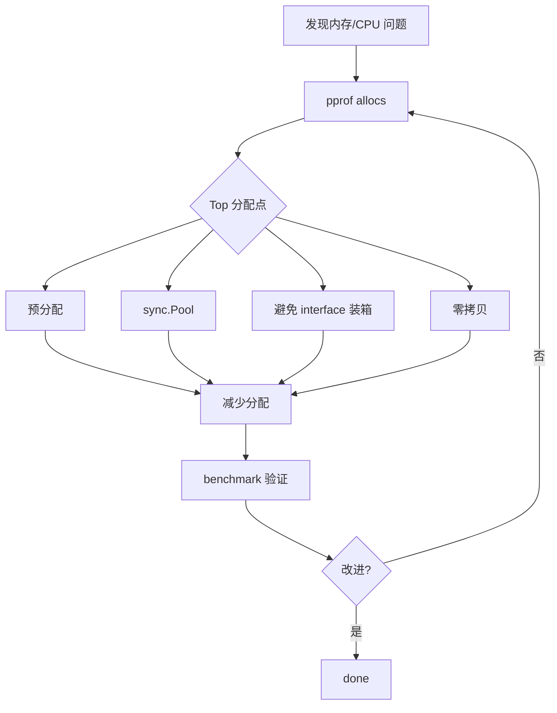
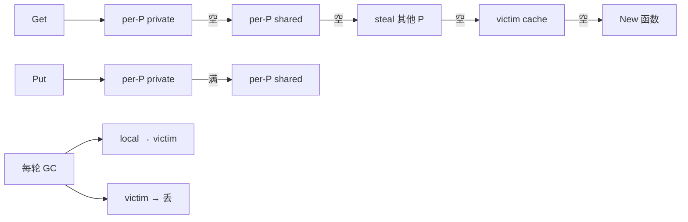

# 内存优化

> 减少分配、池化复用、预分配、零拷贝、字段对齐、避免 interface 装箱；目标是降 GC 压力和提升缓存命中

## 一、核心原理

### 1.1 优化优先级



**铁律**：先 profile 找证据，不要拍脑袋猜。

### 1.2 预分配

```go
// 差: append 多次扩容, 每次新底层数组
result := []int{}
for _, v := range src {
    result = append(result, transform(v))
}

// 好: 一次到位
result := make([]int, 0, len(src))
for _, v := range src {
    result = append(result, transform(v))
}

// map 同理
m := make(map[string]int, expectedN)
```

slice 扩容路径：N=1, 2, 4, 8, 16, 32, ... 每次倍增，分配 + 拷贝。预分配避免全部。

### 1.3 sync.Pool 对象复用

```go
var bufPool = sync.Pool{
    New: func() any { return new(bytes.Buffer) },
}

func getBuf() *bytes.Buffer { return bufPool.Get().(*bytes.Buffer) }
func putBuf(b *bytes.Buffer) {
    b.Reset()
    bufPool.Put(b)
}

// 使用
buf := getBuf()
defer putBuf(buf)
buf.WriteString("...")
```

**适合**：临时对象、buffer、解析中间态。
**不适合**：大对象（占内存）、长期持有的对象（每轮 GC 清空 victim）。

### 1.4 避免 interface 装箱

```go
// 差: int 装进 any 必逃逸到堆
var sum any = 0
for _, v := range xs {
    sum = sum.(int) + v  // 每次断言 + 装箱
}

// 好: 具体类型
var sum int
for _, v := range xs { sum += v }
```

**反模式**：
- 容器用 `[]any`/`map[string]any`（应该用具体类型或泛型）
- 日志 `log.Info("count", any(n))` 装箱
- error wrap 时把基本类型装 error

热点路径泛型（Go 1.18+）能避免装箱：

```go
func Sum[T constraints.Numeric](xs []T) T {
    var sum T
    for _, x := range xs { sum += x }
    return sum
}
```

### 1.5 字段对齐

```go
// 差: 24 字节
type A struct {
    a bool   // 1 + 7 padding
    b int64  // 8
    c bool   // 1 + 7 padding
}

// 好: 16 字节
type A struct {
    b int64  // 8
    a bool   // 1
    c bool   // 1 + 6 padding
}
```

百万级 struct 数组时收益显著。工具：`fieldalignment`（go vet 子集）。

### 1.6 字符串与 []byte 零拷贝

```go
// 拷贝
b := []byte(s)
s := string(b)

// 零拷贝(unsafe, 注意生命周期)
import "unsafe"

func StringToBytes(s string) []byte {
    return unsafe.Slice(unsafe.StringData(s), len(s))
}

func BytesToString(b []byte) string {
    return unsafe.String(unsafe.SliceData(b), len(b))
}
```

⚠️ 仅在确认**只读且生命周期匹配**时用。否则 UB。

### 1.7 减少逃逸

```go
// 差: 返回指针, p 必逃逸
func new() *Point { p := Point{}; return &p }

// 好: 值返回, 可能栈分配
func new() Point { return Point{} }
```

详见 `03-runtime/escape-analysis.md`。

### 1.8 大对象拆分

```go
// 差: 100 万元素���片, 一次性分配 → 大对象走 mheap, 锁竞争
data := make([]Item, 1_000_000)

// 好: 分块, 每块小一些
const chunkSize = 1024
chunks := make([][]Item, 0, 1000)
for i := 0; i < 1_000_000; i += chunkSize {
    chunks = append(chunks, make([]Item, chunkSize))
}
```

或用 chan + 流式处理避免全量加载。

### 1.9 字符串拼接

```go
// 差: O(n²)
s := ""
for _, p := range parts { s += p }

// 好: strings.Builder
var sb strings.Builder
sb.Grow(estimatedSize)  // 预估
for _, p := range parts { sb.WriteString(p) }
s := sb.String()
```

或 `strings.Join(parts, "")`（已知切片）。

### 1.10 减少结构体拷贝

```go
// 差: 大 struct 值传, 每次调用拷贝
func process(o Order) {}  // Order 100 字段

// 好: 指针
func process(o *Order) {}
```

但**小 struct 值传更快**（避免指针逃逸 + 间接寻址 + GC 扫描）。

## 二、八股速记

- 优化前**先 pprof**：`-alloc_objects` 找分配热点，`-inuse_space` 找驻留
- **预分配 slice/map**：`make([]T, 0, n)`
- **sync.Pool 复用临时对象**：buffer、解析中间态
- **避免 interface{} 装箱**：用具体类型或泛型
- **字段对齐**：大字段在前，减少 padding
- **string/[]byte 零拷贝**：unsafe 谨慎用
- **减少逃逸**：栈分配比堆快得多
- **字符串拼接用 Builder**
- **大对象分块**：避免 mheap 锁
- **小 struct 值传，大 struct 指针**

## 三、面试真题

**Q1：内存优化的一般流程？**
1. **监控发现**：QPS 下降、RT 升高、GC pause 长、内存上涨
2. **pprof 定位**：`go tool pprof -alloc_objects http://.../heap` 看 top
3. **针对性优化**：预分配/Pool/避免装箱/零拷贝
4. **benchmark 验证**：`benchstat` 对比改前后
5. **线上验证**：观察 GC 指标

**Q2：sync.Pool 的工作原理？**



要点：
- per-P 减少锁
- victim 缓冲一轮 GC
- 对象**最多两轮 GC** 后被丢

**Q3：Pool 适合什么？不适合什么？**

适合：
- **临时对象**：buffer、解析器、序列化器中间态
- **高频复用**：大量请求各自构造一次同类型对象
- **小到中型对象**：< 几十 KB

不适合：
- **持久状态**：会被 GC 清掉
- **大对象**：占内存，victim 阶段额外驻留
- **低频对象**：每用一次都 New，Pool 没复用价值

**Q4：怎么减少 interface{} 装箱？**
1. **热路径用具体类型**：`func Add(a, b int)` 而不是 `func Add(a, b any)`
2. **Go 1.18+ 用泛型**：`func Sum[T Number](xs []T)`
3. **避免 `[]any`**：用具体类型 slice
4. **fmt.Sprintf 优化**：`strconv.Itoa` 比 `fmt.Sprintf("%d")` 快 5x 且不装箱

**Q5：怎么避免 slice 频繁扩容？**
1. **预估容量**：`make([]T, 0, n)`
2. **复用**：函数参数传 slice 由调用方分配
3. **重置不重建**：`s = s[:0]` 而不是 `s = nil`

```go
// 差
func parseAll(items []Item) []Result {
    result := []Result{}
    for _, i := range items { result = append(result, parse(i)) }
    return result
}

// 好: 预分配
func parseAll(items []Item) []Result {
    result := make([]Result, 0, len(items))
    for _, i := range items { result = append(result, parse(i)) }
    return result
}
```

**Q6：什么时候用 unsafe 零拷贝？**

```go
// 100% 只读, 且字符串生命周期不超过 []byte
b := unsafe.Slice(unsafe.StringData(s), len(s))
```

用：
- 高频 string ↔ []byte 转换
- 确认下游不会修改
- benchmark 证明确有收益

不用：
- 不确定生命周期
- 业务代码（增加复杂度）

风险：UB 难调试，下游修改 → 字符串"莫名其妙变了"，违反 Go 类型系统。

**Q7：字段对齐能省多少？**

```go
type Bad struct {
    A bool      // 1+7
    B int64     // 8
    C bool      // 1+7
} // 24

type Good struct {
    B int64     // 8
    A bool      // 1
    C bool      // 1+6
} // 16
```

百万元素数组：24MB → 16MB，省 33%。
缓存命中也提升（一行 cache line 装更多）。

工具检测：

```bash
go install golang.org/x/tools/go/analysis/passes/fieldalignment/cmd/fieldalignment@latest
fieldalignment ./...
```

**Q8：怎么减少 GC 压力？**
1. **减少分配**：预分配、Pool、避免装箱
2. **降低活跃对象数**：及时释放、避免长期持有引用
3. **避免大对象**：> 32KB 直接走 mheap，碎片化
4. **GOGC 调高**：`GOGC=200` 减少 GC 频率（换内存）
5. **GOMEMLIMIT**：软上限，让 GC 更"懒"

**Q9：内存泄漏怎么发现？**
1. **监控**：`go_memstats_heap_inuse_bytes` 持续增长不回落
2. **heap profile**：`-inuse_space` top，看哪些对象长期驻留
3. **对比**：每小时一次 heap dump，diff 看增长

```bash
go tool pprof -inuse_space \
    -base old.heap new.heap
```

常见泄漏：
- 全局 map 不删 key
- goroutine 泄漏持有引用
- timer/ticker 未 Stop
- 大 slice 截取后留住底层

**Q10：怎么测内存优化效果？**

```bash
# 改前
go test -bench=BenchmarkX -benchmem -count=10 > old.txt

# 改后
go test -bench=BenchmarkX -benchmem -count=10 > new.txt

benchstat old.txt new.txt
```

输出关注：
- `time/op`：单次耗时
- `B/op`：单次分配字节
- `allocs/op`：单次分配次数

**目标**：allocs/op 降到 0~1。

## 四、手写实现

**1. Pool 复用 buffer：**

```go
var bufPool = sync.Pool{
    New: func() any {
        b := make([]byte, 0, 4096)
        return &b
    },
}

func encode(v any) ([]byte, error) {
    bp := bufPool.Get().(*[]byte)
    buf := (*bp)[:0]
    defer func() {
        if cap(buf) < 1<<20 {  // 太大不放回
            *bp = buf
            bufPool.Put(bp)
        }
    }()

    buf = appendJSON(buf, v)
    out := make([]byte, len(buf))
    copy(out, buf)
    return out, nil
}
```

**2. 预分配 + slice 复用：**

```go
type Worker struct {
    buf []Item  // 复用切片
}

func (w *Worker) Process(items []Item) {
    w.buf = w.buf[:0]  // 复用底层数组
    for _, i := range items {
        if filter(i) { w.buf = append(w.buf, transform(i)) }
    }
    save(w.buf)
}
```

**3. 字符串 builder：**

```go
func formatLog(level, msg string, fields []Field) string {
    n := len(level) + len(msg) + len(fields)*32
    var sb strings.Builder
    sb.Grow(n)
    sb.WriteString("[")
    sb.WriteString(level)
    sb.WriteString("] ")
    sb.WriteString(msg)
    for _, f := range fields {
        sb.WriteString(" ")
        sb.WriteString(f.Key)
        sb.WriteString("=")
        sb.WriteString(f.Value)
    }
    return sb.String()
}
```

**4. 字段对齐优化：**

```go
// 优化前 (sizeof = 32)
type Order struct {
    Paid   bool      // 1+7
    Amount float64   // 8
    Done   bool      // 1+7
    User   *User     // 8
}

// 优化后 (sizeof = 24)
type Order struct {
    Amount float64   // 8
    User   *User     // 8
    Paid   bool      // 1
    Done   bool      // 1+6
}
```

**5. 避免装箱：**

```go
// 差: any 装箱
type Cache struct {
    m map[string]any
}

// 好: 类型化或泛型
type StringCache struct {
    m map[string]string
}

type Cache[V any] struct {
    m map[string]V
}
```

**6. 零拷贝（生产慎用）：**

```go
import "unsafe"

// 仅在确认只读时用
func bytesToStringFast(b []byte) string {
    return unsafe.String(unsafe.SliceData(b), len(b))
}

// 真实场景: HTTP body 读完后转 string, 仅用于查找/比较
body, _ := io.ReadAll(r.Body)
s := bytesToStringFast(body)
if strings.Contains(s, "error") { ... }
// 注意: body 不能再被修改, s 失效
```

## 五、踩坑与最佳实践

### 坑 1：Pool 放大对象

```go
var pool = sync.Pool{New: func() any { return make([]byte, 1<<20) }}
// 每个 P 一份, victim 一份, 内存翻倍
```

修复：大对象用专用池或 LRU。

### 坑 2：Pool 拿到的对象状态

```go
buf := pool.Get().(*Buffer)
// 没 Reset, 还带着上次的数据
buf.WriteString("...")  // 拼到旧数据后面
```

修复：Get 后立即 Reset。或 Put 时 Reset。

### 坑 3：unsafe 零拷贝生命周期错

```go
b := []byte("hello")
s := bytesToString(b)
b[0] = 'H'  // 修改 b
fmt.Println(s)  // 输出 "Hello"!? 字符串变了, UB
```

修复：用 unsafe 后**不许修改源数据**。

### 坑 4：减少分配反而变慢

```go
// 改前: 每次 new
b := make([]byte, 1024)

// 改后: pool
b := bufPool.Get().([]byte)
```

但被测代码内置缓存就是局部变量，pool 增加了原子操作开销，反而慢。**必须 benchmark 验证**。

### 坑 5：slice 复用造成数据污染

```go
result = result[:0]
for ... { result = append(result, ...) }
return result  // 调用方拿到的 slice 和我共享底层!
```

修复：要返回时 `return append([]T{}, result...)` 拷贝。

### 坑 6：interface 装箱在循环

```go
var fields []zap.Field
for _, v := range vs {
    fields = append(fields, zap.Any("v", v))  // any 装箱每次
}
```

热路径用具体类型：`zap.Int("n", n)`、`zap.String("s", s)`。

### 坑 7：fmt.Sprintf 当字符串拼接

```go
key := fmt.Sprintf("%s:%d", name, id)  // 反射 + 多次分配
```

修复：

```go
var sb strings.Builder
sb.WriteString(name); sb.WriteString(":"); sb.WriteString(strconv.Itoa(id))
key := sb.String()
```

### 坑 8：map 删 key 不缩容

```go
m := make(map[int]V)
// 加 100 万 删 99 万
// len(m) 极小, 但 bucket 数组还在
```

修复：重建 `m = make(map[int]V); copy ...`。

### 最佳实践

- **先 pprof 后优化**：拍脑袋常优化错地方
- **预分配 slice/map**：知道容量就 hint
- **Pool 用于临时对象**：buffer、parser
- **避免 interface{}**：泛型或具体类型
- **字段对齐**：跑 fieldalignment
- **strings.Builder 拼接**
- **小 struct 值传，大 struct 指针**
- **benchmark 验证**：每次改动跑 `-benchmem`
- **GC 调优**：`GOGC` / `GOMEMLIMIT`，容器化必设
- **unsafe 零拷贝慎用**：业务代码不建议
- **指标监控**：heap inuse、allocs/sec、GC pause、goroutine 数
