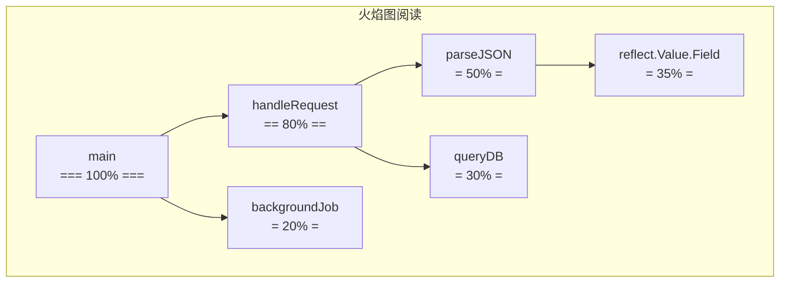

# pprof

> Go 性能剖析利器：CPU / heap / goroutine / block / mutex 五种 profile，runtime 内置采样，火焰图直观

## 一、核心原理

### 1.1 五种 profile

| profile | 采集内容 | 触发开销 |
| --- | --- | --- |
| **CPU** | 每 10ms 采样一次正在运行的 g 栈 | 启动期间约 ~5% |
| **heap** | 当前堆分配（按对象数/字节） | 极小 |
| **allocs** | 所有分配（含已 GC 的） | 极小 |
| **goroutine** | 当前所有 g 的栈 | 触发时短暂 |
| **block** | g 阻塞超过阈值的栈（chan/mutex/IO） | 中（默认关） |
| **mutex** | mutex 争用栈 | 中（默认关） |
| **threadcreate** | OS 线程创建栈 | 极小 |

### 1.2 启用 net/http/pprof

```go
import _ "net/http/pprof"  // 自动注册 /debug/pprof/* handler

go func() {
    log.Println(http.ListenAndServe("localhost:6060", nil))
}()
```

> ⚠️ 生产**不要暴露公网**。仅 localhost 监听，或加鉴权 middleware。

注册的端点：
- `/debug/pprof/`（首页）
- `/debug/pprof/profile`（CPU，默认 30s）
- `/debug/pprof/heap`
- `/debug/pprof/goroutine`
- `/debug/pprof/block`
- `/debug/pprof/mutex`
- `/debug/pprof/trace`（execution trace）

### 1.3 抓取 profile

```bash
# CPU 30 秒
go tool pprof http://localhost:6060/debug/pprof/profile?seconds=30

# heap (当前)
go tool pprof http://localhost:6060/debug/pprof/heap

# allocs (累计分配)
go tool pprof http://localhost:6060/debug/pprof/allocs

# goroutine
go tool pprof http://localhost:6060/debug/pprof/goroutine

# 文件保存
curl -o cpu.prof http://localhost:6060/debug/pprof/profile?seconds=30
go tool pprof cpu.prof
```

### 1.4 pprof 交互命令

```
(pprof) top            # 累计耗时 top 10
(pprof) top -cum       # 按 cumulative 排
(pprof) list FuncName  # 看函数源码 + 行级耗时
(pprof) web            # 生成 svg 调用图
(pprof) svg            # 同上, 文件
(pprof) tree           # 调用树
(pprof) peek FuncName  # 看 FuncName 上下文
(pprof) traces         # 所有采样栈
```

### 1.5 火焰图（推荐）

```bash
# 现代方式: pprof 自带 web UI
go tool pprof -http=:8080 cpu.prof

# 老方式: 用 brendangregg/FlameGraph
go tool pprof -raw cpu.prof | flamegraph.pl > flame.svg
```

火焰图阅读：
- **横轴**：总耗时占比（越宽越耗时）
- **纵轴**：调用栈（上下层调用关系）
- **颜色**：随机区分函数



`reflect.Value.Field` 占 35% → 优化重点。

### 1.6 启用 block / mutex profile

默认关，需手动开：

```go
runtime.SetBlockProfileRate(1)         // 1 = 记录所有阻塞事件
runtime.SetMutexProfileFraction(1)     // 1 = 记录所有 mutex 竞争
```

或环境变量：`GODEBUG=blockprofile=1`。

**代价**：~10% 性能损失，仅在排查时开。

### 1.7 trace（执行追踪）

```bash
curl -o trace.out http://localhost:6060/debug/pprof/trace?seconds=5
go tool trace trace.out  # 浏览器打开
```

trace 比 pprof 更细：
- 每个 g 的生命周期
- 调度事件（runnable/running/waiting）
- syscall 时间
- GC 阶段
- 网络阻塞

适合排查**调度抖动 / GC 影响 / 锁竞争时间分布**。

### 1.8 定期采集（生产监控）

```go
// 后台周期采集 + 上报
go func() {
    ticker := time.NewTicker(time.Hour)
    for range ticker.C {
        f, _ := os.Create(fmt.Sprintf("/var/log/pprof/heap-%d.gz", time.Now().Unix()))
        pprof.WriteHeapProfile(f)
        f.Close()
    }
}()
```

或用 [Pyroscope](https://pyroscope.io/) / [Polar Signals Parca](https://www.parca.dev/) 等持续 profiling 系统。

## 二、八股速记

- **5 大 profile**：CPU / heap / allocs / goroutine / block / mutex
- 启用：`import _ "net/http/pprof"` + 起 server
- **生产慎暴露**，localhost 监听或加鉴权
- 抓取：`go tool pprof http://.../debug/pprof/<type>`
- **top / list / web / svg** 是核心命令
- **火焰图横宽看耗时**，纵向看调用栈
- block/mutex profile 默认关，需 SetBlockProfileRate/MutexProfileFraction
- **trace** 看调度细节，比 pprof 更微观
- **`go tool pprof -http=:8080`** 现代 UI 体验最好
- 持续 profiling：Pyroscope / Parca

## 三、面试真题

**Q1：CPU 飙高怎么定位？**

```bash
# 1. 抓 CPU profile
go tool pprof http://localhost:6060/debug/pprof/profile?seconds=30

# 2. 看 top
(pprof) top
# 类似:
#   1.5s  30%  encoding/json.(*decodeState).object
#   0.8s  16%  reflect.Value.Field
#   0.6s  12%  runtime.mallocgc

# 3. 看具体函数
(pprof) list (*decodeState).object

# 4. 看调用关系 (web/svg)
(pprof) web
```

常见根因：
- 序列化（JSON/反射）
- 锁竞争（自旋）
- GC 频繁
- 死循环 / 重试风暴

**Q2：heap profile 看什么？**

```bash
go tool pprof http://localhost:6060/debug/pprof/heap
(pprof) top
#   100MB  40%  main.LoadConfig (大对象)
#    50MB  20%  bytes.NewBuffer
```

四种 sample type：
- `inuse_space`（默认，当前占用字节）
- `inuse_objects`（当前对象数）
- `alloc_space`（累计分配字节）
- `alloc_objects`（累计分配数）

```bash
go tool pprof -alloc_space http://.../heap   # 历史累计分配
go tool pprof -inuse_space http://.../heap   # 当前驻留
```

定位泄漏看 `inuse_space`，定位分配热点看 `alloc_objects`。

**Q3：goroutine 暴涨怎么排查？**

```bash
go tool pprof http://localhost:6060/debug/pprof/goroutine
(pprof) top
# 大量 g 卡在某栈帧 → 泄漏点

# 或直接看 dump
curl http://localhost:6060/debug/pprof/goroutine?debug=2 > g.txt
# 直接看可读文本
```

常见泄漏点：
- chan send/recv 永久阻塞
- select 没退出条件
- 没监听 ctx.Done

**Q4：怎么排查锁竞争？**

```go
runtime.SetMutexProfileFraction(1)
runtime.SetBlockProfileRate(1)
```

```bash
go tool pprof http://localhost:6060/debug/pprof/mutex
go tool pprof http://localhost:6060/debug/pprof/block
```

mutex profile 显示**等待获取锁**的栈；block profile 显示**等待 channel/cond 等**的栈。

**Q5：pprof 在生产开销大吗？**
- CPU profile：约 5% 开销，仅采样期间
- heap：极小（仅采样分配，默认 1/512KB）
- goroutine：触发时短暂阻塞
- block/mutex：约 10%，仅排查时开

总体：**短时间采集（30s）安全**，长开 block/mutex 不建议。

**Q6：pprof 能在线上用吗？**
能，但要注意：
- 端口**绝对不暴露公网**（曾有公司 pprof 暴露被扒源码）
- localhost 监听 + SSH 隧道访问
- 或加鉴权 middleware

```go
mux := http.NewServeMux()
mux.Handle("/debug/", AuthMiddleware(http.DefaultServeMux))
http.ListenAndServe(":6060", mux)
```

**Q7：top 和 list 怎么读？**

```
      flat  flat%   sum%        cum   cum%
     1.5s   30%    30%         3s   60%   funcA
```

- **flat**：函数自己耗时
- **cum**：函数及其调用链总耗时

例：`json.Unmarshal` flat 小但 cum 大 → 自己快但调用了慢函数（反射）。

`list funcA` 看源码每行耗时，定位到具体语句。

**Q8：pprof 火焰图怎么看？**
- **每个矩形 = 一个函数**
- **宽度 = 耗时占比**（越宽越慢）
- **纵向 = 调用栈**（下面是 caller）
- **颜色 = 随机**（区分相邻函数）

定位流程：从底部最宽的函数往上看，找最宽的子调用。

**Q9：trace 和 pprof 区别？**
- **pprof**：采样统计（每 10ms 采样栈）
- **trace**：精确事件流（每个 g 的状态变化）

trace 看：调度延迟、GC 时长、syscall 阻塞、g 阻塞分布。
pprof 看：函数总耗时、内存分配热点。

**Q10：pprof 数据怎么对比？**

```bash
# 抓两次
go test -cpuprofile old.prof   # 改前
go test -cpuprofile new.prof   # 改后

# 对比
go tool pprof -base old.prof new.prof
(pprof) top  # 看变化, 负数表示变快
```

或 benchstat 对比 benchmark 结果。

## 四、手写实现

**1. 启用 pprof（生产模板）：**

```go
import (
    "log"
    "net/http"
    _ "net/http/pprof"
    "runtime"
)

func init() {
    runtime.SetBlockProfileRate(0)     // 默认关, 排查时打开
    runtime.SetMutexProfileFraction(0)
}

func StartPprof(addr string) {
    go func() {
        if err := http.ListenAndServe(addr, nil); err != nil {
            log.Printf("pprof: %v", err)
        }
    }()
}

// 调用: StartPprof("127.0.0.1:6060")  ← 仅本机
```

**2. 测试期 profile：**

```go
func BenchmarkXxx(b *testing.B) {
    for i := 0; i < b.N; i++ { Xxx() }
}
```

```bash
# 抓 CPU
go test -bench=BenchmarkXxx -cpuprofile cpu.prof

# 抓内存
go test -bench=BenchmarkXxx -memprofile mem.prof

# 分析
go tool pprof -http=:8080 cpu.prof
```

**3. 程序内主动采集：**

```go
import "runtime/pprof"

func dumpHeap() {
    f, _ := os.Create("/tmp/heap.prof")
    defer f.Close()
    pprof.WriteHeapProfile(f)
}

// CPU
func startCPUProfile(file string) (stop func()) {
    f, _ := os.Create(file)
    pprof.StartCPUProfile(f)
    return func() {
        pprof.StopCPUProfile()
        f.Close()
    }
}

stop := startCPUProfile("/tmp/cpu.prof")
expensiveWork()
stop()
```

**4. 鉴权 + pprof：**

```go
func PprofAuth(next http.Handler) http.Handler {
    return http.HandlerFunc(func(w http.ResponseWriter, r *http.Request) {
        user, pass, ok := r.BasicAuth()
        if !ok || user != "admin" || pass != os.Getenv("PPROF_PASS") {
            w.Header().Set("WWW-Authenticate", `Basic realm="pprof"`)
            http.Error(w, "unauthorized", 401)
            return
        }
        next.ServeHTTP(w, r)
    })
}

mux := http.NewServeMux()
mux.Handle("/debug/", PprofAuth(http.DefaultServeMux))
http.ListenAndServe(":6060", mux)
```

**5. 持续采集 + 上传：**

```go
func PeriodicProfile(interval time.Duration, uploader Uploader) {
    ticker := time.NewTicker(interval)
    for range ticker.C {
        // CPU 30s
        var cpu bytes.Buffer
        pprof.StartCPUProfile(&cpu)
        time.Sleep(30 * time.Second)
        pprof.StopCPUProfile()
        uploader.Upload("cpu", cpu.Bytes())

        // heap
        var heap bytes.Buffer
        pprof.WriteHeapProfile(&heap)
        uploader.Upload("heap", heap.Bytes())
    }
}
```

## 五、踩坑与最佳实践

### 坑 1：生产暴露 pprof

```go
http.ListenAndServe(":6060", nil)  // 0.0.0.0:6060 公网可达
```

被攻击者扒源码、内存（含敏感数据）。**修复**：localhost 或鉴权。

### 坑 2：profile 时间太短

```bash
go tool pprof http://.../profile?seconds=5
```

5s 采样有偏差。**推荐 30s**，覆盖更全。

### 坑 3：默认 block/mutex 关闭

排查锁竞争发现 mutex profile 空。**修复**：先 `SetBlockProfileRate(1)` + `SetMutexProfileFraction(1)`。

### 坑 4：heap inuse vs alloc 混淆

- 内存泄漏看 **inuse_space**（当前驻留）
- 优化分配热点看 **alloc_objects**（累计次数）

混了会导致优化方向跑偏。

### 坑 5：火焰图反着看

某些工具（如老 perf）火焰图栈顶是入口，pprof 是栈底。**pprof 火焰图**：底部 main，顶部叶子函数。

### 坑 6：pprof 仅看 CPU 忽略 IO 阻塞

CPU profile 只统计**正在执行**的栈。如果服务大部分时间阻塞在 syscall / DB / 网络，CPU profile 看不出问题。**用 trace 或 block profile**。

### 坑 7：测试 profile 没用 b.N

```go
func TestX(t *testing.T) {  // Test 不是 Benchmark
    // ...
}
go test -cpuprofile cpu.prof  // 跑的是 Test, 数据稀疏
```

性能 profile 用 `Benchmark*` + `b.N` 长跑。

### 坑 8：pprof URL 特殊字符

```
?seconds=30  ← 有 ? 用 wget/curl 时要 quote
```

```bash
curl -o cpu.prof "http://localhost:6060/debug/pprof/profile?seconds=30"  # quote
```

### 最佳实践

- **生产长期开 pprof**（仅本机或鉴权）
- 用 **`-http=:8080`** 模式分析，UI 友好
- CPU profile **30s+**，覆盖完整业务周期
- block/mutex 排查时再开，平时关闭省 10% 开销
- trace 看调度细节，pprof 看耗时分布
- benchmark 配合 `-cpuprofile` / `-memprofile` 找性能 bug
- 持续 profiling 用 Pyroscope/Parca，长期有数据可对比
- **`go tool pprof -base`** 对比改前改后差异
- 团队建立 "性能问题打 profile + 上传" 的 SOP
