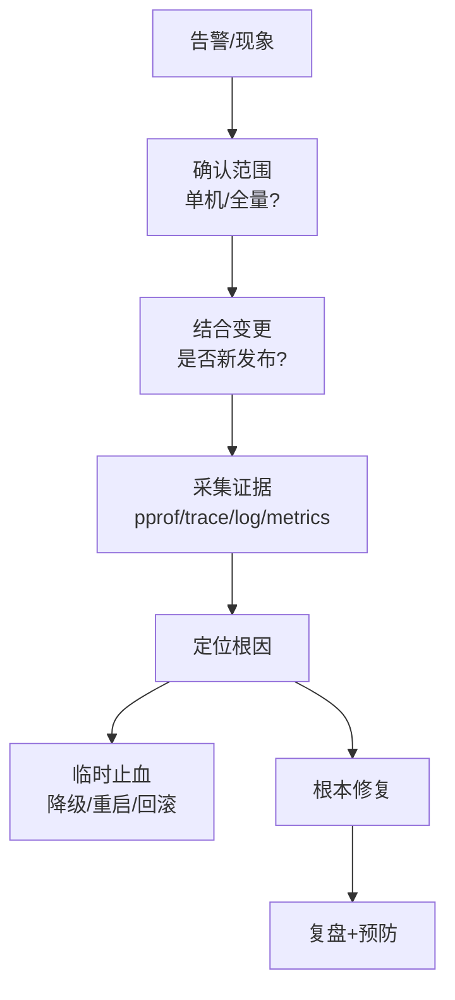
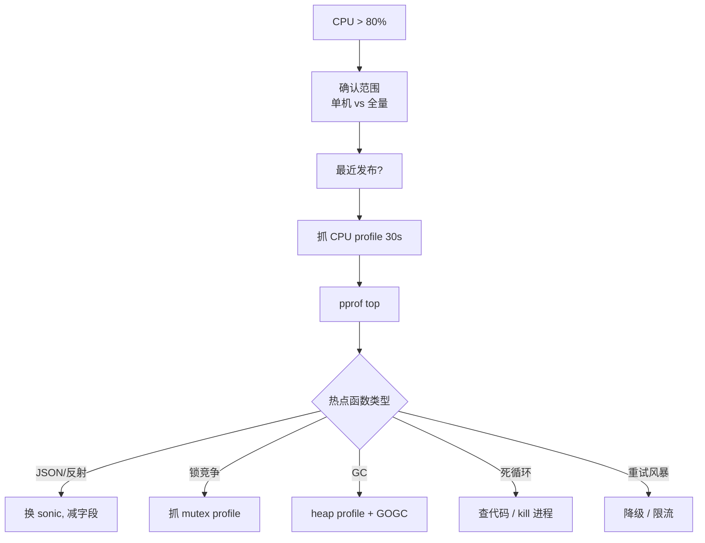

# 线上排查 (troubleshooting)

> 实战 SOP：CPU 飙高、内存涨、goroutine 泄漏、GC 抖动、死锁、网络异常的标准定位流程

## 一、核心原理

### 1.1 排查总框架



**铁律**：先止血，再修 bug。线上不是调试环境。

### 1.2 工具箱

| 工具 | 用途 |
| --- | --- |
| **pprof** | CPU/heap/goroutine/block/mutex 剖析 |
| **trace** | 调度/GC/IO 时间线 |
| **GODEBUG** | gctrace/scheddetail/madvdontneed 等 runtime 调试 |
| **dlv** | Delve 调试器（极少线上用） |
| **strace** / **lsof** | 系统调用、文件句柄 |
| **netstat** / **ss** | 网络连接 |
| **prom + grafana** | 指标监控 |
| **logs** | 应用日志 + trace_id |
| **APM** | trace 链路追踪 |

### 1.3 必备指标

```
CPU:        process_cpu_seconds_total
内存:       go_memstats_heap_inuse_bytes / process_resident_memory_bytes
GC:         go_gc_duration_seconds, go_gc_cycles_total
goroutine:  go_goroutines
fd:         process_open_fds
GC pause:   go_gc_duration_seconds (sum)
请求:       http_request_duration_seconds (RT 分位)
错误:       http_requests_total{status=~"5.."}
DB pool:    db.Stats() (custom metrics)
```

无监控 = 盲人摸象。

## 二、场景 SOP

### 2.1 CPU 飙高



**采集**：

```bash
go tool pprof -seconds=30 http://localhost:6060/debug/pprof/profile
(pprof) top -cum
(pprof) list FuncName
```

**典型根因**：
- 序列化重（JSON/反射）→ 换 sonic / easyjson
- 锁竞争自旋
- GC 频繁（heap 增长太快）
- 死循环（最近 commit 改坏了）
- 下游慢导致重试风暴

### 2.2 内存持续上涨

```bash
# 看趋势
heap_inuse_bytes 是否持续涨且不回落?

# 抓两次 heap, diff
curl -o h1.prof http://.../heap; sleep 1h
curl -o h2.prof http://.../heap
go tool pprof -base h1.prof h2.prof
(pprof) top  # 看哪些类型增长

# 同时抓 goroutine
curl -o g.txt http://.../goroutine?debug=2
```

**根因清单**：
1. **goroutine 泄漏**：每个 g 持有栈和闭包引用
2. **全局 map 不删 key**：缓存无淘汰
3. **slice 留住大数组**：`small := big[:10]`
4. **timer/ticker 未 Stop**：底层 timer heap 留引用
5. **大对象在 sync.Pool**：victim 阶段额外驻留
6. **业务正常增长**（不是泄漏）

### 2.3 goroutine 泄漏

```bash
# 看 goroutine 数趋势
go_goroutines 持续涨?

# dump
curl 'http://localhost:6060/debug/pprof/goroutine?debug=2' > g.txt
grep -c '^goroutine' g.txt   # 总数
sort g.txt | uniq -c | sort -rn | head  # 找最多的栈
```

或 pprof 模式：

```bash
go tool pprof http://localhost:6060/debug/pprof/goroutine
(pprof) top
# 看 N 个 g 卡在哪
```

**典型阻塞栈**：
- `chan send` / `chan receive`：channel 没人收/发
- `select` (无 default)：所有 case 不就绪
- `runtime.gopark` / `sync.runtime_SemacquireMutex`：锁等待
- `net.runtime_pollWait`：网络 IO

**修复**：
- chan 加 ctx + select
- 限制 worker 数量
- 加超时

### 2.4 GC 抖动 / Pause 长

```bash
# 看 GC pause 分布
go_gc_duration_seconds (P99 > 100ms?)

# GODEBUG 实时观察
GODEBUG=gctrace=1 ./app 2>&1 | head -20
# gc 1 @0.005s 0%: 0.018+0.5+0.013 ms clock, ...
```

**指标**：
- pause time（每次 STW）
- gc cpu fraction（GC 占总 CPU）

**对策**：
- **减分配**：sync.Pool / 预分配 / 避免装箱
- **GOGC 调高**：100 → 200，频率减半（换内存）
- **GOMEMLIMIT**：软上限，配合大 GOGC
- **避免大量小对象**：合并、扁平化

### 2.5 RT 抖动 / P99 高

```bash
# trace 看具体某请求
go tool trace -http=:8080 trace.out
# 看时间线: g 阻塞、GC、syscall、网络
```

**根因清单**：
- GC pause 影响（看 trace GC bar 是否落到请求时间）
- 锁竞争（mutex profile）
- 下游慢（RPC client RT 分位）
- DB 慢查询（DB 侧 slow log）
- 缓存击穿（大量请求同时回源）
- 网络抖动（重传/丢包）

### 2.6 死锁 / 卡死

```bash
# 发 SIGQUIT 让 Go 打全栈
kill -QUIT <pid>
# 或: curl http://.../debug/pprof/goroutine?debug=2

# 看是否有 g 卡在 sync.Mutex.Lock
grep -A 10 'sync.runtime_SemacquireMutex' dump.txt
```

经典死锁：

```go
mu1.Lock()
mu2.Lock()  // 另一 g 反序锁 → AB-BA 死锁
```

修复：统一锁顺序、超时锁、`go vet -race`。

### 2.7 fd / 句柄泄漏

```bash
ls /proc/<pid>/fd | wc -l
lsof -p <pid> | wc -l

ulimit -n  # 系统上限
```

**典型**：
- HTTP body 没 close → 连接不释放
- 文件 open 没 close
- DB rows 没 close

```go
defer resp.Body.Close()
defer rows.Close()
defer file.Close()
```

### 2.8 OOM Killed

```bash
dmesg | grep -i 'killed process'
# Out of memory: Killed process 123 (myapp) total-vm:...

# k8s
kubectl describe pod
# Last State: Terminated, Reason: OOMKilled
```

**对策**：
- **设 GOMEMLIMIT**：Go 1.19+ 软上限避免撞 cgroup limit
- **Go ≤1.15** 用 `MADV_DONTNEED`（GODEBUG=madvdontneed=1）让 RSS 及时下降
- **优化分配**：预分配 / Pool / 避免大对象

### 2.9 网络异常

```bash
# 连接状态
ss -ant | awk '{print $1}' | sort | uniq -c

# 大量 TIME_WAIT?
ss -ant | grep TIME-WAIT | wc -l
# → MaxIdleConnsPerHost 太小, 连接频繁开关
```

**典型**：
- TIME_WAIT 过多：端口耗尽
- CLOSE_WAIT 多：本端没 Close
- 重传率高：网络问题或下游慢

### 2.10 panic 排查

```
panic: runtime error: index out of range [5] with length 3

goroutine 1 [running]:
main.processItems(...)
    /app/main.go:42
main.main()
    /app/main.go:15
```

看堆栈定位。关键：所有 g 入口必有 recover + log，否则 panic 直接进程崩溃。

## 三、八股速记

- **5 步**：现象 → 范围 → 变更 → 证据 → 定位
- **先止血再修 bug**：降级/限流/回滚
- **CPU 飙**：pprof CPU 30s + top + list
- **内存涨**：heap diff + goroutine dump
- **goroutine 泄漏**：`/debug/pprof/goroutine?debug=2` 看阻塞栈
- **GC 抖动**：`GODEBUG=gctrace=1`，调 GOGC/GOMEMLIMIT
- **RT 高**：trace 看时间线
- **死锁**：SIGQUIT 看全栈，统一锁顺序
- **fd 泄漏**：lsof + 检查 defer Close
- **OOM**：GOMEMLIMIT + 减分配
- **panic**：recover 中间件 + log + 堆栈

## 四、面试真题（场景题）

**Q1：服务 CPU 突然飙到 100%，怎么排查？**

```
1. 确认范围: kubectl top pods 看是单机还是全量
2. 看变更: 最近 30 分钟有发布/配置变更吗?
3. 看监控: QPS 是否同步上涨? 错误率? 下游延迟?
4. pprof CPU 30s
   go tool pprof -seconds=30 http://...
   top → 看热点函数
5. 常见根因:
   - 死循环(最近 commit)
   - JSON/反射(对接新接口)
   - 锁竞争(并发突增)
   - 重试风暴(下游挂)
   - GC 频繁(heap 涨)
6. 临时止血: 降级/限流/回滚
7. 复盘: 加 metrics 监控该指标
```

**Q2：内存持续涨，怎么定位泄漏？**

```
1. 看趋势: 持续涨 vs 业务增长
2. 抓两次 heap, 间隔 1 小时, diff
   curl -o h1.prof http://.../heap; sleep 1h; curl -o h2.prof http://.../heap
   go tool pprof -base h1.prof h2.prof
   top → 看新增对象
3. 同时看 goroutine 数 (常见: g 泄漏带走对象)
4. 排查清单:
   - goroutine 泄漏(chan/select/网络无超时)
   - 全局 map 不删 key
   - slice 截取留住大底层
   - timer 未 Stop
5. 修复 + 监控
```

**Q3：goroutine 数持续涨怎么定位？**

```
1. dump: curl 'http://.../debug/pprof/goroutine?debug=2' > g.txt
2. 分析阻塞栈:
   sort g.txt | uniq -c | sort -rn | head
   找最多重复的栈
3. 常见栈帧:
   - chan send/receive: 无超时, 对端不收
   - select: 无 default, 所有 case 不就绪
   - sync.Mutex.Lock: ���竞争 / 死锁
   - net.runtime_pollWait: 网络 IO 没超时
4. 回到代码: 加 ctx, 加超时, 限并发
```

**Q4：GC pause P99 > 200ms, 怎么优化？**

```
1. 监控: go_gc_duration_seconds, gc_cpu_fraction
2. GODEBUG=gctrace=1 看每次 GC 详情:
   - 堆增长速率
   - mark/sweep 时间
3. 优化方向:
   a. 减少分配 (主要)
      - pprof allocs 找热点
      - sync.Pool / 预分配 / 避免装箱
   b. 调 GOGC
      - 100 → 200 (频率减半, 内存翻倍)
   c. GOMEMLIMIT
      - 容器 limit 的 80~90%, 软上限
   d. 避免大 root set
      - 减少 goroutine 数 (栈是 root)
4. 验证: 灰度后 P99 是否降
```

**Q5：服务 RT 抖动严重,但 CPU 不高怎么办？**

```
可能原因(非 CPU):
- GC pause: 看 GC 时间分布
- 锁竞争: mutex/block profile
- 下游慢: 查 RPC RT 分位
- DB 慢查询: DB 侧慢日志
- 网络抖动: ping/traceroute/重传
- syscall 慢: 文件系统繁忙

工具: trace
go tool trace trace.out
看时间线 GC/syscall/network 是否落到请求时间
```

**Q6：服务 OOM 被 kill 怎么处理？**

```
1. 看 dmesg / k8s events 确认 OOM
2. 短期止血:
   - 重启 (Pod 自愈)
   - 扩容内存 limit
3. 排查:
   - heap profile 看分配
   - 业务是否真的需要这么多 (合理增长)
   - 是否有泄漏
4. 长期方案:
   - GOMEMLIMIT (Go 1.19+) 防止超 limit
   - GOGC 调小让 GC 更频繁
   - 优化 / 拆服务
```

**Q7：连接数 / fd 数突然涨,什么原因？**

```
1. lsof -p PID 看具体 fd 类型
2. ss -ant | sort | uniq -c 看连接状态
3. 常见:
   - HTTP Body 没 Close → 连接不复用
   - DB rows 没 Close → 连接池满
   - 文件 open 没 Close
   - 短连接没 keep-alive (TIME_WAIT 多)
4. defer Close 检查
5. 监控: process_open_fds
```

**Q8：服务无响应,但 CPU/内存正常怎么排查？**

```
1. SIGQUIT 打全栈: kill -QUIT PID (容器: kill -QUIT 1)
2. 看所有 g 状态:
   - 大量在 chan / mutex → 死锁
   - 大量在 syscall → IO 慢
   - 大量在 netpollwait → 等下游
3. 检查:
   - 死锁: 统一锁顺序
   - 下游: 加超时
   - DB: 看 SHOW PROCESSLIST
```

**Q9：怎么在线开 block/mutex profile？**

```go
// 一般通过 admin 接口动态开:
http.HandleFunc("/admin/profile/on", func(w http.ResponseWriter, r *http.Request) {
    runtime.SetBlockProfileRate(1)
    runtime.SetMutexProfileFraction(1)
})
http.HandleFunc("/admin/profile/off", func(w http.ResponseWriter, r *http.Request) {
    runtime.SetBlockProfileRate(0)
    runtime.SetMutexProfileFraction(0)
})
```

排查后立即关，约 10% 性能损失。

**Q10：pprof / trace 分别什么时候用？**

| 场景 | 工具 |
| --- | --- |
| 找耗时函数 | pprof CPU |
| 找内存热点 | pprof heap/allocs |
| 找 g 泄漏 | pprof goroutine |
| 看 GC 影响 | trace |
| 看调度延迟 | trace |
| 看 syscall 时间 | trace |
| 锁竞争统计 | pprof mutex |
| 阻塞分布 | pprof block |

简单：找"什么慢" → pprof；找"为什么慢" → trace。

## 四、手写实现

**1. 排查工具集成（admin endpoint）：**

```go
func RegisterDebug(mux *http.ServeMux) {
    mux.Handle("/debug/pprof/", http.HandlerFunc(pprof.Index))
    mux.Handle("/debug/pprof/cmdline", http.HandlerFunc(pprof.Cmdline))
    mux.Handle("/debug/pprof/profile", http.HandlerFunc(pprof.Profile))
    mux.Handle("/debug/pprof/symbol", http.HandlerFunc(pprof.Symbol))
    mux.Handle("/debug/pprof/trace", http.HandlerFunc(pprof.Trace))

    // 动态开 block/mutex profile
    mux.HandleFunc("/debug/profile/block/on", func(w http.ResponseWriter, r *http.Request) {
        runtime.SetBlockProfileRate(1)
        w.Write([]byte("on"))
    })
    mux.HandleFunc("/debug/profile/block/off", func(w http.ResponseWriter, r *http.Request) {
        runtime.SetBlockProfileRate(0)
        w.Write([]byte("off"))
    })

    // 强制 GC
    mux.HandleFunc("/debug/gc", func(w http.ResponseWriter, r *http.Request) {
        runtime.GC()
        w.Write([]byte("ok"))
    })

    // memstats
    mux.HandleFunc("/debug/memstats", func(w http.ResponseWriter, r *http.Request) {
        var m runtime.MemStats
        runtime.ReadMemStats(&m)
        json.NewEncoder(w).Encode(m)
    })
}
```

**2. 自动化定期 dump：**

```go
func AutoDump(interval time.Duration, dir string) {
    ticker := time.NewTicker(interval)
    go func() {
        for range ticker.C {
            ts := time.Now().Format("20060102_150405")

            // heap
            f, _ := os.Create(filepath.Join(dir, "heap-"+ts+".prof"))
            pprof.WriteHeapProfile(f)
            f.Close()

            // goroutine
            f, _ = os.Create(filepath.Join(dir, "goroutine-"+ts+".txt"))
            pprof.Lookup("goroutine").WriteTo(f, 2)
            f.Close()
        }
    }()
}
```

**3. 异常时自动 dump（当 g 数突增）：**

```go
func GoroutineGuard(threshold int) {
    go func() {
        ticker := time.NewTicker(30 * time.Second)
        for range ticker.C {
            n := runtime.NumGoroutine()
            if n > threshold {
                ts := time.Now().Format("20060102_150405")
                f, _ := os.Create(fmt.Sprintf("/tmp/g-%s.txt", ts))
                pprof.Lookup("goroutine").WriteTo(f, 2)
                f.Close()
                log.Printf("WARN: goroutine count %d > %d, dumped to /tmp/g-%s.txt", n, threshold, ts)
            }
        }
    }()
}
```

**4. 排查 SOP 模板（团队 wiki）：**

```markdown
## CPU 飙高 SOP

1. 确认范围 (kubectl top / 监控)
2. 查最近变更 (gitlog / 配置 diff)
3. 抓 pprof:
   `curl -o cpu.prof http://localhost:6060/debug/pprof/profile?seconds=30`
4. 分析:
   `go tool pprof -http=:8080 cpu.prof`
5. 临时方案: 降级 / 限流 / 回滚
6. 长期: 修代码 + 加监控
7. 复盘记录
```

## 五、踩坑与最佳实践

### 坑 1：没监控盲查

无 metrics → 不知道现象规模 / 时间线 / 关联指标。

**修复**：先建监控（Prometheus + Grafana）：
- CPU / 内存 / fd / goroutine
- QPS / RT / 错误率
- GC pause / GC frequency

### 坑 2：直接重启不留证据

```
看着不对劲 → kill 重启 → 现场没了
```

**修复**：先 dump 再重启。

```bash
curl -o /tmp/cpu.prof http://.../profile?seconds=30
curl -o /tmp/heap.prof http://.../heap
curl -o /tmp/g.txt 'http://.../goroutine?debug=2'
# 然后再 kill
```

### 坑 3：pprof 暴露公网

被攻击者拿数据。**修复**：localhost 或鉴权。

### 坑 4：block/mutex profile 长期开

10% 性能损失。**修复**：排查后立即关。

### 坑 5：在容器里看不到完整指标

容器看到的 `/proc/cpuinfo` 是宿主，CPU 限额看不到。

**修复**：用 cgroup-aware 库（automaxprocs）或 Go 1.25+。

### 坑 6：复现不了的偶发问题

**对策**：
- 持续 profiling（Pyroscope / Parca）
- 异常时自动 dump
- 链路追踪 + log 聚合

### 坑 7：把症状当根因

```
RT 高 → 加 worker → 暂时好 → 没找到下游慢的根因
```

**修复**：定位到根因再修。临时方案要记录复盘项和负责人，避免长期遗留。

### 坑 8：pprof 看不到第三方 SDK 内部

某些库 inline 严重，pprof 看到 caller 不准。**修复**：编译加 `-gcflags="-l"` 禁内联（仅排查时）。

### 最佳实践

- **必备监控**：CPU/内存/fd/goroutine/QPS/RT/错误率/GC
- **持续 profiling**：pprof 定期采集 + Pyroscope
- **异常自动 dump**：超阈值触发
- **排查 SOP 文档化**：CPU/内存/g 泄漏每个一个 runbook
- **先 dump 再重启**：保留现场
- **block/mutex 用完关**
- **找根因不止于止血**
- **容器化注意 cgroup**：automaxprocs / GOMEMLIMIT
- **trace 排查微观**，pprof 排查宏观
- **复盘 + 加监控**：每次问题都建立预警
