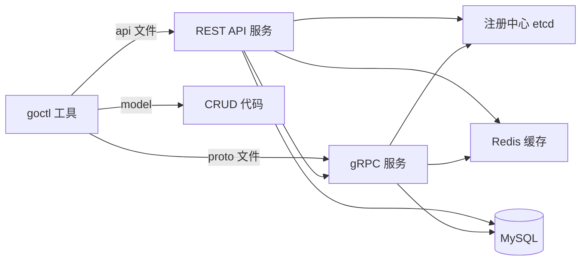

# go-zero

> 国产微服务框架（晓黑板/好未来出品）：API + RPC + goctl 代码生成 + 自带熔断限流自适应；适合中小团队快速搭建微服务

## 一、核心原理

### 1.1 整体定位



**特色**：
- **goctl** 一键生成项目骨架（类似 spring boot initializer）
- 自带 **熔断（Google SRE 风格自适应）+ 限流（令牌桶）+ 负载均���（P2C）**
- API 网关层 + RPC 服务层分离
- 内置 cache（缓存击穿/穿透/雪崩防护）

### 1.2 .api 文件（DSL）

```
syntax = "v1"

type LoginReq {
    Username string `json:"username"`
    Password string `json:"password"`
}

type LoginResp {
    Token string `json:"token"`
}

service user-api {
    @handler Login
    post /api/login (LoginReq) returns (LoginResp)
}
```

```bash
goctl api go -api user.api -dir .
```

生成：handler、logic、types、server、main。

### 1.3 .proto + RPC

```bash
goctl rpc protoc user.proto --go_out=. --go-grpc_out=. --zrpc_out=.
```

生成 zrpc server / client，**封装了 grpc + 服务注册 + 熔断**。

### 1.4 自适应熔断

不是固定阈值，根据**请求成功率自适应**：

```
拒绝概率 = max(0, (requests - K * accepts) / (requests + 1))
```

- K 是敏感度（默认 1.5）
- 请求成功率高 → 拒绝概率 0
- 失败率上升 → 拒绝概率上升
- 完全失败 → 100% 拒绝（熔断）

这是 Google SRE 的算法，比 Hystrix 的滑动窗口更灵活。

### 1.5 限流

**令牌桶**（默认）：

```yaml
# user.yaml
RestConf:
    MaxConns: 10000
    Timeout: 3000  # ms

# 自定义路由限流(中间件)
```

或**自适应限流**（基于 CPU + 队列长度）：

```yaml
shedding: true
```

CPU 高 + 队列长 → 自动开始 shed（拒请求）。

### 1.6 缓存自动管理

```bash
goctl model mysql ddl -src user.sql -dir . -c
```

生成的 model 自带：
- **缓存 key 自动管理**：按主键、唯一索引
- **防穿透**：查不到时缓存空值（短 TTL）
- **防雪崩**：缓存 TTL 加随机抖动
- **防击穿**：singleflight

```go
func (m *defaultUserModel) FindOne(ctx context.Context, id int64) (*User, error) {
    cacheKey := fmt.Sprintf("user#%d", id)
    var user User
    err := m.QueryRowCtx(ctx, &user, cacheKey, func(ctx context.Context, conn sqlx.SqlConn, v any) error {
        return conn.QueryRowCtx(ctx, v, "SELECT ... FROM users WHERE id=?", id)
    })
    // 缓存自动管理
    return &user, err
}
```

### 1.7 服务发现

```yaml
UserRpc:
    Etcd:
        Hosts:
            - 127.0.0.1:2379
        Key: user.rpc
```

服务启动时往 etcd 注册，客户端从 etcd 拿 endpoints。

### 1.8 vs kratos / 标准库

| | go-zero | kratos | gin + 自己组装 |
| --- | --- | --- | --- |
| 代码生成 | 强（goctl） | 中（kratos cli） | 无 |
| 学习曲线 | 陡（DSL） | 陡（DDD 风格） | 平缓 |
| 自带治理 | 强 | 中 | 自己接 |
| 灵活性 | 中 | 中 | 高 |
| 适合团队 | 中小，快速产出 | 中大，DDD 落地 | 任意 |

## 二、八股速记

- **goctl 代码生成**：api / rpc / model 一键生成
- **自适应熔断**（Google SRE 风格）+ **令牌桶限流**
- **P2C 负载均衡**（pick-of-2）
- **缓存自动管理**：穿透/雪崩/击穿防护
- **etcd 服务发现**
- **API + RPC 分层**
- 适合中小团队快速搭微服务
- 国产文档中文友好
- 配置以 yaml 为主

## 三、面试真题

**Q1：go-zero 的代码生成做什么？**
基于 DSL（.api / .proto）生成：
- HTTP/RPC server 骨架
- 路由 / handler / logic / types 分层文件
- model（含缓存 CRUD）
- 配置文件
- 单元测试模板

好处：**新人接手项目结构一致**，迭代加 API 改 .api 文件再 generate。

代价：DSL 学习成本，自定义场景受限。

**Q2：自适应熔断 vs Hystrix？**
- **Hystrix**：固定窗口 + 失败率阈值（如 50% 失败 + 20 次请求触发熔断）
- **go-zero（Google SRE）**：连续概率，按 `(requests - K*accepts) / (requests+1)` 动态拒绝

优势：
- 不需要调阈值
- 渐进式（不是突然全断）
- 失败率回升 → 自动恢复

**Q3：缓存防三件套怎么做？**

| 问题 | 解决 |
| --- | --- |
| **穿透**（查不存在的） | 缓存空值，短 TTL（如 1 分钟） |
| **雪崩**（同时失效） | TTL 加随机抖动（基础 1h ± 10min） |
| **击穿**（热 key 失效瞬间） | singleflight，同 key 并发只有一个回源 |

go-zero model 自动做这三件，业务层无感。

**Q4：P2C 负载均衡是什么？**
**Power of 2 Choices**：随机选 2 个 endpoint，比较负载（连接数 + 平均 RT），选轻的。

vs round-robin：能感知节点压力。
vs least-conn：开销小（不需要全局排序）。

数学证明：P2C 期望负载分布接近最优，O(log log n) 不平衡。

**Q5：限流怎么做？**

```yaml
# 全局
MaxConns: 10000
CpuThreshold: 900  # 自适应限流, CPU > 90% 开始 shed
```

或代码：

```go
import "github.com/zeromicro/go-zero/core/limit"

// 周期限流
limiter := limit.NewPeriodLimit(60, 100, store, "user-api")

// 令牌桶
bucket := limit.NewTokenLimiter(100, 100, store, "user-api")
```

**Q6：API 服务怎么调 RPC 服务？**

```go
// service config
type UserApiConfig struct {
    UserRpc zrpc.RpcClientConf
}

// 初始化 client
userRpc := userrpc.NewUserClient(zrpc.MustNewClient(c.UserRpc))

// 调用
resp, err := userRpc.GetUser(ctx, &userrpc.GetUserReq{Id: 1})
```

底层是 gRPC，但封装了服务发现、熔断、负载均衡。

**Q7：怎么集成 trace？**

```yaml
Telemetry:
    Name: user-api
    Endpoint: http://jaeger:14268/api/traces
    Sampler: 1.0
    Batcher: jaeger
```

go-zero 内置 OpenTelemetry，请求自动生成 trace，跨 RPC 透传。

**Q8：怎么做配置热更新？**

go-zero 配置默认从文件加载，不直接支持热更新。常见方案：
- 自己监听文件变化 + 重启
- 用 etcd / nacos 等配置中心 + 内置 conf.MustLoad 时设置 watcher

或换 kratos（自带配置中心抽象）。

**Q9：多 API + 多 RPC 项目结构？**

```
project/
├── api/
│   ├── user/   # user API service
│   └── order/  # order API service
├── rpc/
│   ├── user/   # user RPC service
│   ├── order/  # order RPC service
│   └── pay/
└── shared/
    ├── model/  # 共享 model
    └── pkg/
```

每个服务独立 main，独立部署。共享代码放 shared/。

**Q10：go-zero 适合什么团队？**

适合：
- 中小团队 / 创业公司，快速搭微服务
- 团队 Go 经验不足，需要框架约束
- 偏 CRUD 业务，goctl 大量生成代码
- 中文社区，国内云厂商对接好

不适合：
- 大型公司有自己的基础设施（Spring Cloud 类）
- 复杂领域模型（DDD），go-zero 偏过程式
- 极致性能 / 自定义需求

## 四、手写实现

**1. .api 完整示例：**

```
syntax = "v1"

info(
    title: "User API"
    desc: "用户服务"
    author: "team"
    version: "v1"
)

type (
    LoginReq {
        Username string `json:"username"`
        Password string `json:"password"`
    }

    LoginResp {
        Token string `json:"token"`
        UserId int64 `json:"userId"`
    }

    UserInfo {
        Id    int64  `json:"id"`
        Name  string `json:"name"`
        Email string `json:"email"`
    }
)

@server(
    group: user
    prefix: /api/v1
)
service user-api {
    @handler Login
    post /login (LoginReq) returns (LoginResp)
}

@server(
    group: user
    prefix: /api/v1
    middleware: AuthMiddleware
)
service user-api {
    @handler GetMe
    get /me returns (UserInfo)
}
```

`goctl api go -api user.api -dir .` 生成完整项目。

**2. logic 层（业务实现）：**

```go
func (l *LoginLogic) Login(req *types.LoginReq) (*types.LoginResp, error) {
    user, err := l.svcCtx.UserRpc.GetByUsername(l.ctx, &userrpc.GetByUsernameReq{
        Username: req.Username,
    })
    if err != nil { return nil, err }

    if !checkPassword(req.Password, user.Hashed) {
        return nil, errx.NewError(errx.WrongPassword, "wrong password")
    }

    token, _ := jwt.NewToken(user.Id)
    return &types.LoginResp{Token: token, UserId: user.Id}, nil
}
```

**3. 自定义中间件：**

```go
func (m *AuthMiddleware) Handle(next http.HandlerFunc) http.HandlerFunc {
    return func(w http.ResponseWriter, r *http.Request) {
        token := r.Header.Get("Authorization")
        userID, err := jwt.Parse(token)
        if err != nil {
            httpx.Error(w, errx.NewError(errx.Unauthorized, "invalid token"))
            return
        }
        ctx := context.WithValue(r.Context(), "userId", userID)
        next(w, r.WithContext(ctx))
    }
}
```

**4. 缓存 model 用法：**

```go
// goctl 生成的 model
user, err := m.UserModel.FindOne(ctx, 1)  // 自动缓存
err = m.UserModel.UpdateColumn(ctx, &User{Id: 1, Name: "x"})  // 自动失效缓存
```

## 五、踩坑与最佳实践

### 坑 1：DSL 学习成本

新人不熟 .api 语法，乱改后 generate 崩。**修复**：团队建立 .api 模板规范。

### 坑 2：goctl 升级破坏代码

升级 goctl 后生成代码格式变化，已有 logic 改动可能丢失。**修复**：goctl generate 用 git 控制，diff 后选择性合并。

### 坑 3：缓存策略不灵活

go-zero model 缓存策略固定（id key + 唯一索引 key），复杂场景（按 status 缓存等）要自己写。**修复**：复杂场景跳过 model，自己用 redis client。

### 坑 4：自适应熔断误判

低 QPS 时（如夜间），少数失败概率比例高 → 触发拒绝。**修复**：设最小请求数阈值。

### 坑 5：服务发现 etcd 单点

etcd 挂了所有服务发现失效。**修复**：etcd 集群部署 + 客户端 endpoints 缓存。

### 坑 6：日志格式锁死

go-zero 日志格式固定 JSON，要自定义字段（如 trace_id）需要 hook。**修复**：用 logc 包扩展，或换 zap 替换内部 logger。

### 坑 7：rest 服务里 svcCtx 重用 ctx

```go
type LoginLogic struct {
    ctx context.Context  // 请求 ctx
    svcCtx *svc.ServiceContext  // 全局, 不要存 ctx
}
```

ServiceContext 是全局共享的，不要塞 request-scoped 数据。

### 坑 8：配置热更新没原生支持

修改配置必须重启。**修复**：自己 watch 文件 + 信号触发重载。

### 最佳实践

- **遵循 goctl 生成的目录结构**，不要乱改
- **用 .api 控制接口定义**，作为契约
- **缓存用 model 自带**，复杂场景手写
- **熔断/限流参数按业务调**：默认值不一定合适
- **etcd 集群 + endpoints 缓存** 防服务发现单点
- **service config 文件** 分环境（user-dev.yaml / user-prod.yaml）
- **单元测试**用 goctl 生成的模板
- **trace + log 接 OpenTelemetry**
- **小团队 + 快速产出选 go-zero**，DDD 项目选 kratos
