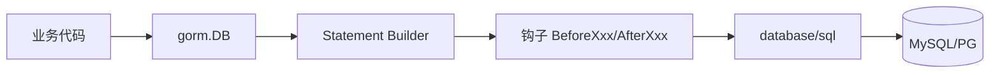

# GORM

> Go 最流行的 ORM：链式 API + 反射 + 钩子 + 关联自动加载；强大但坑多，性能不如手写 SQL

## 一、核心原理

### 1.1 整体架构



`*gorm.DB` 是**链式调用**的入口，每次方法返回新的 `*DB`（带新条件）。

### 1.2 模型映射

```go
type User struct {
    ID        uint           `gorm:"primaryKey"`
    Name      string         `gorm:"size:100;index"`
    Email     string         `gorm:"uniqueIndex"`
    CreatedAt time.Time
    UpdatedAt time.Time
    DeletedAt gorm.DeletedAt `gorm:"index"`  // 软删除
}
```

**约定**：
- 表名 = 复数化的 struct 名（`User` → `users`）
- 主键默认 `ID`（uint）
- `CreatedAt` / `UpdatedAt` 自动维护
- `DeletedAt` 启用软删除

可关 `gorm.Config{NamingStrategy: schema.NamingStrategy{SingularTable: true}}`。

### 1.3 链式 API

```go
db.Where("age > ?", 18).
    Where("status = ?", "active").
    Order("created_at DESC").
    Limit(10).
    Find(&users)
```

每个方法返回新 `*DB`，**最终调用 `Find/First/Create/Update/Delete`** 才执行 SQL。

### 1.4 CRUD

```go
// Create
db.Create(&User{Name: "alice"})       // INSERT
db.CreateInBatches(users, 100)         // ���量

// Read
db.First(&u, 1)                        // WHERE id=1 LIMIT 1
db.Where("name=?", "alice").First(&u)
db.Find(&users)                        // SELECT *

// Update
db.Model(&u).Update("name", "bob")
db.Model(&u).Updates(User{Name: "bob", Age: 18})  // 非零字段
db.Model(&u).Updates(map[string]any{"age": 0})    // map 强制更新(可设零值)

// Delete (软删除)
db.Delete(&u, 1)              // 软删除: UPDATE deleted_at
db.Unscoped().Delete(&u, 1)   // 物理删除
```

### 1.5 事务

```go
err := db.Transaction(func(tx *gorm.DB) error {
    if err := tx.Create(&order).Error; err != nil { return err }
    if err := tx.Model(&user).Update("balance", gorm.Expr("balance - ?", price)).Error; err != nil {
        return err
    }
    return nil  // commit
    // 返回 error 自动 rollback
})
```

### 1.6 关联

```go
type User struct {
    ID     uint
    Orders []Order  // has many
}

type Order struct {
    ID     uint
    UserID uint
    User   User    // belongs to
}

// 预加载
db.Preload("Orders").Find(&users)  // SELECT users + SELECT orders WHERE user_id IN (...)

// joins (一次 SQL)
db.Joins("User").Find(&orders)
```

### 1.7 钩子

```go
func (u *User) BeforeCreate(tx *gorm.DB) error {
    if u.Email == "" { return errors.New("email required") }
    u.Email = strings.ToLower(u.Email)
    return nil
}

// 钩子: BeforeSave/Create/Update/Delete, AfterFind/Save/Create/...
```

### 1.8 软删除

`DeletedAt` 字段触发：
- `Delete` 改为 `UPDATE deleted_at = NOW()`
- 所有查询自动 `WHERE deleted_at IS NULL`
- 用 `Unscoped()` 跳过软删除过滤

### 1.9 性能问题

GORM 性能比手写 sql 慢 **2~5x**，原因：
- 反射 + 字段映射
- 链式 API 每次创建新 *DB（分配）
- 钩子 / 回调
- Auto-migrate / association 自动加载

热路径推荐：
- 用 GORM 的 `Raw().Scan()` 写 SQL
- 或换 `sqlc`（生成代码）/ `sqlx`（轻量）/ `ent`（Facebook，类型安全）

## 二、八股速记

- 链式 API，最后调 `Find/Create/...` 执行
- 表名复数，主键默认 `ID`，CreatedAt/UpdatedAt 自动
- **DeletedAt 启用软删除**，`Unscoped()` 跳过
- `Update("name", x)` 单字段；`Updates(struct)` 非零字段；`Updates(map)` 含零值
- `Preload` (N+1 → N+1 query)；`Joins` (1 query)
- 事务用 `Transaction` 函数式包装
- 钩子 BeforeCreate/AfterFind 等，可校验/补字段
- **性能 2~5x 慢于手写 SQL**，热路径用 Raw 或换 sqlc/sqlx

## 三、面试真题

**Q1：GORM 的链式 API 是怎么实现的？**
每次调用方法（`Where`、`Order` 等）**返回一个新的 `*DB`**，内部累积条件。直到调用终结方法（`Find`/`Create`/`Update`/`Delete`）才生成 SQL 执行。

```go
db.Where("a=?", 1)         // 返回带条件的新 *DB
  .Where("b=?", 2)         // 又一个新 *DB
  .Find(&out)              // 拼出 SQL: WHERE a=1 AND b=2, 执行
```

代价：每次链式调用都分配一个 *DB，热路径 GC 压力。

**Q2：`Update` 几种用法的区别？**

```go
db.Model(&u).Update("name", "x")              // 只更新 name
db.Model(&u).Updates(User{Name: "x", Age: 0}) // 更新非零字段, age=0 被忽略!
db.Model(&u).Updates(map[string]any{"age": 0})// map 不忽略零值, age=0 被更新
db.Save(&u)                                    // 全字段更新
```

**坑**：用 struct Updates 时零值字段不会被更新。要更新成零值用 map 或 `Select("Age").Updates(...)`。

**Q3：N+1 查询问题怎么解决？**

```go
// N+1: 1 次查 users + N 次查每个 user 的 orders
for _, u := range users {
    db.Where("user_id=?", u.ID).Find(&u.Orders)
}

// 解决 1: Preload (1 + 1 = 2 次)
db.Preload("Orders").Find(&users)
// SELECT * FROM users
// SELECT * FROM orders WHERE user_id IN (1,2,3,...)

// 解决 2: Joins (1 次)
db.Joins("Orders").Find(&users)  // 但只能 1:1, 1:N 会重复
```

复杂场景 `Preload("Orders.Items")` 嵌套预加载。

**Q4：事务怎么写？**

```go
err := db.Transaction(func(tx *gorm.DB) error {
    if err := tx.Create(&order).Error; err != nil { return err }
    if err := tx.Model(&user).UpdateColumn("balance", gorm.Expr("balance - ?", price)).Error; err != nil {
        return err
    }
    return nil
})
// 返回 nil → commit
// 返回 err / panic → rollback
```

或手动：

```go
tx := db.Begin()
defer tx.Rollback()  // 兜底
if err := tx.Create(&o).Error; err != nil { return err }
return tx.Commit().Error
```

事务里**必须用 tx.Xxx**，混用 db.Xxx 会从池另拿连接。

**Q5：GORM 性能慢在哪？**
1. **反射**：每次 Scan 用反射映射 row → struct
2. **链式分配**：每个方法新 *DB
3. **钩子**：所有 CRUD 都跑一遍 BeforeXxx/AfterXxx
4. **关联检测**：自动检测字段间关系
5. **AutoMigrate**：启动时反射比对 schema

热路径优化：
- 用 `Select("a,b,c")` 只取需要字段
- 用 `Raw().Scan()` 跳过 ORM 层
- `Statement.SkipHooks = true` 跳钩子
- 大量数据用 `CreateInBatches`

或换 sqlc / sqlx。

**Q6：软删除有什么坑？**

```go
// 1. 唯一索引失效
type User struct {
    Email string `gorm:"uniqueIndex"`
    DeletedAt gorm.DeletedAt
}
// 删了同 email 的 user, 再创建会冲突(因为软删, deleted_at 不参与唯一)

// 2. 关联查询要小心
db.Preload("Orders").Find(&users)  // orders 也会过滤 deleted_at IS NULL

// 3. 误删除时业务还能查到
db.Find(&u, 1)  // 软删后查不到, 但数据还在
```

**修复**：
- 唯一索引加 `WHERE deleted_at IS NULL`（部分索引，只 PG 支持）
- 或唯一索引含 deleted_at 字段
- 业务关键表谨慎用软删，考虑归档表

**Q7：怎么打印 SQL？**

```go
db, _ := gorm.Open(mysql.Open(dsn), &gorm.Config{
    Logger: logger.Default.LogMode(logger.Info),
})

// 单次
db.Debug().Where("...").Find(&out)
```

生产用 `logger.Warn`，慢 SQL 才打。

**Q8：怎么和现有 sql.DB 集成？**

```go
sqlDB, _ := sql.Open("mysql", dsn)
sqlDB.SetMaxOpenConns(100)
// ... 配置连接池

db, _ := gorm.Open(mysql.New(mysql.Config{Conn: sqlDB}), &gorm.Config{})
```

GORM 复用你的 `*sql.DB`，连接池配置生效。

**Q9：批量插入怎么做？**

```go
// 错: 一条一条 INSERT
for _, u := range users { db.Create(&u) }

// 好: 一次 INSERT 多行 (内部分批)
db.CreateInBatches(users, 100)
// → INSERT INTO users (...) VALUES (?,?), (?,?), ...
```

注意 MySQL 的 `max_allowed_packet`，过大要调小 batch。

**Q10：GORM 适合什么项目？**

适合：
- **CRUD 为主**的中后台系统
- 团队**对 SQL 不熟**或想统一抽象
- 多 DB 后端（MySQL / PG / SQLite）切换

不适合：
- 性能敏感（高 QPS）
- 复杂 SQL（多表 join、子查询、窗口函数）
- 强类型安全要求

**对比**：
- `sqlc`：从 SQL 生成类型安全代码，**最强类型 + 高性能**
- `sqlx`：轻量扩展 database/sql，靠手写 SQL
- `ent`：Facebook 的图状 ORM，类型安全
- `xorm`：老牌 ORM

## 四、手写实现

**1. 标准初始化：**

```go
import (
    "gorm.io/driver/mysql"
    "gorm.io/gorm"
    "gorm.io/gorm/logger"
)

func NewDB(cfg Config) (*gorm.DB, error) {
    sqlDB, err := sql.Open("mysql", cfg.DSN)
    if err != nil { return nil, err }
    sqlDB.SetMaxOpenConns(100)
    sqlDB.SetMaxIdleConns(20)
    sqlDB.SetConnMaxLifetime(30 * time.Minute)

    db, err := gorm.Open(mysql.New(mysql.Config{Conn: sqlDB}), &gorm.Config{
        Logger: logger.Default.LogMode(logger.Warn),
        NamingStrategy: schema.NamingStrategy{SingularTable: false},
    })
    if err != nil { return nil, err }

    return db, nil
}
```

**2. Repo 层模板：**

```go
type UserRepo struct{ db *gorm.DB }

func (r *UserRepo) Get(ctx context.Context, id uint) (*User, error) {
    var u User
    if err := r.db.WithContext(ctx).First(&u, id).Error; err != nil {
        if errors.Is(err, gorm.ErrRecordNotFound) {
            return nil, biz.ErrNotFound
        }
        return nil, err
    }
    return &u, nil
}

func (r *UserRepo) List(ctx context.Context, page, size int) ([]*User, error) {
    var us []*User
    err := r.db.WithContext(ctx).
        Order("id DESC").
        Offset((page - 1) * size).
        Limit(size).
        Find(&us).Error
    return us, err
}

func (r *UserRepo) UpdateStatus(ctx context.Context, id uint, status int) error {
    return r.db.WithContext(ctx).
        Model(&User{}).
        Where("id = ?", id).
        Update("status", status).Error
}
```

**3. 事务封装：**

```go
func (r *UserRepo) Transfer(ctx context.Context, from, to uint, amount int) error {
    return r.db.WithContext(ctx).Transaction(func(tx *gorm.DB) error {
        // 锁定行
        var src User
        if err := tx.Set("gorm:query_option", "FOR UPDATE").First(&src, from).Error; err != nil {
            return err
        }
        if src.Balance < amount {
            return errors.New("insufficient")
        }

        if err := tx.Model(&User{}).Where("id=?", from).
            Update("balance", gorm.Expr("balance - ?", amount)).Error; err != nil {
            return err
        }
        if err := tx.Model(&User{}).Where("id=?", to).
            Update("balance", gorm.Expr("balance + ?", amount)).Error; err != nil {
            return err
        }
        return nil
    })
}
```

**4. 慢 SQL 监控：**

```go
db, _ := gorm.Open(..., &gorm.Config{
    Logger: logger.New(
        log.New(os.Stdout, "\r\n", log.LstdFlags),
        logger.Config{
            SlowThreshold: 200 * time.Millisecond,
            LogLevel:      logger.Warn,
            Colorful:      false,
        },
    ),
})
```

## 五、踩坑与最佳实践

### 坑 1：Updates 忽略零值

```go
db.Model(&u).Updates(User{Name: "x", Age: 0})  // age=0 不更新
```

**修复**：用 map 或 `Select("Age").Updates(...)`。

### 坑 2：忘记 WithContext

```go
db.First(&u, 1)  // 没传 ctx, 不能取消, 不能超时
```

**修复**：所有 query 加 `WithContext(ctx)`。

### 坑 3：N+1

```go
db.Find(&users)
for _, u := range users {
    db.Find(&u.Orders)  // N 次查
}
```

**修复**：`db.Preload("Orders").Find(&users)`。

### 坑 4：软删除 + 唯一索引

```go
type User struct {
    Email     string         `gorm:"uniqueIndex"`
    DeletedAt gorm.DeletedAt
}
// 软删 alice → 重新创建 alice → 冲突
```

**修复**：MySQL 加 deleted_at 字段到唯一索引；或归档而非软删。

### 坑 5：未初始化 ID 的 Create

```go
db.Create(&User{ID: 0, Name: "x"})  // ID=0 时 GORM 用 AUTO_INCREMENT, 否则用指定 ID
db.Create(&User{ID: 5, Name: "x"})  // 显式 ID=5, 与已有冲突就报错
```

注意 ID 是否手动管理。

### 坑 6：事务里用 db 而不是 tx

```go
db.Transaction(func(tx *gorm.DB) error {
    db.Create(&o)  // 错! 这是从池另拿连接, 不在事务里
    return nil
})
```

**修复**：事务里只用 tx。

### 坑 7：链式 API 重用 *DB

```go
q := db.Where("status=?", 1)
q.Find(&active)
q.Find(&active2)  // q 仍带 status=1 条件, 但还可能带其他副作用
```

**修复**：链式 API 每次从 db 重新开始，避免 *DB 复用。

### 坑 8：AutoMigrate 在生产

```go
db.AutoMigrate(&User{})  // 启动时改 schema
```

可能加索引 / 改字段，影响线上。**修复**：用 SQL 迁移工具（goose / migrate）+ CI 控制。

### 最佳实践

- **Repo 层封装**：业务不直接接触 *gorm.DB
- **必 WithContext(ctx)**：超时控制
- **First 判 ErrRecordNotFound**：转领域错误
- **慢 SQL 阈值告警**
- **批量用 CreateInBatches**
- **关联用 Preload/Joins**，避免 N+1
- **Update 含零值用 map / Select**
- **事务用 Transaction 函数式**
- **关闭 AutoMigrate**，用迁移工具
- **热路径用 Raw + 手写 SQL**
- **复杂查询直接写 SQL**：`db.Raw().Scan()`，比 GORM 链式表达准
- **生产 GORM 慢可换 sqlc / ent**：类型安全 + 性能更好
