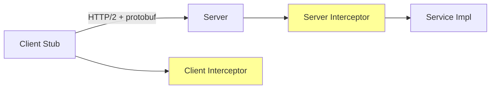

# gRPC

> Google 跨语言 RPC 框架：HTTP/2 + Protobuf + 多语言代码生成；4 种调用模式 + 拦截器 + metadata + 双向流

## 一、核心原理

### 1.1 整体架构



特点：
- **HTTP/2** 传输：多路复用、header 压缩、流式
- **Protobuf** 序列化：紧凑、类型安全、跨语言
- **代码生成**：从 .proto 生成 Server/Client stub
- **强类型**：编译期检查参数

### 1.2 .proto 定义

```protobuf
syntax = "proto3";
package user.v1;
option go_package = "github.com/foo/proto/user/v1;userv1";

service UserService {
    rpc GetUser(GetUserReq) returns (User);
    rpc ListUsers(ListUsersReq) returns (stream User);              // 服务端流
    rpc UploadAvatar(stream Chunk) returns (UploadResp);            // 客户端流
    rpc Chat(stream Message) returns (stream Message);              // 双向流
}

message User {
    int64  id    = 1;
    string name  = 2;
    int32  age   = 3;
}
```

生成代码：

```bash
protoc --go_out=. --go-grpc_out=. user.proto
```

生成 `user.pb.go`（消息）+ `user_grpc.pb.go`（服务接口）。

### 1.3 四种调用模式

| 模式 | client | server | 场景 |
| --- | --- | --- | --- |
| **Unary** | 1 req | 1 resp | 普通 RPC |
| **Server stream** | 1 req | N resp | 大量结果分批返回（list） |
| **Client stream** | N req | 1 resp | 上传（文件分块） |
| **Bidi stream** | N req | N resp | 实时聊天、IM |

```go
// Unary
resp, err := client.GetUser(ctx, &pb.GetUserReq{Id: 1})

// Server stream
stream, _ := client.ListUsers(ctx, &pb.ListUsersReq{})
for {
    u, err := stream.Recv()
    if err == io.EOF { break }
    // 处理 u
}

// Client stream
stream, _ := client.UploadAvatar(ctx)
for _, chunk := range chunks { stream.Send(chunk) }
resp, err := stream.CloseAndRecv()

// Bidi stream
stream, _ := client.Chat(ctx)
go func() { for msg := range outgoing { stream.Send(msg) } }()
for {
    msg, err := stream.Recv()
    if err == io.EOF { break }
}
```

### 1.4 拦截器

类似中间件，分 Unary 和 Stream：

```go
// Unary Server Interceptor
func LoggingInterceptor(
    ctx context.Context,
    req any,
    info *grpc.UnaryServerInfo,
    handler grpc.UnaryHandler,
) (any, error) {
    start := time.Now()
    resp, err := handler(ctx, req)
    log.Printf("%s took %v err=%v", info.FullMethod, time.Since(start), err)
    return resp, err
}

srv := grpc.NewServer(grpc.UnaryInterceptor(LoggingInterceptor))
```

链式：`grpc.ChainUnaryInterceptor(a, b, c)`。

### 1.5 metadata

类似 HTTP header，KV：

```go
// 客户端发送
md := metadata.New(map[string]string{"trace-id": "abc"})
ctx := metadata.NewOutgoingContext(ctx, md)
client.Foo(ctx, req)

// 服务端读取
md, _ := metadata.FromIncomingContext(ctx)
tids := md.Get("trace-id")  // []string

// 服务端写响应 metadata
grpc.SetTrailer(ctx, metadata.Pairs("k", "v"))
```

注意 key **不区分大小写**。

### 1.6 错误处理

```go
import "google.golang.org/grpc/status"
import "google.golang.org/grpc/codes"

// 服务端
return nil, status.Error(codes.NotFound, "user not found")

// 客户端
resp, err := client.Get(ctx, req)
if st, ok := status.FromError(err); ok {
    switch st.Code() {
    case codes.NotFound: ...
    case codes.Unauthenticated: ...
    case codes.DeadlineExceeded: ...  // ctx 超时自动这个
    }
}
```

带详情：

```go
st := status.New(codes.InvalidArgument, "bad input")
st, _ = st.WithDetails(&errdetails.BadRequest{
    FieldViolations: []*errdetails.BadRequest_FieldViolation{...},
})
return nil, st.Err()
```

### 1.7 超时与取消

```go
// 客户端: ctx 超时直接传给服务端
ctx, cancel := context.WithTimeout(parent, 3*time.Second)
defer cancel()
resp, err := client.Foo(ctx, req)
```

ctx 超时：客户端 deadline 通过 metadata 传给服务端，服务端 ctx 也会取消。**无缝传播**。

### 1.8 重试

gRPC 内置重试（service config）：

```json
{
  "methodConfig": [{
    "name": [{"service": "user.v1.UserService"}],
    "retryPolicy": {
      "maxAttempts": 3,
      "initialBackoff": "0.1s",
      "maxBackoff": "1s",
      "backoffMultiplier": 2.0,
      "retryableStatusCodes": ["UNAVAILABLE"]
    }
  }]
}
```

或客户端自己包一层。

### 1.9 Keepalive

```go
import "google.golang.org/grpc/keepalive"

server := grpc.NewServer(grpc.KeepaliveParams(keepalive.ServerParameters{
    Time:    30 * time.Second,
    Timeout: 5 * time.Second,
}))

conn, _ := grpc.Dial(addr, grpc.WithKeepaliveParams(keepalive.ClientParameters{
    Time:                30 * time.Second,
    Timeout:             5 * time.Second,
    PermitWithoutStream: true,
}))
```

防止中间件 / 防火墙断空闲连接。

### 1.10 vs HTTP+JSON

| | gRPC | HTTP+JSON |
| --- | --- | --- |
| 序列化 | Protobuf（紧凑） | JSON（文本） |
| 性能 | 5~10x | 1x |
| 类型 | 强（编译期） | 弱（运行时） |
| 浏览器 | grpc-web 间接 | 原生 |
| 调试 | 难（二进制） | 易（curl） |
| 流式 | 原生 | SSE/WebSocket |
| 跨语言 | 强（10+ 语言） | 强 |

**内部服务**用 gRPC，**对外 API** 用 HTTP/JSON。或用 grpc-gateway 双向。

## 二、八股速记

- **HTTP/2 + Protobuf**，多路复用 + 紧凑编码
- 4 种调用：**Unary / Server stream / Client stream / Bidi stream**
- 拦截器 = 中间件，Unary 和 Stream 各一种
- **metadata** 类似 HTTP header
- 错误用 `status.Error(codes.X, msg)`，客户端 `status.FromError`
- ctx 超时 / 取消**自动跨进程传播**
- 重试用 service config
- **Keepalive** 防中间件断连
- 性能 5~10x 于 HTTP+JSON
- 内部服务首选 gRPC，对外 API 用 HTTP

## 三、面试真题

**Q1：gRPC 为什么比 HTTP+JSON 快？**
1. **Protobuf 紧凑**：编码后体积 1/3 ~ 1/10 of JSON
2. **HTTP/2 多路复用**：一个连接并行多请求，减 TCP 握手
3. **二进制**：解析比 JSON 文本快
4. **代码生成**：少反射，直接读字段

实测：单次调用 5~10x 提升。但**业务逻辑/DB 时间占主导**，端到端通常没那么夸张。

**Q2：四种调用模式各适合什么？**

| 模式 | 适用 | 例子 |
| --- | --- | --- |
| Unary | 普通 RPC | 查用户、下单 |
| Server stream | 大量结果分批 | 列表分页（替代分页 RPC）、订阅 |
| Client stream | 客户端持续上传 | 大文件分块上传、批量埋点 |
| Bidi stream | 双向实时 | IM 聊天、协作编辑、推送 |

**Q3：metadata 用什么？**
类似 HTTP header，传 **不在业务参数里的元数据**：
- trace_id / span_id
- 认证 token
- 客户端版本
- 路由（X-Region 等）

注意 key 不区分大小写，多值可重复。

**Q4：错误怎么从 gRPC 服务端传到客户端？**

```go
// 服务端
return nil, status.Errorf(codes.NotFound, "user %d not found", id)

// 客户端
if st, ok := status.FromError(err); ok {
    if st.Code() == codes.NotFound { ... }
}
```

**坑**：gRPC error 不是 Go 的标准 error wrap，跨服务**类型信息丢失**。要传业务码用 `status.WithDetails`。

**Q5：怎么做认证？**

3 种方式：

1. **TLS 双向认证**：mTLS，服务端验证客户端证书
2. **Token 拦截器**：客户端 metadata 带 token，服务端拦截器验证

```go
ctx = metadata.AppendToOutgoingContext(ctx, "authorization", "Bearer xxx")
```

3. **OAuth2**：用 `grpc.WithPerRPCCredentials`

服务端拦截器：

```go
func AuthInterceptor(ctx context.Context, req any, info *grpc.UnaryServerInfo, handler grpc.UnaryHandler) (any, error) {
    md, _ := metadata.FromIncomingContext(ctx)
    tokens := md.Get("authorization")
    if len(tokens) == 0 || !verify(tokens[0]) {
        return nil, status.Error(codes.Unauthenticated, "invalid token")
    }
    return handler(ctx, req)
}
```

**Q6：怎么做客户端连接管理？**

```go
// 全局共享 1 个 conn (HTTP/2 多路复用)
conn, _ := grpc.Dial(addr,
    grpc.WithTransportCredentials(insecure.NewCredentials()),
    grpc.WithKeepaliveParams(keepalive.ClientParameters{
        Time:                30 * time.Second,
        Timeout:             5 * time.Second,
        PermitWithoutStream: true,
    }),
)
defer conn.Close()

client := pb.NewUserServiceClient(conn)
```

**不要每次请求新建 conn**！HTTP/2 单连接足够并发，建 conn 慢且占资源。

**Q7：gRPC 怎么做服务发现 + 负载均衡？**

```go
// 内置: dns://
conn, _ := grpc.Dial("dns:///myservice:50051",
    grpc.WithDefaultServiceConfig(`{"loadBalancingConfig": [{"round_robin":{}}]}`),
)

// 或用 resolver
import "google.golang.org/grpc/resolver"
// 注册 etcd / consul / nacos resolver
conn, _ := grpc.Dial("etcd:///user-service", ...)
```

支持 round_robin、pick_first；想要 P2C / least_request 等用 service mesh（Istio）或 自定义 balancer。

**Q8：双向流怎么避免死锁？**

```go
// 错: 主 g 一直 Send, 没人 Recv → 缓冲满 → block
for { stream.Send(...) }

// 对: 一 g send, 一 g recv
go func() {
    for msg := range out { stream.Send(msg) }
    stream.CloseSend()
}()
for {
    in, err := stream.Recv()
    if err == io.EOF { break }
}
```

Send/Recv 用各自 g。

**Q9：超时怎么从客户端传到服务端的下游？**

```go
// 客户端: ctx 带 deadline
ctx, cancel := context.WithTimeout(parent, 3*time.Second)
defer cancel()
client.A(ctx, req)

// 服务端 A
func (s *server) A(ctx context.Context, req *Req) (*Resp, error) {
    // ctx 已经包含 client 的 deadline
    return svcB.B(ctx, ...)  // 透传, B 也会自动收到 deadline
}
```

deadline 通过 metadata `grpc-timeout` 传输，服务端 ctx 自动设。

**Q10：debug 一个 gRPC 调用怎么做？**

```bash
# 1. 看协议 (二进制不能直接 curl)
grpcurl -plaintext -d '{"id":1}' localhost:50051 user.v1.UserService/GetUser

# 2. 服务端反射 (生产关闭)
import "google.golang.org/grpc/reflection"
reflection.Register(srv)

# 3. 抓包用 tcpdump + Wireshark gRPC dissector
```

或用 Postman / BloomRPC 等 GUI 客户端。

## 四、手写实现

**1. 服务端模板：**

```go
func main() {
    lis, err := net.Listen("tcp", ":50051")
    if err != nil { log.Fatal(err) }

    srv := grpc.NewServer(
        grpc.ChainUnaryInterceptor(
            RecoveryInterceptor(),
            LoggingInterceptor(),
            MetricsInterceptor(),
            AuthInterceptor(),
        ),
        grpc.KeepaliveParams(keepalive.ServerParameters{
            Time:    30 * time.Second,
            Timeout: 5 * time.Second,
        }),
    )

    pb.RegisterUserServiceServer(srv, &userServer{})
    reflection.Register(srv)  // 开发期

    go srv.Serve(lis)

    // 优雅停机
    ctx, stop := signal.NotifyContext(context.Background(), syscall.SIGTERM, syscall.SIGINT)
    defer stop()
    <-ctx.Done()
    srv.GracefulStop()  // 等所有进行中的 RPC 完成
}
```

**2. 客户端模板：**

```go
var (
    once   sync.Once
    client pb.UserServiceClient
)

func GetClient(addr string) pb.UserServiceClient {
    once.Do(func() {
        conn, err := grpc.Dial(addr,
            grpc.WithTransportCredentials(insecure.NewCredentials()),
            grpc.WithKeepaliveParams(keepalive.ClientParameters{
                Time:                30 * time.Second,
                Timeout:             5 * time.Second,
                PermitWithoutStream: true,
            }),
            grpc.WithDefaultServiceConfig(`{
                "loadBalancingConfig": [{"round_robin":{}}],
                "methodConfig": [{
                    "name": [{}],
                    "retryPolicy": {
                        "maxAttempts": 3,
                        "initialBackoff": "0.1s",
                        "maxBackoff": "1s",
                        "backoffMultiplier": 2.0,
                        "retryableStatusCodes": ["UNAVAILABLE"]
                    }
                }]
            }`),
        )
        if err != nil { log.Fatal(err) }
        client = pb.NewUserServiceClient(conn)
    })
    return client
}
```

**3. 拦截器示例：**

```go
func RecoveryInterceptor() grpc.UnaryServerInterceptor {
    return func(ctx context.Context, req any, info *grpc.UnaryServerInfo, handler grpc.UnaryHandler) (any, error) {
        defer func() {
            if r := recover(); r != nil {
                log.Printf("panic %s: %v\n%s", info.FullMethod, r, debug.Stack())
                metrics.PanicCount.Inc()
            }
        }()
        return handler(ctx, req)
    }
}

func TimeoutInterceptor(d time.Duration) grpc.UnaryServerInterceptor {
    return func(ctx context.Context, req any, info *grpc.UnaryServerInfo, handler grpc.UnaryHandler) (any, error) {
        ctx, cancel := context.WithTimeout(ctx, d)
        defer cancel()
        return handler(ctx, req)
    }
}
```

**4. 流式 demo：**

```go
// 服务端: server stream
func (s *server) ListUsers(req *pb.ListUsersReq, stream pb.UserService_ListUsersServer) error {
    users, _ := s.repo.List(stream.Context())
    for _, u := range users {
        if err := stream.Send(toProto(u)); err != nil { return err }
    }
    return nil
}

// 客户端
stream, _ := client.ListUsers(ctx, &pb.ListUsersReq{})
for {
    u, err := stream.Recv()
    if err == io.EOF { break }
    if err != nil { return err }
    fmt.Println(u)
}
```

## 五、踩坑与最佳实践

### 坑 1：每次新建 conn

```go
func call() {
    conn, _ := grpc.Dial(...)  // 每次新建
    defer conn.Close()
    // ...
}
```

慢且占资源。**修复**：全局 conn 复用。

### 坑 2：proto 没设 deadline

```go
client.A(ctx, req)  // ctx 没超时, 默认无限等
```

**修复**：客户端必 `WithTimeout`。

### 坑 3：流式没关 send

```go
stream, _ := client.UploadAvatar(ctx)
for _, c := range chunks { stream.Send(c) }
// 忘 CloseSend → 服务端 stream.Recv() 一直等
resp, err := stream.CloseAndRecv()
```

CloseSend 必加。

### 坑 4：proto 字段编号变更

```protobuf
message User {
    int64 id = 1;
    string name = 2;  // 改成 int32 → 兼容性炸
}
```

proto 兼容规则：**字段编号不能变**，类型变只在兼容范围内（int32/int64/sint32 etc.）。
**修复**：旧字段 deprecated，新字段加新编号。

### 坑 5：服务端用 Marshal 把 proto 当 JSON 输出

```go
b, _ := json.Marshal(pbMsg)  // 字段名是 proto 的 (snake_case)? 不一定
```

用 `protojson` 包：

```go
b, _ := protojson.Marshal(pbMsg)
```

字段名按 proto JSON spec。

### 坑 6：metadata key 大小写

```go
md.Get("Trace-Id")  // 都是小写 "trace-id"
```

gRPC metadata key 内部全小写。**修复**：统一小写。

### 坑 7：gRPC reflection 暴露公网

```go
reflection.Register(srv)  // 生产暴露 → 可枚举所有方法
```

**修复**：仅 dev/staging 注册。

### 坑 8：Keepalive 太激进被判 GOAWAY

```go
grpc.KeepaliveParams(keepalive.ServerParameters{
    Time: 1 * time.Second,  // 太频繁
})
```

服务端检查到客户端 ping 太频繁会主动断开。**修复**：与服务端策略匹配（通常 30s+）。

### 最佳实践

- **conn 复用**：全局共享一个 *grpc.ClientConn
- **ctx 必 deadline**：每次 RPC 设超时
- **拦截器链**：Recovery / Logging / Metrics / Auth / Timeout
- **GracefulStop** 优雅停机
- **status + codes** 标准错误传递
- **metadata 传请求级元数据**：trace_id, auth
- **流式注意 CloseSend / EOF 处理**
- **keepalive** 防中间件断连
- **service config** 重试 + 负载均衡
- **proto 兼容**：字段编号不变，新字段加 optional
- **reflection 仅开发期**
- **gRPC 内部用，对外 API 用 grpc-gateway 转 HTTP/JSON**
