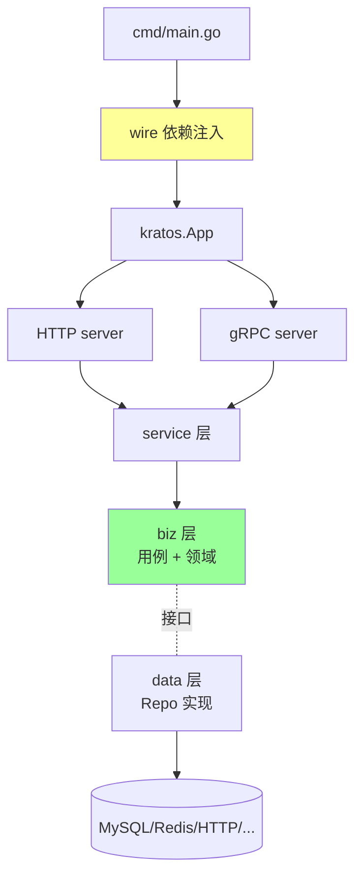

# Kratos

> B 站开源的 Go 微服务框架：DDD 分层 + Wire 依赖注入 + 传输层抽象（HTTP/gRPC 共存）+ 配置中心抽象；适合中大型团队 DDD 落地

## 一、核心原理

### 1.1 整体架构



**特色**：
- **DDD 风格分层**：`api` / `service` / `biz` / `data`
- **Wire** 编译期依赖注入（不是反射）
- **传输层抽象**：同一 service 可同时暴露 HTTP + gRPC
- **配置 / 注册中心 / log 都是接口**，可换 Apollo / Nacos / etcd / Consul
- **内置中间件**：recovery / logging / metrics / tracing / circuitbreaker

### 1.2 标准目录

```
project/
├── api/v1/                # proto 定义
│   ├── user.proto
│   └── user.pb.go
├── cmd/server/
│   └── main.go            # 启动入口 (wire 生成)
├── configs/
│   └── config.yaml
├── internal/
│   ├── biz/               # 业务用例 + 领域接口
│   │   ├── user.go
│   │   └── biz.go         # ProviderSet
│   ├── data/              # 数据层 (repo 实现)
│   │   ├── user.go
│   │   └── data.go        # ProviderSet
│   ├── service/           # API handler (HTTP+gRPC 共用)
│   │   └── user.go
│   ├── server/
│   │   ├── http.go        # HTTP server 配置
│   │   ├── grpc.go        # gRPC server 配置
│   │   └── server.go      # ProviderSet
│   ├── conf/
│   └── pkg/
└── third_party/
```

### 1.3 proto-first

```protobuf
// api/v1/user.proto
syntax = "proto3";
package user.v1;

import "google/api/annotations.proto";

service UserService {
    rpc GetUser(GetUserReq) returns (User) {
        option (google.api.http) = {
            get: "/v1/users/{id}"
        };
    }
}
```

`make api` 用 protoc + kratos 插件生成：
- gRPC server / client
- HTTP handler（基于 `google.api.http` 注解）
- Swagger 文档

**同一 service 实现，HTTP 和 gRPC 共用**：

```go
type UserService struct {
    pb.UnimplementedUserServiceServer
    uc *biz.UserUseCase
}

func (s *UserService) GetUser(ctx context.Context, req *pb.GetUserReq) (*pb.User, error) {
    u, err := s.uc.Get(ctx, req.Id)
    // ...
}
```

### 1.4 Wire 依赖注入

```go
// cmd/server/wire.go (build tag: wireinject)
//go:build wireinject

func wireApp(*conf.Server, *conf.Data, log.Logger) (*kratos.App, func(), error) {
    panic(wire.Build(
        server.ProviderSet,
        data.ProviderSet,
        biz.ProviderSet,
        service.ProviderSet,
        newApp,
    ))
}
```

`make wire` 生成 `wire_gen.go`（编译期解析依赖图，生成实际代码）。

**好处 vs 反射 DI**：
- 编译期错误（缺依赖立即报）
- 零运行时开销
- 代码可读

### 1.5 中间件

```go
import "github.com/go-kratos/kratos/v2/middleware/recovery"
import "github.com/go-kratos/kratos/v2/middleware/logging"
import "github.com/go-kratos/kratos/v2/middleware/tracing"

httpSrv := http.NewServer(
    http.Middleware(
        recovery.Recovery(),
        tracing.Server(),
        logging.Server(logger),
    ),
)
```

中间件统一接口，HTTP 和 gRPC 通用。

### 1.6 配置抽象

```go
import "github.com/go-kratos/kratos/v2/config"
import "github.com/go-kratos/kratos/v2/config/file"

c := config.New(
    config.WithSource(file.NewSource("configs/config.yaml")),
)
c.Load()

var conf Conf
c.Scan(&conf)

// 监听变化
c.Watch("server.http.port", func(k string, v config.Value) {
    // hot reload
})
```

可换 `config/apollo`、`config/nacos`、`config/etcd` 等。

### 1.7 服务注册 / 发现

```go
import "github.com/go-kratos/kratos/contrib/registry/etcd/v2"

reg := etcd.New(client)

app := kratos.New(
    kratos.Server(httpSrv, grpcSrv),
    kratos.Registrar(reg),
)
```

或换 nacos / consul / k8s。

### 1.8 错误处理

Kratos 提供统一的 errors 包：

```go
import "github.com/go-kratos/kratos/v2/errors"

return nil, errors.NotFound("USER_NOT_FOUND", "user %d not found", id)
```

自动转：
- HTTP：404 + JSON `{code, reason, message}`
- gRPC：`status.Error(codes.NotFound, ...)`

## 二、八股速记

- **DDD 分层**：api / service / biz / data
- **Wire 编译期 DI**：不是反射，零运行时
- **HTTP + gRPC 共用 service**：proto + google.api.http 注解
- **配置 / 注册中心 / log 都是接口**：可热插拔实现
- **统一中间件**：HTTP 和 gRPC 通用
- **errors 包统一**：自动转 HTTP/gRPC 状态
- 适合中大型团队 + DDD 项目
- 比 go-zero 灵活，比 gin 重
- B 站出品，有大厂背书

## 三、面试真题

**Q1：Kratos 和 go-zero 区别？**

| | Kratos | go-zero |
| --- | --- | --- |
| 设计哲学 | 灵活 + DDD | 约束 + 快速 |
| 代码生成 | 中（proto-first） | 强（DSL goctl） |
| DI | wire（编译期） | 手动 |
| HTTP+gRPC | 统一 service | 分开 api / rpc |
| 注册中心 | 多种可换 | etcd 为主 |
| 学习曲线 | 中-陡（DDD + wire） | 陡（DSL） |
| 适合 | 中大团队，长期维护 | 中小团队，快速产出 |

**Q2：为什么用 Wire 而不是反射 DI？**

```go
// wire 生成的代码
db := newDB()
repo := newUserRepo(db)
uc := newUserUseCase(repo)
svc := newUserService(uc)
// 全是显式 new
```

vs reflect-based（如 fx）：
- **编译期错误**：缺依赖编不过
- **零运行时开销**：没有 reflect.Call
- **可读**：生成的代码清晰
- **IDE 友好**：跳转 / 重构

代价：依赖图改动后要 `make wire` 重新生成。

**Q3：HTTP 和 gRPC 怎么共用 service？**

通过 proto + google.api.http 注解：

```protobuf
service UserService {
    rpc GetUser(GetUserReq) returns (User) {
        option (google.api.http) = {get: "/v1/users/{id}"};
    }
}
```

生成代码同时注册：
- gRPC handler
- HTTP handler（按 URL 模板转换 → 调用同一 service 方法）

业务实现一份，两种协议都暴露。

**Q4：DDD 分层怎么落地？**

- **api**：协议定义（proto），不含业务
- **service**：协议层 handler，做参数转换 + 调 biz，**不应有业务逻辑**
- **biz**：业务用例 + 领域实体 + repo 接口；**核心**
- **data**：repo 实现 + DB/Redis/外部依赖

依赖方向：service → biz → data；biz 通过接口反向依赖 data。

**Q5：repo 接口为什么定义在 biz？**

```go
// internal/biz/user.go
type UserRepo interface {
    Get(context.Context, int64) (*User, error)
}

// internal/data/user.go
type userRepo struct{ db *sql.DB }
func NewUserRepo(db *sql.DB) biz.UserRepo {
    return &userRepo{db: db}
}
```

依赖反转：biz 是核心，repo 是细节。biz 不应该 import data。
好处：
- biz 不依赖具体存储（MySQL → MongoDB 不影响 biz）
- 测试可 mock repo

**Q6：errors 包怎么用？**

```go
// 服务端
return nil, errors.NotFound("USER_NOT_FOUND", "user %d not found", id)
return nil, errors.BadRequest("INVALID_PARAM", "name required")
return nil, errors.InternalServer("DB_ERROR", "...")

// 客户端
e := errors.FromError(err)
e.Code   // HTTP/gRPC code
e.Reason // 业务错误码
e.Message
```

跨协议自动转换：HTTP 是 JSON 响应，gRPC 是 status。

**Q7：怎么集成配置中心？**

```go
import "github.com/go-kratos/kratos/contrib/config/apollo/v2"

c := config.New(
    config.WithSource(apollo.NewSource(
        apollo.WithAppID("myapp"),
        apollo.WithCluster("default"),
        apollo.WithEndpoint("http://apollo:8080"),
        apollo.WithNamespace("application"),
    )),
)
```

支持 hot reload：

```go
c.Watch("user.maxAge", func(k string, v config.Value) {
    // 配置变更回调
})
```

**Q8：怎么做 trace？**

```go
import "github.com/go-kratos/kratos/v2/middleware/tracing"

http.Middleware(tracing.Server())
```

集成 OpenTelemetry，自动生成 span，跨 HTTP / gRPC 透传。

**Q9：和 spring boot 类比？**

| Spring Boot | Kratos |
| --- | --- |
| `@Controller` | service 层 |
| `@Service` | biz 层 |
| `@Repository` | data 层 |
| `@Autowired` | wire DI |
| `application.yml` | configs/config.yaml |
| `Spring Cloud` | kratos contrib (registry/config) |

但 Kratos 更轻、Go 性能更好。

**Q10：什么时候选 Kratos？**

适合：
- 中大型团队，长期维护项目
- DDD / Clean Architecture 落地
- HTTP + gRPC 双协议
- 多环境多基础设施（不绑定 etcd 或 nacos）

不适合：
- 快速 prototype（goctl 更快）
- 简单 CRUD（gin 足够）
- 团队 Go 经验弱（DDD + wire 学习曲线陡）

## 四、手写实现

**1. proto 定义：**

```protobuf
// api/user/v1/user.proto
syntax = "proto3";
package user.v1;
import "google/api/annotations.proto";
option go_package = "myapp/api/user/v1;v1";

service User {
    rpc Get(GetReq) returns (GetResp) {
        option (google.api.http) = {get: "/v1/users/{id}"};
    }
    rpc Create(CreateReq) returns (CreateResp) {
        option (google.api.http) = {
            post: "/v1/users"
            body: "*"
        };
    }
}

message GetReq { int64 id = 1; }
message GetResp { int64 id = 1; string name = 2; }
message CreateReq { string name = 1; }
message CreateResp { int64 id = 1; }
```

**2. biz 层（用例 + 接口）：**

```go
// internal/biz/user.go
package biz

type User struct {
    ID   int64
    Name string
}

type UserRepo interface {
    Get(context.Context, int64) (*User, error)
    Save(context.Context, *User) error
}

type UserUseCase struct {
    repo UserRepo
    log  *log.Helper
}

func NewUserUseCase(r UserRepo, logger log.Logger) *UserUseCase {
    return &UserUseCase{repo: r, log: log.NewHelper(logger)}
}

func (uc *UserUseCase) Get(ctx context.Context, id int64) (*User, error) {
    return uc.repo.Get(ctx, id)
}

// internal/biz/biz.go
var ProviderSet = wire.NewSet(NewUserUseCase)
```

**3. data 层（repo 实现）：**

```go
// internal/data/user.go
package data

type userRepo struct {
    data *Data
    log  *log.Helper
}

func NewUserRepo(data *Data, logger log.Logger) biz.UserRepo {
    return &userRepo{data: data, log: log.NewHelper(logger)}
}

func (r *userRepo) Get(ctx context.Context, id int64) (*biz.User, error) {
    var u biz.User
    err := r.data.db.QueryRowContext(ctx, "SELECT id, name FROM users WHERE id=?", id).Scan(&u.ID, &u.Name)
    if err != nil { return nil, err }
    return &u, nil
}

// internal/data/data.go
type Data struct {
    db *sql.DB
}

func NewData(c *conf.Data, logger log.Logger) (*Data, func(), error) {
    db, err := sql.Open("mysql", c.Database.Source)
    if err != nil { return nil, nil, err }
    cleanup := func() { db.Close() }
    return &Data{db: db}, cleanup, nil
}

var ProviderSet = wire.NewSet(NewData, NewUserRepo)
```

**4. service 层（HTTP+gRPC 共用）：**

```go
// internal/service/user.go
package service

type UserService struct {
    pb.UnimplementedUserServer
    uc *biz.UserUseCase
}

func NewUserService(uc *biz.UserUseCase) *UserService {
    return &UserService{uc: uc}
}

func (s *UserService) Get(ctx context.Context, req *pb.GetReq) (*pb.GetResp, error) {
    u, err := s.uc.Get(ctx, req.Id)
    if err != nil { return nil, err }
    return &pb.GetResp{Id: u.ID, Name: u.Name}, nil
}

// internal/service/service.go
var ProviderSet = wire.NewSet(NewUserService)
```

**5. wire 注入：**

```go
// cmd/server/wire.go (build tag: wireinject)
//go:build wireinject
package main

func wireApp(*conf.Server, *conf.Data, log.Logger) (*kratos.App, func(), error) {
    panic(wire.Build(
        server.ProviderSet,
        data.ProviderSet,
        biz.ProviderSet,
        service.ProviderSet,
        newApp,
    ))
}
```

跑 `make wire` 生成 `wire_gen.go`。

## 五、踩坑与最佳实践

### 坑 1：wire 改后忘 generate

```go
// 改了 NewUserUseCase 加参数, 没 make wire
// 编译报错: not enough arguments
```

**修复**：每次改 ProviderSet 跑 `make wire`。

### 坑 2：service 层写业务

```go
func (s *UserService) Get(ctx context.Context, req *pb.GetReq) {
    // 直接查 DB ← 错, 跳过了 biz
    var u User
    s.db.QueryRow("...").Scan(&u)
}
```

**修复**：service 只做协议转换，业务在 biz。

### 坑 3：biz 层 import data

```go
// internal/biz/user.go
import "myapp/internal/data"  // 错, 反向依赖
```

**修复**：biz 定义接口，data 实现。biz 不知道有 data 包。

### 坑 4：DDD 过度

简单 CRUD 也按 DDD 全套写，代码量翻倍。**修复**：DDD 是工具不是宗教，简单业务可以简化。

### 坑 5：proto 定义乱

每个服务一个 .proto，字段编号反复改。**修复**：proto buffer 兼容性规则严格遵守，CI 加 buf lint。

### 坑 6：注册中心选错

dev 用 etcd 调试方便，prod 切 nacos 又改一遍代码。**修复**：从一开始用 kratos 抽象，配置切换实现。

### 坑 7：wire 循环依赖

```
biz → data
data → biz  // 错
```

wire 生成失败。**修复**：保持单向依赖。

### 最佳实践

- **proto-first**：先定 API，再生成代码
- **HTTP + gRPC 共存**：用 google.api.http 注解
- **DDD 分层**：service → biz → data，repo 接口在 biz
- **wire 严格用**：每改 provider 跑 make wire
- **统一 errors**：errors.NotFound 等，自动转协议
- **中间件标配**：recovery / tracing / logging / metrics
- **配置抽象**：用 config 包，dev/prod 切 source
- **注册中心抽象**：用 registry 包
- **make 自动化**：make api / make wire / make build
- **小项目用 gin，中大项目用 kratos，快速产出用 go-zero**
