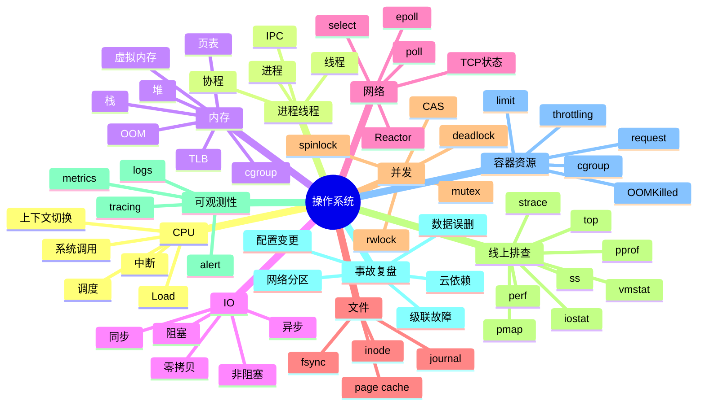

# 操作系统知识地图

> 后端面试里的 OS 不是孤立知识，而是解释服务性能的底层语言：CPU、内存、IO、网络、文件和并发。

## 一、知识地图



## 二、后端视角

| OS 能力 | 后端对应问题 |
| --- | --- |
| CPU 调度 | 服务延迟抖动、上下文切换、负载 |
| 进程线程 | Go goroutine、线程池、隔离 |
| 虚拟内存 | OOM、内存泄漏、缺页、Swap |
| IO 多路复用 | 高并发连接、Nginx、Redis、Go netpoll |
| Page Cache | 文件读写、日志、数据库、缓存命中 |
| 锁与 CAS | 并发安全、死锁、性能瓶颈 |
| Linux 排查 | CPU 高、load 高、OOM、磁盘慢、连接异常 |
| 可观测性 | 日志、指标、链路追踪、告警和事故复盘 |
| 性能工具 | pprof、perf、strace、火焰图、压测验证 |
| CPU/内存手册 | 高 CPU 定位到线程和函数，高内存区分 RSS、heap、mmap、cgroup |
| 事故复盘 | 从大厂事故抽象出排查、止血、容灾和长期治理模型 |
| 网络排查 | DNS、建连、TLS、重传、连接池、端口耗尽 |
| 磁盘排查 | 空间、inode、deleted 文件、iostat、fsync、Page Cache |
| 容器资源 | cgroup、OOMKilled、CPU throttling、request/limit、探针 |

## 三、能力分层

```text
第一层：概念
  进程线程、虚拟内存、IO、锁、文件系统

第二层：机制
  调度、页表、Page Cache、epoll、fsync、TCP 状态

第三层：线上问题
  CPU 高、load 高、OOM、IO 慢、连接泄漏、P99 抖动

第四层：工具闭环
  top/vmstat/iostat/ss/strace/perf/pprof/trace

第五层：事故复盘
  配置灰度、备份恢复、主从切换、网络容灾、过载保护

第六层：云原生资源
  cgroup、OOMKilled、CPU throttling、request/limit、探针
```

个人沉淀时要从“能解释概念”升级到“能定位问题”：


## 四、常见答题方式

OS 题可以按三步讲：

```text
定义：这个机制是什么
原因：为什么需要它
代价：它带来什么开销和线上问题
```

例子：

```text
虚拟内存是进程看到的连续地址空间，底层通过页表映射到物理内存。
它解决了进程隔离、地址空间管理和内存扩展问题。
代价是地址转换需要页表和 TLB，缺页会触发中断，Swap 会导致严重性能下降。
```

线上排查题可以按四步讲：

```text
现象：用户看到什么，监控怎么变
分类：CPU、内存、IO、网络、锁、依赖
证据：用什么指标和工具确认
处理：先止血，再根因修复和复盘
```

例子：

```text
如果 CPU 不高但接口很慢，我不会先怀疑 CPU，而会看 IO 等待、连接池等待、下游 RPC、慢 SQL 和锁竞争。
工具上先看 P99、trace、goroutine dump、iostat、ss，再根据证据决定是限流、降级、扩容、回滚还是优化 SQL。
```

## 五、面试表达

```text
我理解 OS 面试题要落到后端性能上。
进程线程解释并发模型，虚拟内存解释 OOM 和缺页，IO 多路复用解释高并发网络，Page Cache 解释文件和数据库 IO，调度和锁解释延迟抖动。
所以回答时我会把机制、代价和线上场景一起讲。
如果是线上排查题，我会从影响面、时间线、核心指标入手，再按 CPU、内存、IO、网络、依赖逐步收敛，并用 pprof、perf、strace、iostat、ss 等工具拿证据。
```
