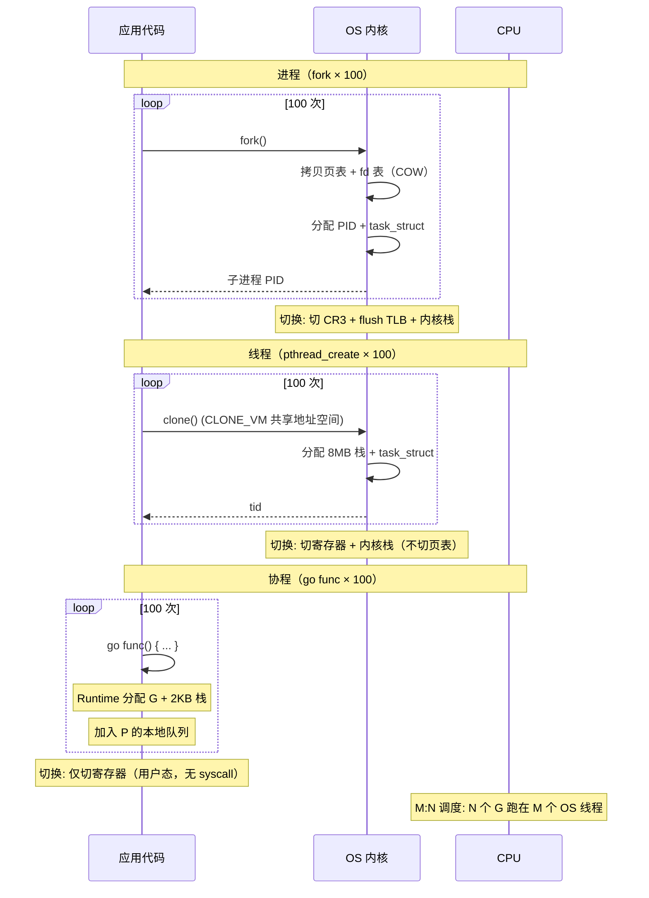
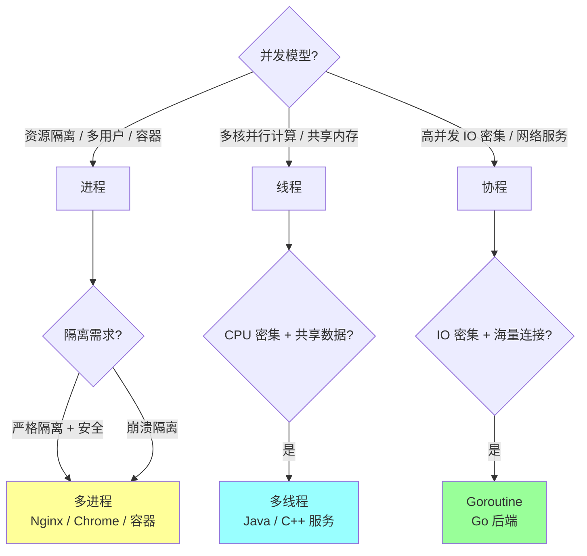

# 进程、线程、协程

> 进程是资源隔离单位，线程是 CPU 调度单位，协程是用户态调度的轻量执行单元。

## 〇、多概念对比：进程 vs 线程 vs 协程（D 模板）

### 一句话定位

| 概念 | 一句话定位 |
| --- | --- |
| **进程（Process）** | **资源分配 + 隔离的最小单位**，独立地址空间 + fd 表 + 信号 + 堆栈，**OS 调度（内核态）**，开销最大 |
| **线程（Thread）** | **CPU 调度的最小单位**，**共享进程资源**（地址空间 / fd / 堆），独立栈 + 寄存器，**OS 调度（内核态）**，开销中等 |
| **协程（Coroutine / Goroutine）** | **用户态调度**的轻量执行单元，由**应用 / Runtime 管理**（不经内核），栈极小（KB 级），开销最小 |

### 多维度对比（17 维度，必背）

| 维度 | 进程 | 线程 | 协程（Goroutine）|
| --- | --- | --- | --- |
| **隔离级别** | **完全隔离**（独立地址空间）| 共享进程资源 | 共享线程资源（M 上的 G）|
| **调度者** | **OS 内核** | **OS 内核** | **应用 / Runtime（用户态）** |
| **调度方式** | 抢占式 + 时间片 | 抢占式 + 时间片 | **协作式**（Go 1.14+ 基于信号的部分抢占）|
| **创建开销** | **极大**（fork + 拷贝页表）| 中（pthread_create / clone）| **极小**（go func()，约 100ns）|
| **切换开销** | **大**（切页表 + TLB flush + 内核栈）| 中（寄存器 + 内核栈，~1-10μs）| **极小**（用户态寄存器切换，~100-200ns）|
| **切换耗时** | 微秒~毫秒 | 1-10 μs | 100-200 ns |
| **栈大小** | 几 MB（独立堆栈）| **默认 8MB**（pthread）/ 2MB（Linux）| **初始 2KB 可动态扩展**（最大 1GB）|
| **最大数量** | 几千个（受 PID + 内存限制）| **几千 - 几万**（受栈空间）| **百万级**（10w+ 轻松）|
| **通信方式** | **IPC**（管道 / 信号 / 共享内存 / Socket / MQ）| **共享内存 + 同步原语**（Mutex / 条件变量）| **Channel**（推荐）/ 共享内存 + sync.Mutex |
| **同步代价** | 重（IPC 慢）| 中（锁竞争）| 轻（CSP 模型）|
| **崩溃影响** | **独立**（一个挂了不影响其他）| **全进程挂**（OOM / 段错误）| **全进程挂**（panic 默认终止）|
| **CPU 占用** | 1 个 CPU 核心（每个进程串行）| 多核可并行（每线程 1 核）| **M:N 模型**（N 个 G 跑在 M 个线程上）|
| **资源占用（10w 个）** | **数百 GB**（不可能）| **几百 GB**（栈空间）| **~200MB**（默认 2KB × 10w）|
| **跨核迁移成本** | 高（缓存失效）| 中（缓存失效）| 低（Runtime 管理，Work Stealing）|
| **典型 API** | fork / exec / wait / kill | pthread_create / pthread_join | go func() / channel / select |
| **代表语言** | C / 多进程 Python（multiprocessing）| C++ / Java / 多线程 Python | **Go / Lua / Kotlin / Rust async** |
| **业内代表场景** | Nginx Master / Worker / 容器 | Web 服务器 / 数据库连接池 | **Go 后端 / 高并发网络服务** |

### 协作时序对比（创建 100 个并发执行单元）



### 资源占用对比（实测数据）

```
创建 10 万个执行单元的资源占用:

进程（不可能）:
  - 10w × 几 MB 栈 + 页表 = 数百 GB
  - 创建耗时: fork 1ms × 10w = 100 秒
  - 切换: 切页表 + TLB flush，每次 ~10μs
  → 实际跑不起来

线程（极限场景）:
  - 默认栈 8MB × 10w = 800 GB（必须调小栈）
  - 调成 64KB × 10w = 6.4 GB（勉强）
  - 创建耗时: ~10μs × 10w = 1 秒
  - 切换: ~1-10μs，10w 线程切换严重抖动
  → 不推荐，性能崩溃

Goroutine（轻松驾驭）:
  - 默认 2KB × 10w = 200 MB
  - 创建耗时: ~100ns × 10w = 10 ms
  - 切换: ~100-200ns，几乎无感
  → Go 的核心优势

差距对比:
  - 内存: Goroutine 是线程的 1/4000（2KB vs 8MB）
  - 创建: Goroutine 比线程快 100 倍
  - 切换: Goroutine 比线程快 10-50 倍
```

### 调度模型对比

```
进程 / 线程调度（1:1 模型）:
  应用 1 个执行单元 ←→ OS 1 个调度单元
       Thread/Process
            ↕
       Kernel Scheduler
            ↕
          CPU Core

  问题: 切换成本高（穿越用户态/内核态）
  问题: 数量受 OS 限制

协程 N:1 模型（Python asyncio / 早期 Go）:
  应用 N 个协程 → 1 个 OS 线程
       多个 Goroutine
            ↕
       1 个 OS 线程
            ↕
          CPU Core

  优点: 切换轻
  问题: 无法利用多核

Go GMP 模型 M:N（业界最佳实践）:
  G - Goroutine（用户协程）
  M - Machine（OS 线程）
  P - Processor（逻辑处理器，调度上下文）

  N 个 G 分配到 M 个 P 的本地队列
  每个 P 绑定 1 个 M
  M 在 OS 上跑 P 的 G

  G1 G2 G3 ... → P1 ← M1 ← CPU1
  G4 G5 G6 ... → P2 ← M2 ← CPU2
  G7 G8 ...    → P3 ← M3 ← CPU3

  优点: 充分利用多核 + 用户态切换轻量
  Work Stealing: P 空闲时偷其他 P 的 G
  → Go 高并发的根基
```

### 内存布局对比

```
进程:
  ┌────────────────┐
  │ 内核空间       │  ← 共享给所有进程，但每进程独立映射
  ├────────────────┤
  │ Stack          │  ← 独立
  ├────────────────┤
  │ Heap           │  ← 独立
  ├────────────────┤
  │ BSS / Data     │  ← 独立
  ├────────────────┤
  │ Code           │  ← 独立（或 COW 共享）
  └────────────────┘

线程（同一进程内）:
  Thread 1 Stack ──┐
  Thread 2 Stack ──┤
  Thread 3 Stack ──┤   共享 Heap / BSS / Data / Code
  ...              ┘
  每个线程默认 8MB 栈（占地址空间）

Goroutine（同一线程内）:
  G1 Stack (2KB, 可扩展)  ──┐
  G2 Stack (2KB, 可扩展)  ──┤   共享线程 Heap
  G3 Stack (2KB, 可扩展)  ──┤   栈在 heap 上分配（不是 OS 栈）
  ...                       ┘   栈不够 → 拷贝到更大空间
```

### 缺一不可分析

| 假设 | 后果 |
| --- | --- |
| **没进程** | OS 失去资源隔离能力（容器 / 多用户 / 安全模型崩塌）|
| **没线程** | 单进程无法利用多核（必须多进程 IPC，开销巨大）|
| **没协程** | 高并发服务必须开万级线程 → 内存爆 + 上下文切换抖动 |
| **没 M:N 调度** | 协程要么不能利用多核（N:1）要么开销大（1:1）|
| **协程没栈扩展** | 必须预分配大栈 → 失去内存优势 |

### 通信方式深度对比

```
进程间通信（IPC）:
  - 管道 Pipe: 父子进程半双工
  - 命名管道 FIFO: 任意进程
  - 信号 Signal: 异步通知
  - 共享内存 Shared Memory: 最快，但需同步
  - 信号量 Semaphore: 同步原语
  - 消息队列 MQ: 解耦
  - Socket: 跨主机
  - 文件 / DB: 持久化通信
  → 复杂且慢

线程间通信:
  - 共享变量（默认共享地址空间）
  - 同步原语: Mutex / RWMutex / 条件变量 / 信号量
  - 原子操作 Atomic
  - 线程局部存储 TLS
  → 简单但需小心数据竞争

Goroutine 间通信:
  - Channel（推荐，CSP 模型）: chan T
    "Don't communicate by sharing memory; share memory by communicating"
  - sync.Mutex / sync.RWMutex（兼容）
  - sync/atomic（无锁）
  - context.Context（取消传播）
  - sync.WaitGroup / errgroup（等待组）
  → 内置 + 简单 + 安全
```

### 怎么选（决策树）



**实战推荐**：

| 场景 | 推荐 | 备注 |
| --- | --- | --- |
| Web 高并发服务（API / 微服务）| **Goroutine** | Go 的最佳实践 |
| CPU 密集型计算（科学计算）| **线程**（C++/Java）| 利用多核 |
| 隔离任务（沙箱 / 多租户）| **进程**（容器）| 安全 + 崩溃隔离 |
| 浏览器（每 Tab 独立）| **进程** | 崩溃隔离 + 沙箱 |
| Nginx / Redis | **进程 + 协程** | Master/Worker 进程 + 单进程内事件循环 |
| 数据库连接池 | **线程** | 连接复用 + 阻塞 IO |
| 网络爬虫 / 推送服务 | **Goroutine** | IO 密集 + 高并发 |

### Go 协程的独特优势

```
Go GMP 调度的核心创新:

1. 栈管理:
   - 协程栈在 heap 分配（不是 OS 栈）
   - 初始 2KB → 不够自动扩展（拷贝到更大空间）
   - 不用时自动收缩
   → 内存极省

2. 调度时机（协作式 + 抢占式）:
   - 主动: channel 阻塞 / select / sleep / IO 阻塞
   - Go 1.14+ 基于信号的抢占（防长循环饿死）
   - syscall 阻塞 → P 解绑 M → P 找新 M 继续跑 G
   → 不浪费 CPU

3. Work Stealing:
   - 每个 P 有本地 G 队列（256 个）
   - P 空了 → 偷其他 P 一半 G
   - 全局队列做兜底
   → 负载均衡

4. netpoll 集成:
   - 网络 IO 阻塞 → G 挂起 + 注册 epoll
   - IO 就绪 → 唤醒 G
   - M 不阻塞 → 跑其他 G
   → 高并发网络服务的根基

性能对比（同一台 32 核机器）:
  Java 线程模型 1w 并发: ~80% CPU + 8GB 内存
  Go Goroutine 1w 并发: ~30% CPU + 200MB 内存
  Go Goroutine 100w 并发: ~50% CPU + 2GB 内存
```

### 反模式

```
❌ 多进程做高并发 Web 服务 → 资源浪费 + IPC 慢
❌ 多线程 + 大栈（8MB） + 10w 并发 → 内存爆
❌ Goroutine 没有控制并发数 → 失控（如 for 循环 go func() 不带 worker pool）
❌ Goroutine 泄漏（启动后没 channel 退出机制）→ 内存涨
❌ 用 sync.Mutex 替代 channel（除非高频热点）→ 失去 CSP 优势
❌ 协程内做长时间 CPU 密集任务且没 yield → 影响调度（其他 G 饿死）
❌ 把进程 / 线程 / 协程混用没规划 → 复杂度爆炸
```

### 一句话总结（D 模板专属）

> 进程 / 线程 / 协程的核心是 **"隔离度 vs 共享度 vs 调度成本"三维取舍**：
> **进程隔离最强**（独立地址空间 + 独立 fd）但开销最大（fork + 切页表）；
> **线程共享进程资源**（地址空间 + 堆 + fd）+ 内核调度，中等开销；
> **协程用户态调度**（不经内核 + 栈极小 + M:N）= 高并发首选。
> **缺一不可**：进程做隔离（容器 / 沙箱）/ 线程做并行（CPU 密集）/ 协程做高并发（IO 密集 + 海量连接）。
> **Go 的优势**：GMP + Work Stealing + 栈动态扩展 + netpoll = **百万级 Goroutine 单机轻松**。

---

## 一、核心概念

### 1. 进程

进程拥有独立资源：

- 虚拟地址空间。
- 文件描述符。
- 信号处理。
- 用户态栈和堆。
- 代码段、数据段。

进程之间默认隔离，一个进程崩溃通常不会直接破坏另一个进程。

### 2. 线程

线程是进程内的执行流。

同一进程内线程共享：

- 地址空间。
- 文件描述符。
- 全局变量。
- 堆内存。

每个线程独有：

- 栈。
- 寄存器上下文。
- 线程局部存储。

### 3. 协程

协程通常是用户态调度的轻量执行单元。

Go goroutine：

- 初始栈小。
- 由 Go runtime 调度。
- 多个 goroutine 映射到多个 OS thread。
- 阻塞系统调用和网络 IO 由 runtime 处理。

## 二、进程 vs 线程

| 维度 | 进程 | 线程 |
| --- | --- | --- |
| 资源 | 独立资源 | 共享进程资源 |
| 创建成本 | 高 | 较低 |
| 切换成本 | 高 | 较低 |
| 崩溃影响 | 隔离较好 | 可能影响整个进程 |
| 通信 | IPC | 共享内存更方便 |

## 三、上下文切换

上下文切换需要保存和恢复：

- 寄存器。
- 程序计数器。
- 栈指针。
- 调度状态。
- 地址空间信息。

进程切换更重，因为可能涉及地址空间切换和 TLB 失效。


上下文切换过多会导致：

- CPU 花在调度上。
- 缓存局部性变差。
- 延迟抖动。

## 四、进程间通信 IPC

常见方式：

- 管道。
- 消息队列。
- 共享内存。
- 信号。
- Unix Domain Socket。
- TCP Socket。

共享内存最快，但需要自己处理同步和并发安全。

## 五、Go 相关

Go 的 GMP：

- G：goroutine。
- M：OS thread。
- P：processor，调度上下文。

粗略理解：

```text
大量 goroutine
  -> Go runtime 调度
  -> 少量 OS thread 执行
```

优势：

- 创建成本低。
- 栈可增长。
- 适合高并发 IO。

注意：

- goroutine 不是没有成本。
- 大量 goroutine 堆积也会占内存。
- 阻塞、锁竞争、channel 堵塞仍会影响性能。

## 六、高频面试题

### 线程切换为什么比进程切换轻？

因为线程共享同一进程地址空间，切换时不需要完整切换地址空间，TLB 和缓存影响相对小。

### 协程为什么轻？

因为协程调度通常在用户态完成，不必每次进入内核；栈也更小，创建和切换成本低。

但协程需要 runtime 支持，遇到阻塞系统调用、锁竞争、CPU 密集任务时仍要谨慎。

## 七、常见坑

- 认为 goroutine 无限便宜。
- 只看 goroutine 数量，不看阻塞原因。
- 线程共享内存，忘记并发安全。
- 进程间共享内存没有同步机制。
- 上下文切换高却只看 CPU 使用率。

## 八、面试表达

```text
进程是资源隔离单位，线程是调度执行单位。
线程比进程轻，因为线程共享进程地址空间和资源。
协程更轻，通常由用户态 runtime 调度，比如 Go goroutine 由 GMP 模型调度到 OS thread 上执行。
但轻量不等于无成本，大量 goroutine 堆积、锁竞争和阻塞调用都会导致性能问题。
```
