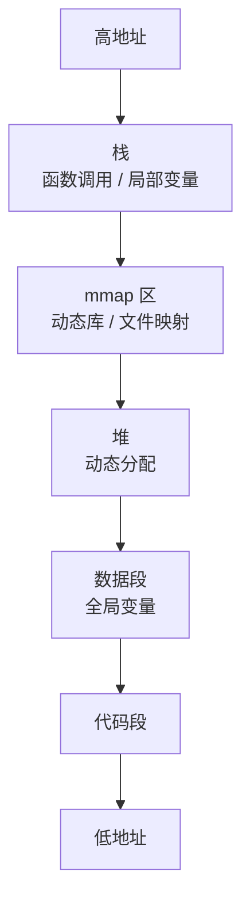

# 内存管理

> 内存题要能讲清栈、堆、分配、碎片、mmap、Page Cache，以及它们如何影响服务性能。

## 一、进程内存布局

典型进程地址空间：



## 二、栈和堆

| 维度 | 栈 | 堆 |
| --- | --- | --- |
| 管理 | 编译器 / runtime 自动管理 | 分配器管理 |
| 生命周期 | 函数调用期间 | 手动或 GC 管理 |
| 分配速度 | 快 | 相对慢 |
| 空间 | 较小 | 较大 |
| 常见问题 | 栈溢出 | 内存泄漏、碎片 |

Go 中变量是否在栈上，取决于逃逸分析。

## 三、内存分配和碎片

内存碎片：

- 内部碎片：分配块大于实际使用。
- 外部碎片：空闲空间不连续。

影响：

- 内存使用率下降。
- 分配变慢。
- RSS 上升。

服务端常见问题：

- 大对象频繁分配。
- 切片扩容保留大底层数组。
- 缓存无上限。
- goroutine 堆积。

## 四、mmap

`mmap` 可以把文件或匿名内存映射到进程地址空间。

用途：

- 文件映射。
- 大块内存分配。
- 共享内存。

好处：

- 访问文件像访问内存。
- 可减少拷贝。
- 适合大文件随机读取。

风险：

- 缺页时仍会触发磁盘 IO。
- 使用不当可能导致内存和 IO 抖动。

## 五、Page Cache

Page Cache 是内核用于缓存文件数据的内存。

```text
应用 read 文件
  -> 先查 Page Cache
  -> 命中直接返回
  -> 未命中从磁盘读取并放入 Page Cache
```

写文件：

```text
write 返回
  -> 数据进入 Page Cache
  -> 后台异步刷盘
```

所以：

> write 成功不代表数据已经落盘，fsync 才会要求刷到稳定存储。

## 六、高频面试题

### 栈和堆有什么区别？

栈用于函数调用和局部变量，生命周期清晰，分配快；堆用于动态分配，生命周期不固定，需要分配器或 GC 管理。

### Page Cache 有什么作用？

缓存文件数据，减少磁盘 IO，提高读写性能。数据库、日志、文件服务都会受 Page Cache 影响。

### mmap 是零拷贝吗？

mmap 可以减少用户态和内核态之间的数据拷贝，但不等于所有场景都完全零拷贝。它仍可能触发缺页和磁盘 IO。

## 七、常见坑

- 以为 free 内存少就是内存不够，忽略 Page Cache。
- write 成功就认为数据落盘。
- 大文件扫描冲刷 Page Cache。
- Go 切片截取导致大数组无法释放。
- 缓存没有上限导致 OOM。

## 八、面试表达

```text
进程内存大致分为代码段、数据段、堆、mmap 区和栈。
栈适合生命周期明确的函数调用，堆适合动态分配但需要分配器或 GC 管理。
文件 IO 很多时候会经过 Page Cache，read 可以命中内存，write 通常先写 Page Cache，fsync 才要求落盘。
所以排查内存和 IO 问题时，要同时看应用堆内存、RSS、Page Cache 和磁盘 IO。
```
