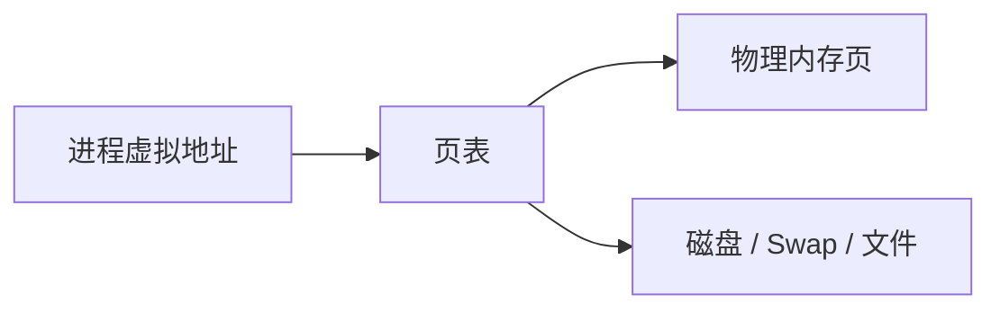
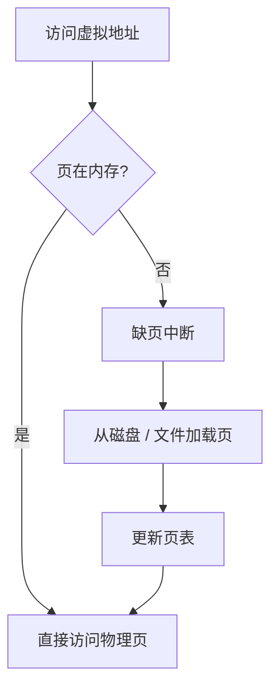

# 虚拟内存

> 虚拟内存让每个进程看到独立连续地址空间，底层通过页表映射到物理内存。

## 一、为什么需要虚拟内存

虚拟内存解决：

- 进程地址空间隔离。
- 简化内存管理。
- 支持按需加载。
- 支持内存映射文件。
- 支持 Swap 扩展。



## 二、页表和分页

内存按页管理，常见页大小 4KB。

页表记录：

```text
虚拟页 -> 物理页
```

如果页不在物理内存，会触发缺页中断。

## 三、TLB

TLB 是页表缓存。

作用：

- 缓存虚拟地址到物理地址的转换结果。
- 减少访问页表的开销。

TLB miss 会增加内存访问成本。

进程切换可能导致 TLB 失效，所以进程切换比线程切换更重。

## 四、缺页中断

缺页流程：



缺页可能是正常的：

- 程序按需加载。
- mmap 文件首次访问。

也可能导致性能问题：

- 大量 page fault。
- Swap in/out。
- 内存不足。

## 五、Swap 和 OOM

Swap：

- 把不常用内存页换出到磁盘。
- 可以缓解内存不足。
- 但磁盘远慢于内存，性能会急剧下降。

OOM：

- 内存不足且无法回收。
- Linux OOM Killer 选择进程杀掉。

服务端建议：

- 监控 RSS、heap、page fault、swap。
- 容器设置合理 memory limit。
- 避免无限缓存和 goroutine 堆积。

## 六、高频面试题

### 虚拟内存和物理内存区别？

虚拟内存是进程看到的地址空间，物理内存是真实 RAM。虚拟地址通过页表映射到物理地址。

### 缺页中断一定是坏事吗？

不一定。按需加载和 mmap 首次访问会产生正常缺页。但频繁缺页、Swap 相关缺页会严重影响性能。

### 为什么进程有独立地址空间？

为了隔离和安全。一个进程不能随便访问另一个进程的内存，除非通过共享内存等机制。

## 七、常见坑

- 容器 OOM 只看系统总内存，不看 cgroup limit。
- 开启 Swap 后服务延迟突然抖动。
- mmap 大文件以为都在内存里。
- 大量进程切换导致 TLB 和缓存失效。
- 只看 Go heap，不看 RSS 和 mmap。

## 八、面试表达

```text
虚拟内存给每个进程提供独立连续的地址空间，底层通过页表映射到物理内存。
TLB 用来缓存地址转换，减少页表访问。
如果访问的页不在内存，会触发缺页中断，可能从磁盘或文件加载。
虚拟内存带来隔离和按需加载，但频繁缺页、Swap 和 OOM 都会造成明显线上问题。
```
