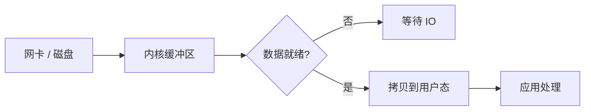
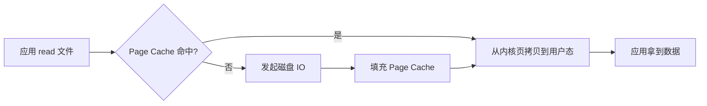
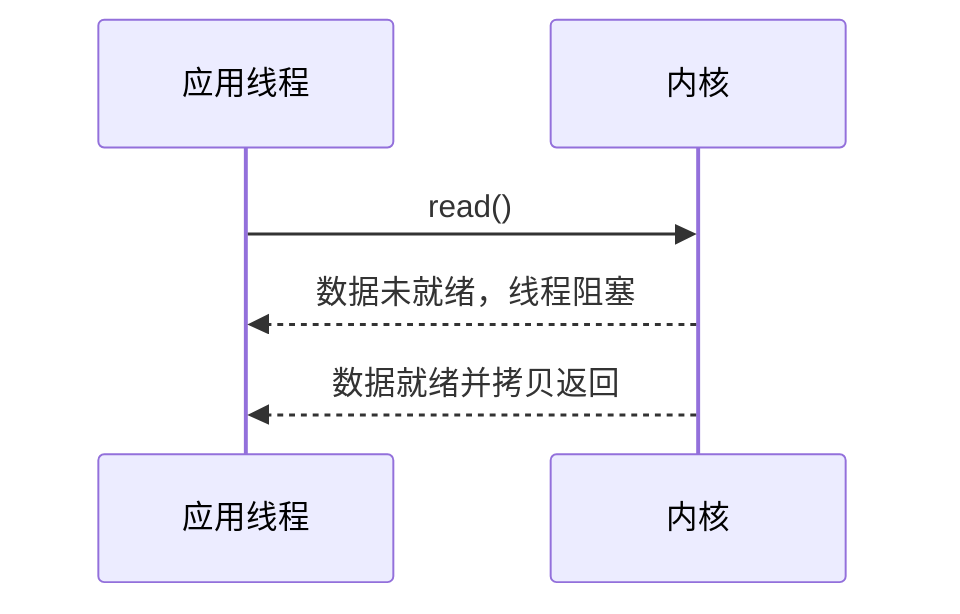
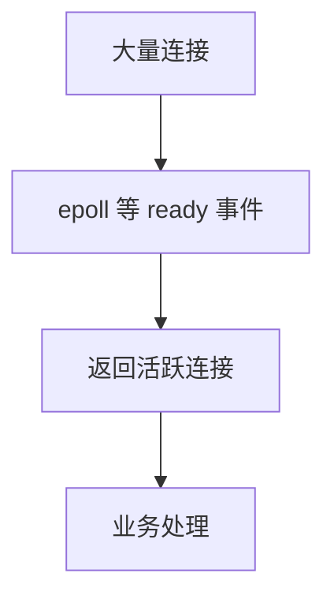

# IO 模型

> IO 模型不是抽象概念，它背后是数量级差异：CPU/内存是 ns 级，网络是 us/ms 级，磁盘是 us/ms 级。服务端性能问题很多都来自“等 IO”。

## 一、先记住数量级

不同硬件、内核、负载下差异很大，下面是面试和排查时常用的经验数量级：

| 操作 | 典型数量级 | 说明 |
| --- | --- | --- |
| CPU L1 cache 访问 | 约 1 ns | 最快，和 CPU 强相关 |
| CPU L2 cache 访问 | 几 ns | 比 L1 慢 |
| CPU L3 cache 访问 | 十几 ns | 跨核共享缓存更慢 |
| 内存访问 | 50~100 ns | 比 cache 慢一个数量级以上 |
| 一次 mutex 无竞争加解锁 | 几十 ns | 有竞争会退化很多 |
| 一次系统调用 | 0.1~1 us | 取决于 syscall 类型和机器 |
| 本机回环网络 RTT | 十几到几十 us | localhost / loopback |
| 同机房网络 RTT | 0.1~1 ms | 和网络、交换机、拥塞有关 |
| 跨地域网络 RTT | 10~100+ ms | 物理距离主导 |
| NVMe SSD 随机读 | 几十到几百 us | 高端盘更低，队列深度影响大 |
| SATA SSD 随机读 | 0.1~1 ms | 常见经验值 |
| 机械硬盘随机寻道 | 5~15 ms | 常说磁盘一次随机 IO 10ms 左右 |
| 机械硬盘顺序读写 | 百 MB/s 级 | 顺序吞吐不错，随机差 |

面试里不用把数字背到很精确，重点是数量级：

```text
内存 ns 级
系统调用 us 级
SSD us~ms 级
机械盘随机 IO ms 级
跨地域网络几十 ms 级
```

这解释了为什么：

- 缓存能显著提升性能。
- 随机 IO 很贵。
- 顺序写比随机写快。
- 跨地域调用不能放在强同步链路。
- 高并发服务要避免大量线程阻塞在 IO 上。

### 这些数字怎么用？

面试时不要只背数字，要能把它换成工程判断。

假设一个接口目标 P99 是 100ms：

```text
1 次跨地域 RPC：可能 30~100ms+
1 次机械盘随机 IO：可能 5~15ms
1 次 SSD 随机读：可能 0.05~1ms
1 次内存访问：通常可以忽略到 ns 级
```

所以一个核心接口如果串行做：

```text
查数据库 3 次
调用外部 RPC 2 次
写日志并强刷盘 1 次
```

它的 P99 很容易被 IO 放大，而不是被 CPU 计算打满。

粗略估算：

```text
机械盘随机 IO 10ms
  -> 单线程串行最多约 100 次/s

SSD 随机读 0.2ms
  -> 单线程串行最多约 5000 次/s

同机房 RPC 1ms
  -> 串行调用 5 次至少吃掉 5ms
```

这不是精确压测结果，但可以帮助你在面试里快速判断：问题大概率在 CPU、网络、磁盘、锁，还是数据库。

## 二、一次 IO 发生了什么

以网络读取为例：

```text
数据到达网卡
  -> DMA 写入内核内存
  -> 内核协议栈处理
  -> 放入 socket receive buffer
  -> 应用调用 read
  -> 数据从内核态拷贝到用户态
```

两个阶段：

1. **等待数据准备好**：网卡、磁盘、内核缓冲区是否有数据。
2. **数据拷贝到用户态**：从内核 buffer 拷贝到用户 buffer。



对文件读也是类似：

```text
磁盘 / Page Cache
  -> 内核 buffer
  -> 用户态 buffer
```

如果命中 Page Cache，可能不需要真正读磁盘；如果没命中，才会等待磁盘 IO。



这也是为什么线上看起来“读文件很快”，不一定代表磁盘快，可能只是 Page Cache 命中了。

## 三、阻塞 IO



特点：

- 调用方阻塞。
- 编程模型简单。
- 一个连接一个线程时，高并发下线程数量会爆炸。

实际影响：

```text
1 万个连接
  -> 如果每个连接一个阻塞线程
  -> 大量线程栈内存
  -> 上下文切换变多
  -> 调度开销和延迟抖动
```

阻塞 IO 不是不能用：

- 后台任务。
- 低并发工具。
- 线程池受控的业务调用。

但高并发网络服务不能简单“一连接一线程”。

## 四、非阻塞 IO

非阻塞 read：

```text
read()
  -> 数据未就绪，立即返回 EAGAIN
  -> 应用稍后再试
```

特点：

- 调用不阻塞。
- 线程可以继续处理其他事。
- 但如果应用自己死循环轮询，会浪费 CPU。

所以非阻塞 IO 通常要配合：

- select。
- poll。
- epoll。
- kqueue。
- IOCP。

面试表达：

> 非阻塞 IO 的价值是避免线程挂死在一个 fd 上，但需要事件通知机制告诉应用什么时候再读。

## 五、同步 IO vs 异步 IO

同步 IO：

- 调用方需要参与等待 IO 完成。
- 阻塞 IO、非阻塞 IO、IO 多路复用通常都属于同步 IO。

异步 IO：

- 应用提交请求后返回。
- 内核完成数据准备和拷贝后通知应用。

关键区别：

```text
非阻塞：问一下有没有数据，没有就返回。
异步：把读取任务交出去，完成后通知我。
```

所以：

> 非阻塞不等于异步。epoll 也不是异步 IO，它是同步 IO 多路复用。

## 六、IO 多路复用和服务端性能

IO 多路复用解决：

```text
少量线程管理大量连接
```

典型模型：

```text
epoll_wait 等待 ready fd
  -> 哪些连接可读/可写
  -> 应用处理这些连接
```

它提升的是连接管理效率，不是让单次磁盘或网络 IO 本身变快。



Go 里网络 IO 看起来像阻塞读写，但 runtime 底层使用 netpoll：

```text
goroutine read
  -> fd 未就绪
  -> goroutine park
  -> netpoll 等事件
  -> ready 后唤醒 goroutine
```

这就是 Go 能用大量 goroutine 管理连接的重要原因。

## 七、零拷贝

传统文件发送：

```text
磁盘
  -> Page Cache
  -> 用户态 buffer
  -> socket buffer
  -> 网卡
```

问题：

- 多次数据拷贝。
- 多次用户态/内核态切换。

零拷贝目标：

- 减少用户态和内核态之间的数据拷贝。
- 减少上下文切换。
- 提高大文件传输吞吐。

常见技术：

- `mmap`
- `sendfile`
- `splice`

适合：

- 静态文件服务。
- 大文件下载。
- Kafka 这类日志系统。
- 网关转发大响应体。

不适合夸大：

- 零拷贝不是“完全没有任何拷贝”。
- 数据可能仍经过 Page Cache、DMA、网卡 buffer。
- 如果业务需要修改内容，仍可能要进用户态处理。

## 八、线上怎么判断是不是 IO 问题

常见现象：

- CPU 使用率不高，但接口很慢。
- goroutine / 线程大量卡在 read、write、fsync、recv、send。
- 数据库慢查询里扫描行数、临时表、回表很多。
- 磁盘 util 很高，await 变大，队列长度升高。
- 网络 RTT 抖动，P99/P999 拉长。

常用判断思路：

| 现象 | 可能原因 | 处理方向 |
| --- | --- | --- |
| CPU 不高，接口慢 | 线程在等 IO | 看网络、磁盘、DB、下游 RPC |
| P50 正常，P99 很高 | IO 抖动、锁等待、队列堆积 | 看慢请求链路和尾延迟 |
| 磁盘 await 高 | 随机 IO 多、刷盘频繁、盘打满 | 减少随机读写、批量、顺序写、扩容 |
| 网络 RTT 高 | 跨机房、拥塞、下游慢 | 就近访问、异步化、超时熔断 |
| write 很快但丢数据 | 只写入 Page Cache，未 fsync | 明确持久化语义 |

排查时常看的指标：

```text
接口：P50 / P95 / P99 / 超时率
应用：线程数、goroutine 数、连接池等待、GC
磁盘：IOPS、吞吐、await、util、队列长度
网络：RTT、重传、连接数、带宽
数据库：慢 SQL、锁等待、Buffer Pool 命中率、redo fsync
```

注意一个很常见的坑：

```text
write() 返回成功
  != 数据已经落到物理磁盘

fsync() / fdatasync() 成功
  才更接近“持久化完成”
```

所以日志、订单、支付这类场景，不能只看 `write` 成功，要明确是否需要强刷盘，以及强刷盘带来的延迟成本。

## 九、实际场景

### 场景 1：为什么缓存能救慢接口？

如果一次请求需要随机读磁盘：

```text
机械盘随机 IO：约 5~15 ms
SSD 随机读：几十到几百 us
内存访问：几十到一百 ns
```

即使命中 Redis，也通常是网络 + 内存访问，远低于随机磁盘读取。

所以热点数据放缓存，本质是把慢 IO 变成快 IO，并减少数据库压力。

但缓存不是免费午餐：

- 热点 key 会打爆单节点。
- 缓存穿透会把请求打回数据库。
- 缓存重建如果没有互斥，可能造成击穿。
- 强一致读不能盲目依赖缓存。

### 场景 2：为什么日志系统喜欢顺序写？

随机写会造成磁盘寻址或 SSD 写放大；顺序写可以充分利用磁盘吞吐。

所以：

- MySQL redo log 顺序写。
- Kafka append-only log。
- WAL 都偏顺序追加。

这是用日志把随机更新转成顺序写的典型思路。

面试可以这样说：

> 数据库和消息队列很多设计都在做一件事：把随机写转成顺序追加，再通过后台合并、索引、Page Cache 来摊平成本。

### 场景 3：为什么跨地域 RPC 不能放强同步链路？

同机房 RTT 可能是 0.1~1 ms，跨地域可能是几十 ms 甚至更高。

如果一个核心接口串行调用 3 个跨地域 RPC：

```text
总延迟至少几十到上百 ms 起步
```

所以跨地域链路通常要：

- 异步化。
- 就近访问。
- 本地缓存。
- 数据复制。
- 最终一致。

### 场景 4：为什么高并发连接不能一连接一线程？

线程会占用栈内存，线程切换也有调度开销。

大量连接大部分时间在等 IO，如果每个连接一个线程：

- 内存占用高。
- 上下文切换多。
- CPU cache 失效。
- P99 抖动。

所以高并发网络服务通常使用：

- 非阻塞 IO。
- epoll / kqueue。
- Reactor。
- Go netpoll + goroutine。

### 场景 5：一次慢 SQL 为什么会拖垮应用？

慢 SQL 不只是数据库慢，它会占住应用侧连接池。

```text
慢 SQL 执行 5s
连接池 100 个连接
短时间 100 个请求都卡住
  -> 新请求拿不到连接
  -> 应用超时
  -> 重试放大流量
  -> 数据库更慢
```

所以慢 SQL 的影响链路通常是：


处理方向：

- 给 SQL 加合适索引，减少扫描和回表。
- 控制单次查询返回行数。
- 设置合理超时，避免无限等待。
- 读写拆分、缓存、异步化。
- 限制重试，保证幂等。

## 十、高频面试题

### 阻塞和非阻塞区别？

阻塞 IO 在数据未就绪时线程挂起；非阻塞 IO 在数据未就绪时立即返回错误码，由应用稍后重试。

### 同步和异步区别？

同步 IO 需要调用方参与等待 IO 完成；异步 IO 是提交请求后由内核完成并通知调用方。

### 非阻塞 IO 为什么还需要 epoll？

单纯非阻塞需要应用不断轮询很多 fd，浪费 CPU。epoll 提供事件通知，告诉应用哪些 fd ready。

### epoll 会让磁盘 IO 变快吗？

不会。epoll 解决的是大量 fd 的事件等待和通知问题，不改变磁盘本身延迟。

### 为什么一次磁盘随机 IO 对接口延迟影响很大？

因为机械盘随机 IO 是 ms 级，SSD 也是 us~ms 级，而内存是 ns 级。一次随机 IO 就可能吃掉接口延迟预算。

### write 成功是不是代表数据落盘？

不一定。很多时候只是写入内核 Page Cache，真正落盘可能由后台刷脏页完成。如果业务要求强持久化，需要关注 `fsync` / `fdatasync` 语义。

## 十一、常见坑

- 把非阻塞 IO 等同于异步 IO。
- 以为 epoll 让单次 IO 更快。
- 高并发连接用一个线程阻塞读写。
- 忽略系统调用和上下文切换成本。
- 忽略内核态到用户态的数据拷贝成本。
- 把 write 成功等同于数据落盘。
- 以为零拷贝完全没有任何拷贝。
- 只看平均延迟，不看 P99/P999。
- 连接池没有超时，慢 IO 把线程和连接全部占住。

## 十二、面试表达

```text
IO 性能要先看数量级：内存是 ns 级，系统调用是 us 级，SSD 随机读通常是几十到几百 us，机械盘随机 IO 常见是 5~15ms。
一次 IO 通常分为等待数据就绪和数据从内核态拷贝到用户态两个阶段。
阻塞 IO 会让线程等待，非阻塞 IO 会立即返回，但需要 epoll 这类机制通知哪些 fd ready。
epoll 提升的是大量连接的事件管理效率，不会让磁盘本身变快。
零拷贝通过减少用户态/内核态拷贝和上下文切换来提升大文件传输效率。
线上判断 IO 问题时，我会看接口 P99、线程阻塞点、磁盘 await/util、网络 RTT、数据库慢 SQL 和连接池等待。
```
