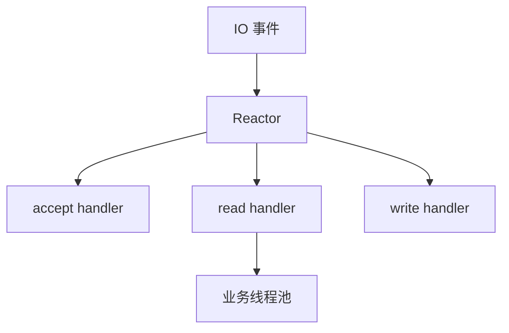

# IO 多路复用

> IO 多路复用让一个线程可以管理大量连接，是 Nginx、Redis、Go netpoll 等高并发网络服务的基础。

## 一、为什么需要 IO 多路复用

阻塞 IO 模型：

```text
一个连接一个线程
```

连接数多时：

- 线程数爆炸。
- 上下文切换高。
- 内存占用高。

IO 多路复用：

```text
一个线程监听多个 fd
哪个 fd ready，就处理哪个
```

## 二、select

特点：

- 用 fd_set 表示监听集合。
- 每次调用都要把 fd 集合从用户态拷贝到内核态。
- 返回后应用需要遍历所有 fd。
- 有 fd 数量限制。

缺点：

- fd 数量限制。
- 每次都要全量拷贝。
- 每次都要全量扫描。

## 三、poll

poll 改进：

- 用数组保存 fd。
- 没有 select 固定 fd_set 限制。

但仍然：

- 每次全量拷贝。
- 每次全量扫描。

## 四、epoll

epoll 的关键：

- `epoll_create` 创建实例。
- `epoll_ctl` 注册 fd。
- `epoll_wait` 等待 ready 事件。

优势：

- 不需要每次传全量 fd。
- 返回 ready fd 列表。
- 适合大量连接、少量活跃的场景。


## 五、LT 和 ET

LT：Level Trigger，水平触发。

- 只要 fd 还有数据没读完，就会一直通知。
- 编程简单。

ET：Edge Trigger，边缘触发。

- 状态变化时通知一次。
- 必须一次读到 EAGAIN。
- 性能更好，但更容易写错。

## 六、Reactor 模型

Reactor：



常见模型：

- 单 Reactor 单线程。
- 单 Reactor 多线程。
- 主从 Reactor 多线程。

## 七、Go netpoll

Go 网络库底层会使用操作系统的 IO 多路复用能力。

大致：

- goroutine 发起网络 IO。
- runtime 把 fd 注册到 netpoll。
- goroutine park。
- fd ready 后 runtime 唤醒 goroutine。

所以 Go 可以用大量 goroutine 写同步风格代码，同时底层通过 netpoll 避免大量线程阻塞。

## 八、高频面试题

### select、poll、epoll 区别？

select 有 fd 数量限制，每次全量拷贝和扫描；poll 取消了固定数量限制，但仍全量扫描；epoll 通过注册机制和 ready 列表避免每次全量扫描，更适合高并发连接。

### epoll 为什么高效？

因为 fd 注册一次，后续等待 ready 事件；返回的是就绪 fd，而不是让应用扫描全部 fd。

### epoll 一定比 select 快吗？

不一定。fd 很少时差别不大。epoll 优势主要在大量连接、少量活跃的场景。

## 九、常见坑

- 认为 epoll 让 IO 本身更快，实际它减少的是等待和扫描成本。
- ET 模式没有读到 EAGAIN，导致事件丢失。
- 只讲 epoll，不讲应用层业务处理仍可能阻塞。
- 高并发连接没有限流，ready 事件过多也会打满 CPU。

## 十、面试表达

```text
IO 多路复用解决的是一个线程管理多个连接的问题。
select 和 poll 都需要每次传入并扫描 fd 集合，连接多时成本高。
epoll 把 fd 注册到内核，epoll_wait 返回 ready fd，避免全量扫描，所以适合大量连接少量活跃的服务。
Go 的网络模型底层也会用 netpoll，把网络 IO ready 后再唤醒 goroutine。
```
