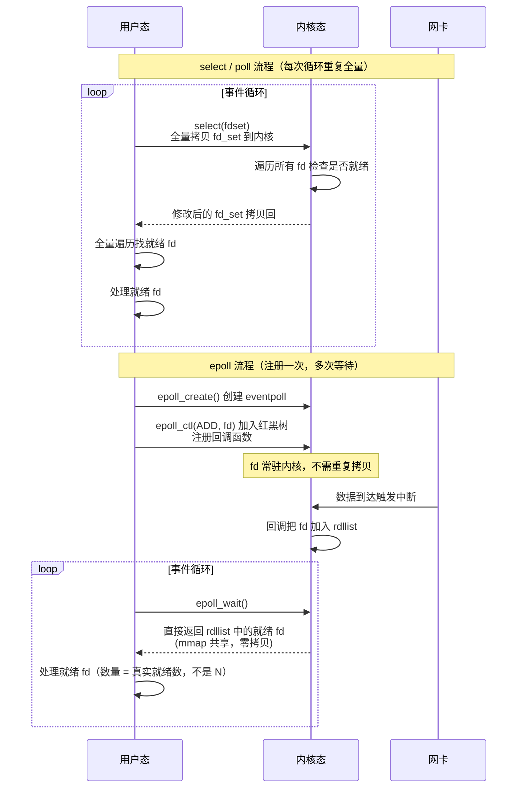
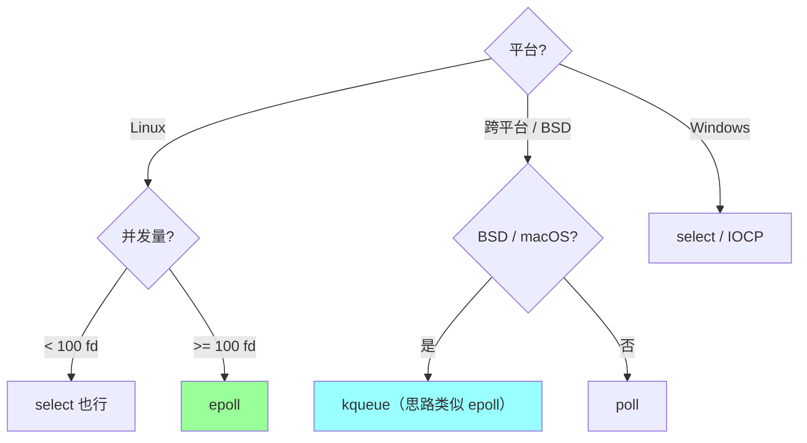
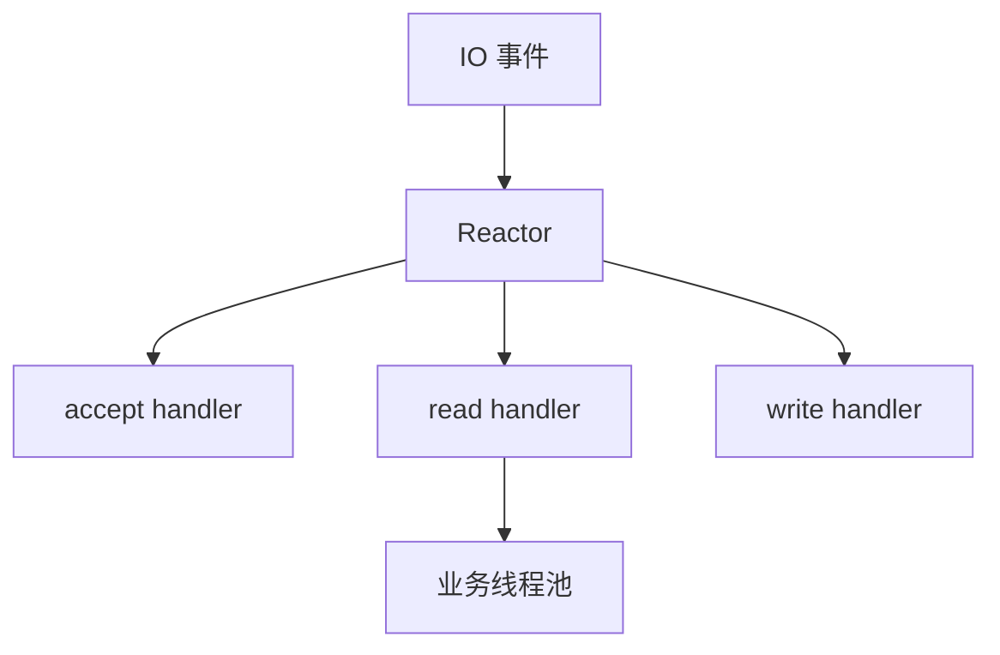

# IO 多路复用

> IO 多路复用让一个线程可以管理大量连接，是 Nginx、Redis、Go netpoll 等高并发网络服务的基础。

## 〇.5 多概念对比：select vs poll vs epoll（D 模板）

### 一句话定位

| 机制 | 一句话定位 |
| --- | --- |
| **select**（1983）| **bitmap 记 fd**，1024 上限 + 全量拷贝 + 全量遍历，**跨平台兼容**（Linux/BSD/Windows） |
| **poll**（1986）| **链表代替 bitmap**，无 fd 上限，但**仍全量拷贝 + 全量遍历** |
| **epoll**（Linux 2.5.44+）| **红黑树注册 + 就绪链表 + 回调**，O(1) 找就绪 fd，**Linux 主流** |

### 多维度对比（15 维度，必背）

| 维度 | select | poll | epoll |
| --- | --- | --- | --- |
| **诞生年份** | 1983（POSIX）| 1986 | 2002（Linux 2.5.44）|
| **数据结构（用户态）** | fd_set（bitmap）| pollfd 数组（链表）| epoll_event 数组 |
| **数据结构（内核态）** | bitmap 拷贝 | 链表拷贝 | **红黑树（注册）+ 就绪链表（rdllist）** |
| **fd 上限** | **1024**（FD_SETSIZE，编译期定）| 无上限 | 无上限（受 /proc/sys/fs/nr_open）|
| **拷贝方式** | 每次 epoll_wait 全量拷贝 fd_set | 每次全量拷贝 pollfd 数组 | **注册一次，常驻内核**（mmap 共享）|
| **查找就绪 fd 复杂度** | **O(N)** 遍历 | **O(N)** 遍历 | **O(1)** 直接读 rdllist |
| **就绪通知机制** | 内核遍历后修改 bitmap | 内核遍历后修改 pollfd.revents | **回调机制**（中断触发） |
| **触发模式** | LT（水平触发）| LT | **LT 默认 + ET 可选**（边缘触发，高性能）|
| **跨平台** | ✅ Linux / BSD / macOS / Windows | ✅ Linux / Unix | ❌ **仅 Linux**（BSD 用 kqueue）|
| **API 函数** | select() | poll() | epoll_create / epoll_ctl / epoll_wait |
| **性能（10w 连接）** | 毫秒级 | 毫秒级 | **微秒级** |
| **CPU 消耗** | 高（全量遍历）| 高 | 低 |
| **内存共享** | 无 | 无 | **mmap 共享 rdllist** |
| **典型用户** | 旧版本 / 跨平台库 | 中等并发 | **Nginx / Redis / Go netpoll / Node.js / Java NIO** |
| **代码复杂度** | 简单 | 简单 | LT 简单 / ET 复杂（必须循环 read 到 EAGAIN）|

### 协作时序对比（监听 N 个 fd 的事件循环）



### 职责分层 / 内部结构

```
select 内部:
  fd_set { uint8_t[1024/8] }  // bitmap
  每次 select(): 用户 → 内核 全量拷贝 → 内核全量遍历 → 拷贝回 → 用户全量遍历

poll 内部:
  pollfd { fd, events, revents }
  pollfd[] array
  每次 poll(): 同 select 但用链表，无 1024 限制

epoll 内部:
  eventpoll {
      rb_root   rbr;        // 红黑树（注册 fd）
      list_head rdllist;    // 就绪链表
      wait_queue wq;        // 等待队列
  }

  注册 (epoll_ctl ADD):
    红黑树插入 fd
    注册回调 ep_poll_callback

  数据到达:
    网卡 → 中断 → 内核处理
    → 调用 ep_poll_callback
    → fd 加入 rdllist

  等待 (epoll_wait):
    检查 rdllist 是否非空
    非空 → mmap 拷贝就绪事件 → 返回
    空 → wq 挂起进程 → 唤醒
```

### 缺一不可分析

| 假设 | 后果 |
| --- | --- |
| **没 select** | 旧应用 / 跨平台库失去标准 IO 多路复用接口 |
| **没 poll** | select 的 1024 限制无法突破（不重编译内核）|
| **没 epoll** | Linux 高并发服务（Nginx / Redis）退化 → 万级以上连接性能崩 |
| **没 LT 模式** | 边界条件下数据可能"丢"（ET 必须 read 到 EAGAIN）|
| **没 ET 模式** | 极致性能场景（Nginx）无法发挥 |

### LT vs ET 深度对比（epoll 内部）

| 维度 | LT（水平触发，默认）| ET（边缘触发）|
| --- | --- | --- |
| **触发条件** | fd 可读 → 每次 epoll_wait 都返回 | fd 状态变化时**只触发一次** |
| **编程复杂度** | 简单（不必读完）| **复杂**（必须循环 read 到 EAGAIN）|
| **效率** | 略低（同事件多次唤醒）| **高**（不重复唤醒）|
| **漏读后果** | 下次 epoll_wait 还会返回 → 不丢 | **下次不返回 → 漏读数据丢** |
| **业内使用** | Redis（简单可靠）| Nginx / Go netpoll（极致性能）|

```c
// LT 模式正确用法（简单）
n = read(fd, buf, len);
if (n > 0) process(buf, n);

// ET 模式正确用法（必须循环）
while (1) {
    n = read(fd, buf, len);
    if (n == -1 && errno == EAGAIN) break;  // 读完
    if (n > 0) process(buf, n);
}
```

### 性能数据（生产参考）

```
监听 10 万连接，1000 个就绪:

select:
  - 用户 → 内核 拷贝 10w fd_set = 12.5 KB
  - 内核遍历 10w 个 fd
  - 用户遍历 10w 个 fd 找就绪
  - 单次 epoll_wait 等价: 1-10 ms

poll:
  - 同 select 但无 1024 限制
  - 单次 ~1-10 ms

epoll:
  - 注册一次（毫秒级）
  - 后续 epoll_wait: O(1) 直接读 rdllist
  - 单次 ~微秒级
  - → 10w 连接和 100 连接性能几乎一样

差距: epoll 比 select 快 100-1000x（高并发场景）
```

### 怎么选（决策树）



**实战推荐**：

| 场景 | 推荐 |
| --- | --- |
| Linux 高并发服务（>1k 连接）| **epoll** |
| 跨平台库 / 学术研究 | select / poll |
| 极致性能（Nginx 级别）| **epoll ET** |
| 简单可靠（Redis 级别）| **epoll LT** |
| BSD / macOS | **kqueue**（Go runtime 自动选用）|

### Reactor 模式（epoll 的应用层封装）

```
单 Reactor 单线程（Redis 模式）:
  一个线程跑 epoll_wait + 处理 + 响应
  优: 简单，无锁
  缺: 单核瓶颈

单 Reactor 多线程:
  主线程 epoll_wait + accept
  Worker 线程池处理业务
  优: 多核
  缺: 主线程仍是瓶颈

多 Reactor 多线程（Nginx / Netty 标准）:
  主 Reactor: accept 连接
  从 Reactor 池: 各自 epoll_wait + 处理
  优: 充分利用多核
  → 最广泛的高性能架构
```

### 反模式（生产不要踩）

```
❌ Linux 上用 select 处理高并发 → 1024 上限 + 性能差
❌ epoll ET 模式但只 read 一次 → 漏读数据丢
❌ epoll fd 注册但忘记 epoll_ctl DEL → 内存泄漏（红黑树越来越大）
❌ epoll_wait 不设超时 → 没事件时永久阻塞
❌ 在多线程中共享 epoll_fd 但不同步 → 数据竞争
```

### 一句话总结（D 模板专属）

> select → poll → epoll 三代演进的核心是 **"从 O(N) 拷贝 + 遍历到 O(1) 回调"**：
> select 有 1024 上限 + 全量拷贝 + 全量遍历 → poll 解决上限但仍全量 → epoll 用**红黑树常驻 + 就绪链表 + 回调机制**实现 O(1)。
> **epoll 高效的根源**：红黑树常驻内核（无重复拷贝）+ 中断回调（无遍历）+ mmap 共享（无拷贝）。
> **缺一不可**：select 跨平台兼容、poll 无 fd 上限、epoll 高性能、LT 简单、ET 极致。
> **业内现状**：Linux 服务必选 epoll（Nginx / Redis / Go netpoll / Java NIO），BSD 用 kqueue（思路类似）。

---

## 〇、核心提炼（5 段式）

### 核心机制（4 条必背）

1. **select**（最老）- bitmap 标记 fd，每次调用全量拷贝 + 全量遍历，**1024 fd 上限**
2. **poll**（select 改进）- 链表代替 bitmap，**无 fd 上限**，但仍是全量拷贝 + 全量遍历
3. **epoll**（Linux 主流）- 红黑树管理 fd + 就绪链表 + 回调机制，**只通知就绪 fd**，O(1) 复杂度
4. **LT vs ET** - LT（水平触发）默认易用，ET（边缘触发）只通知一次必须一次读尽（Nginx / Redis 用 ET）

### 核心本质（必懂）

> IO 多路复用的本质是 **"一个线程监听多个 fd 的事件"**：
>
> - **解决 C10K 问题**：一个 OS 线程管理几万到几百万 TCP 连接（vs 每连接一个线程的内核开销）
> - **事件驱动**：哪个 fd 有事件 → 哪个被处理（不需要阻塞等待单个 fd）
> - **三者演进解决核心问题**：
>   - select → 有 fd 上限（1024）+ 全量遍历
>   - poll → 解决 fd 上限，仍全量遍历
>   - epoll → 红黑树注册 + 就绪链表 + 回调，**O(1) 找就绪 fd**
>
> **关键事实**：
> - **epoll 不是只能在 Linux**：BSD 用 kqueue（思路类似），Solaris 用 evport
> - **epoll 是 LT 默认 / ET 高性能**：但 ET 编程复杂（必须循环 read 直到 EAGAIN）
> - **不解决"慢系统调用"**：epoll 只解决"什么时候该读"，不解决"读得快"
> - **Reactor 模式**：epoll + 事件分发 + 处理器 = 高并发网络服务通用架构
>
> **性能差距**：
> - select / poll 监听 10w 连接：O(N) 遍历，单次 ms 级
> - epoll 监听 10w 连接：O(1) 就绪链表，单次 us 级

### 完整流程（面试必背）

```
epoll 完整流程（Linux）:

1. epoll_create(size):
   - 内核创建 eventpoll 结构
   - 返回 epfd（epoll 文件描述符）
   - eventpoll 包含:
     - rb_tree（红黑树）: 管理所有注册的 fd
     - rdllist（就绪链表）: 当前就绪的 fd

2. epoll_ctl(epfd, op, fd, event):
   - op = EPOLL_CTL_ADD: 把 fd 加入红黑树
   - op = EPOLL_CTL_MOD: 修改监听事件
   - op = EPOLL_CTL_DEL: 从红黑树删除
   - 注册时：内核为该 fd 注册回调函数

3. 数据到达时（内核中断）:
   - 网卡收到数据 → 中断
   - 内核处理中断 → 唤醒等待该 fd 的进程
   - 同时把 fd 加入 eventpoll.rdllist（就绪链表）
   → 回调机制！不需要遍历

4. epoll_wait(epfd, events, maxevents, timeout):
   - 检查 rdllist 是否非空
   - 非空 → 立即返回就绪 fd 列表
   - 空 → 阻塞等待（直到事件触发或超时）
   - 关键: 只返回"就绪的 fd"，不返回"所有注册的 fd"
   → O(1) 找就绪 fd

5. 用户态处理:
   - 遍历 events 数组
   - 对每个就绪 fd 调用对应的 handler

select 流程对比（低效原因）:
  1. 用户传入 fd_set（bitmap）到内核
  2. 内核全量遍历检查每个 fd 是否就绪
  3. 修改 fd_set 标记就绪的
  4. 拷贝回用户态
  5. 用户全量遍历 fd_set 找就绪的

  问题:
  - 每次都全量拷贝（用户↔内核）
  - 每次都全量遍历（无论有多少就绪）
  - fd 上限 1024（FD_SETSIZE 编译时定）

LT vs ET:
  LT（水平触发，默认）:
    fd 可读 → epoll_wait 一直返回（每次都触发）
    简单，但有就绪事件每次都返回
    
  ET（边缘触发）:
    fd 状态变化时只触发一次
    必须循环 read 直到 EAGAIN（读完所有数据）
    否则数据丢失（下次 epoll_wait 不再返回）
    高性能，但编程复杂

Reactor 模式（epoll 应用）:
  单 Reactor 单线程: Redis 用这个
  单 Reactor 多线程: 主线程 accept + 工作线程处理 IO
  多 Reactor 多线程（主从）: Nginx / Netty 标准模式
    - 主 Reactor: accept 连接
    - 从 Reactor: 处理 IO
```

### 4 条核心机制 - 逐点讲透

#### 1. select（最老，有限制）

```
特点:
  - bitmap（fd_set）表示 fd 集合
  - 用户传入 → 内核遍历 → 修改 bitmap → 拷贝回
  - 用户再遍历 bitmap 找就绪

3 大问题:
  1. fd 上限 1024（FD_SETSIZE 编译时定，改要重编译）
  2. 每次都全量拷贝（用户↔内核）
  3. 每次都全量遍历（O(N) 找就绪）

适用:
  - 跨平台需求（Windows / Unix / Mac 都支持）
  - fd 少（< 100）+ 简单需求
  - 几乎不在 Linux 高性能服务用
```

#### 2. poll（select 改进）

```
改进:
  - 用 pollfd 数组代替 bitmap
  - 无 fd 上限（理论上）
  - 每个 fd 单独的 events 字段（更灵活）

仍存在的问题:
  - 全量拷贝（用户↔内核）
  - 全量遍历（O(N) 找就绪）

适用:
  - fd 数量多但中等并发
  - 跨平台（poll 比 select 通用性差一些）
```

#### 3. epoll（Linux 主流）

```
3 个核心函数:
  epoll_create: 创建 eventpoll 内核结构
  epoll_ctl:    增删改 fd
  epoll_wait:   等待事件

内核数据结构:
  eventpoll
  ├── rb_tree (红黑树): 管理所有注册 fd
  └── rdllist (双向链表): 就绪 fd

回调机制（核心优势）:
  注册 fd 时 → 内核为该 fd 安装回调
  数据到达 → 中断 → 回调把 fd 加入 rdllist
  epoll_wait 直接返回 rdllist
  → O(1) 找就绪

vs select / poll:
  ✓ 没有 fd 上限
  ✓ 无需全量拷贝（红黑树常驻内核，注册一次）
  ✓ O(1) 找就绪（不遍历）
  ✓ mmap 共享内存优化（用户态和内核态共享 rdllist，避免拷贝）

性能:
  10w 连接监听:
  - select: O(N) = 10w 次遍历，毫秒级
  - poll:   同上
  - epoll:  O(1) 直接读 rdllist，微秒级
  → 高并发场景必须 epoll
```

#### 4. LT vs ET（触发模式）

```
LT (Level-Triggered，水平触发，默认):
  规则: fd 可读 → epoll_wait 一直返回该 fd
  
  例子: socket 收到 100 字节
  - 第一次 epoll_wait → 返回该 fd（可读）
  - 读 50 字节
  - 第二次 epoll_wait → 还返回该 fd（仍有 50 字节）
  
  优点: 编程简单，不会"漏"事件
  缺点: 同一事件多次唤醒，效率略低

ET (Edge-Triggered，边缘触发):
  规则: fd 状态变化时只触发一次
  
  例子: socket 收到 100 字节
  - 第一次 epoll_wait → 返回该 fd
  - 读 50 字节
  - 第二次 epoll_wait → 不返回该 fd！必须等下次有新数据
  - 没读完的 50 字节怎么办？业务侧应该已经处理（缓冲）
  
  必须循环读直到 EAGAIN:
    for {
        n, err := read(fd)
        if err == EAGAIN { break }  // 全部读完
        process(buf[:n])
    }
  
  优点: 效率高（同事件只通知一次）
  缺点: 编程复杂，漏读会"丢"事件

业内选择:
  - Nginx: ET（追求极致性能）
  - Redis: LT（简单可靠）
  - Go netpoll: ET（Go runtime 封装好了）
```

### 一句话总结

> IO 多路复用的核心是：**select（bitmap，1024 上限，全量遍历）→ poll（数组，无上限，仍全量）→ epoll（红黑树 + 就绪链表 + 回调，O(1)）+ LT/ET 两种触发模式**，
> 本质是**一个线程监听多个 fd 的事件**：解决 C10K 问题，让单线程管理 10w+ 连接。
> **epoll 高效的根源**：红黑树常驻内核（无重复拷贝）+ 回调机制（无遍历）+ mmap（无拷贝）。
> **Nginx / Redis / Go netpoll** 都是基于 epoll + Reactor 模式：单线程事件驱动 → 高并发网络服务的通用架构。

---

## 一、为什么需要 IO 多路复用

阻塞 IO 模型：

```text
一个连接一个线程
```

连接数多时：

- 线程数爆炸。
- 上下文切换高。
- 内存占用高。

IO 多路复用：

```text
一个线程监听多个 fd
哪个 fd ready，就处理哪个
```

## 二、select

特点：

- 用 fd_set 表示监听集合。
- 每次调用都要把 fd 集合从用户态拷贝到内核态。
- 返回后应用需要遍历所有 fd。
- 有 fd 数量限制。

缺点：

- fd 数量限制。
- 每次都要全量拷贝。
- 每次都要全量扫描。

## 三、poll

poll 改进：

- 用数组保存 fd。
- 没有 select 固定 fd_set 限制。

但仍然：

- 每次全量拷贝。
- 每次全量扫描。

## 四、epoll

epoll 的关键：

- `epoll_create` 创建实例。
- `epoll_ctl` 注册 fd。
- `epoll_wait` 等待 ready 事件。

优势：

- 不需要每次传全量 fd。
- 返回 ready fd 列表。
- 适合大量连接、少量活跃的场景。


## 五、LT 和 ET

LT：Level Trigger，水平触发。

- 只要 fd 还有数据没读完，就会一直通知。
- 编程简单。

ET：Edge Trigger，边缘触发。

- 状态变化时通知一次。
- 必须一次读到 EAGAIN。
- 性能更好，但更容易写错。

## 六、Reactor 模型

Reactor：



常见模型：

- 单 Reactor 单线程。
- 单 Reactor 多线程。
- 主从 Reactor 多线程。

## 七、Go netpoll

Go 网络库底层会使用操作系统的 IO 多路复用能力。

大致：

- goroutine 发起网络 IO。
- runtime 把 fd 注册到 netpoll。
- goroutine park。
- fd ready 后 runtime 唤醒 goroutine。

所以 Go 可以用大量 goroutine 写同步风格代码，同时底层通过 netpoll 避免大量线程阻塞。

## 八、高频面试题

### select、poll、epoll 区别？

select 有 fd 数量限制，每次全量拷贝和扫描；poll 取消了固定数量限制，但仍全量扫描；epoll 通过注册机制和 ready 列表避免每次全量扫描，更适合高并发连接。

### epoll 为什么高效？

因为 fd 注册一次，后续等待 ready 事件；返回的是就绪 fd，而不是让应用扫描全部 fd。

### epoll 一定比 select 快吗？

不一定。fd 很少时差别不大。epoll 优势主要在大量连接、少量活跃的场景。

## 九、常见坑

- 认为 epoll 让 IO 本身更快，实际它减少的是等待和扫描成本。
- ET 模式没有读到 EAGAIN，导致事件丢失。
- 只讲 epoll，不讲应用层业务处理仍可能阻塞。
- 高并发连接没有限流，ready 事件过多也会打满 CPU。

## 十、面试表达

```text
IO 多路复用解决的是一个线程管理多个连接的问题。
select 和 poll 都需要每次传入并扫描 fd 集合，连接多时成本高。
epoll 把 fd 注册到内核，epoll_wait 返回 ready fd，避免全量扫描，所以适合大量连接少量活跃的服务。
Go 的网络模型底层也会用 netpoll，把网络 IO ready 后再唤醒 goroutine。
```
