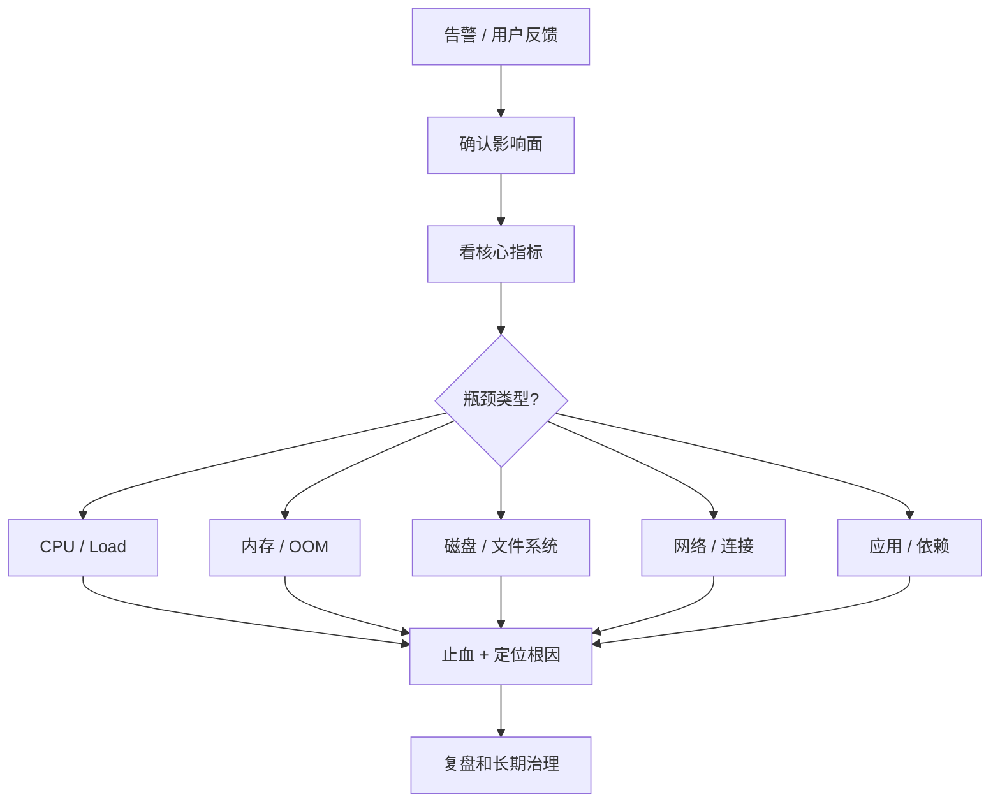

# Linux 线上排查套路

> 线上排查不是背命令，而是先判断瓶颈类型：CPU、内存、IO、网络、锁、下游依赖，随后用指标和证据收敛。

## 一、排查总流程



先问四个问题：

1. **影响谁**：单实例、单机房、全链路？
2. **从什么时候开始**：是否和发布、流量、配置、依赖变更相关？
3. **核心指标怎么变**：QPS、错误率、P99、CPU、内存、IO、连接数？
4. **先止血还是先定位**：线上优先恢复服务。

## 二、常用命令地图

| 问题 | 常用命令 | 看什么 |
| --- | --- | --- |
| 系统概览 | `uptime`、`top`、`vmstat 1` | load、CPU、run queue、上下文切换 |
| CPU 高 | `top -H`、`pidstat -u 1`、`perf top` | 哪个进程/线程、用户态还是内核态 |
| 内存高 | `free -h`、`pidstat -r 1`、`pmap` | RSS、Swap、Page Cache、内存增长 |
| 磁盘慢 | `iostat -x 1`、`iotop`、`df -h` | util、await、队列、空间 |
| 网络慢 | `ss -antp`、`sar -n TCP,DEV 1` | 连接状态、重传、带宽 |
| 文件句柄 | `lsof -p`、`ulimit -n` | fd 泄漏、连接泄漏 |
| 系统调用 | `strace -p` | 卡在 read/write/futex/connect |
| 应用画像 | `pprof`、日志、trace | 慢函数、阻塞点、依赖耗时 |

## 三、先看系统是否饱和

```text
uptime
top
vmstat 1
iostat -x 1
ss -s
```

核心判断：

- CPU 是否打满？
- load 是否明显大于 CPU 核数？
- 内存是否被打满，是否开始 Swap？
- 磁盘 await/util 是否很高？
- TCP 连接数、TIME_WAIT、CLOSE_WAIT 是否异常？

常见误区：

- load 高不一定是 CPU 高，也可能是大量任务在不可中断 IO 等待。
- free 显示内存少不一定有问题，Linux 会用空闲内存做 Page Cache。
- CPU 不高但接口慢，常见是 IO、锁、连接池或下游依赖。

## 四、定位到进程和线程

常用路径：

```text
top
  -> 找到高 CPU / 高内存进程
top -H -p <pid>
  -> 找到具体线程
应用工具
  -> Go 用 pprof，Java 用 jstack/jmap
```

Go 服务排查时重点看：

- goroutine 数是否暴涨。
- HTTP client / DB client 是否设置超时。
- 连接池是否被打满。
- pprof 里是否大量 goroutine 卡在 `net/http`、`database/sql`、`sync.Mutex`、`runtime.gopark`。

## 五、典型线上场景

### 场景 1：CPU 不高，但接口大量超时

可能原因：

- 数据库慢 SQL 占满连接池。
- 下游 RPC 慢，goroutine 全在等网络。
- 磁盘 IO 高，日志或本地文件写阻塞。
- 锁竞争严重，大量请求排队。

排查方向：

```text
接口 P99
  -> trace 看慢在哪一段
  -> 连接池等待时间
  -> DB 慢 SQL
  -> 下游 RPC 超时率
  -> goroutine dump
```

### 场景 2：服务突然 OOM

可能原因：

- 代码内存泄漏。
- 大对象或批量查询一次性加载太多。
- goroutine 泄漏。
- 容器 memory limit 设置过小。
- Page Cache / mmap / off-heap 被忽略。

排查方向：

```text
dmesg / 容器事件
  -> 看 OOM killer 记录
pprof heap
  -> 看对象分布
goroutine dump
  -> 看是否泄漏
RSS vs heap
  -> 判断是否 Go heap 之外的内存
```

### 场景 3：磁盘满导致服务异常

常见表现：

- 日志写失败。
- MySQL / Kafka 写入失败。
- 临时文件无法创建。
- 进程还能运行，但很多操作报错。

处理：

- 先确认大文件来源：日志、core dump、临时文件、未释放删除文件。
- 用 `lsof | grep deleted` 找被删除但仍占用的文件。
- 长期治理：日志切割、保留周期、磁盘告警、容量预算。

## 六、止血优先级

线上事故处理顺序：

1. **限流/降级**：先保护核心链路。
2. **扩容/切流**：把流量转走或增加实例。
3. **回滚**：如果和发布强相关，优先回滚。
4. **隔离依赖**：断开慢下游，避免拖垮主链路。
5. **根因定位**：在服务恢复后继续分析。

## 七、面试表达

```text
线上排查我一般先看影响面和时间线，然后看四类资源：CPU、内存、IO、网络。
如果 CPU 高，我会定位到进程、线程和热点函数；如果 CPU 不高但延迟高，我会重点看 IO、锁、连接池和下游依赖。
排查时不会只看平均值，会看 P95/P99、错误率、连接池等待、磁盘 await、网络重传等指标。
线上处理上先止血，比如限流、降级、扩容、回滚，再做根因分析和长期治理。
```
