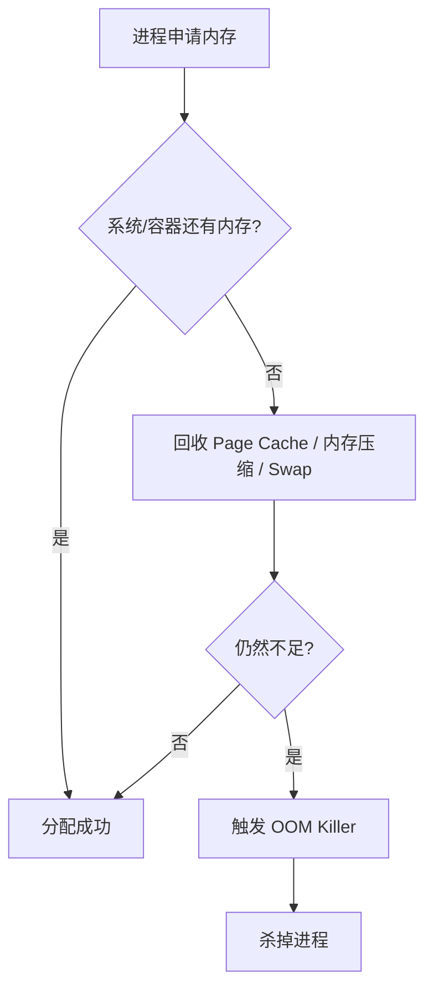

# 内存、OOM 与泄漏排查

> 内存问题要区分虚拟内存、物理内存、RSS、Page Cache、Go heap、mmap 和容器限制。只看 `free` 很容易误判。

## 一、几个核心概念

| 概念 | 含义 | 排查意义 |
| --- | --- | --- |
| VSS / VSZ | 进程虚拟地址空间大小 | 不等于实际占用物理内存 |
| RSS | 进程实际常驻物理内存 | 更接近进程真实内存压力 |
| Page Cache | Linux 用空闲内存缓存文件页 | 可回收，不一定是泄漏 |
| Swap | 内存不足时换出到磁盘 | 会带来严重延迟 |
| cgroup memory | 容器内存限制 | 容器 OOM 常由它触发 |
| Go heap | Go 堆内存 | 不包含全部 RSS |

常见关系：

```text
RSS != Go heap
RSS 可能包含：
  Go heap
  goroutine stack
  mmap
  cgo/off-heap
  runtime metadata
  Page Cache 映射页
```

## 二、Linux 内存不是越空越好

`free -h` 里看到 used 很高，不一定有问题。

Linux 会把空闲内存用于 Page Cache：

```text
读文件
  -> 文件页进入 Page Cache
  -> 下次读更快
内存压力上来
  -> Page Cache 可被回收
```

真正要关注：

- available 是否持续下降。
- Swap 是否被使用。
- 进程 RSS 是否持续增长。
- 容器是否接近 memory limit。
- OOM killer 是否触发。

## 三、OOM 是怎么发生的



容器里常见的是：

```text
宿主机还有内存
但容器超过 memory limit
  -> 容器被 OOMKilled
```

所以排查时要看容器限制，不只看宿主机内存。

## 四、常用排查命令

```text
free -h
top
ps aux --sort=-rss
pmap -x <pid>
cat /proc/<pid>/status
cat /proc/<pid>/smaps
dmesg | grep -i oom
```

容器环境看：

```text
kubectl describe pod <pod>
kubectl top pod
cat /sys/fs/cgroup/memory.max
cat /sys/fs/cgroup/memory.current
```

Go 服务看：

```text
go tool pprof http://host/debug/pprof/heap
go tool pprof http://host/debug/pprof/goroutine
GODEBUG=gctrace=1
```

## 五、典型泄漏场景

### 场景 1：一次性查太多数据

现象：

- RSS 突然上涨。
- heap profile 里大 slice / map 很多。
- SQL 返回行数很大。

处理：

- 分页。
- 流式处理。
- 限制最大返回量。
- 避免把全量数据一次性加载到内存。

### 场景 2：goroutine 泄漏

常见原因：

- channel 没人消费。
- HTTP 请求没有超时。
- context 没有取消。
- producer 退出了，consumer 阻塞。

表现：

- goroutine 数持续上涨。
- RSS 缓慢上涨。
- dump 中大量相同栈。

### 场景 3：RSS 高但 Go heap 不高

可能原因：

- mmap 文件。
- cgo/off-heap。
- goroutine stack。
- 内存碎片。
- Page Cache 映射。

处理：

- 对比 heap、RSS、smaps。
- 看 mmap 区域。
- 检查 cgo/native 库。
- 检查 goroutine 数。

## 六、线上处理

短期止血：

- 扩容或提高 memory limit。
- 限制大查询、大请求、大批量任务。
- 回滚可疑发布。
- 降低并发或临时限流。

长期治理：

- 大对象限制。
- 分页和流式处理规范。
- pprof 常态化。
- 容器 request/limit 合理配置。
- 内存告警看 RSS、heap、goroutine、OOM 事件。

## 七、常见坑

- 把 VSZ 当成实际内存占用。
- 看到 free 很少就认为内存泄漏。
- 只看 Go heap，不看 RSS。
- 容器 OOM 时只看宿主机内存。
- 忽略 goroutine stack 和 mmap。
- 允许接口无上限返回大结果集。

## 八、面试表达

```text
排查内存问题时，我会先区分 RSS、虚拟内存、Page Cache、Go heap 和容器 memory limit。
free 看到内存少不一定是问题，因为 Linux 会用 Page Cache；真正要看 available、Swap、RSS 增长和 OOM 事件。
Go 服务里如果 RSS 高但 heap 不高，我会进一步看 goroutine stack、mmap、cgo/off-heap 和 smaps。
线上先通过限流、扩容、回滚止血，再用 pprof 和系统指标定位根因。
```
