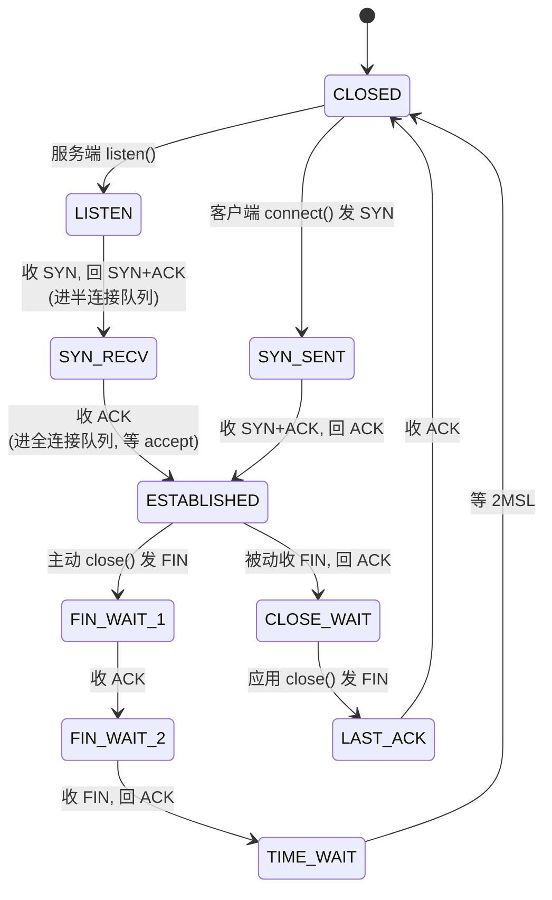
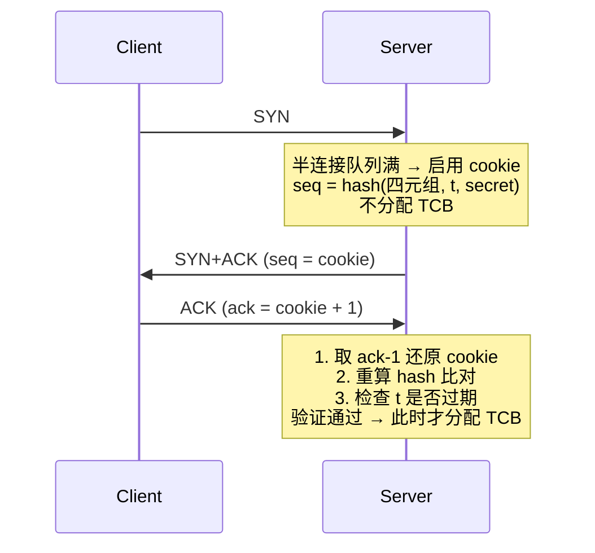

# 网络栈与连接问题

> 后端网络问题常见表现是超时、连接打满、重传、TIME_WAIT/CLOSE_WAIT 异常、DNS 慢、下游抖动。回答时要能把 TCP 状态和线上现象连起来。

## 一、一次请求经过什么


延迟可能来自：

- DNS 解析慢。
- TCP 建连慢。
- TLS 握手慢。
- 网络 RTT 高或重传。
- 服务端处理慢。
- 连接池等待。

## 二、TCP 状态机全景



11 个状态:

| 状态 | 哪一方 | 含义 | 线上关注 |
| --- | --- | --- | --- |
| LISTEN | 服务端 | 等待连接 | 服务端进程是否在监听 |
| SYN_SENT | 客户端 | 发了 SYN 等响应 | 下游不可达 / 防火墙 |
| SYN_RECV | 服务端 | 收 SYN 回 SYN+ACK | 半连接队列堆积 / SYN Flood |
| ESTABLISHED | 双方 | 已建立 | 连接数异常 |
| FIN_WAIT_1 | 主动方 | 发了 FIN 等 ACK | 短暂,堆积说明对端无响应 |
| FIN_WAIT_2 | 主动方 | 收 ACK 等对端 FIN | 对端不 close → 堆积 |
| **CLOSE_WAIT** ⚠ | 被动方 | 收 FIN 等应用 close() | **应用 bug,没 close** |
| LAST_ACK | 被动方 | 发 FIN 等最后 ACK | 短暂状态 |
| **TIME_WAIT** | 主动方 | 收 FIN 回 ACK 等 2MSL | **正常**,但客户端短连过多 → 端口耗尽 |
| CLOSED | - | 已关闭 | - |
| CLOSING | 双方 | 同时关闭的罕见状态 | 几乎不见 |

## 三、三次握手 + 半连接/全连接队列 ★

### 3.1 三次握手

```text
Client -> SYN              seq=x
Server -> SYN+ACK          seq=y, ack=x+1
Client -> ACK              seq=x+1, ack=y+1
```

### 3.1.1 为什么是 3 次?(高频)

**核心目的:全双工双向确认通信能力 + 协商 ISN**。

逐次推演:

| 次数 | 问题 |
| --- | --- |
| **1 次** | 服务端知道"客户端能发",但客户端不知道"我发的服务端能否收到" ❌ |
| **2 次** | 客户端双向确认了,但**服务端不知道"客户端能否收到我的"**;且服务端此时已分配资源 → 易被伪造 SYN 攻击 ❌ |
| **3 次** | 双方都确认"我能发 + 我能收"。✅ 最少必要次数 |
| **4 次** | 第 2 步 SYN 和 ACK 合并成 SYN+ACK 即可,4 次浪费 |

三次握手顺带解决:

1. **防止历史连接**:旧 SYN 在网络里游荡后到达,服务端能通过 ack 号识别并 RST 拒掉
2. **协商初始序列号 ISN**:双方各带随机 ISN,3 次完成相互确认,防止序列号预测攻击
3. **防资源浪费**:确保只有真实存在的客户端能让服务端分配 TCB

### 3.2 LISTEN 后的两个队列(高频考点)

服务端 `listen()` 后,内核维护**两个队列**:

```text
       ┌─────────── 三次握手 ───────────┐
                                         │
   SYN ──► [半连接队列]   ──ACK──►  [全连接队列]  ──accept()──► 应用
            (SYN queue)              (Accept queue)
            状态: SYN_RECV            状态: ESTABLISHED
```

| | 半连接队列(SYN queue) | 全连接队列(Accept queue) |
| --- | --- | --- |
| **存放** | 收 SYN,回了 SYN+ACK,等客户端 ACK 的连接 | 三次握手完成,等 accept() 取走的连接 |
| **状态** | SYN_RECV | ESTABLISHED |
| **大小参数** | `net.ipv4.tcp_max_syn_backlog` | `min(somaxconn, listen() 的 backlog)` |
| **满了怎么办** | 丢 SYN / 开 SYN cookies | 丢 ACK / 回 RST(看 `tcp_abort_on_overflow`) |
| **典型问题** | **SYN Flood**(伪造 SYN 灌满) | 应用 accept 慢导致 |

### 3.3 listen(fd, backlog) 的 backlog 是什么?

**Linux 上 backlog = 全连接队列长度**(且最终取 `min(backlog, somaxconn)`)。
半连接队列由 `tcp_max_syn_backlog` 控制,与 backlog 参数无关。

### 3.4 accept() 干了什么

```c
int conn_fd = accept(listen_fd, ...);
```

- **从全连接队列头取一个 ESTABLISHED 的连接**,返回新 fd
- 队列空 → 阻塞(默认)/ 返回 EAGAIN(非阻塞)
- 不参与三次握手——**握手是内核做的**,accept 只是"取货"

> 这也解释了为什么 SYN Flood 不靠应用层防护:握手在内核,应用根本看不到 SYN_RECV。

### 3.5 看队列状态

```bash
# 全连接队列(LISTEN socket 的 Recv-Q / Send-Q)
ss -lnt
#   Recv-Q 当前全连接队列长度
#   Send-Q 全连接队列上限

# 全连接溢出统计
netstat -s | grep "listen overflows"

# 半连接队列大小
cat /proc/sys/net/ipv4/tcp_max_syn_backlog
```

### 3.6 应用没及时 accept 会怎样?

- 全连接队列堆积 → 满了之后新连接被丢/拒
- 客户端表现:**TCP 连接成功但请求超时**(连接进了全连接队列,应用没拿到)
- Go 中:`Accept` 阻塞 / goroutine 调度卡 / GC 长 STW 都会触发

### 3.7 SYN Cookie(防 SYN Flood)★

**SYN Flood 攻击**:攻击者伪造大量 SYN(随机源 IP)→ 服务端给每个分配 TCB + 进半连接队列 → 队列被填满 → 真实用户的 SYN 被丢弃。

**SYN Cookie 思路**:**不分配 TCB、不入半连接队列**,把"半连接状态"加密编码进 SYN+ACK 的序列号,等客户端 ACK 回来时反向验证再建连接。

cookie(32 bit seq)结构:

```text
[ 5 bit | 3 bit |       24 bit       ]
   t      mss            hash
   时间戳   MSS 索引      四元组+secret 哈希
```

完整流程:



Linux 配置:

```bash
cat /proc/sys/net/ipv4/tcp_syncookies
# 0 = 关闭
# 1 = 队列满时启用(默认,推荐)
# 2 = 始终启用

netstat -s | grep -i "syncookies"
#   SYN cookies sent / received / invalid
```

代价(为什么默认 = 1 而不是 = 2):

- SYN 里的 TCP 选项(WScale / SACK / 时间戳)塞不进 24 bit → 长肥管道吞吐下降
- MSS 只能从 8 个预设值选(3 bit)
- 无法重传 SYN+ACK(没 TCB)

**防 SYN Flood 手段对比**:

| 手段 | 原理 | 评价 |
| --- | --- | --- |
| 加大 `tcp_max_syn_backlog` | 调大半连接队列 | 治标 |
| **SYN Cookie** | 不分配队列,加密编码 | **治本,中等规模够用** |
| 首包丢弃 | 第一个 SYN 丢,合法客户端会重传 | 增加正常用户延迟 |
| iptables 限速 / 黑名单 | 限制 SYN 速率 | 易误伤 |
| 云高防 IP / 硬件清洗 | 流量牵引到清洗中心 | **大流量必备** |

> 实战:`tcp_syncookies=1` 是默认兜底;几百 Gbps 攻击必须靠**云高防 IP**,内核再轻量也扛不住攻击带宽。

## 四、四次挥手 + FIN 状态详解 ★

### 4.0 为什么是 4 次?(高频)

**核心原因:TCP 全双工,两个方向独立关闭**。

```text
A→B 方向 和 B→A 方向 是两条独立通道,关闭时各自单独关
```

为什么握手时 SYN+ACK 能合并,挥手时 ACK 和 FIN 不能合并?

> **因为 B 收到 FIN 时,B 应用层可能还有数据没发完**。

```text
A → B: FIN                  ① "我没数据要发了"
A ← B: ACK (内核立即回)     ② "知道了"  ← 必须立即
       ── B 应用可能还在 Write 剩余数据 ──
A ← B: FIN                  ③ "我也没了"  ← 应用 close 后才发
A → B: ACK                  ④ "知道了"
```

举例:服务端 `read → process(5s) → write → close`,客户端发 FIN 后,服务端这 5s 内 ACK 必须立刻回(否则客户端以为丢包重传 FIN),但 FIN 要等 5s 后才发 → ② 和 ③ 必须分开。

**什么时候能变 3 次?**

如果 B 收 FIN 时应用层也没数据了,内核可以**合并 ACK 和 FIN 成 `FIN+ACK`**,变成 3 次。Linux 支持,但常见服务端处理有延迟,所以多数还是 4 次。

**TIME_WAIT 为什么必要?**

第 ④ 步的 ACK 可能丢 → B 重发 FIN(③)→ A 必须还在能再回 ACK。所以 A 等 2MSL 才 CLOSED(详见第五章)。

### 4.1 完整时序

```text
主动方                              被动方
ESTABLISHED                         ESTABLISHED
   │ close() / 发 FIN                 │
   ├─────────────── FIN ───────────►  │
FIN_WAIT_1                            │ 收 FIN(内核回 ACK)
   │                                  │ 应用还没 close
   │ ◄────────────── ACK ─────────────┤ → CLOSE_WAIT
FIN_WAIT_2                          CLOSE_WAIT  ★
   │                                  │ 应用 close() 发 FIN
   │ ◄────────────── FIN ─────────────┤
   │ 回 ACK                          LAST_ACK
TIME_WAIT  ★                          │
   │ 等 2MSL                          │ ◄── ACK
CLOSED                              CLOSED
```

### 4.2 状态对比

| 状态 | 哪一方 | 含义 | 危险信号 |
| --- | --- | --- | --- |
| FIN_WAIT_1 | 主动方 | 已发 FIN,等 ACK | 短暂,堆积说明对端没回 ACK |
| FIN_WAIT_2 | 主动方 | 收 ACK,等对端 FIN | 对端不 close → 半关闭可能堆积 |
| **CLOSE_WAIT** ⚠ | 被动方 | 收 FIN,等应用 close() | **应用 bug,最常见** |
| LAST_ACK | 被动方 | 应用 close 发 FIN,等最后 ACK | 短暂状态 |

### 4.3 CLOSE_WAIT 多 = 应用没 close(高频考点)

```text
对端发了 FIN 要关连接
本端内核自动回 ACK
但应用代码没调 close() → 一直 CLOSE_WAIT
```

Go 典型坑:

```go
resp, err := http.Get(url)
if err != nil { return err }
defer resp.Body.Close()                  // 必须
io.Copy(io.Discard, resp.Body)           // body 要读完,否则连接不能复用
```

其他典型场景:

- `sql.Rows` 没 `Close()`
- `os.File` / 管道 fd 没 close
- 异常分支提前 return 跳过 defer

## 五、TIME_WAIT 深入

主动关闭方收到对方 FIN、回最后 ACK 后,进入 TIME_WAIT,等 **2MSL**(Linux 默认 60s)再 CLOSED。

### 5.1 为什么需要 TIME_WAIT

1. **保证最后那个 ACK 能到对端**:对端没收到会重发 FIN,本端还能再回 ACK
2. **让旧连接的迷路报文消失**:防止"四元组复用"时旧包混进新连接

### 5.2 代价

- **占用本地端口**(客户端最痛):大量短连接 → 端口耗尽,报 `cannot assign requested address`
- **占用内核内存**(每条几 KB)
- 服务端通常被动关闭,**TIME_WAIT 多数出现在客户端**

### 5.3 谁会主动关闭

| 协议 | 默认主动方 |
| --- | --- |
| HTTP/1.0 | 服务端 → 服务端 TIME_WAIT |
| HTTP/1.1 keep-alive | 看谁先 close,多数是客户端 |
| 短连接客户端(curl / 批处理调用) | 客户端 |

### 5.4 处理

**正确思路**:让应用复用连接(连接池 / keep-alive)
**错误思路**:一上来就调内核参数压制症状

内核兜底参数(理解后再用):

| 参数 | 作用 | 注意 |
| --- | --- | --- |
| `net.ipv4.tcp_tw_reuse=1` | 允许新连接复用 TIME_WAIT 端口 | **客户端用**,需要 TCP 时间戳 |
| `net.ipv4.ip_local_port_range` | 客户端可用端口范围 | 默认 32768-60999,可调大 |
| `tcp_tw_recycle` | **已在 4.12 内核移除**,NAT 下会丢包 | **不要用** |

### 5.5 看 TIME_WAIT 数量

```bash
ss -ant | awk '{print $1}' | sort | uniq -c
#   1234 TIME-WAIT
#     56 ESTABLISHED
```

## 六、TCP 状态异常速查

| 现象 | 问题位置 | 第一手排查 |
| --- | --- | --- |
| **SYN_RECV 多** | 半连接队列堆积 | SYN Flood?调 `tcp_max_syn_backlog` + 开 SYN cookies |
| **全连接队列溢出** | 应用 accept 慢 | 应用 CPU / GC / 阻塞;`netstat -s \| grep overflow` |
| **CLOSE_WAIT 多** ⚠ | 应用没 close | code review:resp.Body / rows / fd 释放 |
| **TIME_WAIT 多**(客户端) | 短连接 + 不复用 | 用连接池 / keep-alive,而不是先调参数 |
| **FIN_WAIT_2 多** | 对端长期不 close | 设 `tcp_fin_timeout` 兜底 + 排查对端 |
| **大量 LAST_ACK** | 对端不回最后 ACK | 网络丢包 / 对端挂了 |

## 七、常用排查命令

```text
ss -antp
ss -s
netstat -s
sar -n TCP,ETCP,DEV 1
ping
traceroute
dig
tcpdump
```

看连接状态分布：

```text
ss -ant | awk '{print $1}' | sort | uniq -c
```

看某个端口连接：

```text
ss -antp sport = :8080
ss -antp dport = :3306
```

## 八、典型线上场景

### 场景 1：CLOSE_WAIT 很多

含义：

```text
对端已经关闭连接
本端应用没有 close
```

常见原因：

- HTTP response body 没有关闭。
- 数据库 rows 没有关闭。
- 异常分支遗漏 close。

Go 里典型坑：

```go
resp, err := http.Get(url)
if err != nil {
    return err
}
defer resp.Body.Close()
```

### 场景 2：TIME_WAIT 很多

常见原因：

- 客户端短连接过多。
- 没有开启连接复用。
- HTTP client 每次创建新实例。

处理方向：

- 使用连接池。
- 复用 HTTP client。
- 调整 keepalive。
- 必要时调内核参数，但不要先靠参数掩盖应用问题。

### 场景 3：请求偶发超时

可能原因：

- 网络重传。
- 下游 P99 抖动。
- DNS 解析慢。
- 连接池打满。
- 跨机房调用。

排查：

- trace 拆分 DNS、connect、TLS、server processing。
- 看 TCP 重传。
- 看下游 P99。
- 看连接池等待和超时配置。

## 九、超时配置

线上必须有：

- 连接超时。
- 读超时。
- 写超时。
- 整体请求超时。
- 连接池等待超时。

原则：

```text
超时要分层设置
上游超时 > 下游超时
避免下游已经超时，上游还一直等
```

重试要谨慎：

- 只对幂等操作重试。
- 设置最大重试次数。
- 加退避和抖动。
- 避免雪崩时重试放大流量。

## 十、常见坑

- HTTP client 每次请求都 new，导致连接无法复用。
- 没有关闭 response body，导致连接泄漏。
- 没有超时，慢下游拖死线程和连接池。
- 盲目重试非幂等接口。
- 只看服务端耗时，不看 DNS、建连、TLS、网络 RTT。
- CLOSE_WAIT 多还以为是系统参数问题。

## 十一、字节序(大小端)

> 网络协议是大端,服务端 CPU 几乎都是小端 —— 中间必须做转换。
> 这是底层网络通信最基础也最容易踩的坑。

### 11.1 大小端定义

**字节序**:多字节数据在内存里**字节的排列顺序**。

例:32 位整数 `0x12345678` 存到内存地址 `0x1000` 起:

```
              0x1000  0x1001  0x1002  0x1003
大端 (Big):    12      34      56      78       ← 高位在前
小端 (Little): 78      56      34      12       ← 低位在前
```

| | 大端 Big-Endian | 小端 Little-Endian |
| --- | --- | --- |
| 高位字节 | 放低地址 | 放高地址 |
| 直观性 | 和人读写一致 | 反着的 |
| 运算友好 | 差 | 好(加法从低位开始,顺读) |
| 典型代表 | **网络协议 / Java / PowerPC** | **x86 / ARM64 / RISC-V** |

口诀:**大端像人读数,小端像机器算数**。

### 11.2 网络字节序 = 大端

**RFC 1700 规定:网络协议传输用大端**(Big-Endian),又叫 **Network Byte Order (NBO)**。

涉及字段:
- **IP 头**:源 IP / 目的 IP / 总长度 / TTL
- **TCP 头**:端口号 / 序列号 / 确认号 / 窗口大小
- **UDP 头**:端口号 / 长度

```
TCP 端口 80 (0x0050) 在网线上传输:
   字节1   字节2
    00     50          ← 大端,高位先发
```

**为什么选大端**:
1. 历史路径依赖(早期网络设备 IBM/SUN/Motorola 都是大端)
2. 抓包工具按字节顺序展示就是人类读法,调试方便
3. 早期硬件可以读第一字节就预判包大小

### 11.3 服务端硬件 = 几乎全是小端

| 平台 | 字节序 | 服务端占比 |
| --- | --- | --- |
| x86 / x86_64 (Intel / AMD) | 小端 | 95%+ |
| ARM64 (鲲鹏 / 飞腾 / Graviton / Apple Silicon) | 小端(默认) | 增长中 |
| PowerPC / SPARC | 大端 | 已边缘化 |

**结论**:服务端 CPU **几乎 100% 小端**,网络传输是大端 → 应用层**必须做字节序转换**。

### 11.4 字节序转换 API

**C / Linux**:

```c
#include <arpa/inet.h>

htons()   // host to network short  (16位,如端口号)
htonl()   // host to network long   (32位,如 IP)
ntohs()   // network to host short
ntohl()   // network to host long

uint16_t port = 8080;
uint16_t net_port = htons(port);  // 发送前转大端
send(fd, &net_port, 2, 0);
```

x86 上 `htons` 实际就是字节翻转;大端机上是 no-op。

**Go**(显式指定,不依赖隐式假设):

```go
import "encoding/binary"

// 写入网络(大端)
buf := make([]byte, 4)
binary.BigEndian.PutUint32(buf, 0x12345678)
// buf = [0x12, 0x34, 0x56, 0x78]

// 从网络读取
val := binary.BigEndian.Uint32(buf)

// 本地存储 / 私有协议常用小端(性能略好)
binary.LittleEndian.PutUint32(buf, 0x12345678)
// buf = [0x78, 0x56, 0x34, 0x12]
```

### 11.5 检测当前机器字节序

```bash
# Linux 命令行
lscpu | grep "Byte Order"
# Byte Order: Little Endian
```

```go
// Go
func nativeEndian() binary.ByteOrder {
    var i uint16 = 1
    if *(*byte)(unsafe.Pointer(&i)) == 1 {
        return binary.LittleEndian
    }
    return binary.BigEndian
}
```

### 11.6 生产中的字节序坑

**坑 1:跨语言通信忘转字节序**

```
Go 服务(小端)直接 binary.LittleEndian 编码 → 发给 Java 服务
Java 默认大端解 → 数值全乱
```

修复:私有协议必须**文档显式约定字节序**,推荐用 protobuf / msgpack 等已封装好的序列化框架。

**坑 2:Redis / 数据库存二进制 key 跨架构不一致**

```go
// 小端机
binary.LittleEndian.PutUint64(key, userID)
redis.Set(key, val)
// 跨架构的大端机用同一 userID 编码出来的 key 完全不同 → miss
```

修复:统一用大端,或显式转字符串。

**坑 3:抓包看到的别按本地字节序解**

```
tcpdump 抓到 TCP 端口字段: 1F 90
错解(按小端) = 0x901F = 36895  ❌
正解(网络大端) = 0x1F90 = 8080  ✅
```

**坑 4:C 里结构体直接 send**

```c
struct Header { uint16_t port; uint32_t seq; };
send(fd, &header, sizeof(header), 0);  // ❌ 不同机器解析不一致
// 还有内存对齐 padding 问题
```

修复:每个字段单独 htons/htonl,或用序列化框架。

### 11.7 一句话总结

> **网络字节序 = 大端**(RFC 规定,TCP/IP 协议头都是);**服务端 CPU 几乎都是小端**(x86 / ARM64);
> → **应用层必须做转换**(C 用 `htons/htonl`,Go 用 `binary.BigEndian`);
> 选小端是 CPU 运算友好,选大端是协议互通和可读性。**两边各取所需,中间靠字节序转换桥接**。

## 十二、面试表达

```text
网络问题我会先拆请求链路：DNS、建连、TLS、发送、服务端处理、响应和连接复用。
TIME_WAIT 多通常和短连接有关，CLOSE_WAIT 多更像应用没有关闭连接。
偶发超时要看 TCP 重传、下游 P99、连接池等待和跨机房 RTT。
工程上必须设置连接超时、读写超时、整体超时，并且重试要考虑幂等和退避，避免放大故障。
```
