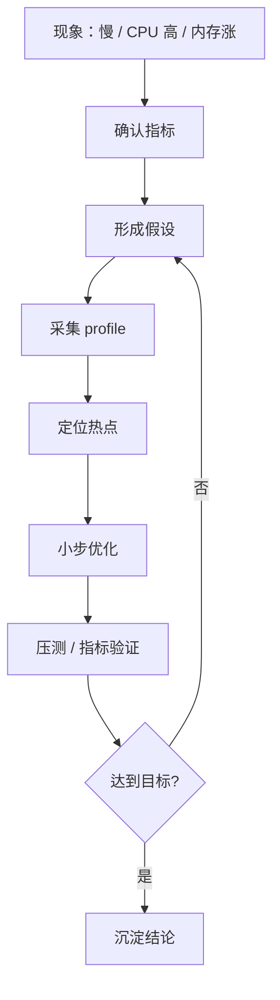

# 性能工具与火焰图

> 性能优化不要凭感觉。正确路径是先量化问题，再用工具定位热点，最后验证优化效果。

## 一、性能分析流程



不要一上来改代码。先回答：

- 优化目标是什么？
- 当前瓶颈在哪里？
- 是 CPU、内存、IO、锁，还是下游？
- 优化后如何证明有效？

## 二、工具地图

| 工具 | 适合定位 | 典型用途 |
| --- | --- | --- |
| pprof CPU | CPU 热点 | Go 函数耗时、序列化、压缩 |
| pprof heap | 内存分布 | 大对象、泄漏趋势 |
| pprof goroutine | 阻塞和泄漏 | goroutine 堆积、channel 阻塞 |
| go trace | 调度和阻塞 | GC、网络阻塞、调度延迟 |
| perf | 系统级 CPU | 内核态、native、系统调用热点 |
| strace | 系统调用 | 卡在 read/write/futex/connect |
| iostat | 磁盘 | await、util、吞吐、IOPS |
| tcpdump | 网络包 | 重传、握手、异常包 |
| flamegraph | 调用栈占比 | 可视化热点路径 |

## 三、Go pprof 常用

CPU profile：

```text
go tool pprof http://host/debug/pprof/profile?seconds=30
top
list <func>
web
```

Heap profile：

```text
go tool pprof http://host/debug/pprof/heap
top
list <func>
```

Goroutine：

```text
go tool pprof http://host/debug/pprof/goroutine
top
traces
```

常见判断：

- CPU top 函数占比高：业务热点。
- heap 某类对象持续增长：可能泄漏。
- goroutine 大量相同栈：可能阻塞或泄漏。
- mutex/block profile 高：锁竞争或阻塞严重。

## 四、火焰图怎么看

火焰图规则：

- 宽度代表占用比例。
- 高度代表调用栈深度。
- 越宽越值得看。
- 不要只看最顶层函数，要看整条调用链。

```text
宽而平：某个函数本身很耗时
高而宽：调用链深，可能层层封装或递归
多个宽块：热点分散，需要分别处理
```

优化策略：

- 减少重复计算。
- 减少分配。
- 降低锁竞争。
- 批量化 IO。
- 缓存热点结果。
- 减少序列化和反序列化成本。

## 五、strace 怎么用

适合回答：

```text
进程到底卡在哪个系统调用？
```

常见现象：

| 系统调用 | 可能含义 |
| --- | --- |
| `futex` | 锁等待、goroutine/线程同步 |
| `read` / `recvfrom` | 等网络或文件数据 |
| `write` / `sendto` | 写网络或文件阻塞 |
| `connect` | 下游建连慢 |
| `openat` / `stat` | 高频文件访问 |
| `fsync` | 强刷盘慢 |

注意：

- `strace` 有额外开销，不要长时间挂生产高流量进程。
- 更推荐短时间、低风险采样。

## 六、perf 适合什么

pprof 更偏 Go 应用内部，perf 更偏系统级。

适合：

- system CPU 高。
- native/cgo 热点。
- 内核态网络栈开销。
- CPU 火焰图。

典型路径：

```text
perf top
perf record -g -p <pid>
perf report
```

## 七、典型优化案例

### 场景 1：接口 CPU 高

定位：

- pprof CPU 发现 JSON 序列化占比高。
- 单次响应返回字段过多。

优化：

- 精简字段。
- 分页。
- 缓存热点结果。
- 避免重复序列化。

验证：

- CPU 使用率下降。
- P99 降低。
- QPS 上升。

### 场景 2：内存持续上涨

定位：

- heap profile 显示 map 持续增长。
- goroutine profile 显示后台任务没有退出。

优化：

- 增加 TTL / 上限。
- context 取消。
- 修复 channel 阻塞。

验证：

- RSS 稳定。
- goroutine 数稳定。
- GC 压力下降。

### 场景 3：P99 抖动

定位：

- trace 显示连接池等待。
- goroutine 大量卡在 DB 查询。
- 慢 SQL 增多。

优化：

- SQL 加索引。
- 控制超时。
- 限制并发。
- 缓存热点数据。

验证：

- 连接池等待下降。
- 慢 SQL 减少。
- P99 收敛。

## 八、常见坑

- 没有指标基线就开始优化。
- 只优化 CPU，不看 P99 和错误率。
- 本地 profile 结果直接代表线上。
- 只看 pprof top，不看调用链。
- 优化后不压测、不回看监控。
- 为了微小收益引入复杂代码。

## 九、面试表达

```text
我做性能优化会先确认目标和瓶颈，再采集 profile，而不是凭感觉改代码。
Go 服务通常先看 pprof 的 CPU、heap、goroutine、mutex/block，再结合 trace 看调度和阻塞。
如果 system CPU 高或怀疑内核态开销，我会用 perf；如果怀疑卡在系统调用，会短时间用 strace。
优化后必须通过压测和线上指标验证，比如 CPU、P99、错误率、连接池等待、内存和 GC 是否改善。
```
