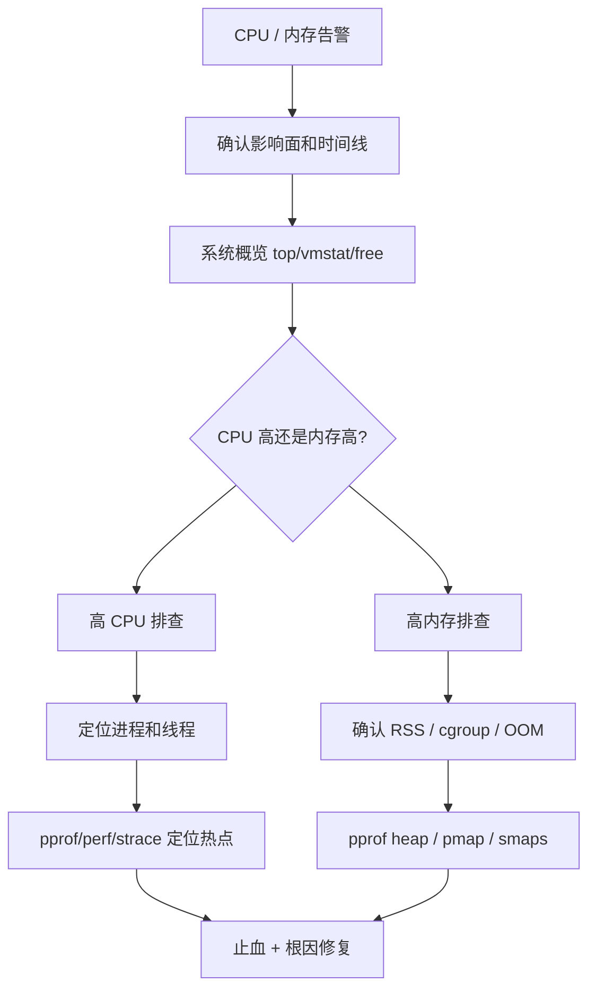

# 高 CPU 与高内存排查手册

> 面试和线上都不要只说 `top`。高 CPU 要定位到进程、线程、函数、系统调用；高内存要区分 RSS、heap、mmap、Page Cache、cgroup 和 OOM。

## 一、总原则

先判断是系统资源问题，还是应用自身问题。



线上排查顺序：

1. **确认影响面**：单机、单 pod、单接口、全链路？
2. **确认时间线**：是否刚发布、流量突增、定时任务启动、依赖异常？
3. **先看大盘**：CPU、load、内存、Swap、IO、网络。
4. **定位进程**：哪个进程占资源。
5. **定位线程/对象/系统调用**：不要停在进程级别。
6. **先止血**：限流、扩容、摘流、回滚、降级。
7. **再根因**：profile、日志、trace、代码修复。

## 二、命令速查表

| 命令 | 主要用途 | 重点看什么 |
| --- | --- | --- |
| `top` | 系统概览 | CPU、load、RES、进程排序 |
| `top -H -p <pid>` | 看进程内线程 | 哪个线程 CPU 高 |
| `htop` | 交互式看进程/线程 | 线程、CPU core 分布 |
| `uptime` | 快速看 load | 1/5/15 分钟 load |
| `vmstat 1` | CPU/内存/上下文切换 | `r`、`b`、`us`、`sy`、`wa`、`cs` |
| `pidstat -u -w -r 1` | 进程级 CPU/切换/内存 | CPU、上下文切换、RSS |
| `ps aux --sort=-%cpu` | CPU 排序 | 高 CPU 进程 |
| `ps aux --sort=-rss` | RSS 排序 | 高内存进程 |
| `pmap -x <pid>` | 进程内存映射 | heap、anon、mmap、so、stack |
| `cat /proc/<pid>/status` | 进程状态 | VmRSS、VmSize、Threads |
| `cat /proc/<pid>/smaps_rollup` | 聚合内存明细 | RSS、PSS、Private、Shared |
| `strace -c -p <pid>` | 系统调用统计 | 是否卡在 futex/read/write/connect |
| `perf top` | 系统级 CPU 热点 | 内核态、native、系统调用热点 |
| `iostat -x 1` | 磁盘 IO | await、util、IOPS |
| `ss -antp` | 连接状态 | CLOSE_WAIT、TIME_WAIT、连接数 |
| `lsof -p <pid>` | 文件和连接 | fd 泄漏、deleted 文件 |
| `dmesg | grep -i oom` | OOM 记录 | 谁被 OOM killer 杀了 |
| `pprof` | Go 应用画像 | CPU、heap、goroutine、mutex/block |

生产环境注意：

- `strace`、`perf`、完整 heap dump 都有开销，尽量短时间采样。
- 优先在单实例、低峰期或摘流实例上做深度采样。
- 排查前先保存现场：时间点、实例、版本、核心指标截图或日志。

## 三、高 CPU 排查路径

### 1. 先判断 CPU 类型

```text
top
vmstat 1
pidstat -u 1
```

看 CPU 分布：

| 指标 | 可能原因 |
| --- | --- |
| `us` 高 | 业务代码计算、序列化、正则、压缩、循环 |
| `sy` 高 | 系统调用多、网络包处理、锁、内核态开销 |
| `wa` 高 | 磁盘或存储 IO 等待 |
| `st` 高 | 云主机 CPU 被宿主机抢占 |
| load 高但 CPU 不高 | IO 等待、锁等待、任务排队 |

### 2. 定位高 CPU 进程

```text
ps aux --sort=-%cpu | head
top
```

关注：

- `%CPU` 是否持续高。
- 是否只有一个实例异常。
- 是否和定时任务、发布、流量峰值重合。

### 3. 定位高 CPU 线程

```text
top -H -p <pid>
pidstat -t -u -p <pid> 1
```

如果是 Java，可以把线程 ID 转成 16 进制后去 `jstack` 找线程栈：

```text
printf "%x\n" <tid>
jstack <pid> | grep -A 30 <hex_tid>
```

如果是 Go，线程 ID 对不上 goroutine 栈，一般直接用：

```text
go tool pprof http://host/debug/pprof/profile?seconds=30
go tool pprof http://host/debug/pprof/goroutine
```

### 4. 用 pprof 看 Go CPU 热点

常用命令：

```text
go tool pprof http://host/debug/pprof/profile?seconds=30
top
top -cum
list <func>
web
```

看什么：

- `flat` 高：函数自身耗 CPU。
- `cum` 高：函数及其子调用整体耗 CPU。
- 宽火焰图：热点路径。

常见热点：

- JSON 序列化/反序列化。
- 正则表达式。
- 加解密、压缩。
- 大 map 遍历。
- 日志格式化。
- 锁竞争导致的自旋或调度开销。

### 5. system CPU 高时看 strace / perf

`strace` 看系统调用分布：

```text
strace -c -p <pid>
strace -tt -T -p <pid>
```

常见判断：

| 现象 | 可能原因 |
| --- | --- |
| `futex` 很多 | 锁竞争、线程等待 |
| `read/recvfrom` 很多 | 网络或文件读 |
| `write/sendto` 很多 | 日志、网络写、下游慢 |
| `connect` 慢 | 下游建连慢、连接池没复用 |
| `epoll_wait` 多 | 可能在等 IO，不一定是问题 |
| `openat/stat` 多 | 高频访问文件或配置 |

`perf` 看系统级热点：

```text
perf top -p <pid>
perf record -g -p <pid> -- sleep 30
perf report
```

适合：

- `sy` 高。
- 怀疑内核态网络栈开销。
- cgo/native 库耗 CPU。
- pprof 看不到明显业务热点。

## 四、高内存排查路径

### 1. 先判断是系统内存还是进程内存

```text
free -h
top
ps aux --sort=-rss | head
vmstat 1
```

重点看：

- `available` 是否很低。
- 是否使用 Swap。
- 哪个进程 RSS 高。
- RSS 是否持续增长。
- 是否接近容器 memory limit。

不要误判：

```text
free 看到 used 高，不一定是泄漏。
Linux 会把空闲内存用作 Page Cache。
```

### 2. 看进程 RSS 和线程数

```text
cat /proc/<pid>/status
```

重点字段：

```text
VmSize:   虚拟内存，不等于真实占用
VmRSS:    常驻物理内存，更接近实际压力
Threads:  线程数，过高可能伴随栈内存和调度问题
```

也可以持续观察：

```text
pidstat -r -p <pid> 1
```

### 3. 用 pmap 看内存映射

```text
pmap -x <pid> | tail -n 20
pmap -x <pid> | sort -k3 -nr | head
```

看什么：

- `[ heap ]` 是否很大。
- `[ anon ]` 匿名内存是否很大。
- mmap 文件是否很多。
- 线程 stack 是否很多。
- so 库、文件映射、共享内存占比。

常见解释：

| pmap 现象 | 可能原因 |
| --- | --- |
| heap 大 | 应用堆对象多 |
| anon 大 | mmap、runtime、off-heap、内存碎片 |
| stack 多 | 线程数多 |
| 文件映射大 | mmap 文件、Page Cache 映射 |

### 4. 用 smaps 看更细内存

如果系统支持：

```text
cat /proc/<pid>/smaps_rollup
```

重点看：

- `Rss`
- `Pss`
- `Private_Clean`
- `Private_Dirty`
- `Shared_Clean`
- `Shared_Dirty`

大致理解：

```text
Private_Dirty 高：
  进程独占且被修改的内存，通常更像真实占用

Shared_Clean 高：
  共享库或文件映射，未必是泄漏

PSS：
  按比例分摊共享页，比 RSS 更适合多进程场景
```

### 5. Go 服务看 heap / goroutine

```text
go tool pprof http://host/debug/pprof/heap
top
top -cum
list <func>
```

看当前对象：

```text
go tool pprof -inuse_space http://host/debug/pprof/heap
```

看累计分配：

```text
go tool pprof -alloc_space http://host/debug/pprof/heap
```

goroutine 泄漏：

```text
go tool pprof http://host/debug/pprof/goroutine
top
traces
```

常见判断：

- heap 高、RSS 也高：大概率 Go 堆对象多。
- heap 不高、RSS 高：看 mmap、cgo、goroutine stack、内存碎片、Page Cache 映射。
- goroutine 数持续上涨：可能是请求无超时、channel 阻塞、后台任务泄漏。

### 6. OOM 排查

```text
dmesg | grep -i oom
journalctl -k | grep -i oom
```

Kubernetes：

```text
kubectl describe pod <pod>
kubectl top pod
kubectl get events --sort-by=.lastTimestamp
```

cgroup v2 常见文件：

```text
cat /sys/fs/cgroup/memory.current
cat /sys/fs/cgroup/memory.max
cat /sys/fs/cgroup/memory.events
```

重点判断：

- 是宿主机 OOM，还是容器超过 limit。
- OOM 前 RSS 是否持续增长。
- 是否有大查询、大批量任务、大对象缓存。
- 是否刚发布新版本。

## 五、典型案例

### 案例 1：CPU 飙高，pprof 发现 JSON 序列化

现象：

- `top` 看到应用进程 CPU 300%。
- `pprof profile` 里 `encoding/json` 占比很高。
- 接口返回大列表。

处理：

- 限制分页大小。
- 减少返回字段。
- 缓存热点响应。
- 避免重复序列化。

面试表达：

```text
我不会只说 CPU 高就扩容，会先用 top 定位进程，再用 pprof 定位函数。
如果热点在 JSON 序列化，说明 CPU 消耗在响应构造上，处理方向是分页、字段裁剪、缓存或替换序列化方案。
```

### 案例 2：system CPU 高，strace 发现大量 futex

现象：

- `top` 里 `sy` 高。
- `strace -c -p <pid>` 里 `futex` 占比很高。
- pprof mutex/block 显示锁竞争。

处理：

- 缩小锁粒度。
- 减少共享 map 写。
- 分片锁。
- 用无锁队列或异步聚合替代高频临界区。

### 案例 3：RSS 高但 Go heap 不高

现象：

- `ps` 看到 RSS 4GB。
- pprof heap 只有 1GB。
- `pmap/smaps` 看到大量 mmap 或 anon。

可能原因：

- mmap 文件。
- cgo/off-heap。
- goroutine stack。
- 内存碎片。

处理：

- 对比 `pmap -x` 和 `smaps_rollup`。
- 检查是否使用 mmap/cgo/native 库。
- 看 goroutine 数。
- 检查大文件映射和缓存策略。

### 案例 4：内存持续涨，goroutine 泄漏

现象：

- RSS 缓慢增长。
- goroutine 数持续增长。
- goroutine dump 大量卡在 channel receive 或 HTTP 请求。

处理：

- 给外部调用加 timeout。
- 正确传递和取消 context。
- 关闭 response body / rows。
- 确保 producer/consumer 有退出路径。

## 六、线上止血

高 CPU：

- 临时扩容。
- 摘掉异常实例。
- 限流热点接口。
- 关闭非核心定时任务。
- 回滚可疑发布。

高内存：

- 扩容或提高 memory limit。
- 限制大查询和批量任务。
- 清理异常缓存。
- 降低并发。
- 回滚可疑发布。

注意：

```text
止血不是根因修复。
扩容能缓解，但要继续定位为什么 CPU/内存异常。
```

## 七、面试回答模板

```text
如果线上 CPU 高，我会先看影响面和时间线，然后用 top/vmstat 判断是 user、system、iowait 还是 load 高。
接着用 top -H 或 pidstat 定位到线程；Go 服务用 pprof 看 CPU profile，system CPU 高时再用 strace/perf 看系统调用和内核热点。
如果是内存高，我会先看 free、RSS、Swap、cgroup limit，再用 ps/pidstat 找进程，用 pmap、smaps 看内存映射。
Go 服务还会看 heap profile 和 goroutine profile，区分 Go heap、goroutine 泄漏、mmap、cgo/off-heap 和 Page Cache。
线上处理会先限流、扩容、摘流或回滚止血，然后根据 profile 和指标做根因修复。
```
