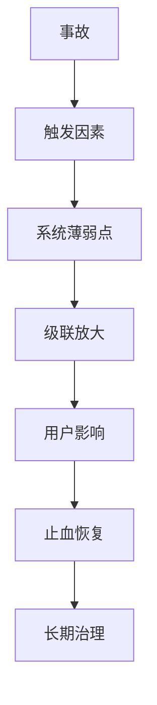
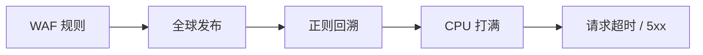
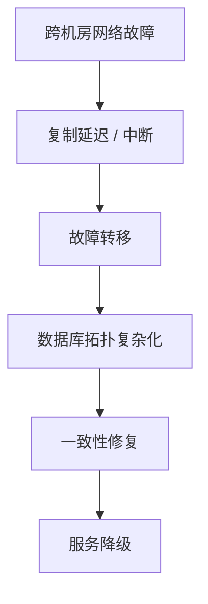
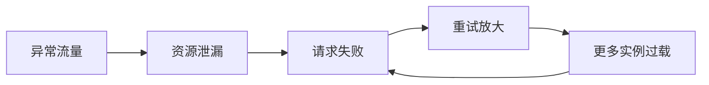

# 大厂线上事故案例与排查复盘

> 经典事故不要当故事背，要抽象成问题模型：配置变更、网络故障、CPU 打满、数据库复制、备份恢复、依赖隐藏、级联故障。

## 一、事故复盘怎么学

看事故时重点不是“哪个公司挂了”，而是回答：

```text
1. 现象是什么？
2. 影响面有多大？
3. 触发条件是什么？
4. 根因是什么？
5. 当时怎么止血？
6. 为什么监控/灰度/回滚/容灾没挡住？
7. 我们自己的系统如何避免？
```



## 二、经典事故地图

| 事故 | 类型 | 关键词 | 可迁移经验 |
| --- | --- | --- | --- |
| Cloudflare 2019 WAF 规则事故 | CPU 打满 | 正则回溯、全球发布、P99 飙升 | 配置也要灰度，规则要做性能测试 |
| GitHub 2018 数据库事故 | 主从复制/网络分区 | MySQL、Raft、跨机房、数据一致性 | 故障转移要考虑复制延迟和脑裂 |
| Meta 2021 全球中断 | 网络/BGP/DNS | 骨干网配置、BGP 撤销、DNS 不可达 | 管控面和数据面要隔离，远程恢复要有预案 |
| AWS 2021 US-EAST-1 事故 | 云服务依赖 | 内部网络设备、控制平面、级联影响 | 不要假设云厂商区域永远可用 |
| GitLab 2017 数据库事故 | 数据误删/备份失败 | 误删主库、备份不可用、恢复困难 | 备份必须演练，危险操作要强约束 |
| Atlassian 2022 长时间中断 | 脚本/租户删除 | 维护脚本、客户站点删除、恢复慢 | 批量变更必须 dry-run、限速、可回滚 |
| Cloudflare 2023 控制面事故 | 机房/容灾 | 电力故障、隐藏依赖、DR 不完整 | 容灾不能只看架构图，要做真实演练 |
| Google SRE 级联故障示例 | 资源泄漏/过载 | 高负载、资源泄漏、失败重试 | 过载保护、限流、隔离比盲目重试重要 |

## 三、案例 1：Cloudflare 2019 WAF 规则导致 CPU 打满

### 现象

Cloudflare 在 2019 年 7 月 2 日发生全球性服务中断，很多客户流量受影响。官方复盘指出，触发因素是一条 WAF 托管规则中的正则表达式导致 CPU 使用率异常升高。

### 根因模型

```text
规则变更
  -> 全球快速发布
  -> 正则表达式出现灾难性回溯
  -> 边缘节点 CPU 打满
  -> 请求处理能力下降
  -> 大面积 5xx / 超时
```



### 排查信号

- CPU 快速升高。
- 请求延迟和 5xx 同时上升。
- 问题和配置发布时间高度相关。
- 回滚或禁用规则后恢复。

### 可迁移经验

- 配置变更和代码变更一样危险。
- WAF、路由、限流、网关规则都要灰度。
- 正则要做性能测试，避免灾难性回溯。
- 全球边缘系统不能一次性全量发布高风险规则。

### 面试表达

```text
如果线上 CPU 突然打满，我会先看是否和发布或配置变更相关。
Cloudflare 这个事故说明配置也可能导致 CPU 热点，比如正则回溯。
排查上要看 CPU profile、错误率、规则发布时间线，止血优先禁用或回滚规则，长期要做灰度和规则性能测试。
```

资料源：[Cloudflare 官方复盘](https://blog.cloudflare.com/details-of-the-cloudflare-outage-on-july-2-2019/)

## 四、案例 2：GitHub 2018 网络分区与数据库一致性事故

### 现象

GitHub 在 2018 年 10 月 21 日到 22 日经历了长时间服务降级。官方复盘中提到，网络链路故障造成东西海岸数据中心之间通信异常，随后 MySQL 集群、复制和故障转移进入复杂状态，导致部分服务显示过期或不一致的数据。

### 根因模型

```text
网络分区
  -> 数据中心之间复制异常
  -> 自动化故障转移触发
  -> 数据库拓扑进入非预期状态
  -> 数据一致性和恢复优先于快速恢复
  -> 服务长时间降级
```



### 排查信号

- 跨机房链路异常。
- 主从复制延迟增大。
- 自动 failover 触发。
- 读到旧数据或不一致数据。
- 恢复过程非常谨慎，因为贸然切换可能扩大数据损坏。

### 可迁移经验

- 主从复制不是强一致。
- 自动故障转移要考虑复制延迟和网络分区。
- 跨机房架构最怕脑裂和双写。
- 恢复数据库事故时，数据正确性通常比快速恢复更重要。
- 要有 runbook，明确什么时候自动切、什么时候人工介入。

### 面试表达

```text
主从复制事故不能只看实例是否存活，还要看复制位点、延迟、拓扑和是否存在脑裂风险。
如果网络分区导致主从状态不确定，我会优先冻结写入或降级写入能力，确认数据边界，再恢复拓扑。
这种事故里快速切换不一定是好事，可能把不一致扩大。
```

资料源：[GitHub 官方复盘](https://github.blog/news-insights/company-news/oct21-post-incident-analysis/)

## 五、案例 3：Meta 2021 BGP/DNS 全球中断

### 现象

Meta 在 2021 年 10 月 4 日发生全球服务中断，Facebook、Instagram、WhatsApp 等服务受到影响。Meta 官方复盘说明，骨干网络配置变更中断了数据中心之间通信，BGP 路由撤销使 DNS 服务器不可达，最终用户无法访问服务。

### 根因模型

```text
骨干网配置变更
  -> 数据中心之间连接中断
  -> BGP 路由撤销
  -> DNS 不可达
  -> 服务域名无法解析
  -> 内部工具也受影响
  -> 恢复变慢
```

### 排查信号

- 外部看域名解析失败。
- BGP 路由消失或不可达。
- 内部控制面工具也不可用。
- 现场恢复依赖物理访问或独立通道。

### 可迁移经验

- 管控面不能完全依赖被管控的数据面。
- DNS、BGP、配置发布属于高危基础设施。
- 网络变更必须有自动校验、分阶段发布和快速回滚。
- 要准备 out-of-band 管理通道。

### 面试表达

```text
这类事故不是应用 bug，而是网络控制面事故。
排查时要从 DNS、BGP、链路连通性入手，而不是只看服务进程。
工程上要把管控面和数据面隔离，并且保证关键恢复工具不依赖同一套故障域。
```

资料源：[Meta 官方复盘](https://engineering.fb.com/2021/10/04/networking-traffic/outage/)、[Cloudflare 外部分析](https://blog.cloudflare.com/october-2021-facebook-outage/)

## 六、案例 4：AWS 2021 US-EAST-1 服务事件

### 现象

AWS 在 2021 年 12 月 7 日 US-EAST-1 区域发生服务事件，影响多个 AWS 服务以及依赖这些服务的客户。AWS 的 Post-Event Summaries 页面记录了该事件。

### 根因模型

```text
云厂商区域内部故障
  -> 控制平面或内部依赖异常
  -> 多个服务受影响
  -> 客户侧应用级联故障
  -> 单区域依赖暴露
```

### 排查信号

- 自己应用没有发布，但多个依赖同时异常。
- 云厂商状态页出现区域级事件。
- 多个 AWS API 调用失败或超时。
- 扩容、发布、恢复动作也可能受控制面影响。

### 可迁移经验

- 云不是没有故障，只是故障形态变了。
- 关键系统不能只依赖单区域。
- 控制平面故障时，临时扩容可能不可用。
- 要提前设计降级：缓存、只读、队列缓冲、跨区域容灾。

### 面试表达

```text
如果多个无关服务同时超时，我会怀疑公共依赖或云区域故障。
排查时会看云状态页、依赖 API 错误率、跨区域指标。
架构上不能假设单区域永远可用，核心链路要有跨 AZ/跨 Region、降级和只读能力。
```

资料源：[AWS Post-Event Summaries](https://aws.amazon.com/premiumsupport/technology/pes/)

## 七、案例 5：GitLab 2017 数据库误删与备份恢复失败

### 现象

GitLab.com 在 2017 年 1 月 31 日发生严重数据库事故。官方复盘说明，事故中生产数据库数据被误删，且多个备份和恢复链路存在问题，导致服务长时间不可用并造成数据丢失。

### 根因模型

```text
数据库压力和复制问题
  -> 人工恢复操作
  -> 误删生产数据目录
  -> 备份不可用 / 恢复困难
  -> 服务长时间中断
```

### 排查信号

- 复制延迟异常。
- 数据库恢复操作频繁。
- 备份任务看似存在，但恢复不可用。
- 危险命令缺少环境确认和保护。

### 可迁移经验

- 备份不等于可恢复。
- 备份必须定期做恢复演练。
- 生产危险操作要有二次确认和权限隔离。
- 主库、从库、备份、恢复流程要明确标识，避免误操作。

### 面试表达

```text
数据库事故里，我会特别强调备份恢复演练。
很多团队以为有备份就安全，但真正事故时可能发现备份失败、恢复慢或数据不完整。
所以要定期做恢复演练，危险操作要强约束，生产环境要最小权限。
```

资料源：[GitLab 官方复盘](https://about.gitlab.com/blog/postmortem-of-database-outage-of-january-31/)

## 八、案例 6：Atlassian 2022 长时间客户站点中断

### 现象

Atlassian 在 2022 年 4 月发生云服务中断，官方复盘称 775 个客户受到影响，部分客户最长中断达到 14 天。事故与维护脚本错误删除客户站点数据有关。

### 根因模型

```text
维护脚本
  -> 目标范围错误
  -> 客户站点被删除
  -> 恢复流程复杂且耗时
  -> 部分客户长时间不可用
```

### 排查信号

- 特定租户或客户站点不可用。
- 控制面显示资源不存在或被删除。
- 数据恢复依赖多服务、多备份、多租户关系重建。

### 可迁移经验

- 批量脚本必须有 dry-run。
- 删除类操作要有软删除、延迟删除、回收站。
- 维护任务要限速、分批、可中断。
- 多租户系统恢复比单库单表恢复复杂得多。

### 面试表达

```text
多租户系统里，删除不是简单的 delete。
我会设计软删除、延迟删除、审计日志、dry-run、批量限速和快速恢复能力。
维护脚本必须经过测试环境、灰度和影响范围确认。
```

资料源：[Atlassian 官方复盘](https://www.atlassian.com/blog/atlassian-engineering/post-incident-review-april-2022-outage)

## 九、案例 7：Cloudflare 2023 控制面和分析服务中断

### 现象

Cloudflare 在 2023 年 11 月 2 日开始发生控制面和分析服务中断。官方复盘说明，核心数据中心电力事件触发故障，部分系统存在不明显依赖，导致控制面和分析服务恢复复杂。

### 根因模型

```text
数据中心电力故障
  -> 核心设施不可用
  -> 部分服务没有完全高可用
  -> 隐藏依赖暴露
  -> 控制面和分析服务中断
```

### 排查信号

- 数据面流量可能仍正常，但控制台/API 不可用。
- 日志和分析延迟。
- DR 设施恢复后，部分产品仍不可用。
- 架构图上的高可用和真实依赖不一致。

### 可迁移经验

- 控制面和数据面要分开评估。
- 容灾要真实演练，不只看设计文档。
- 新产品默认落在单故障域很危险。
- 隐藏依赖需要通过故障演练暴露。

### 面试表达

```text
这个事故说明高可用不能只看主链路，要看所有隐藏依赖。
控制面故障不一定影响已有流量，但会影响配置变更、日志查询、扩容和运维操作。
我会通过故障演练验证 DR，而不是只相信架构图。
```

资料源：[Cloudflare 官方复盘](https://blog.cloudflare.com/post-mortem-on-cloudflare-control-plane-and-analytics-outage/)

## 十、案例 8：Google SRE 级联故障示例

### 现象

Google SRE 书中的示例复盘描述了一个由高负载和资源泄漏共同触发的级联故障：异常请求触发资源泄漏，失败率上升后重试和负载进一步放大，最终导致服务不可用。

### 根因模型

```text
异常流量
  -> 资源泄漏
  -> 实例容量下降
  -> 请求失败
  -> 重试放大流量
  -> 更多实例过载
  -> 级联故障
```



### 排查信号

- 单实例错误率上升后扩散到集群。
- 重试流量增加。
- 队列堆积。
- CPU/内存/连接数逐步被打满。
- 负载均衡把流量打到剩余健康实例，导致更多实例过载。

### 可迁移经验

- 重试必须有限制、退避和熔断。
- 实例过载时要快速失败，而不是无限排队。
- 要有过载保护和限流。
- 资源泄漏平时不明显，高峰才会暴露。

### 面试表达

```text
级联故障的关键不是单点失败，而是失败被重试、队列、负载均衡和共享依赖放大。
我会重点看错误率、重试量、队列长度、实例健康分布和资源使用。
治理上要有限流、熔断、超时、退避、隔离和过载保护。
```

资料源：[Google SRE 示例复盘](https://sre.google/sre-book/example-postmortem/)、[Google SRE 级联故障章节](https://sre.google/sre-book/addressing-cascading-failures/)

## 十一、事故分类沉淀

### 1. 配置和规则事故

代表：

- Cloudflare 2019 WAF 规则。
- Meta 2021 网络配置。

治理：

- 配置灰度。
- 静态校验。
- 自动回滚。
- 变更审计。
- 小流量验证。

### 2. 数据库和数据事故

代表：

- GitHub 2018 主从复制和网络分区。
- GitLab 2017 数据误删。
- Atlassian 2022 站点删除。

治理：

- 备份恢复演练。
- 删除保护。
- 写入冻结能力。
- 数据校验和对账。
- 主从切换 runbook。

### 3. 网络和基础设施事故

代表：

- Meta 2021 BGP/DNS。
- Cloudflare 2023 数据中心电力。
- AWS 2021 区域服务事件。

治理：

- 控制面和数据面隔离。
- 跨 AZ/Region 容灾。
- out-of-band 管理通道。
- 故障演练。
- 关键依赖降级。

### 4. 资源耗尽和级联事故

代表：

- Cloudflare 2019 CPU 打满。
- Google SRE 资源泄漏和级联故障示例。

治理：

- 限流。
- 熔断。
- 超时。
- 退避重试。
- 资源隔离。
- 过载保护。

## 十二、面试回答模板

```text
我看线上事故会先按类型归类：配置变更、资源耗尽、数据库一致性、网络控制面、云依赖、数据误删、级联故障。
排查时先建立时间线，看是否有发布、配置、流量、依赖或基础设施变化。
然后看指标：错误率、P99、CPU、内存、连接数、队列、复制延迟、网络连通性和云状态页。
止血上优先限流、降级、回滚、摘流、冻结写入或切换流量。
长期治理要落到灰度、回滚、备份恢复演练、容灾演练、过载保护、变更审计和事故复盘。
```

