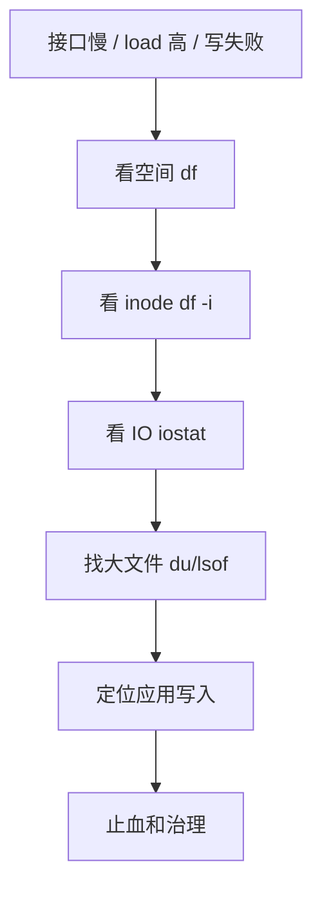

# 磁盘 IO 与文件系统排查

> 磁盘问题常见表现是接口慢、load 高、日志写失败、数据库抖动、磁盘空间满、inode 满、删除文件后空间不释放。

## 一、排查路径



先判断四件事：

1. 空间是否满。
2. inode 是否满。
3. 磁盘 IO 是否打满。
4. 是否有 deleted 文件仍被进程占用。

## 二、命令速查

| 命令 | 用途 | 看什么 |
| --- | --- | --- |
| `df -h` | 磁盘空间 | 使用率、挂载点 |
| `df -i` | inode | 小文件是否太多 |
| `du -sh *` | 目录大小 | 哪个目录占空间 |
| `du -ah | sort -h` | 找大文件 | 大文件分布 |
| `lsof | grep deleted` | 删除但未释放文件 | 进程仍持有 fd |
| `iostat -x 1` | 磁盘性能 | await、util、r/s、w/s |
| `iotop` | 进程 IO | 哪个进程读写多 |
| `pidstat -d 1` | 进程磁盘 IO | read/write 吞吐 |
| `vmstat 1` | IO 等待 | `wa`、`b` |
| `dmesg` | 内核错误 | 磁盘错误、文件系统错误 |

## 三、iostat 怎么看

```text
iostat -x 1
```

重点指标：

| 指标 | 含义 | 判断 |
| --- | --- | --- |
| `%util` | 设备忙碌程度 | 接近 100% 表示可能打满 |
| `await` | IO 平均等待时间 | 高说明 IO 慢或排队 |
| `r/s`、`w/s` | 每秒读写次数 | 看 IOPS |
| `rkB/s`、`wkB/s` | 每秒读写吞吐 | 看带宽 |
| `aqu-sz` | 平均队列长度 | 高说明排队 |

经验判断：

- `%util` 高、`await` 高：磁盘很可能是瓶颈。
- `await` 高但吞吐不高：可能是随机 IO 或设备异常。
- `wa` 高、load 高：大量任务在等 IO。

## 四、场景 1：磁盘空间满

表现：

- 日志写失败。
- 临时文件创建失败。
- MySQL / Kafka / ES 写入异常。
- 应用报 `no space left on device`。

排查：

```text
df -h
du -sh /*
du -sh /var/log/*
du -ah /path | sort -h | tail
```

止血：

- 清理可确认无用的旧日志、临时文件。
- 临时扩容磁盘。
- 降低日志级别。
- 暂停非核心批任务。

长期治理：

- 日志切割和保留周期。
- 磁盘水位告警。
- 大文件写入限额。
- 临时目录定期清理。

## 五、场景 2：inode 满

表现：

```text
df -h 还有空间
但创建文件失败：no space left on device
```

排查：

```text
df -i
find /path -xdev -type f | wc -l
```

常见原因：

- 小文件太多。
- 临时文件没有清理。
- 日志按请求或按用户切碎。
- 缓存文件无限增长。

处理：

- 清理小文件。
- 合并小文件。
- 改存对象存储或数据库。
- 设计 TTL 和清理任务。

## 六、场景 3：删除文件后空间不释放

原因：

```text
文件被 rm
但进程仍持有 fd
磁盘空间要等 fd 关闭后才释放
```

排查：

```text
lsof | grep deleted
lsof -p <pid> | grep deleted
```

处理：

- 优雅重启持有 fd 的进程。
- 让应用重新打开日志文件。
- 修正日志切割策略。

常见于：

- 日志文件被删除但进程还在写。
- 手工清理大文件方式不对。
- logrotate 后应用没有 reopen。

## 七、场景 4：磁盘 IO 打满

表现：

- load 高。
- CPU iowait 高。
- 接口 P99 抖动。
- 数据库慢查询增加。
- 日志写入变慢。

排查：

```text
vmstat 1
iostat -x 1
iotop
pidstat -d 1
```

可能原因：

- 慢 SQL 大量随机读。
- 批任务扫表。
- 日志写入太频繁。
- fsync 过于频繁。
- 大文件读冲刷 Page Cache。
- 多个服务共享磁盘互相影响。

处理：

- 停止或限速批任务。
- SQL 加索引，减少随机读。
- 日志异步和批量。
- 降低 fsync 频率或分组提交。
- 拆分磁盘或实例隔离。

## 八、场景 5：fsync 慢

常见于：

- 数据库事务日志。
- 消息队列刷盘。
- 关键文件写入。

排查：

- 看磁盘 `await`。
- 看应用 P99。
- 看是否批量提交。
- 看是否多个组件共享磁盘。

理解：

```text
write 成功通常只是写到 Page Cache。
fsync 才会要求刷到稳定存储。
fsync 频繁会把吞吐打碎，导致延迟抖动。
```

## 九、常见坑

- 只看 `df -h`，不看 `df -i`。
- 删除大文件后空间不释放，却不知道查 `lsof | grep deleted`。
- 把 `write` 成功当成数据落盘。
- 日志 debug 打满磁盘。
- 大文件扫描冲刷 Page Cache，影响数据库。
- 多个高 IO 服务混部在同一块盘。

## 十、面试表达

```text
磁盘问题我会先看 df -h 判断空间，再看 df -i 判断 inode，然后用 iostat -x 看 await、util 和队列。
如果空间满但找不到文件，我会用 lsof | grep deleted 看是否有删除但仍被进程持有的文件。
如果 load 高但 CPU 不高，我会看 vmstat 的 wa/b 和 iostat，判断是不是 IO 等待。
长期治理上要做日志切割、磁盘水位告警、批任务限速、Page Cache 影响评估和 IO 隔离。
```

