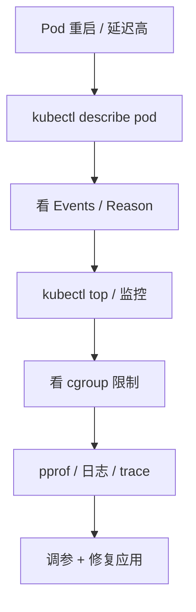

# 容器与 Kubernetes 资源问题

> K8s 里的 CPU 和内存问题，本质还是 Linux cgroup 限制。常见坑是：宿主机有资源，但容器被 OOMKilled；CPU 没打满，但被 throttling 导致延迟升高。

## 一、核心概念

| 概念 | 含义 | 线上影响 |
| --- | --- | --- |
| request | 调度时申请的资源 | 影响 Pod 被调度到哪里 |
| limit | 容器最多可用资源 | 超过内存 limit 会 OOMKilled |
| cgroup | Linux 资源隔离机制 | 限制 CPU、内存、IO |
| OOMKilled | 容器因超内存被杀 | Pod 重启、请求失败 |
| CPU throttling | CPU 被 cgroup 限速 | CPU 看似不满但 P99 升高 |
| QoS | Guaranteed/Burstable/BestEffort | 影响驱逐优先级 |

## 二、排查路径



先看：

```text
kubectl describe pod <pod>
kubectl logs <pod> --previous
kubectl top pod
kubectl get events --sort-by=.lastTimestamp
```

## 三、场景 1：OOMKilled

表现：

- Pod 重启。
- `kubectl describe pod` 看到 `Reason: OOMKilled`。
- 应用日志可能来不及打印错误。

排查：

```text
kubectl describe pod <pod>
kubectl logs <pod> --previous
kubectl top pod
```

容器内看 cgroup v2：

```text
cat /sys/fs/cgroup/memory.current
cat /sys/fs/cgroup/memory.max
cat /sys/fs/cgroup/memory.events
```

常见原因：

- limit 设置过小。
- 大查询、大批量任务。
- goroutine 泄漏。
- 缓存无上限。
- Go heap 外内存：mmap、cgo、goroutine stack。

处理：

- 临时提高 limit 或扩容。
- 限制单请求数据量。
- 修复泄漏。
- 设置缓存上限和 TTL。
- 用 pprof 对比 heap 与 RSS。

## 四、场景 2：宿主机有内存，容器仍 OOM

原因：

```text
容器只能使用 cgroup limit 内的内存
宿主机剩余内存不代表容器可用
```

面试表达：

```text
K8s OOMKilled 通常不是看宿主机 free，而是看容器 memory limit 和 memory.current。
如果超过 cgroup 限制，哪怕宿主机还有内存，容器也会被杀。
```

## 五、场景 3：CPU throttling

表现：

- CPU 使用率看起来没到机器上限。
- P99 明显升高。
- Go GC 或请求处理变慢。
- 监控中 throttled 时间增加。

原因：

```text
容器设置了 CPU limit
在一个 cgroup 周期内用完额度
后续时间被限速
```

排查 cgroup v2：

```text
cat /sys/fs/cgroup/cpu.max
cat /sys/fs/cgroup/cpu.stat
```

重点看：

```text
nr_throttled
throttled_usec
```

处理：

- 调整 CPU limit。
- 对延迟敏感服务谨慎设置过低 limit。
- 优化 CPU 热点。
- 拆分批任务和在线服务。
- 增加副本数。

## 六、场景 4：Pod 频繁重启

排查：

```text
kubectl describe pod <pod>
kubectl logs <pod> --previous
kubectl get events --sort-by=.lastTimestamp
```

常见原因：

- OOMKilled。
- liveness probe 失败。
- 启动太慢，被探针杀掉。
- 依赖不可用导致启动失败。
- 配置错误。

处理：

- 区分 liveness 和 readiness。
- startup probe 保护慢启动。
- 应用启动不要强依赖所有下游。
- 配置变更灰度。

## 七、场景 5：节点资源不足和驱逐

表现：

- Pod 被 Evicted。
- 节点 DiskPressure / MemoryPressure。
- BestEffort Pod 先被驱逐。

排查：

```text
kubectl describe node <node>
kubectl get pod -A -o wide
kubectl top node
kubectl get events --sort-by=.lastTimestamp
```

治理：

- 设置合理 request/limit。
- 避免 BestEffort 运行核心服务。
- 节点磁盘和内存水位告警。
- DaemonSet、日志和镜像缓存治理。

## 八、资源配置建议

在线服务：

- request 按稳定水位设置。
- limit 不要过低，避免 throttling。
- 内存 limit 必须覆盖 RSS 峰值。
- 设置 readiness，避免未就绪接流量。

批任务：

- 和在线服务隔离。
- 可设置较明确的 CPU/memory limit。
- 控制并发和运行时间。

Go 服务：

- 配合 `GOMEMLIMIT` 控制 Go heap。
- 但要记住 RSS 不只包含 heap。
- pprof 和容器 RSS 都要看。

## 九、常见坑

- 只看宿主机资源，不看容器 cgroup。
- 内存 limit 太小，导致偶发 OOMKilled。
- CPU limit 太低，导致 throttling 和 P99 抖动。
- liveness probe 配太激进，把慢启动服务杀死。
- readiness 没配好，未就绪实例接流量。
- 核心服务没有 request，资源被挤压。

## 十、面试表达

```text
K8s 资源问题我会先看 pod describe、events、previous logs 和 kubectl top。
如果是 OOMKilled，我会看 memory limit、memory.current、RSS、pprof heap 和 goroutine，区分 Go heap、mmap、cgo 和栈内存。
如果延迟高但 CPU 看似没满，我会怀疑 CPU throttling，看 cgroup cpu.stat 的 nr_throttled 和 throttled_usec。
治理上要合理设置 request/limit，区分在线服务和批任务，配置 readiness/liveness/startup probe，并用监控覆盖 OOM、重启和 throttling。
```

