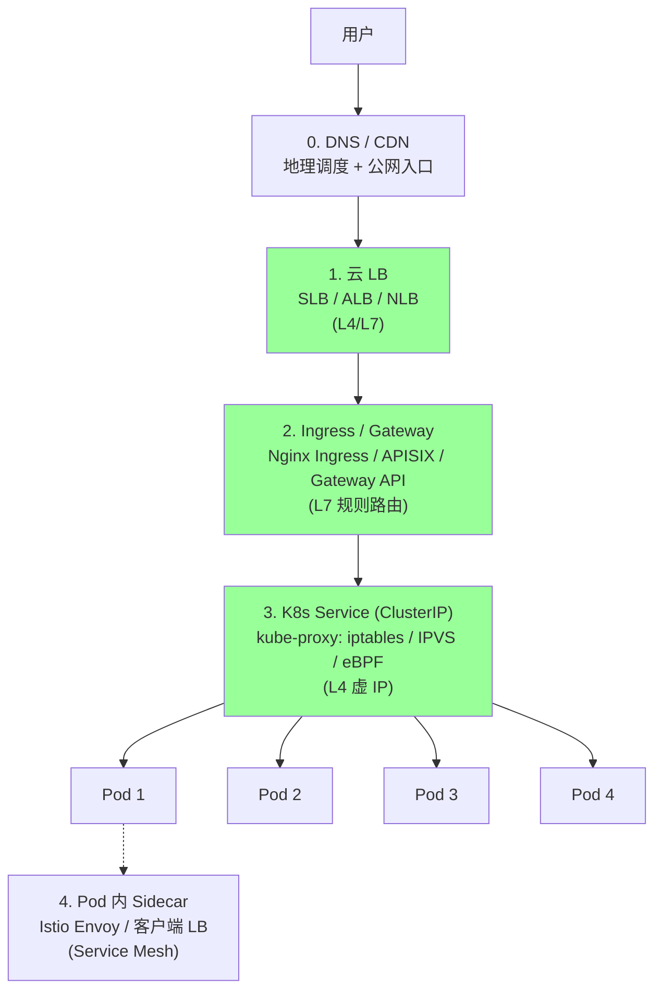
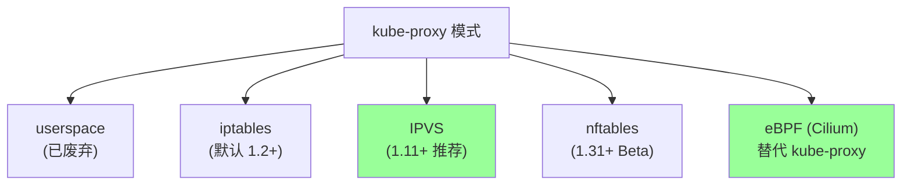
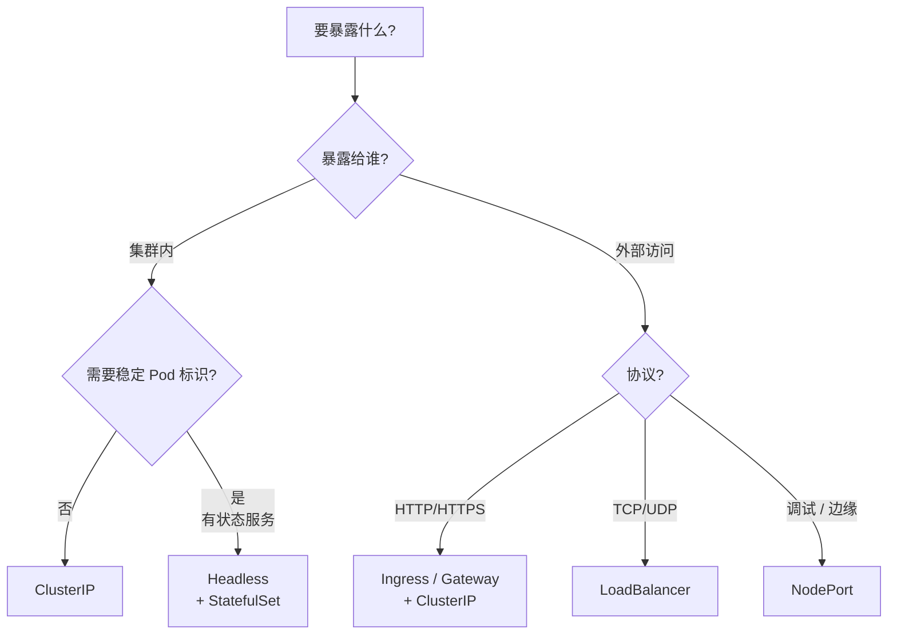
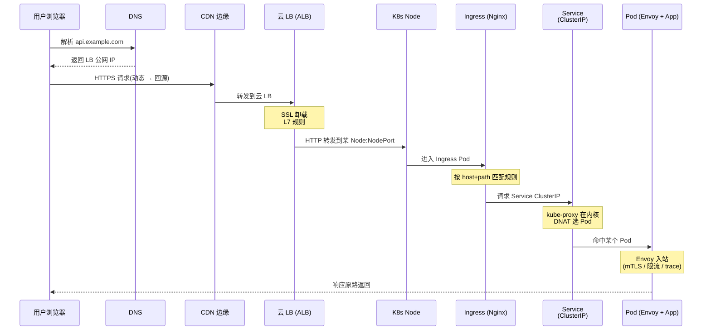

# K8s 多层流量分发

> 从用户浏览器到 Pod 容器,流量要穿过 **5 层负载均衡**。
> 这一篇讲清:每层做什么 LB / 用什么算法 / 怎么选 / 怎么排查。
>
> LB 算法详解看 [../06-distributed/07-service-discovery-lb.md](../06-distributed/07-service-discovery-lb.md)。

## 一、五层流量分发总览



**每层职责**:

| 层 | 组件 | 工作层 | 主要职责 | 典型算法 |
| --- | --- | --- | --- | --- |
| **0** | DNS / CDN | L7 / L3 | 地理调度 + 边缘缓存 | 地理就近 / Anycast |
| **1** | 云 LB(SLB/ALB/NLB)| L4 / L7 | 跨可用区高可用 + SSL 卸载 | 加权 RR / Least Conn / 一致性 Hash |
| **2** | Ingress / Gateway | L7 | host/path/header 规则路由 | RR(Nginx Ingress 默认)|
| **3** | Service (ClusterIP) | L4 | 集群内虚 IP → 实 Pod | Random(iptables)/ RR(IPVS) |
| **4** | Pod 内 Sidecar | L7 | 灰度 / 重试 / 熔断 / mTLS | P2C / EWMA(Istio 等)|

**关键认知**:
- **每层独立做 LB**,算法可以不同
- 算法越往里越细(L3 看 IP,L7 看 URL,Sidecar 看请求语义)
- 每层都可能成为瓶颈,排查时要分层定位

## 二、第 0 层:DNS / CDN

详见 [../11-cdn/03-routing-dispatch.md](../11-cdn/03-routing-dispatch.md),这里只列要点:

- **DNS 解析**:把域名解析到云 LB 的 IP(可能是多 IP 做地理调度)
- **CDN 边缘**:静态资源直接在边缘节点返回,不进 K8s 集群
- **调度算法**:DNS 智能解析 / HTTP 302 调度 / Anycast / 多维度智能调度

**和 K8s 的关系**:CDN 只回源动态请求,通过云 LB 进入 K8s。

## 三、第 1 层:云 LB(SLB / ALB / NLB)

### 3.1 三种云 LB 类型

| 类型 | 工作层 | 典型产品 | 适合 |
| --- | --- | --- | --- |
| **CLB / SLB**(经典型) | L4(TCP/UDP)| 阿里云 CLB / AWS CLB | 基础 TCP 负载 |
| **ALB**(应用型) | L7(HTTP/HTTPS) | 阿里云 ALB / AWS ALB | URL 路由 / 灰度 / WAF |
| **NLB**(网络型) | L4(TCP/UDP,高性能) | 阿里云 NLB / AWS NLB | 高 PPS / 低延迟 |

### 3.2 云 LB 在 K8s 里怎么进来

```yaml
apiVersion: v1
kind: Service
metadata:
  name: app
  annotations:
    service.beta.kubernetes.io/aws-load-balancer-type: nlb
spec:
  type: LoadBalancer    # ← 关键
  selector:
    app: web
  ports:
  - port: 80
    targetPort: 8080
```

K8s 看到 `type: LoadBalancer` → 调云厂商 CCM(Cloud Controller Manager)→ 自动创建云 LB 并绑定 NodePort。

### 3.3 云 LB 的算法

| 算法 | 适合 |
| --- | --- |
| **加权 RR** | 异构节点 |
| **加权最少连接** | 长连接 / 处理时间不均 |
| **一致性 Hash**(源 IP) | 会话保持 |
| **轮询** | 同构节点 + 短连接 |

### 3.4 SSL 卸载

云 LB 处理 TLS 握手 → 把明文转发到 K8s(VPC 内网),省 Pod CPU。

```
用户 ──HTTPS──→ 云 LB ──HTTP──→ Ingress
                  ↑
              证书在这卸载
```

## 四、第 2 层:K8s Ingress / Gateway

### 4.1 Ingress 是什么

Ingress = **K8s 集群入口的 L7 规则**,把 HTTP 请求按 host/path 路由到不同 Service。

```yaml
apiVersion: networking.k8s.io/v1
kind: Ingress
metadata:
  name: app-ingress
spec:
  rules:
  - host: api.example.com
    http:
      paths:
      - path: /v1
        pathType: Prefix
        backend:
          service:
            name: api-v1-svc
            port:
              number: 80
      - path: /v2
        pathType: Prefix
        backend:
          service:
            name: api-v2-svc
            port:
              number: 80
```

Ingress 资源只是**规则**,需要 **Ingress Controller** 实际执行。

### 4.2 主流 Ingress Controller

| Controller | 底层 | 特点 |
| --- | --- | --- |
| **Nginx Ingress** | Nginx | 最常用,生态全 |
| **APISIX Ingress** | OpenResty + etcd | 动态路由 / 国产 |
| **Traefik** | 自研 | 自动发现 / 配置简单 |
| **HAProxy Ingress** | HAProxy | 老牌 LB |
| **Envoy / Contour** | Envoy | 性能高 / Service Mesh 联动 |
| **Cilium Ingress** | eBPF | 高性能 / 替代 kube-proxy |

### 4.3 Ingress 的 LB 算法

以 **Nginx Ingress** 为例:

| Annotation | 算法 |
| --- | --- |
| 默认 | Round Robin |
| `nginx.ingress.kubernetes.io/upstream-hash-by` | 一致性 Hash(指定 key) |
| `nginx.ingress.kubernetes.io/load-balance` | 可选 `ewma` / `round_robin` |

```yaml
annotations:
  nginx.ingress.kubernetes.io/load-balance: "ewma"   # 响应时间加权
```

### 4.4 Gateway API(K8s 1.30+ 的演进)

Ingress 设计太老(2015),做 灰度/header 路由/跨命名空间 都很别扭。**Gateway API** 是 K8s 官方下一代标准(2023 GA)。

```yaml
apiVersion: gateway.networking.k8s.io/v1
kind: Gateway
metadata:
  name: prod-gateway
spec:
  gatewayClassName: istio
  listeners:
  - name: https
    port: 443
    protocol: HTTPS
---
apiVersion: gateway.networking.k8s.io/v1
kind: HTTPRoute
spec:
  parentRefs:
  - name: prod-gateway
  rules:
  - matches:
    - headers:
      - name: x-canary
        value: "true"
    backendRefs:
    - name: canary-svc
      weight: 100
```

**vs Ingress 的优势**:
- 角色分离(Infra Provider / Cluster Operator / App Dev)
- 协议扩展(TCP / UDP / gRPC / TLS Passthrough)
- 灰度 / Header 路由 / 跨命名空间是原生 API

新项目优先用 Gateway API,Ingress 进入维护模式。

## 五、第 3 层:K8s Service(核心)

### 5.1 Service 4 大类型

| 类型 | 用途 | 暴露范围 |
| --- | --- | --- |
| **ClusterIP**(默认) | 集群内访问 | 仅集群内 |
| **NodePort** | 通过 Node IP:port 暴露 | 节点 IP |
| **LoadBalancer** | 自动创建云 LB | 公网 / 私网 LB |
| **ExternalName** | DNS 别名 | DNS CNAME |
| **Headless**(ClusterIP: None) | 不要虚 IP,直接返 Pod IP 列表 | 集群内(DNS 返多个 A 记录)|

```yaml
# Headless Service: 客户端拿到 Pod IP 列表自行选
apiVersion: v1
kind: Service
spec:
  clusterIP: None        # ← 关键
  selector:
    app: redis
```

**Headless 用途**:有状态服务(MySQL / Redis / Kafka),需要稳定 Pod 标识(配合 StatefulSet)。

### 5.2 ClusterIP 是什么

ClusterIP 是**集群内部的虚 IP**,不属于任何节点或 Pod,**只在 iptables/IPVS 规则里存在**。

```
Service: 10.96.0.10:80         ← 虚 IP,从 service-cidr 分配
Endpoints: 10.244.1.5:8080     ← 真实 Pod IP
           10.244.2.7:8080
           10.244.3.9:8080
```

请求 ClusterIP 时,**kube-proxy 在每个节点设置规则**把流量 DNAT 到某个真实 Pod IP。

### 5.3 kube-proxy 三种模式(★ 核心)



| 模式 | 工作位置 | 算法 | 性能 | 适用规模 |
| --- | --- | --- | --- | --- |
| **userspace** | 用户态(已废弃) | RR | 慢(数据要进出内核态) | - |
| **iptables** | 内核 netfilter | Random(默认) | 中(规则 O(n) 匹配) | <5000 Service |
| **IPVS** | 内核 LVS | RR/WRR/LC/SH 等 10+ 种 | 高(hashtable O(1)) | 5000+ Service |
| **nftables** | 内核 nftables | Random | 高(替代 iptables 的下一代) | K8s 1.31+ |
| **eBPF** | 内核 eBPF | 各种 | 最高(绕过 netfilter) | 大规模 Cilium 集群 |

### 5.4 iptables 模式工作原理

```
请求 → 10.96.0.10:80 (Service ClusterIP)
        ↓
KUBE-SERVICES 链 (iptables)
        ↓
KUBE-SVC-XXX 链 (按 Service 分)
        ↓
随机选(statistic mode random):
  - 33% → KUBE-SEP-A → DNAT 到 Pod1:8080
  - 33% → KUBE-SEP-B → DNAT 到 Pod2:8080
  - 33% → KUBE-SEP-C → DNAT 到 Pod3:8080
```

**特点**:
- 算法**只能是随机**(无法配 RR / LC)
- 规则数量 = Service 数 × Endpoint 数 × N → **规模上去会爆炸**
- 一条规则改 → 全量刷新 iptables(锁竞争)

### 5.5 IPVS 模式工作原理

```
内核 LVS 维护 hashtable: ClusterIP → 后端列表
        ↓
请求 → 10.96.0.10:80
        ↓
LVS 查表 → 按算法选后端 → DNAT
```

**算法选择**:

```bash
kube-proxy --proxy-mode=ipvs --ipvs-scheduler=lc
```

| 调度算法 | 含义 |
| --- | --- |
| `rr` | Round Robin |
| `wrr` | Weighted Round Robin |
| `lc` | Least Connection |
| `wlc` | Weighted Least Connection |
| `sh` | Source Hash(会话保持)|
| `dh` | Destination Hash |
| `sed` | Shortest Expected Delay |
| `nq` | Never Queue |
| `lblc` | Locality-Based Least Connection |
| `lblcr` | LBLC + Replication |

**优势**:
- 真正的 LB 算法(不只是 random)
- hashtable O(1) 查找,**大规模集群必选**

### 5.6 EndpointSlice(K8s 1.21+ GA)

老的 Endpoints 资源每个 Service 一个对象,Pod 多了**单对象超大**:
- 1000 个 Pod → 1 个超大 Endpoints → etcd 写入慢 + watch 风暴

**EndpointSlice** 按 100 个一片切分:
- 1000 个 Pod → 10 个 EndpointSlice
- 增删 Pod 只刷一片,减少 etcd 压力

```bash
kubectl get endpointslices -n default
```

### 5.7 Service 选型决策



## 六、第 4 层:Pod 内 Sidecar / 客户端 LB

### 6.1 为什么 Pod 里还需要 LB

经过 Service(L4)后,流量已经到一个 Pod,**但还可以做更多**:
- 应用层灰度(按 header 分流)
- 重试 / 熔断 / 超时
- mTLS 加密
- 链路追踪注入

### 6.2 两种方案

**客户端 LB**(进程内):
- gRPC client-side LB
- go-zero / Kratos 自带
- 优点:少一跳
- 缺点:多语言要各自实现

**Sidecar(Service Mesh)**:
- Istio + Envoy
- Linkerd
- 优点:语言无关 / 统一治理
- 缺点:每个 Pod 多一个容器 / 多一跳

### 6.3 Service Mesh 的算法

Istio 支持:`ROUND_ROBIN` / `LEAST_REQUEST`(P2C 变种) / `RANDOM` / `PASSTHROUGH` / `RING_HASH`(一致性哈希)。

```yaml
apiVersion: networking.istio.io/v1
kind: DestinationRule
spec:
  trafficPolicy:
    loadBalancer:
      simple: LEAST_REQUEST   # 默认推荐
```

详见 [../07-microservice/06-service-mesh.md](../07-microservice/06-service-mesh.md)。

## 七、完整流量路径 trace

**场景**:用户访问 `https://api.example.com/v2/order`



**经过几层 LB**:
1. DNS 解析(地理调度)
2. 云 LB(L7 规则 + 加权)
3. Node 选择(云 LB 选了哪个 Node)
4. Ingress(host/path 匹配)
5. Service kube-proxy(选 Pod)
6. (可选)Sidecar(应用层路由)

## 八、生产坑

### 坑 1:iptables 规则爆炸,变更慢到分钟级

```
Service 数 > 5000 + Endpoint 多 → iptables-restore 卡 30s+
kube-proxy 同步周期内,旧规则还在 → 流量打到死 Pod
```

**修复**:切 IPVS 模式(`--proxy-mode=ipvs`)。

### 坑 2:Service 流量不均衡

iptables 模式只能 random,**长连接** 一旦建立就锁定一个 Pod。

```
gRPC 长连接 + iptables → 流量集中在某几个 Pod,其他 Pod 闲置
```

**修复**:
- 客户端 LB(gRPC 内置)
- 或 Headless Service + 客户端自己选
- 或 Service Mesh(Envoy 做 L7 LB)

### 坑 3:Pod 还没 Ready 就被打流量

Service 创建 Endpoint 不等 readiness,Pod 启动慢但被 select → 5xx。

**修复**:
- 配 `readinessProbe`(健康检查通过才加入 Endpoint)
- 配 `preStop` + `terminationGracePeriodSeconds`(优雅下线)

### 坑 4:NodePort 端口耗尽

NodePort 默认范围 30000-32767(约 2700 个端口),Service 多了用完。

**修复**:`--service-node-port-range=20000-40000`。

### 坑 5:云 LB 健康检查打死 Pod

云 LB 默认每 5s 给每个 Node 发健康检查 → 一万节点 = 2000 QPS 噪音 → 应用日志被刷屏。

**修复**:
- 配 `externalTrafficPolicy: Local`(流量只发给本节点有 Pod 的 Node)
- 健康检查独立路径 `/healthz`,不打业务日志

### 坑 6:`externalTrafficPolicy: Local` 流量不均

`Local` 模式只转给本节点 Pod → 节点上 Pod 数不同 → 流量倾斜。

**修复**:
- 用 `topologySpreadConstraints` 让 Pod 在节点上均匀分布
- 或接受这个权衡(保留客户端真实 IP 比均衡重要)

### 坑 7:Ingress controller 单点

Nginx Ingress Pod 挂了 → 整个集群入口挂。

**修复**:
- Ingress controller 至少 2 副本 + 反亲和
- 云 LB 做健康检查,自动剔除挂的 Node

### 坑 8:跨可用区流量费

Service 默认随机选 Pod → 可能跨 AZ → 云厂商按跨 AZ 流量收费(贵 + 慢)。

**修复**:
- K8s 1.21+ 的 **Topology Aware Routing**
- `service.kubernetes.io/topology-mode: Auto`
- 优先转给本 AZ 的 Pod

### 坑 9:DNS 解析慢

K8s 内 Service 访问通过 CoreDNS,默认配置在大集群可能慢:
- ndots:5 导致 `service.namespace` 也要试多次后缀
- 大量 NXDOMAIN 查询

**修复**:
- Pod `dnsConfig` 改 ndots:2
- NodeLocal DNSCache(节点本地 DNS 缓存)

### 坑 10:Service 选 0 个 Pod 不报错只 502

selector 写错 / Pod label 改了 → Endpoints 空 → 请求直接 502,日志只有"no endpoints"。

**修复**:监控 Endpoints 数量,数量为 0 告警。

## 九、Go 代码与 K8s 交互(简略)

```go
import (
    "k8s.io/client-go/kubernetes"
    "k8s.io/client-go/rest"
)

config, _ := rest.InClusterConfig()
clientset, _ := kubernetes.NewForConfig(config)

// 查询某 Service 的 Endpoints
endpoints, _ := clientset.CoreV1().
    Endpoints("default").Get(ctx, "my-svc", metav1.GetOptions{})
for _, subset := range endpoints.Subsets {
    for _, addr := range subset.Addresses {
        fmt.Println(addr.IP)
    }
}
```

## 十、高频面试题

**Q1:K8s 流量从公网到 Pod 经过多少层 LB?**

5 层:**DNS/CDN → 云 LB → Ingress → Service(kube-proxy) → Sidecar(可选)**。

**Q2:Service 4 种类型?**

ClusterIP(集群内)/ NodePort(节点端口)/ LoadBalancer(云 LB)/ ExternalName(DNS 别名)/ Headless(直接给 Pod IP)。

**Q3:kube-proxy 三种模式怎么选?**

- iptables(默认):规则 O(n) 匹配,大集群慢
- IPVS(推荐):hashtable O(1),支持 10+ 算法
- eBPF(Cilium):内核态绕过 netfilter,最高性能

> 经验:>5000 Service 必切 IPVS,>10000 考虑 Cilium。

**Q4:iptables 模式是什么算法?能改吗?**

只能 **Random**,不能改。要 RR / LC 必须切 IPVS。

**Q5:Service 是怎么实现的?**

ClusterIP 是虚 IP,**不在任何网卡上**。kube-proxy 在每个节点的 netfilter / IPVS 配规则,把 ClusterIP 的请求 DNAT 到真实 Pod IP。

**Q6:Endpoints 和 EndpointSlice 区别?**

Endpoints 一个 Service 一个对象,Pod 多了对象巨大;EndpointSlice 按 100 个切片,降低 etcd 压力。1.21+ 默认。

**Q7:Headless Service 解决什么?**

不要虚 IP,DNS 直接返回所有 Pod IP 列表 → 客户端自己 LB(有状态服务必备)。

**Q8:Ingress vs Gateway API?**

Ingress 设计老(2015),做灰度 / header 路由很别扭;Gateway API 是 2023 GA 的下一代标准,角色分离 + 协议扩展。新项目优先 Gateway API。

**Q9:`externalTrafficPolicy: Local` 是什么?**

云 LB → Node 后,只转给本节点 Pod(不再做集群内跳转)。优点:保留客户端真实 IP + 少一跳;缺点:Pod 分布不均时流量倾斜。

**Q10:Pod 优雅下线怎么做?**

```yaml
lifecycle:
  preStop:
    exec:
      command: ["/bin/sh", "-c", "sleep 30"]   # 等 Endpoint 移除
terminationGracePeriodSeconds: 60
```

流程:Pod 收 SIGTERM → preStop 先让 Endpoint 移除 → 已有连接处理完 → SIGKILL。

**Q11:Service 流量不均怎么排查?**

```bash
kubectl get endpoints svc -o yaml             # 看 Endpoint 列表
kubectl exec POD -- ss -tn | wc -l            # 各 Pod 连接数
ipvsadm -ln                                   # IPVS 看转发统计
```

常见原因:长连接 + iptables / Pod 在节点分布不均 / readinessProbe 没配。

**Q12:Service Mesh 加了 Sidecar 性能损失多少?**

约 1-5ms 延迟 / 5-15% CPU(随业务包大小变化)。换来:统一治理 / 灰度 / 重试 / mTLS / 链路追踪。

## 十一、一句话总结

> **K8s 流量分发 = 5 层 LB 串联**:
> **DNS/CDN**(地理 / 边缘)→ **云 LB**(L4/L7 + SSL 卸载)→ **Ingress / Gateway**(L7 host/path 规则)→ **Service ClusterIP**(kube-proxy iptables/IPVS DNAT)→ **Pod / Sidecar**(应用层 / mTLS / 灰度);
>
> **核心要点**:
> - kube-proxy 三种模式选择:**iptables 默认(只能 random)**、**IPVS 推荐(10+ 算法 + O(1))**、**eBPF 极致(Cilium)**
> - Service 4 类型:**ClusterIP / NodePort / LoadBalancer / Headless**,有状态服务用 Headless
> - **EndpointSlice** 解决大集群 Endpoints 单对象过大
> - **Gateway API** 是 Ingress 的下一代,新项目优先
> - **流量不均**通常是 iptables + 长连接 → 切 IPVS 或客户端 LB
