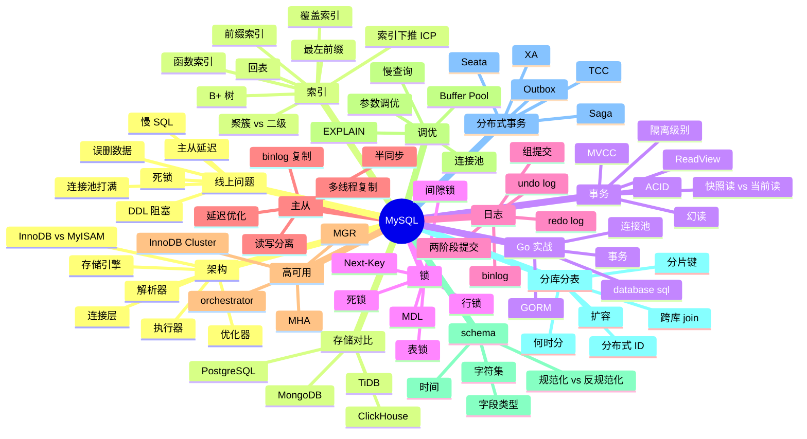
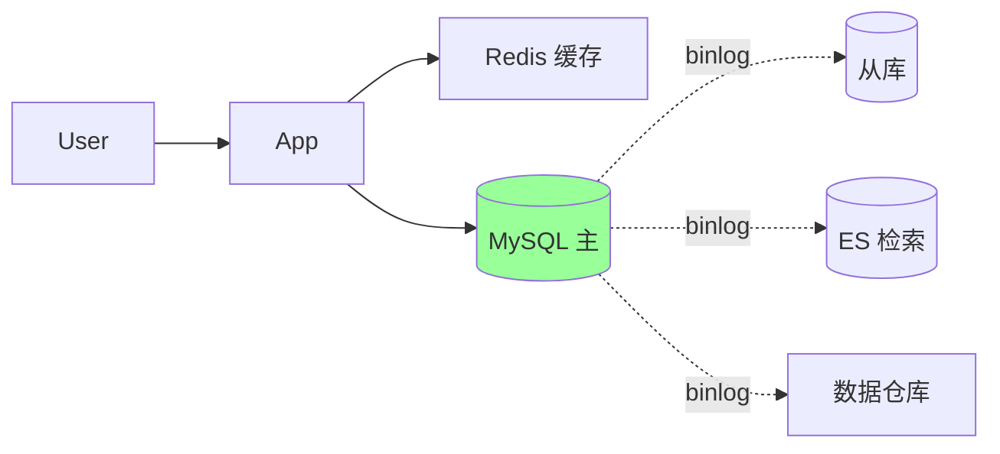
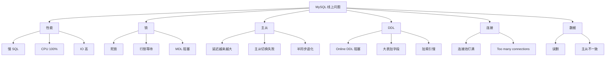
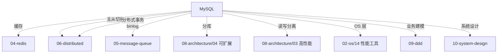

# MySQL 知识地图

> MySQL 是后端面试**最被深挖**的中间件，没有之一。从 SQL 到索引到事务到主从到分库分表，每一层都能问 30 分钟。
>
> 这份地图是 03-mysql 目录的总览：知识树 / 题型分类（P5-P8）/ 学习路径 / 系统设计中的角色 / 排查地图 / 答题方式

---

## 一、整体知识树



---

## 二、后端视角的 MySQL

| MySQL 能力 | 后端解决的问题 |
| --- | --- |
| ACID 事务 | 业务一致性（订单 / 支付 / 库存） |
| MVCC | 高并发读不阻塞写 |
| B+ 索引 | 亿级数据查询毫秒响应 |
| 行锁 + 间隙锁 | 防超卖 / 防幻读 |
| redo + binlog 2PC | 崩溃恢复 + 主从复制一致 |
| 半同步复制 | 不丢数据高可用 |
| 读写分离 | 扩展读容量 5-10x |
| 分库分表 | TB 级数据存储 |
| Buffer Pool | 内存缓存数据页（命中率决定性能） |
| Online DDL | 不停机改 schema |
| Group Commit | 高并发写吞吐 |
| 慢查询日志 | 性能问题定位 |
| 字符集 utf8mb4 | 多语言 emoji 支持 |
| GTID | 主从切换 |
| Cluster Index | 主键设计影响 IO |

---

## 三、能力分层（资深 Go 后端）

```text
L1 SQL 基础
  CRUD / JOIN / 子查询 / GROUP BY / 索引基础

L2 引擎机制
  InnoDB 存储 / B+ 树原理 / Buffer Pool / 三大日志

L3 事务与并发
  ACID / 隔离级别 / MVCC / 锁类型 / 死锁

L4 主从与高可用
  binlog 复制 / 半同步 / 多线程 / 故障切换

L5 性能调优
  EXPLAIN / 慢查询治理 / 索引优化 / 参数调优

L6 分库分表
  分片策略 / 路由 / 扩容 / 分布式 ID

L7 线上问题
  慢 SQL / 死锁 / 主从延迟 / DDL / 误删

L8 综合系统设计
  订单 / 支付 / 库存 / 分布式事务整体方案
```


**资深判断**：能从 L1 走到 L8，每层都举出**生产案例 + 量化数据**。

---

## 四、题型分类

### 4.1 基础题（P5）

```
□ MySQL 整体架构？
□ B+ 树索引为什么不用 Hash / 红黑树？
□ 事务的 ACID？
□ 隔离级别 4 种？
□ 索引怎么用？最左前缀？
□ EXPLAIN 关键字段？
□ 主键 vs 唯一索引？
```

对应：[01](01-architecture.md) / [02](02-index.md) / [03](03-transaction-lock-mvcc.md) / [14](14-explain-optimizer.md)

### 4.2 中级题（P6）

```
□ 聚簇索引 vs 二级索引 + 回表
□ 覆盖索引 / 最左前缀 / 索引下推
□ MVCC 原理 + ReadView
□ 行锁 / 间隙锁 / Next-Key
□ 幻读怎么解决？
□ redo / undo / binlog 区别？
□ 两阶段提交为什么需要？
□ 主从复制原理 + 延迟处理
□ Buffer Pool 改进 LRU
□ Online DDL + MDL 锁
```

对应：[02](02-index.md) / [03](03-transaction-lock-mvcc.md) / [04](04-log.md) / [05](05-replication-ha.md) / [13](13-innodb-buffer-pool.md) / [15](15-online-ddl-mdl.md)

### 4.3 资深题（P7+）

```
□ B+ 树为什么 3-4 层撑亿级？计算给我看
□ Cardinality 估算 + 优化器选错索引
□ 长事务危害（undo + 主从）
□ 死锁完整排查流程
□ 半同步降级为异步问题
□ 主从延迟根因 + 解法
□ 大表 DDL 方案（gh-ost / pt-osc）
□ 分库分表完整方案 + 扩容
□ 跨库 join / 分布式事务取舍
□ TiDB / OceanBase 对比 MySQL
□ MGR vs MHA vs orchestrator
```

对应：[02](02-index.md) / [03](03-transaction-lock-mvcc.md) / [05](05-replication-ha.md) / [12](12-sharding.md) / [15](15-online-ddl-mdl.md) / [19](19-storage-comparison.md)

### 4.4 综合系统设计（P7-P8）

```
□ 订单系统数据库设计（含分库分表）
□ 支付系统强一致性设计
□ 库存系统防超卖完整方案
□ 数据迁移方案（主从切换 / 上云）
□ 数据一致性对账系统
```

对应：[11](11-order-system-design.md) / [17](17-consistency-reconciliation.md) / [09](09-distributed-transaction.md)

### 4.5 线上排查题

```
□ DB CPU 100% 怎么排查？
□ 慢 SQL 怎么找 + 优化？
□ 死锁频发怎么解？
□ 主从延迟越来越大？
□ 误删数据怎么恢复？
□ 大事务怎么发现 + 治理？
□ 连接池打满？
□ Online DDL 锁阻塞业务？
```

对应：[10](10-production-cases.md)（8 个真实案例）

---

## 五、目录文件全览

| # | 文件 | 行数 | 重点 |
| --- | --- | --- | --- |
| 01 | [架构](01-architecture.md) | 220 | 连接层 / SQL 层 / 引擎层 |
| 02 | [索引](02-index.md) | 343 | B+ 树 / 聚簇 / 覆盖 / 最左 / ICP |
| 03 | [事务/锁/MVCC](03-transaction-lock-mvcc.md) | 271 | 隔离级别 / MVCC / 行锁 / Next-Key |
| 04 | [日志](04-log.md) | 279 | redo / undo / binlog / 2PC |
| 05 | [复制与 HA](05-replication-ha.md) | 280 | binlog / 半同步 / MHA / orchestrator |
| 06 | [慢 SQL 优化](06-slow-sql-optimization.md) | 264 | 慢日志 / EXPLAIN / 优化方法 |
| 07 | [Schema 设计](07-schema-design.md) | 301 | 字段类型 / 规范化 / 反规范化 |
| 08 | [对比](08-comparison.md) | 191 | InnoDB vs MyISAM / 各引擎 |
| 09 | [分布式事务](09-distributed-transaction.md) | 346 | XA / 2PC / TCC / Saga |
| 10 | [生产案例](10-production-cases.md) | 476 | 8 个线上事故案例 |
| 11 | [订单系统设计](11-order-system-design.md) | 523 | 端到端订单 DB 设计 |
| 12 | [分库分表](12-sharding.md) | 483 | 何时分 / 分片键 / 扩容 |
| 13 | [Buffer Pool](13-innodb-buffer-pool.md) | 224 | 改进 LRU / 脏页刷新 / Change Buffer |
| 14 | [EXPLAIN 优化器](14-explain-optimizer.md) | 213 | type / key / rows / Extra |
| 15 | [Online DDL / MDL](15-online-ddl-mdl.md) | 170 | gh-ost / pt-osc / INSTANT |
| 16 | [Go MySQL 实战](16-go-mysql-practice.md) | 252 | database/sql / GORM / 连接池 |
| 17 | [一致性对账](17-consistency-reconciliation.md) | 292 | 对账系统 / 实时 / T+1 |
| 18 | [字段类型/字符集/时间](18-field-types-charset-time.md) | 361 | utf8mb4 / DECIMAL / DATETIME |
| 19 | [存储对比](19-storage-comparison.md) | 443 | MySQL vs TiDB / PG / MongoDB |

总 6216 行（不含本 map）。

---

## 六、MySQL 在系统设计中的角色

### 6.1 订单系统



设计要点（详见 [11-order-system-design](11-order-system-design.md)）：
- 分库分表（按 user_id Hash 32 库）
- 订单号雪花算法（趋势递增 + 不冲突）
- 状态机严格迁移
- 历史归档（冷热分层）
- 主从读 + 主库强一致读

### 6.2 支付系统

要求**强一致 + 不能错钱**：
- DB 用 InnoDB（XA 支持）
- 业务订单号 + 唯一索引（幂等）
- 状态机严格（PENDING → PAID）
- TCC / Seata 跨服务
- T+1 对账兜底

详见 [09-distributed-transaction](09-distributed-transaction.md) + [17-consistency-reconciliation](17-consistency-reconciliation.md)。

### 6.3 库存系统

```sql
-- 防超卖核心
UPDATE stock SET count=count-1, version=version+1
WHERE item_id=? AND count>0 AND version=?
```

- 行锁 + 乐观锁（version）
- DB 兜底，Redis Lua 抢扣
- 详见 [10-system-design/15-inventory-system](../10-system-design/15-inventory-system.md)

### 6.4 用户系统

- 主键自增（短）
- 索引：UNIQUE(email) + UNIQUE(phone)
- 字段类型 utf8mb4
- 慢查询限制（用户量大）

### 6.5 报表 / 分析

```
不直接查主库
→ binlog → MQ → 数仓（Hive / ClickHouse / Doris）
→ 离线/实时聚合
```

### 6.6 Feed / 排行

不适合 MySQL（用 Redis ZSet）。

### 6.7 搜索

不适合 MySQL（LIKE 性能差，用 ES）。

---

## 七、线上问题分类地图



### 7.1 排查工具

```bash
# 慢查询
SET GLOBAL slow_query_log = 'ON';
SET GLOBAL long_query_time = 1.0;
SHOW VARIABLES LIKE 'slow%';

# 用 pt-query-digest 分析
pt-query-digest /var/log/mysql/slow.log

# 实时
SHOW PROCESSLIST;
SHOW FULL PROCESSLIST;

# 锁
SELECT * FROM information_schema.INNODB_TRX;
SELECT * FROM information_schema.INNODB_LOCKS;
SELECT * FROM information_schema.INNODB_LOCK_WAITS;
SHOW ENGINE INNODB STATUS;     # 死锁日志

# 主从
SHOW SLAVE STATUS\G  # Seconds_Behind_Master
SHOW MASTER STATUS;

# 性能
mysqltuner.pl
sys.* schema（5.7+）
```

### 7.2 排查路径

```
症状（CPU/慢/锁/延迟）
  ↓
工具（PROCESSLIST/SHOW INNODB STATUS/慢日志）
  ↓
找出问题 SQL / 事务
  ↓
EXPLAIN 看执行计划
  ↓
止血（KILL / 限流 / 切流）
  ↓
根因分析（缺索引 / 大事务 / 优化器选错）
  ↓
修复（加索引 / 改 SQL / 拆事务）
  ↓
监控防再发
```

详见 [10-production-cases](10-production-cases.md)（8 个完整案例）。

---

## 八、学习路径推荐

### 8.1 入门 → 资深（8 周）

```
Week 1: 基础
  01 架构
  02 索引（B+ 树重点）
  14 EXPLAIN

Week 2: 事务并发（最难）
  03 事务/锁/MVCC
  04 日志（redo/undo/binlog 2PC）

Week 3: 复制
  05 主从 + HA
  13 Buffer Pool
  18 字符集/时间

Week 4: 调优
  06 慢 SQL 优化
  07 Schema 设计
  15 Online DDL

Week 5: 分布式
  12 分库分表
  09 分布式事务
  17 一致性对账

Week 6: 实战
  10 生产案例（8 个）
  11 订单系统设计

Week 7: 进阶
  19 存储对比（TiDB / PG / MongoDB）
  16 Go MySQL 实战
  08 引擎对比

Week 8: 综合
  ../99-meta/mysql-20（速记）
  ../99-meta/01-cross-topic-index（交叉索引）
  ../10-system-design/16-high-concurrency-scenarios（综合实战）
```

### 8.2 面试前 1 周冲刺

```
Day 1: 99-meta/mysql-20.md（背诵版 + 标准答案）
Day 2: 02 索引 + 03 事务 + 04 日志
Day 3: 05 主从 + 12 分库分表
Day 4: 09 分布式事务 + 11 订单设计
Day 5: 10 生产案例（8 个）
Day 6: 综合实战 system-design/16
Day 7: 模拟面试
```

### 8.3 大厂特化

```
字节系（高并发）:
  重点 12 分库分表 / 11 订单 / 09 分布式事务 / TiDB
  + 自己跑分库分表演练

阿里系（中台 / 蚂蚁）:
  重点 09 分布式事务 / 17 对账 / OceanBase / Seata

美团 / 拼多多（电商）:
  重点 11 订单 / 09 分布式事务 / 14 EXPLAIN / 10 生产案例

金融 / 银行（强一致）:
  重点 03 事务 / 09 分布式事务 / 17 对账 / XA
```

---

## 九、答题模板

### 9.1 概念题（"InnoDB 为什么用 B+ 树"）

```
3 步:
1. 定义: B+ 树是多叉平衡树，叶子节点链表
2. 对比:
   - vs B 树: 叶子有链表，范围查询好
   - vs 红黑树: 多叉，树矮，磁盘 IO 少
   - vs Hash: 不支持范围
3. 计算:
   - 单页 16KB / 主键 4-8B + 指针 6B → 每页 ~1000 个
   - 3 层 = 1000³ = 10 亿
4. 代价:
   - 插入分裂（主键无序时）
   - 主键过长 → 二级索引也大
```

### 9.2 设计题（"订单表设计"）

```
4 步:
1. 容量:
   - 日均 100 万 → 一年 3.6 亿
   - 超过单表 5000 万 → 必须分

2. 表设计:
   CREATE TABLE orders (
     id BIGINT PRIMARY KEY,           -- 雪花
     order_no VARCHAR(32) UNIQUE,     -- 业务订单号（幂等）
     user_id BIGINT NOT NULL,
     status ENUM(...),
     total_amount BIGINT,             -- 分（不要 DECIMAL）
     created_at TIMESTAMP,
     INDEX idx_user_created (user_id, created_at)
   ) ENGINE=InnoDB DEFAULT CHARSET=utf8mb4;

3. 分库分表:
   - 按 user_id Hash 32 库
   - 按 order_no（含 user_id 段）查询时反向解析
   - 跨库报表走数仓

4. 取舍:
   - 一致性: 单库事务 / 跨库 Saga
   - 主从: 写主读从（主库读关键场景）
   - 历史归档: 1 年前数据归档冷库
```

### 9.3 排查题（"DB CPU 100%"）

```
4 步:
1. 现象: CPU 100% / 慢查询激增 / 业务超时
2. 排查工具:
   - SHOW PROCESSLIST 看正在跑的 SQL
   - SHOW ENGINE INNODB STATUS（锁 + 事务）
   - 慢查询日志 + pt-query-digest
   - sys.* / performance_schema
3. 常见原因:
   - 全表扫（缺索引）
   - 索引选择错（用 FORCE INDEX）
   - 大事务（拆分）
   - 锁等待（死锁 / MDL）
   - 优化器估算错（ANALYZE TABLE）
4. 止血 + 修复:
   - KILL 慢 SQL
   - 限流应用层
   - 加索引（Online DDL）
   - 改 SQL（避免全表扫）
   - 拆事务
```

### 9.4 取舍题（"分库分表 vs TiDB"）

```
3 步:
1. 数据量预估（决定方向）:
   - < 1 亿: 单库主从 + 读写分离
   - 1-10 亿: 分库分表
   - > 10 亿 + 强一致: TiDB

2. 团队能力:
   - 团队熟 MySQL → 分库分表
   - 不想自维 → TiDB / OceanBase

3. 业务特征:
   - 强 OLTP → MySQL
   - HTAP → TiDB
   - 跨地域强一致 → CockroachDB / Spanner
```

---

## 十、面试表达

```text
MySQL 面试题不是孤立的命令记忆，而是后端业务的核心 DB。

我把 MySQL 知识分成 8 层：
- L1 SQL（基础）
- L2 引擎机制（B+ 树 / Buffer Pool / 三大日志）
- L3 事务并发（ACID / MVCC / 锁 / 隔离级别）
- L4 主从 HA（binlog / 半同步 / MHA / orchestrator）
- L5 性能调优（EXPLAIN / 慢查询 / 索引优化）
- L6 分库分表（分片 / 路由 / 扩容）
- L7 线上排查（慢 SQL / 死锁 / 延迟 / DDL）
- L8 系统设计（订单 / 支付 / 库存）

回答时优先讲机制 + 代价 + 边界。
线上排查题按"现象 → 工具 → 证据 → 止血 → 根因 → 修复 → 防再发"流程。
设计题按"容量 → 表设计 → 分库分表 → 一致性 → 取舍"四步走。
```

---

## 十一、常见疑问与误区

### 误区 1：InnoDB RR 完全解决幻读

错。**快照读不幻读**（MVCC），**当前读靠间隙锁**（Next-Key）。详见 [03](03-transaction-lock-mvcc.md)。

### 误区 2：唯一索引一定比普通索引慢

错。Change Buffer 优化让普通索引插入更快，但唯一索引必须查页（不能用 CB）。读取性能两者一样。

### 误区 3：count(*) 比 count(1) 慢

错。MySQL 5.7+ 优化器对 count(*) 有特殊优化，等于 count(1)。**count(field) 才会跳过 NULL**。

### 误区 4：FOR UPDATE 一定锁全表

错。**有索引锁行 + 间隙；没索引才退化为表锁**。

### 误区 5：删除小于 5% 数据不需重组

部分错。删除后**主键 B+ 树有空洞**，OPTIMIZE TABLE 才能回收。但 5% 以内通常可以忽略。

### 误区 6：MyISAM 比 InnoDB 快

老观念。MySQL 5.5+ InnoDB 已默认引擎，**多数场景比 MyISAM 快**（除了纯只读 + 简单 SELECT）。

### 误区 7：主从延迟靠加更多从库解决

错。**加从不解决延迟**。延迟根因：单线程 SQL 重放 / 大事务 / 主从带宽。多线程复制 + 拆事务 + 半同步是正解。

### 误区 8：Online DDL = 无影响

错。**仍要短暂 MDL 写锁**（开始 + 结束），长事务会阻塞 DDL，DDL 反过来阻塞业务。生产用 gh-ost / pt-osc。

---

## 十二、与其他模块的关系



跨模块查找：[../99-meta/01-cross-topic-index](../99-meta/01-cross-topic-index.md)

---

## 十三、面试加分点

- 能从 **L1（SQL）→ L8（系统设计）** 8 层级级答出
- **B+ 树 3-4 层撑亿级**（用计算给出）
- **MVCC + ReadView** 完整推演（包括 RC 和 RR 区别）
- **幻读 = 快照读 + 当前读 + 间隙锁** 三件套
- **redo / undo / binlog 2PC** 的作用
- **半同步 vs 异步**（不丢数据 vs 性能）
- **多线程复制（writeset）** 解决主从延迟
- **分库分表后扩容** 双写 + 切流方案
- **gh-ost / pt-osc** 大表 DDL 标配
- **Online DDL INSTANT 算法**（8.0 秒级加字段）
- **CDC（Canal / Debezium）** 订阅 binlog 是数据流标配
- **TiDB Percolator 模型** 知道一点
- **Go database/sql + GORM 连接池** 实战
- 真实案例 + 量化数据
- 知道 **MyISAM 已淘汰**

---

## 十四、推荐阅读路径

```
入门:
  □ 《MySQL 必知必会》
  □ 《高性能 MySQL》前 6 章
  □ 极客时间《MySQL 实战 45 讲》（强烈推荐）
  □ 03-mysql/01-04（架构 / 索引 / 事务 / 日志）

进阶:
  □ 《高性能 MySQL》第 4 版
  □ 官方文档（事务 / 复制 / Online DDL）
  □ 03-mysql/05-15

资深:
  □ 《MySQL 技术内幕：InnoDB 存储引擎》姜承尧
  □ MySQL 内核源码（InnoDB / 优化器）
  □ Percona / Vitess / TiDB 博客
  □ 03-mysql/16-19 + 99-meta/mysql-20

实战:
  □ 自己部署主从 + Cluster
  □ 跑 sysbench 压测
  □ 用 pt-query-digest 分析慢查询
  □ 演练大表 DDL（gh-ost）
  □ 模拟死锁 + 主从切换
```

---

## 十五、与 99-meta 的关联

```
速记题集: 99-meta/mysql-20.md（20 题）
跨主题索引: 99-meta/01-cross-topic-index.md
综合实战: 10-system-design/16-high-concurrency-scenarios.md
分布式事务: 06-distributed/03-transaction.md + 06-distributed/11-newsql-tcc-frameworks.md
```
