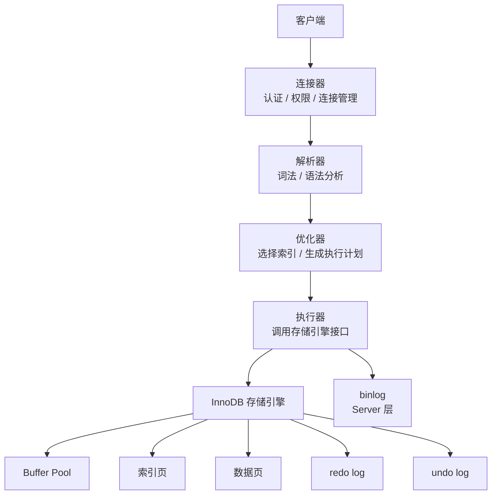
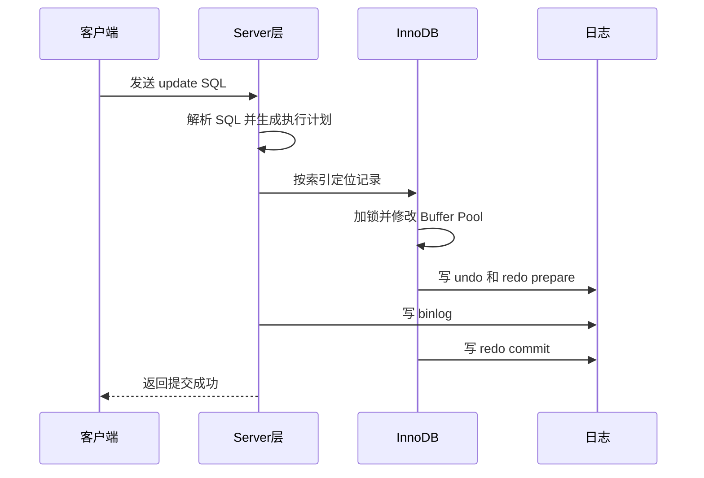

# MySQL 架构

> 先建立 MySQL 的分层视角：SQL 不是直接操作磁盘，而是经过 Server 层和存储引擎层协作完成。

## 一、核心原理

### 1. MySQL 分层架构

MySQL 大体可以分为两层：

- **Server 层**：连接管理、权限校验、SQL 解析、优化器、执行器、binlog。
- **存储引擎层**：真正负责数据读写、索引组织、事务、锁、redo log、undo log。

常见面试表达：

```text
客户端
  -> 连接器
  -> 解析器
  -> 优化器
  -> 执行器
  -> 存储引擎
  -> 数据页 / 索引页
```



这个分层很重要，因为很多问题都要先判断属于哪一层：

- binlog 属于 Server 层。
- redo log、undo log 属于 InnoDB。
- SQL 优化器属于 Server 层。
- 行锁、MVCC 主要由 InnoDB 实现。

### 2. 一条 SQL 的执行流程

以查询为例：

1. 客户端建立连接，连接器做认证、权限相关处理。
2. 解析器做词法、语法分析，判断 SQL 是否合法。
3. 优化器生成执行计划，决定用哪个索引、表连接顺序等。
4. 执行器根据计划调用存储引擎接口。
5. 存储引擎读取索引页、数据页，返回结果。

以更新为例，还会涉及：

- undo log：用于回滚和 MVCC。
- redo log：用于崩溃恢复。
- binlog：用于复制和恢复。
- 锁：保证并发更新的正确性。



### 3. InnoDB 的定位

InnoDB 是 MySQL 默认且最常用的事务型存储引擎。它的关键能力：

- 支持事务。
- 支持行级锁。
- 支持 MVCC。
- 支持崩溃恢复。
- 使用 B+Tree 索引。
- 主键索引是聚簇索引。

面试时可以这样总结：

> Server 层负责“理解和执行 SQL”，InnoDB 负责“可靠地存取数据”。事务、锁、MVCC、redo/undo 都是 InnoDB 面试的重点。

### 4. InnoDB 和 MyISAM

| 对比点 | InnoDB | MyISAM |
| --- | --- | --- |
| 事务 | 支持 | 不支持 |
| 锁粒度 | 行锁为主 | 表锁 |
| 崩溃恢复 | 强 | 弱 |
| 外键 | 支持 | 不支持 |
| 索引结构 | 聚簇索引 | 非聚簇索引 |
| 适用场景 | OLTP、交易、核心业务 | 历史遗留、读多写少场景 |

现在面试里 MyISAM 更多是对比项，不是重点。重点是借它引出 InnoDB 的事务、锁和聚簇索引。

## 二、高频面试题

### MySQL 一条 SQL 是如何执行的？

答题框架：

1. 连接器建立连接，校验用户和权限。
2. 解析器解析 SQL。
3. 优化器选择执行计划。
4. 执行器调用存储引擎接口。
5. 存储引擎通过索引和数据页读取数据。
6. 如果是更新，还会写 undo log、redo log、binlog，并涉及事务提交。

不要只背“连接器、查询缓存、分析器、优化器、执行器”。MySQL 8.0 已经移除了查询缓存，继续把查询缓存作为核心流程容易显得资料过旧。

### Server 层和 InnoDB 分别做什么？

Server 层更偏 SQL 通用能力：

- 连接管理。
- SQL 解析。
- SQL 优化。
- 执行调度。
- binlog。

InnoDB 更偏数据可靠存储：

- 数据页、索引页管理。
- Buffer Pool。
- redo log、undo log。
- 事务、锁、MVCC。
- 崩溃恢复。

### 为什么优化器有时不走索引？

优化器选择的是“成本较低”的执行计划，而不是“只要有索引就走索引”。可能原因：

- 表数据量很小，全表扫描更便宜。
- 索引区分度低，过滤效果差。
- 需要回表的数据太多。
- 统计信息不准确。
- SQL 写法导致索引不能有效使用。

面试补一句：

> 是否走索引要看执行计划和成本，不是看表上有没有索引。

### 为什么 MySQL 8.0 移除了查询缓存？

查询缓存按 SQL 文本缓存结果。问题是：

- 表一更新，相关缓存就要失效。
- 高并发写入下缓存维护成本高。
- 命中率不稳定。
- 容易成为锁竞争点。

所以 MySQL 8.0 移除查询缓存。业务侧更常用 Redis、本地缓存、物化视图、汇总表等方式做缓存。

## 三、典型场景

### 场景 1：接口突然变慢，怀疑 MySQL

排查顺序：

1. 看应用指标：接口耗时、错误率、连接池是否耗尽。
2. 看数据库指标：QPS、TPS、CPU、IO、连接数、锁等待。
3. 看慢查询日志，定位 SQL。
4. 用 EXPLAIN 看执行计划。
5. 判断是 SQL 慢、锁等待、主从延迟、IO 抖动，还是连接池问题。

不要一上来就说“加索引”。慢不一定是索引问题。

### 场景 2：明明 SQL 没变，突然变慢

可能原因：

- 数据量增长导致原计划不再合适。
- 统计信息变化，优化器选择了不同索引。
- Buffer Pool 命中率下降。
- 出现锁等待。
- 主从延迟导致读请求堆积。
- 磁盘 IO 抖动。

这类问题要结合监控和执行计划历史，不要只看当前 SQL。

## 四、常见坑

- 把 MySQL 所有能力都归到一个“数据库层”，不区分 Server 和 InnoDB。
- 把 binlog、redo log、undo log 混为一谈。
- 认为有索引就一定走索引。
- 认为 SQL 执行顺序等同于自己写的语句顺序。
- 继续把查询缓存当作 MySQL 8.0 的核心能力。

## 五、答题模板

### 问架构

```text
MySQL 我会先分成 Server 层和存储引擎层。
Server 层负责连接、解析、优化、执行和 binlog。
InnoDB 负责数据页、索引页、事务、锁、MVCC、redo/undo。
一条 SQL 会先经过 Server 层生成执行计划，再通过执行器调用 InnoDB 读写数据。
如果是更新，还会涉及 undo、redo、binlog 和两阶段提交。
```

### 问 InnoDB

```text
InnoDB 是事务型存储引擎，核心能力是事务、行锁、MVCC、崩溃恢复和聚簇索引。
面试里谈 InnoDB 通常会延伸到索引结构、事务隔离、锁机制、日志恢复这些问题。
```
