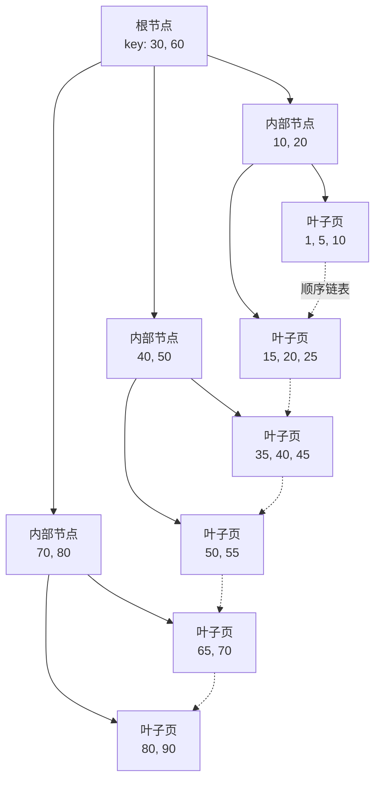
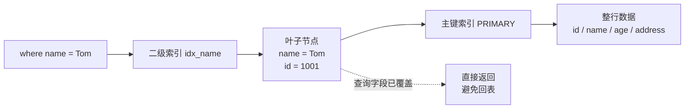

# MySQL 索引

> 索引题是 MySQL 面试最高频部分，核心不是背概念，而是能解释”为什么这样建、为什么没走、怎么优化”。

## 〇、核心提炼（5 段式）

### 核心机制（4 条必背）

1. **B+ 树**：多叉平衡树 + 叶子链表，磁盘 IO 友好的索引结构（3-4 层撑亿级数据）
2. **聚簇索引 + 二级索引**：主键索引叶子放完整行，二级索引叶子放主键值（**回表**）
3. **覆盖索引 + 最左前缀**：联合索引按列顺序构建 → 查询带最左 N 列才能用上 + 包含查询字段则免回表
4. **索引下推 ICP**（5.6+）：把 WHERE 过滤下推到 InnoDB 层（在索引上过滤），减少回表

### 核心本质（必懂）

> MySQL 索引的本质是 **”用磁盘空间 + 写入开销换读取速度”**：
>
> - **B+ 树是磁盘场景的最优解**：不是因为它最快，而是它**最少 IO**
>   - 单页 16KB / 索引项 ~14B → 每页 ~1170 个分支
>   - 3 层 = 1170³ ≈ 16 亿，根 + 中间常驻 Buffer Pool → 一次查询 1-2 次 IO
> - **聚簇索引是 InnoDB 的”主存储”**：表数据本身就按主键 B+ 树组织，不是另一份”索引”
>   - 所以主键查询 = 直接定位数据
>   - 二级索引查询 = 先找到主键 → 再查主键索引 → 回表
> - **代价**：每加一个索引 = 多一棵 B+ 树要维护 → 写性能下降 + 存储翻倍
>
> **关键事实**：
> - 主键设计**严重影响**性能（无序主键 = 频繁页分裂 = 写入慢 + 空间浪费）
> - 联合索引顺序**严重影响**命中（最左前缀 = 索引”前缀路径”才有效）

### 完整流程（面试必背）

```
SELECT * FROM orders WHERE user_id = 100 AND created_at > '...' 流程:

1. 优化器选择索引:
   - 评估每个候选索引的代价（行数估算 + 回表代价）
   - 选 idx_user_created (user_id, created_at)

2. 二级索引查找:
   - 从根节点开始
   - CRC + 二分定位 user_id=100 的第一个叶子
   - 沿叶子链表向后扫直到 created_at > '...'
   - 拿到这些行的主键值

3. 回表（如果非覆盖索引）:
   - 用主键值去聚簇索引中查完整行
   - 返回所有字段

4. 索引下推（ICP）:
   - 如果 WHERE 还有 status='paid' 等条件
   - 在二级索引层就过滤（不需要先回表再过滤）
   - 减少回表次数

5. 返回结果

页分裂场景（写入路径）:
   INSERT 时如果目标页已满:
     - 顺序主键: 在末尾追加 → 加新页 → 性能好
     - 无序主键: 中间分裂 → 复制一半数据到新页 → 性能差 + 空间浪费
```

### 4 条核心机制 - 逐点讲透

#### 1. B+ 树（为什么是它）

```
对比其他结构:

vs B 树:
  B 树叶子节点不连接 → 范围查询要回溯
  B+ 叶子双向链表 → 范围扫描连续 IO

vs 红黑树（二叉）:
  1 亿数据 27 层（log2 1亿）
  每层一次磁盘 IO → 27 次 IO
  B+ 三叉 → 3 次 IO
  → 树越宽 IO 越少（磁盘场景关键）

vs Hash:
  Hash O(1) 但不支持范围、排序、模糊
  InnoDB 的 Adaptive Hash Index 是热点优化，不是主索引

vs LSM Tree:
  LSM 写好（顺序追加）但读放大、空间放大
  B+ 读写均衡，OLTP 场景更合适

→ B+ 树 = 磁盘 IO 最少 + 范围查询最优 + 读写均衡
```

#### 2. 聚簇索引 vs 二级索引（回表本质）

```
InnoDB 的聚簇索引:
  - 表数据本身按主键 B+ 树组织
  - 叶子节点 = 完整行数据
  - 没显式定义主键 → InnoDB 自动用第一个唯一非空索引 / 隐藏 ROW_ID

二级索引（非聚簇索引）:
  - 单独一棵 B+ 树
  - 叶子节点 = 索引列值 + 主键值
  - 不存完整行

回表:
  二级索引查到主键 → 再用主键查聚簇索引 → 拿完整行
  → 多一次树查找

主键设计影响:
  - 主键越短 → 二级索引越小（每个二级索引行 = key + 主键）
  - 主键有序 → 插入末尾不分裂 → 写入快
  - 主键过长（如 UUID 36B）→ 所有二级索引膨胀 + 写入慢
```

#### 3. 覆盖索引 + 最左前缀

```
覆盖索引（避免回表）:
  SELECT id, name FROM users WHERE name = 'A'
  如果有 idx_name_id(name, id)
  → 索引本身就有 id, name → 不回表
  → EXPLAIN Extra: Using index

最左前缀原则:
  联合索引 (a, b, c) 相当于建了:
    (a) / (a, b) / (a, b, c) 三个索引

  WHERE 命中规则:
  ✓ a = 1
  ✓ a = 1 AND b = 2
  ✓ a = 1 AND b = 2 AND c = 3
  ✗ b = 2（缺 a，索引失效）
  ✗ b = 2 AND c = 3（缺 a，失效）
  ⚠️ a = 1 AND c = 3（只用上 a，c 用不上）

设计原则:
  1. 等值查询字段在前（a, b 都等值）
  2. 范围查询字段在后（范围后的字段用不上）
  3. 高选择性在前（a 区分度高 → 第一列）
```

#### 4. 索引下推 ICP（5.6+ 优化）

```
没有 ICP（5.6 前）:
  联合索引 (name, age)
  WHERE name LIKE 'A%' AND age = 20
  → Server 层拿 name LIKE 'A%' 的所有主键
  → 回表 → 每行查 age 是否等于 20
  → 回表多

有 ICP（5.6+）:
  → InnoDB 层在索引上同时过滤 name LIKE 'A%' AND age = 20
  → 只对满足条件的回表
  → 回表次数大幅减少

EXPLAIN Extra: Using index condition
```

### 一句话总结

> MySQL 索引的核心是：**B+ 树 + 聚簇/二级双层结构 + 覆盖索引 + 最左前缀 + ICP 索引下推**，
> 本质是**用空间和写入开销换读取速度**：B+ 树是磁盘 IO 最少的方案（3-4 层撑亿级），
> 聚簇索引让主键查询=数据本身，二级索引查询要回表（除非覆盖）。
> **代价**：每加一个索引 = 多一棵 B+ 树 = 写性能下降 + 存储翻倍。
> 设计原则：**短主键 + 顺序主键 + 联合索引按”等值前 / 范围后 / 高选择性前”** 组合。

---

## 一、核心原理

### 1. 为什么用 B+Tree

数据库索引要解决的是磁盘 IO 问题。B+Tree 适合数据库，是因为：

- 多路平衡树，树高低，磁盘 IO 次数少。
- 非叶子节点只存 key 和指针，一页能放更多 key。
- 叶子节点保存完整索引项，并通过链表连接，适合范围查询。
- 支持等值、范围、排序、最左前缀。



对比：

- 红黑树树高更高，更适合内存结构，不适合磁盘页模型。
- Hash 等值查询快，但不适合范围查询、排序、最左前缀。
- B Tree 非叶子节点也存数据，范围扫描不如 B+Tree 友好。

### 2. 聚簇索引和二级索引

InnoDB 的主键索引是聚簇索引：

- 叶子节点保存整行数据。
- 数据本身按主键组织。
- 一张表只能有一个聚簇索引。

二级索引：

- 叶子节点保存索引列和主键值。
- 通过二级索引找到主键后，再回到主键索引查整行，叫回表。



所以主键设计会影响所有二级索引：

- 主键太长，二级索引也会变大。
- 主键随机，容易导致页分裂和写入抖动。
- 常见建议是使用短、有序、稳定的主键。

### 3. 回表和覆盖索引

回表：

```sql
select * from user where name = 'Tom';
```

如果有索引 `(name)`：

1. 先从 name 索引找到主键 id。
2. 再用 id 回主键索引查整行。

覆盖索引：

```sql
select id, name from user where name = 'Tom';
```

如果查询字段都在 `(name)` 索引里，或者索引叶子节点自带主键 id，就不需要回表。

覆盖索引适合：

- 高频列表页。
- 查询字段少。
- 回表成本高。
- 分页查询需要先缩小结果集。

### 4. 联合索引和最左前缀

联合索引 `(a, b, c)` 的索引项按 `a -> b -> c` 排序。

可以较好使用的情况：

```sql
where a = ?
where a = ? and b = ?
where a = ? and b = ? and c = ?
where a = ? and b > ?
```

不理想的情况：

```sql
where b = ?
where c = ?
where b = ? and c = ?
```

范围条件要注意：

```sql
where a = ? and b > ? and c = ?
```

一般可以利用 `a` 和 `b` 定位范围，但 `c` 很难继续用于精确缩小索引扫描范围。不同版本和优化器能力会有差异，面试表达不要绝对化。

### 5. 索引失效常见原因

常见原因：

- 联合索引不满足最左前缀。
- 对索引列使用函数。
- 对索引列做表达式计算。
- 隐式类型转换。
- `like '%xxx'`。
- `or` 两侧条件无法都有效使用索引。
- 区分度太低，优化器认为全表扫描更便宜。

例子：

```sql
-- 不好
where date(create_time) = '2026-05-03'

-- 更好
where create_time >= '2026-05-03 00:00:00'
  and create_time <  '2026-05-04 00:00:00'
```

## 二、高频面试题

### 为什么推荐自增主键？

自增主键的优势：

- 顺序写入，减少页分裂。
- 主键短，二级索引更小。
- 查询和关联简单。

但不是所有场景都必须自增主键：

- 分库分表需要全局唯一 ID。
- 对外暴露的业务 ID 不一定适合用数据库自增 ID。
- 高并发插入可能出现尾部热点，需要结合业务判断。

### 什么是最左前缀原则？

联合索引按最左列开始排序。只有查询条件从最左列连续命中，才能充分利用索引的有序性。

答题时不要停在“必须从最左边开始”，要补充：

- 等值条件可以连续利用。
- 范围条件右侧列利用能力变弱。
- `order by` 和 `group by` 也受索引列顺序影响。
- 最终执行计划由优化器根据成本决定。

### 覆盖索引为什么快？

因为不需要回表。二级索引已经包含查询所需字段时，MySQL 只扫描二级索引即可。

优势：

- 减少随机 IO。
- 减少主键索引访问。
- 对列表页、分页页收益明显。

代价：

- 索引字段更多，写入成本增加。
- 索引占用更多空间。
- 不能为了覆盖所有查询无限加宽索引。

### 索引是不是越多越好？

不是。

索引的代价：

- 写入时要维护索引。
- 更新索引列可能触发更多页修改。
- 占用磁盘和内存。
- 优化器候选路径变多，统计信息不准时可能选错。

合理做法：

- 根据核心查询建联合索引。
- 定期清理重复索引和无效索引。
- 高频写表谨慎加索引。

## 三、典型场景

### 场景 1：订单列表如何建索引？

查询：

```sql
select id, order_no, status, created_at
from orders
where user_id = ?
  and status = ?
order by created_at desc
limit 20;
```

可考虑：

```sql
(user_id, status, created_at)
```

原因：

- `user_id` 通常是租户或用户隔离条件。
- `status` 是过滤条件。
- `created_at` 支持排序和分页。
- 查询字段少时可进一步考虑覆盖索引，但要控制索引宽度。

如果用户经常查全部状态：

```sql
where user_id = ?
order by created_at desc
limit 20;
```

可能还需要：

```sql
(user_id, created_at)
```

索引设计要围绕真实查询，不是凭字段感觉。

### 场景 2：为什么加了索引还是慢？

可能原因：

- 走了索引但扫描行数仍然很多。
- 回表次数太多。
- 排序没有利用索引。
- 索引区分度低。
- 查询返回字段太多。
- 实际慢在锁等待，不是扫描。
- 统计信息不准确，执行计划不稳定。

排查：

1. 看 `EXPLAIN` 的 `key`、`type`、`rows`、`Extra`。
2. 看实际扫描行数和返回行数。
3. 看是否出现 `Using filesort`、`Using temporary`。
4. 看慢查询日志里的锁等待时间。

### 场景 3：深分页如何优化？

低效写法：

```sql
select *
from orders
where user_id = ?
order by id
limit 100000, 20;
```

优化方式：

```sql
select *
from orders
where user_id = ?
  and id > ?
order by id
limit 20;
```

或者延迟关联：

```sql
select o.*
from orders o
join (
  select id
  from orders
  where user_id = ?
  order by id
  limit 100000, 20
) t on o.id = t.id;
```

游标分页更适合业务列表，延迟关联适合不得不跳页的场景。

## 四、常见坑

- `select *` 会增加回表和网络传输成本。
- 字段类型不一致会导致隐式转换。
- 联合索引顺序要服务查询条件，不是按字段出现顺序随便建。
- 低区分度字段单独建索引收益低，比如性别、布尔状态。
- `order by` 字段不在合适的联合索引里，容易文件排序。
- 大字段不适合放进普通联合索引。
- 唯一索引允许多个 `NULL`，业务不允许时要加 `NOT NULL`。

## 五、答题模板

### 问索引原理

```text
MySQL InnoDB 常用 B+Tree，因为它适合磁盘页模型。
树高低，IO 少，叶子节点有序链表适合范围查询。
InnoDB 主键索引是聚簇索引，叶子节点保存整行数据；
二级索引叶子节点保存主键，所以二级索引查整行通常要回表。
```

### 问索引设计

```text
我会先看核心查询，而不是直接按字段建索引。
优先识别等值过滤、范围过滤、排序、分页和返回字段。
常见做法是设计联合索引，让过滤和排序尽量在索引上完成；
如果查询字段少，可以考虑覆盖索引。
同时要控制索引数量，因为索引会增加写入和存储成本。
```

### 问索引失效

```text
索引失效本质是不能利用索引的有序性，或者优化器认为走索引成本更高。
常见原因有函数、表达式、隐式转换、前缀模糊查询、联合索引不满足最左前缀、区分度太低。
排查时不能只看有没有索引，要看 EXPLAIN 的 key、type、rows 和 Extra。
```
