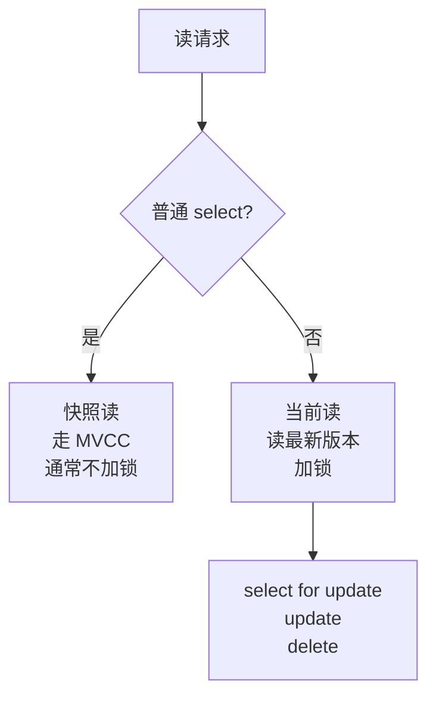

# 事务、锁、MVCC

> 事务题的核心是并发正确性：读写如何互不干扰，异常如何回滚，崩溃后如何恢复。

## 一、核心原理

### 1. ACID

事务的四个特性：

- **原子性**：事务内操作要么全部成功，要么全部回滚，主要依赖 undo log。
- **一致性**：事务前后数据满足约束和业务规则，是事务机制追求的结果。
- **隔离性**：并发事务之间互相隔离，依赖锁和 MVCC。
- **持久性**：事务提交后数据不丢，依赖 redo log 和刷盘策略。

面试里要注意：

> 一致性不是某一个日志单独保证的，它依赖数据库约束、事务机制和业务设计共同保证。

### 2. 隔离级别

#### 2.1 表象：4 级 vs 3 种并发现象

| 隔离级别 | 脏读 | 不可重复读 | 幻读 | 说明 |
| --- | --- | --- | --- | --- |
| 读未提交 RU | ❌ | ❌ | ❌ | 几乎不用 |
| 读已提交 RC | ✅ | ❌ | ❌ | 每次查询生成新 Read View |
| 可重复读 RR | ✅ | ✅ | ⚠️ | InnoDB 默认，快照读避免幻读 |
| 串行化 | ✅ | ✅ | ✅ | 强制串行，性能差 |

三个并发现象：

- **脏读**：读到其他事务未提交的数据。
- **不可重复读**：同一事务内两次读同一行，结果不同（关注**单行**，UPDATE 引起）。
- **幻读**：同一事务内两次范围查询，出现新增或消失的行（关注**行集合**，INSERT/DELETE 引起）。

#### 2.2 本质：隔离级别 = 锁的组合 ★★★

> **表象只回答"防什么"，本质回答"为什么这样防"——四个级别的差异本质是锁的组合不同。**

| 隔离级别 | 写锁 | 读锁 | 范围锁 | 解释 |
| --- | --- | --- | --- | --- |
| **读未提交** | ✅ 持有到事务结束 | ❌ 不加 | ❌ | 读不加锁 → 读到别人未提交的写 → **脏读** |
| **读已提交** | ✅ 持有到事务结束 | ⚠️ **读完立即释放** | ❌ | 加读锁但马上放 → 读到的是已提交 → 但**下次读时别人可能改完了** → **不可重复读** |
| **可重复读** | ✅ 持有到事务结束 | ✅ **持有到事务结束** | ❌ | 读锁不放 → 别人改不了你读过的行 → **同行重复读一致** → 但别人能 INSERT 到范围内 → **幻读** |
| **串行化** | ✅ 持有到事务结束 | ✅ 持有到事务结束 | ✅ **锁住区间** | 范围锁挡住新插入 → **彻底无幻读**，代价是并发退化为串行 |

**记忆口诀**：

```
RU: 只有写锁                    → 啥都防不住（除了写写冲突）
RC: 写锁 + 读完就放的读锁       → 防脏读
RR: 写锁 + 读锁持到结束         → 防脏读 + 不可重复读
SR: 写锁 + 读锁 + 范围锁        → 全防
```

每升一级 = 多加一种锁 / 多持锁更久 → 一致性强 + 并发低。

#### 2.3 MVCC 在隔离级别里的位置

> **MVCC 不是另一个隔离级别，是"读+写"冲突的优化策略。**

```
四个级别按"读写冲突"分类:

  RU      → 读不加锁 → 没有读写冲突可言 → MVCC 不介入
  RC      → 读要加锁（读后放）→ MVCC 替代读锁 → 读不阻塞写
  RR      → 读要加锁（持到末）→ MVCC 替代读锁 → 读不阻塞写
  SR      → 必须真加锁 → MVCC 无法保证范围 → 退化到加锁

→ MVCC 只在 RC / RR 起作用（中间两级）
→ RU 不需要、SR 救不了
```

**MVCC 的等价语义**：

| 级别 | 加锁视角 | MVCC 视角（InnoDB 实际做法）|
| --- | --- | --- |
| **RC** | 写锁 + 短读锁 | **每次 SELECT 都建新 Read View**，总是读"最新已提交版本" |
| **RR** | 写锁 + 长读锁 | **事务首次 SELECT 建 Read View 后复用**，总是读"事务启动时已提交的版本" |

→ **MVCC 把"读加锁"换成了"读快照"**，效果等价但并发飙升（读不阻塞写、写不阻塞读）。

#### 2.4 InnoDB 在 RR 下如何防幻读（突破 SQL 标准）

SQL 标准里 RR 允许幻读，但 InnoDB 在 RR 下基本防住了：

| 读类型 | 防幻读机制 |
| --- | --- |
| **快照读**（普通 SELECT）| **MVCC**——Read View 锁定一致快照，新插入的行不在快照里 |
| **当前读**（`SELECT ... FOR UPDATE` / UPDATE / DELETE）| **Next-Key Lock**（行锁 + **间隙锁**）——锁住索引区间，别人插不进来 |

→ InnoDB 的 RR ≈ 标准 RR + 间隙锁 + MVCC，**当前读和快照读都防住了幻读**。

#### 2.5 业内默认选择

| DB | 默认级别 | 理由 |
| --- | --- | --- |
| **MySQL InnoDB** | RR | 兼容 statement binlog（早期主从复制要求）|
| Oracle / PostgreSQL / SQL Server | **RC** | 写锁短、并发高 |
| **阿里 / 字节内部 MySQL** | **改 RC** | 避免 RR 间隙锁死锁 + row binlog 已是主流 |

### 3. MVCC

#### 3.0 核心提炼（5 段式）

##### 核心机制（4 条必背）

1. **隐藏字段** - 每行隐藏 3 个字段：`DB_TRX_ID`（最近修改事务 ID）/ `DB_ROLL_PTR`（指向 undo log）/ `DB_ROW_ID`（无主键时用）
2. **undo log 链** - 一行的所有历史版本组成单链表，沿 `DB_ROLL_PTR` 回溯
3. **Read View 快照** - 事务的"可见性视角"：`m_ids` 活跃事务列表 + `min_trx_id` + `max_trx_id` + `creator_trx_id`
4. **可见性判断** - 5 条规则决定每个版本是否对当前事务可见，不可见则沿 undo 链回溯

##### 核心本质（必懂）

> MVCC 的本质是**用空间换并发**：
>
> - 每个写操作不修改原数据，而是**追加新版本 + 保留旧版本到 undo log**
> - 读时按事务的 Read View 找"自己能看到的版本"
> - **读不加锁、写不阻塞读、读不阻塞写** → 高并发的根本
>
> RC vs RR 的本质差异 = **Read View 创建时机**：
> - **RC**：每次 SELECT 都创建新 Read View → 每次都看最新已提交
> - **RR**：事务第一个 SELECT 创建 Read View 后复用 → 整个事务一致快照
>
> **代价**：长事务 → undo 链很长 → 回溯成本 + purge 跟不上 → ibdata 涨爆。

##### 完整流程（面试必背）

```
事务 T 执行 SELECT * FROM t WHERE id = 1:

1. 找到主键索引上的记录 R（最新版本）

2. 取出 R 的 DB_TRX_ID（假设为 30）

3. 用 T 的 Read View 判断 R 是否可见:
   ① R.trx_id == creator_trx_id → 可见（自己改的）
   ② R.trx_id < min_trx_id      → 可见（已提交在事务开始前）
   ③ R.trx_id >= max_trx_id     → 不可见（未来事务）
   ④ R.trx_id ∈ m_ids          → 不可见（还活跃）
   ⑤ R.trx_id ∉ m_ids          → 可见（已提交）

4. 不可见 → 沿 R.DB_ROLL_PTR → 找 undo log 中前一个版本 R'
            → 重新执行步骤 3 判断 R'

5. 找到第一个可见的版本 → 返回给事务 T
   全部都不可见 → 返回空（数据对当前事务不存在）
```


##### 4 条核心机制 - 逐点讲透

###### 1. 隐藏字段（3 个）

```
DB_TRX_ID     6 字节   最近修改这行的事务 ID
DB_ROLL_PTR   7 字节   指向 undo log 中前一个版本（构建链表）
DB_ROW_ID     6 字节   只有无主键且无唯一索引时才有
```

###### 2. undo log 链

```
update / delete 时:
  - 复制当前行到 undo log
  - 修改原行，trx_id 改为当前事务
  - DB_ROLL_PTR 指向 undo log 中的旧版本

  → 形成 V_当前 → V_旧 → V_更旧 → ... → 最初版本 的链

undo log 何时清理:
  - 事务提交后不能立即删（其他事务的 Read View 可能还要用）
  - purge 线程异步清理：当所有活跃 Read View 的 min_trx_id 都 > undo 的 trx_id 时才清
  - 长事务会让 history list length 涨到几千万 → 排查必查
```

###### 3. Read View 快照

```c
typedef struct ReadView {
    trx_id_t  m_low_limit_id;   // 下一个分配的事务 ID（max_trx_id）
    trx_id_t  m_up_limit_id;    // 当前活跃事务最小 ID（min_trx_id）
    trx_id_t  m_creator_trx_id; // 创建该 Read View 的事务 ID
    ids_t     m_ids;            // 活跃事务 ID 列表
} ReadView;
```

###### 4. 可见性判断（5 条规则）

记忆口诀：**自己 / 过去 / 未来 / 活跃 / 已提交**

```
对每行的 trx_id:
  是自己改的（== creator）         → 可见
  在所有活跃事务之前（< min）       → 可见（已提交）
  在 Read View 之后（>= max）       → 不可见（未来事务）
  在活跃列表中（∈ m_ids）           → 不可见（还没提交）
  不在活跃列表（< max 且 ∉ m_ids）  → 可见（已提交）
```

##### 一句话总结

> MVCC 的核心是：**隐藏字段 trx_id + DB_ROLL_PTR 构建 undo 链 + Read View 快照 + 5 条可见性规则**，
> 本质是**空间换并发**：让读不阻塞写、写不阻塞读。
> RC 和 RR 的差异是 **Read View 创建时机**（每次 SELECT vs 事务首次 SELECT）。
> 但 **MVCC 只解决快照读的幻读，当前读靠 Next-Key 锁**。

---

#### 3.1 实现细节（深入）

MVCC 是多版本并发控制，目标是让读写尽量不互相阻塞。

InnoDB MVCC 依赖：

- 隐藏字段：记录创建版本、删除版本等信息。
- undo log：保存历史版本。
- Read View：判断哪个版本对当前事务可见。

读已提交和可重复读的重要区别：

- 读已提交：每次快照读都会创建新的 Read View。
- 可重复读：事务第一次快照读创建 Read View，后续复用。

所以在可重复读下，同一事务多次普通查询通常能看到一致的快照。

### 4. 快照读和当前读

快照读：

```sql
select * from user where id = 1;
```

- 通过 MVCC 读取历史可见版本。
- 通常不加锁。
- 读写并发性能好。

当前读：

```sql
select * from user where id = 1 for update;
update user set name = 'Tom' where id = 1;
delete from user where id = 1;
```

- 读取最新版本。
- 需要加锁。
- 用于更新、删除、显式锁定。



### 5. InnoDB 锁

常见锁：

- **共享锁**：读锁，允许其他事务读，不允许写。
- **排他锁**：写锁，不允许其他事务读写冲突数据。
- **记录锁**：锁住索引记录。
- **间隙锁**：锁住索引记录之间的间隙。
- **临键锁**：记录锁 + 间隙锁。
- **意向锁**：表级标记，用于协调表锁和行锁。

关键点：

> InnoDB 行锁是加在索引上的。如果查询条件没有有效索引，可能扫描大量记录并加锁，导致锁范围扩大。

## 二、高频面试题

### MVCC 解决了什么问题？

解决读写冲突问题。

没有 MVCC 时，读和写容易互相阻塞。MVCC 通过多版本让普通读读取历史版本，写操作修改最新版本，从而提升并发。

但 MVCC 不是万能的：

- 当前读仍然要加锁。
- 更新同一行仍然会冲突。
- 长事务会保留旧版本，影响 undo 清理。

### MySQL 默认隔离级别是什么？

InnoDB 默认是可重复读。

答题要补充：

- 普通 select 是快照读。
- `select ... for update`、`update`、`delete` 是当前读。
- 可重复读下快照读通常不会看到幻读。
- 当前读为了避免幻读，会使用间隙锁或临键锁。

### 间隙锁解决什么问题？

间隙锁锁住索引记录之间的范围，主要防止其他事务在范围内插入新记录，从而避免当前读下的幻读。

例如：

```sql
select *
from orders
where id between 10 and 20
for update;
```

如果只锁已有记录，其他事务可以插入 `id = 15` 的新记录，当前事务再次范围查询就可能看到新行。间隙锁用来锁住这个范围。

### 死锁如何产生？

典型原因是多个事务加锁顺序不一致。

例子：

```text
事务 A：先锁订单，再锁库存
事务 B：先锁库存，再锁订单
```

两个事务互相等待对方释放锁，就形成死锁。

处理方式：

- InnoDB 会检测死锁，回滚其中一个事务。
- 业务层要捕获死锁错误并重试。
- 设计上要固定加锁顺序，缩短事务，避免大范围更新。

## 三、典型场景

### 场景 1：扣库存如何保证不超卖？

常见做法：

```sql
update sku
set stock = stock - 1
where id = ?
  and stock > 0;
```

判断影响行数：

- 影响 1 行：扣减成功。
- 影响 0 行：库存不足。

为什么可行：

- 更新是当前读，会加排他锁。
- `stock > 0` 在数据库层判断，避免应用先查再改的并发漏洞。

高并发下的问题：

- 热点 SKU 会形成单行锁竞争。
- 可以结合库存分桶、队列削峰、缓存预扣，但要处理一致性和补偿。

### 场景 2：转账事务怎么设计？

核心原则：

- 两边账户变更必须在一个事务里。
- 更新顺序固定，例如按账户 ID 从小到大加锁。
- 金额字段用整数分，不用浮点数。
- 事务内不要调用外部服务。
- 失败要回滚，超时要有幂等和对账。

伪流程：

```text
begin
  锁定转出账户
  判断余额
  扣减转出账户
  增加转入账户
  写资金流水
commit
```

### 场景 3：长事务有什么问题？

长事务会带来：

- 持有锁时间长，阻塞其他事务。
- Read View 长时间不释放，undo 历史版本无法清理。
- 回滚成本高。
- 主从复制重放慢。
- 连接占用时间长。

治理方式：

- 事务内只放必要的数据库操作。
- 不在事务内做 RPC、HTTP、文件 IO。
- 大批量操作拆小批次。
- 监控长事务和锁等待。

## 四、常见坑

- 把快照读和当前读混在一起。
- 认为可重复读下完全没有任何幻读问题，不区分读类型。
- 查询条件没索引，导致锁范围扩大。
- 事务内调用外部接口，导致锁长时间不释放。
- 先查再改没有原子条件，导致并发错误。
- 认为死锁是数据库异常，不做业务重试。
- 长事务导致 undo 膨胀和主从延迟，却只从 SQL 角度排查。

## 五、答题模板

### 问 MVCC

```text
MVCC 是多版本并发控制，用来提升读写并发。
InnoDB 通过隐藏字段、undo log 版本链和 Read View 判断数据版本可见性。
普通 select 是快照读，读历史可见版本，一般不加锁；
update、delete、select for update 是当前读，要读最新版本并加锁。
读已提交和可重复读的区别之一是 Read View 创建时机不同。
```

### 问锁

```text
InnoDB 主要是行锁，但行锁是基于索引实现的。
常见有记录锁、间隙锁、临键锁。
记录锁锁已有记录，间隙锁锁范围间隙，临键锁是两者组合。
如果条件没有命中索引，可能扫描并锁住更多记录，导致并发下降。
```

### 问死锁

```text
死锁通常来自多个事务加锁顺序不一致。
InnoDB 能检测死锁并回滚其中一个事务，但业务侧要能重试。
预防上要固定加锁顺序、缩短事务、避免事务内外部调用、保证更新条件走索引。
```
