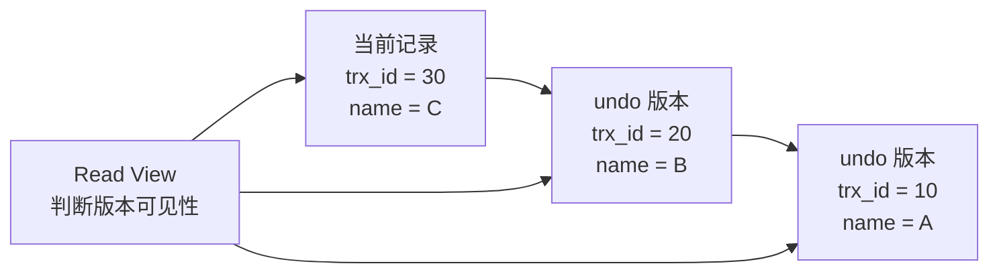
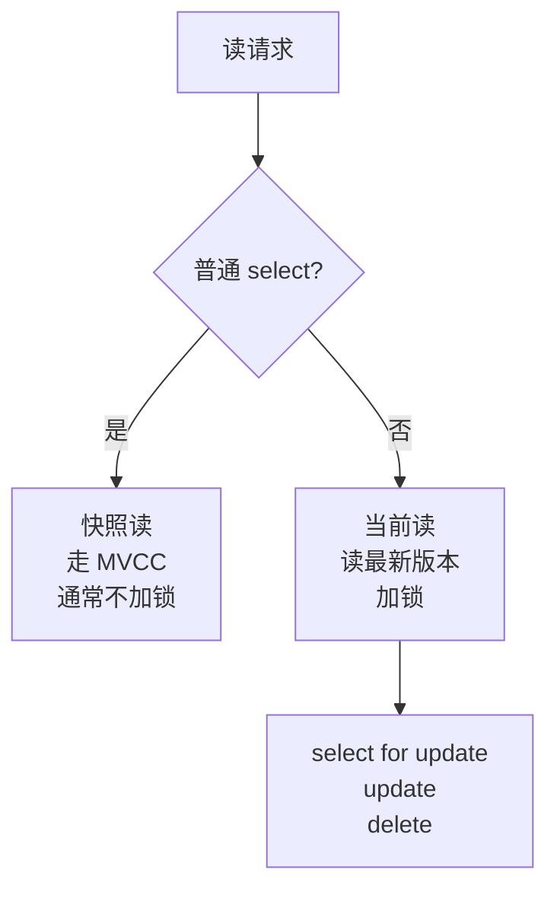

# 事务、锁、MVCC

> 事务题的核心是并发正确性：读写如何互不干扰，异常如何回滚，崩溃后如何恢复。

## 一、核心原理

### 1. ACID

事务的四个特性：

- **原子性**：事务内操作要么全部成功，要么全部回滚，主要依赖 undo log。
- **一致性**：事务前后数据满足约束和业务规则，是事务机制追求的结果。
- **隔离性**：并发事务之间互相隔离，依赖锁和 MVCC。
- **持久性**：事务提交后数据不丢，依赖 redo log 和刷盘策略。

面试里要注意：

> 一致性不是某一个日志单独保证的，它依赖数据库约束、事务机制和业务设计共同保证。

### 2. 隔离级别

| 隔离级别 | 可能问题 | 说明 |
| --- | --- | --- |
| 读未提交 | 脏读、不可重复读、幻读 | 几乎不用 |
| 读已提交 | 不可重复读、幻读 | 每次查询生成新 Read View |
| 可重复读 | 理论有幻读 | InnoDB 默认级别，快照读下通常可避免幻读 |
| 串行化 | 并发低 | 强制串行，性能差 |

三个并发现象：

- **脏读**：读到其他事务未提交的数据。
- **不可重复读**：同一事务内两次读同一行，结果不同。
- **幻读**：同一事务内两次范围查询，出现新增或消失的行。

### 3. MVCC

MVCC 是多版本并发控制，目标是让读写尽量不互相阻塞。

InnoDB MVCC 依赖：

- 隐藏字段：记录创建版本、删除版本等信息。
- undo log：保存历史版本。
- Read View：判断哪个版本对当前事务可见。



读已提交和可重复读的重要区别：

- 读已提交：每次快照读都会创建新的 Read View。
- 可重复读：事务第一次快照读创建 Read View，后续复用。

所以在可重复读下，同一事务多次普通查询通常能看到一致的快照。

### 4. 快照读和当前读

快照读：

```sql
select * from user where id = 1;
```

- 通过 MVCC 读取历史可见版本。
- 通常不加锁。
- 读写并发性能好。

当前读：

```sql
select * from user where id = 1 for update;
update user set name = 'Tom' where id = 1;
delete from user where id = 1;
```

- 读取最新版本。
- 需要加锁。
- 用于更新、删除、显式锁定。



### 5. InnoDB 锁

常见锁：

- **共享锁**：读锁，允许其他事务读，不允许写。
- **排他锁**：写锁，不允许其他事务读写冲突数据。
- **记录锁**：锁住索引记录。
- **间隙锁**：锁住索引记录之间的间隙。
- **临键锁**：记录锁 + 间隙锁。
- **意向锁**：表级标记，用于协调表锁和行锁。

关键点：

> InnoDB 行锁是加在索引上的。如果查询条件没有有效索引，可能扫描大量记录并加锁，导致锁范围扩大。

## 二、高频面试题

### MVCC 解决了什么问题？

解决读写冲突问题。

没有 MVCC 时，读和写容易互相阻塞。MVCC 通过多版本让普通读读取历史版本，写操作修改最新版本，从而提升并发。

但 MVCC 不是万能的：

- 当前读仍然要加锁。
- 更新同一行仍然会冲突。
- 长事务会保留旧版本，影响 undo 清理。

### MySQL 默认隔离级别是什么？

InnoDB 默认是可重复读。

答题要补充：

- 普通 select 是快照读。
- `select ... for update`、`update`、`delete` 是当前读。
- 可重复读下快照读通常不会看到幻读。
- 当前读为了避免幻读，会使用间隙锁或临键锁。

### 间隙锁解决什么问题？

间隙锁锁住索引记录之间的范围，主要防止其他事务在范围内插入新记录，从而避免当前读下的幻读。

例如：

```sql
select *
from orders
where id between 10 and 20
for update;
```

如果只锁已有记录，其他事务可以插入 `id = 15` 的新记录，当前事务再次范围查询就可能看到新行。间隙锁用来锁住这个范围。

### 死锁如何产生？

典型原因是多个事务加锁顺序不一致。

例子：

```text
事务 A：先锁订单，再锁库存
事务 B：先锁库存，再锁订单
```

两个事务互相等待对方释放锁，就形成死锁。

处理方式：

- InnoDB 会检测死锁，回滚其中一个事务。
- 业务层要捕获死锁错误并重试。
- 设计上要固定加锁顺序，缩短事务，避免大范围更新。

## 三、典型场景

### 场景 1：扣库存如何保证不超卖？

常见做法：

```sql
update sku
set stock = stock - 1
where id = ?
  and stock > 0;
```

判断影响行数：

- 影响 1 行：扣减成功。
- 影响 0 行：库存不足。

为什么可行：

- 更新是当前读，会加排他锁。
- `stock > 0` 在数据库层判断，避免应用先查再改的并发漏洞。

高并发下的问题：

- 热点 SKU 会形成单行锁竞争。
- 可以结合库存分桶、队列削峰、缓存预扣，但要处理一致性和补偿。

### 场景 2：转账事务怎么设计？

核心原则：

- 两边账户变更必须在一个事务里。
- 更新顺序固定，例如按账户 ID 从小到大加锁。
- 金额字段用整数分，不用浮点数。
- 事务内不要调用外部服务。
- 失败要回滚，超时要有幂等和对账。

伪流程：

```text
begin
  锁定转出账户
  判断余额
  扣减转出账户
  增加转入账户
  写资金流水
commit
```

### 场景 3：长事务有什么问题？

长事务会带来：

- 持有锁时间长，阻塞其他事务。
- Read View 长时间不释放，undo 历史版本无法清理。
- 回滚成本高。
- 主从复制重放慢。
- 连接占用时间长。

治理方式：

- 事务内只放必要的数据库操作。
- 不在事务内做 RPC、HTTP、文件 IO。
- 大批量操作拆小批次。
- 监控长事务和锁等待。

## 四、常见坑

- 把快照读和当前读混在一起。
- 认为可重复读下完全没有任何幻读问题，不区分读类型。
- 查询条件没索引，导致锁范围扩大。
- 事务内调用外部接口，导致锁长时间不释放。
- 先查再改没有原子条件，导致并发错误。
- 认为死锁是数据库异常，不做业务重试。
- 长事务导致 undo 膨胀和主从延迟，却只从 SQL 角度排查。

## 五、答题模板

### 问 MVCC

```text
MVCC 是多版本并发控制，用来提升读写并发。
InnoDB 通过隐藏字段、undo log 版本链和 Read View 判断数据版本可见性。
普通 select 是快照读，读历史可见版本，一般不加锁；
update、delete、select for update 是当前读，要读最新版本并加锁。
读已提交和可重复读的区别之一是 Read View 创建时机不同。
```

### 问锁

```text
InnoDB 主要是行锁，但行锁是基于索引实现的。
常见有记录锁、间隙锁、临键锁。
记录锁锁已有记录，间隙锁锁范围间隙，临键锁是两者组合。
如果条件没有命中索引，可能扫描并锁住更多记录，导致并发下降。
```

### 问死锁

```text
死锁通常来自多个事务加锁顺序不一致。
InnoDB 能检测死锁并回滚其中一个事务，但业务侧要能重试。
预防上要固定加锁顺序、缩短事务、避免事务内外部调用、保证更新条件走索引。
```
