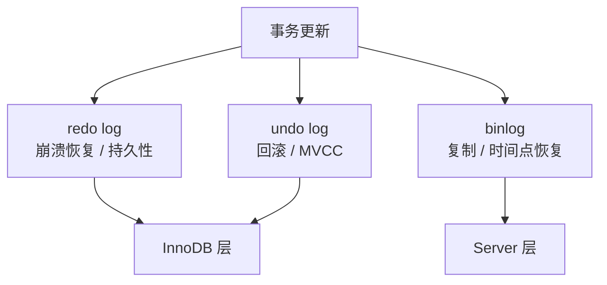
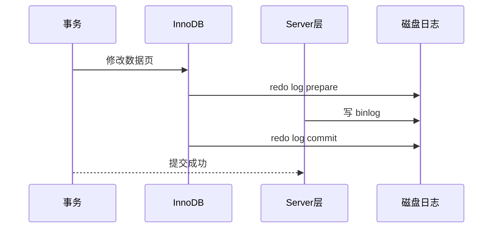

# MySQL 日志

> 日志是 MySQL 可靠性的核心：回滚靠 undo，崩溃恢复靠 redo，复制和恢复靠 binlog。

## 〇、核心提炼（5 段式）

### 核心机制（4 条必背）

1. **redo log（InnoDB 引擎层）**：物理日志（记录"哪页哪偏移改成什么"），WAL 写入，循环覆盖，**保崩溃恢复**
2. **undo log（InnoDB 引擎层）**：逻辑日志（记录"如何还原"），**保事务回滚 + MVCC 历史版本**
3. **binlog（Server 层）**：逻辑日志（记录 SQL 或行变更），**保主从复制 + 数据归档 + 闪回**
4. **两阶段提交（2PC）**：redo prepare → binlog 写盘 → redo commit，**保两个日志的一致性**

### 核心本质（必懂）

> MySQL 三种日志的本质是 **"职责分层"**：
>
> - **redo 在 InnoDB 层**：解决"已 commit 的事务在 crash 后不丢"的问题
>   - WAL（Write-Ahead Log）：先写日志，再异步刷脏页
>   - 物理日志：记录"页的字节级修改"，恢复时重放即可
> - **undo 在 InnoDB 层**：解决"事务可回滚 + 读老版本"的问题
>   - 逻辑日志：记录"逆操作"
>   - MVCC 沿 undo 链回溯历史版本
> - **binlog 在 Server 层**：解决"主从复制 + 数据归档 + 闪回"的问题
>   - 逻辑日志：记录 SQL（STATEMENT）或行变更（ROW）
>   - 是否记录与引擎无关（MyISAM 也有 binlog）
>
> **为什么需要 2PC**：
> - redo 在引擎层、binlog 在 Server 层，两个独立日志
> - 不协调 → crash 后两者状态不一致 → 主从永久不一致
> - 2PC 让"redo 写成功 + binlog 写成功"原子化
>
> **CAP 视角**：
> - 双 1 配置（sync_binlog=1 + innodb_flush_log_at_trx_commit=1）= 强持久（CP）+ TPS 损失大
> - 业内主流：核心业务双 1，非核心 sync_binlog=0/100，损失换性能

### 完整流程（面试必背）

```
事务 commit 完整流程（2PC + 组提交）:

1. InnoDB Prepare 阶段:
   - redo log 写入 buffer
   - redo log 状态 = prepare
   - fsync redo log（持久化到磁盘）
   - undo log 也已写好（伴随事务执行）

2. Server 写 binlog:
   - binlog 写入 binlog cache
   - fsync binlog 到磁盘（受 sync_binlog 控制）

3. InnoDB Commit 阶段:
   - redo log 状态 = commit
   - 不需要立刻 fsync（已在 prepare 阶段刷盘）

4. Crash Recovery 逻辑:
   - 扫描 redo log
   - 对每个 prepare 的事务:
     - binlog 中能找到对应记录 → 自动 commit
     - binlog 中找不到 → rollback
   - 确保 redo + binlog 状态一致

5. 数据页刷盘（异步）:
   - Buffer Pool 中脏页定期/触发刷到磁盘
   - 与事务 commit 解耦
   - WAL 保证: 即使脏页未刷，redo log 已持久化 → crash 后能恢复

binlog 三种格式:
  STATEMENT: 存 SQL 原文（紧凑但不确定函数主从不一致）
  ROW（推荐）: 存每行变更前后值（一致性强 + 支持闪回）
  MIXED: 默认 STATEMENT，遇不确定切 ROW
```

### 4 条核心机制 - 逐点讲透

#### 1. redo log（崩溃恢复的核心）

```
WAL（Write-Ahead Log）:
  规则: 修改数据前必须先写 redo log
  目的: 即使脏页没刷盘，redo 已持久化 → crash 后能恢复

物理日志:
  记录"哪个页哪个偏移改成什么字节"
  例: page 5, offset 100, 旧 'A' → 新 'B'
  恢复时直接重放，幂等

文件结构:
  ib_logfile0, ib_logfile1（默认 48MB × 2）
  循环写: 写满 0 → 写 1 → 回到 0（覆盖）
  innodb_log_file_size 决定容量（生产 1-4GB）

刷盘策略（innodb_flush_log_at_trx_commit）:
  = 1: 每次 commit fsync（不丢，默认）
  = 0: 每秒刷（崩溃丢 1s）
  = 2: 每次写 OS buffer，每秒 fsync（宿主不挂 ≈ 1）

崩溃恢复:
  从 checkpoint LSN 开始扫 redo
  对应页已是新版本 → 跳过
  老版本 → apply redo
```

#### 2. undo log（回滚 + MVCC）

```
逻辑日志:
  INSERT → 记录"删除该行"
  UPDATE → 记录"改回原值"
  DELETE → 记录"插入该行"

两个用途:
  1. 事务回滚: ROLLBACK → 按 undo 反向执行
  2. MVCC: SELECT 沿 DB_ROLL_PTR → undo 链回溯历史版本

回收时机:
  事务提交后不能立即删（其他事务的 ReadView 可能要用）
  purge 线程异步清理: 当所有活跃 ReadView 的 min_trx_id > undo.trx_id 时

存储位置:
  共享表空间 ibdata（默认）
  独立 undo 表空间（5.6+ 推荐）
  → 长事务会让 ibdata 涨爆（必须监控 history list length）
```

#### 3. binlog（复制 + 归档）

```
Server 层日志:
  与存储引擎无关
  MyISAM / InnoDB 都用同一个 binlog

3 种格式:
  STATEMENT: 存 SQL 原文
    ✓ 紧凑
    ✗ NOW() / RAND() / UUID() 主从不一致
    ✗ 行触发器复制不准

  ROW（推荐，5.7+ 主流）:
    存每行变更前后值
    ✓ 主从严格一致
    ✓ 支持闪回（解析 binlog 反向 SQL）
    ✗ 大事务 binlog 大

  MIXED:
    默认 STATEMENT，遇不确定切 ROW

3 种用途:
  1. 主从复制: 主库 binlog → 从库 SQL 线程重放
  2. 数据归档: 增量备份
  3. 闪回 / 恢复: 解析 binlog 找历史变更

刷盘策略（sync_binlog）:
  = 1: 每次事务 fsync（不丢，金融场景）
  = 0: OS 决定（性能最好，崩溃可能丢）
  = N: 每 N 个事务 fsync（折中）
```

#### 4. 两阶段提交（必懂）

```
为什么需要 2PC:
  redo 在 InnoDB 层、binlog 在 Server 层
  两者必须状态一致，否则:
  - redo commit + binlog 没写 → 从库少一条
  - binlog 写了 + redo 没 commit → 从库多一条

流程（commit 时）:
  ① InnoDB Prepare:
     redo log 状态 = prepare
     fsync redo

  ② Server 写 binlog:
     binlog 落盘（受 sync_binlog 控制）

  ③ InnoDB Commit:
     redo log 状态 = commit
     （不需立刻 fsync，已在 prepare 时刷盘）

崩溃恢复裁决:
  redo prepare + binlog 完整 → commit（认为成功）
  redo prepare + binlog 缺   → rollback
  redo 只 prepare 没 commit  → 看 binlog 决定

组提交（Group Commit）优化:
  收集多个事务一起 fsync
  binlog_group_commit_sync_delay 延迟收集
  → TPS 从几千提升到几万
```

### 一句话总结

> MySQL 三种日志的核心是：**redo（物理 / WAL / 崩溃恢复）+ undo（逻辑 / 回滚 + MVCC）+ binlog（逻辑 / 复制 + 归档）**，
> 本质是**职责分层**：redo / undo 在 InnoDB 引擎层、binlog 在 Server 层。
> **两阶段提交**保证 redo 与 binlog 状态一致（防主从不一致）。
> **双 1 配置**（sync_binlog=1 + innodb_flush_log_at_trx_commit=1）= 不丢但 TPS 损失，金融必开。
> **组提交**让"双 1"性能从几千 TPS 提升到几万。

---

## 一、核心原理

### 1. 三类核心日志

| 日志 | 所属层 | 作用 |
| --- | --- | --- |
| undo log | InnoDB | 事务回滚、MVCC 历史版本 |
| redo log | InnoDB | 崩溃恢复、保证持久性 |
| binlog | Server 层 | 主从复制、时间点恢复、审计 |

最容易混的是 redo log 和 binlog：

- redo log 偏物理，记录页的修改，用于崩溃恢复。
- binlog 偏逻辑，记录 SQL 或行变更，用于复制和恢复。
- redo log 循环写，binlog 追加写。
- redo log 是 InnoDB 特有，binlog 是 Server 层能力。



### 2. undo log

undo log 的作用：

- 事务失败时回滚。
- MVCC 中提供历史版本。

例子：

```sql
update user set age = 20 where id = 1;
```

undo log 会记录修改前的数据或反向操作，使事务回滚时能恢复旧值。

注意：

- undo log 不是只为 rollback 服务。
- 长事务会让旧版本长时间不能清理，导致 undo 膨胀。

### 3. redo log

redo log 解决的问题：

> 事务提交了，但数据页还没刷盘，此时 MySQL 宕机，如何保证提交的数据不丢？

答案是 WAL：

1. 修改先写入 Buffer Pool 中的数据页。
2. 生成 redo log。
3. 提交时保证 redo log 按策略刷盘。
4. 数据页可以之后异步刷盘。
5. 宕机恢复时用 redo log 重放。

redo log 的价值：

- 把随机写数据页变成顺序写日志。
- 提升写性能。
- 保证崩溃恢复。

### 4. binlog

binlog 的作用：

- 主从复制。
- 数据恢复。
- 审计和数据订阅。

常见格式：

- **Statement**：记录 SQL，日志小，但非确定性 SQL 有风险。
- **Row**：记录行变化，准确，日志量更大。
- **Mixed**：混合模式。

生产更常见 Row，因为复制一致性更好，也更适合数据恢复和订阅。

### 5. 两阶段提交

一次更新同时涉及 redo log 和 binlog。如果两者不一致，会出现：

- 主库崩溃恢复后认为事务提交了。
- 从库通过 binlog 却没看到这个事务。

两阶段提交大致流程：

1. 写 redo log，状态为 prepare。
2. 写 binlog。
3. 提交 redo log，状态为 commit。



崩溃判断可以简化成：


崩溃恢复时：

- redo log 没 prepare：事务没完成，回滚。
- redo log prepare 但 binlog 不完整：回滚。
- redo log prepare 且 binlog 完整：提交。

核心目标：

> 保证 InnoDB 的崩溃恢复结果和 Server 层 binlog 记录结果一致。

## 二、高频面试题

### redo log 和 binlog 有什么区别？

可以从四个角度回答：

1. 层次不同：redo log 属于 InnoDB，binlog 属于 Server 层。
2. 内容不同：redo 偏物理页修改，binlog 偏逻辑变更。
3. 写法不同：redo 循环写，binlog 追加写。
4. 用途不同：redo 用于崩溃恢复，binlog 用于复制和时间点恢复。

### WAL 是什么？

WAL 是 Write-Ahead Logging，先写日志，再刷数据页。

为什么需要：

- 数据页随机写成本高。
- 日志顺序写成本低。
- 提交事务时不必立刻刷所有数据页。
- 宕机后可以靠日志恢复。

### binlog 能不能替代 redo log？

不能。

原因：

- binlog 是 Server 层逻辑日志，不知道 InnoDB 页的具体恢复细节。
- binlog 不适合做崩溃恢复中的幂等页级重放。
- redo log 和 Buffer Pool、脏页刷盘机制配合，解决的是存储引擎层持久性。

### redo log 能不能替代 binlog？

不能。

原因：

- redo log 是 InnoDB 内部日志，不适合跨引擎复制。
- redo log 循环写，不保存完整历史。
- 主从复制和时间点恢复依赖 binlog。

### binlog 三种格式怎么选？

面试建议：

- Statement 日志小，但可能复制不一致。
- Row 更准确，但日志量更大。
- Mixed 折中，但行为判断更复杂。
- 生产中更倾向 Row，尤其是对一致性、恢复、数据订阅要求高的系统。

## 三、典型场景

### 场景 1：事务提交后宕机，数据会丢吗？

要看刷盘策略和提交是否完成。

关键参数：

```text
innodb_flush_log_at_trx_commit
sync_binlog
```

常见理解：

- redo log 每次提交都刷盘，持久性最强，但性能较低。
- binlog 每次提交都刷盘，复制恢复风险更低，但性能也会受影响。
- 如果为了性能放松刷盘，系统宕机时可能丢最近事务。

面试不需要背所有参数值，但要能说清：

> 持久性和性能之间有取舍，刷盘越严格，丢数据风险越低，写入性能越差。

### 场景 2：误删数据如何通过日志恢复？

常见流程：

1. 找最近一次全量备份。
2. 恢复到临时实例。
3. 回放备份点之后的 binlog。
4. 跳过误操作语句，或者恢复到误操作前一刻。
5. 校验数据后回灌主库。

注意：

- 不要直接在主库盲目操作。
- binlog 恢复依赖完整备份和连续 binlog。
- 备份必须定期演练。

### 场景 3：大事务为什么影响主从复制？

大事务的问题：

- 主库执行时间长。
- binlog 一次提交很大。
- 从库重放耗时长。
- 期间其他事务可能排队。
- 出错回滚成本高。

优化：

- 拆小批次。
- 控制单事务行数。
- 避免事务内复杂查询和外部调用。

## 四、常见坑

- 认为 redo log 和 binlog 都是“记录 SQL 的日志”。
- 认为 binlog 可以单独完成崩溃恢复。
- 忽视两阶段提交的原因，只背流程。
- 只关注 SQL 回滚，不知道 undo 还服务 MVCC。
- 长事务导致 undo 无法清理。
- 备份没有演练，却认为有 binlog 就一定能恢复。
- 为性能降低刷盘策略，却没有评估宕机丢数据风险。

## 五、答题模板

### 问三类日志

```text
MySQL 常考的日志主要是 undo、redo、binlog。
undo 是 InnoDB 的回滚日志，也支持 MVCC 历史版本；
redo 是 InnoDB 的崩溃恢复日志，配合 WAL 保证事务持久性；
binlog 是 Server 层逻辑日志，主要用于主从复制和时间点恢复。
```

### 问两阶段提交

```text
一次事务提交要同时写 redo log 和 binlog。
如果两者不一致，主库崩溃恢复结果和从库复制结果可能不一致。
所以 MySQL 使用两阶段提交：先 redo prepare，再写 binlog，最后 redo commit。
崩溃恢复时结合 redo 状态和 binlog 完整性判断事务提交还是回滚。
```

### 问 WAL

```text
WAL 是先写日志再刷数据页。
因为数据页随机写成本高，而日志可以顺序写。
事务提交时只要 redo log 按策略持久化，数据页可以之后异步刷盘。
宕机后 InnoDB 通过 redo log 重放来恢复已提交事务。
```
