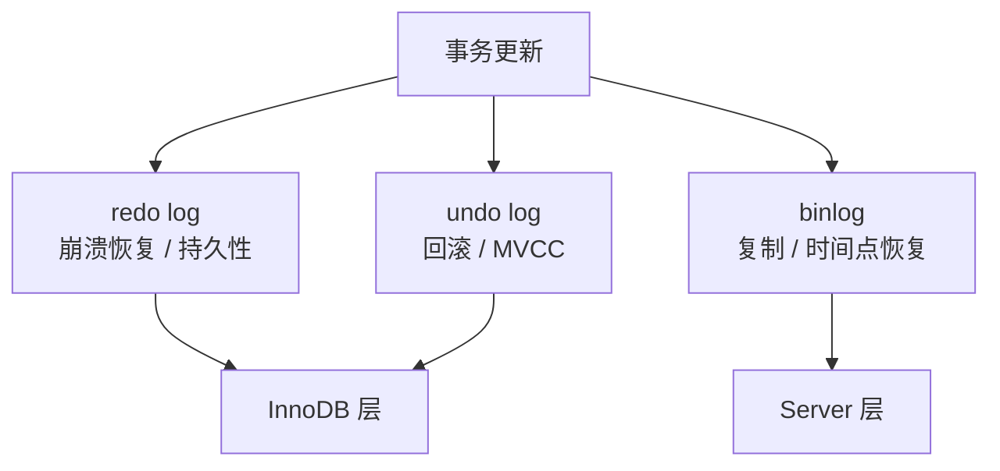
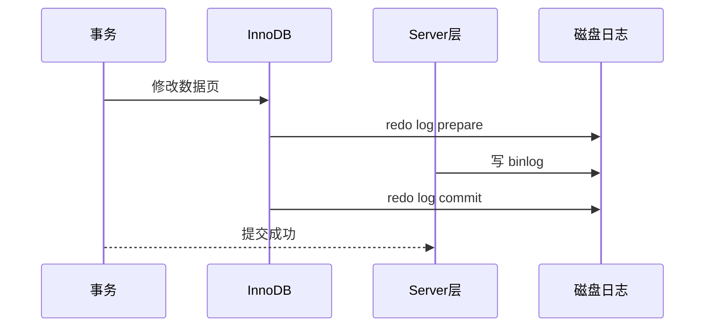
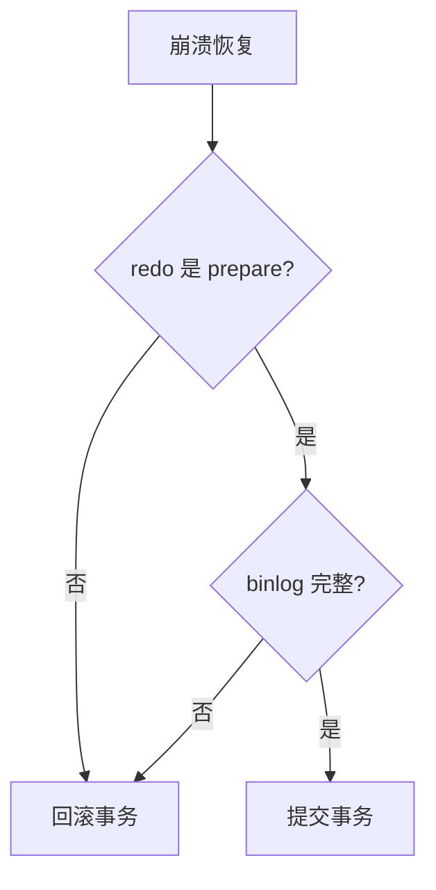

# MySQL 日志

> 日志是 MySQL 可靠性的核心：回滚靠 undo，崩溃恢复靠 redo，复制和恢复靠 binlog。

## 一、核心原理

### 1. 三类核心日志

| 日志 | 所属层 | 作用 |
| --- | --- | --- |
| undo log | InnoDB | 事务回滚、MVCC 历史版本 |
| redo log | InnoDB | 崩溃恢复、保证持久性 |
| binlog | Server 层 | 主从复制、时间点恢复、审计 |

最容易混的是 redo log 和 binlog：

- redo log 偏物理，记录页的修改，用于崩溃恢复。
- binlog 偏逻辑，记录 SQL 或行变更，用于复制和恢复。
- redo log 循环写，binlog 追加写。
- redo log 是 InnoDB 特有，binlog 是 Server 层能力。



### 2. undo log

undo log 的作用：

- 事务失败时回滚。
- MVCC 中提供历史版本。

例子：

```sql
update user set age = 20 where id = 1;
```

undo log 会记录修改前的数据或反向操作，使事务回滚时能恢复旧值。

注意：

- undo log 不是只为 rollback 服务。
- 长事务会让旧版本长时间不能清理，导致 undo 膨胀。

### 3. redo log

redo log 解决的问题：

> 事务提交了，但数据页还没刷盘，此时 MySQL 宕机，如何保证提交的数据不丢？

答案是 WAL：

1. 修改先写入 Buffer Pool 中的数据页。
2. 生成 redo log。
3. 提交时保证 redo log 按策略刷盘。
4. 数据页可以之后异步刷盘。
5. 宕机恢复时用 redo log 重放。

redo log 的价值：

- 把随机写数据页变成顺序写日志。
- 提升写性能。
- 保证崩溃恢复。

### 4. binlog

binlog 的作用：

- 主从复制。
- 数据恢复。
- 审计和数据订阅。

常见格式：

- **Statement**：记录 SQL，日志小，但非确定性 SQL 有风险。
- **Row**：记录行变化，准确，日志量更大。
- **Mixed**：混合模式。

生产更常见 Row，因为复制一致性更好，也更适合数据恢复和订阅。

### 5. 两阶段提交

一次更新同时涉及 redo log 和 binlog。如果两者不一致，会出现：

- 主库崩溃恢复后认为事务提交了。
- 从库通过 binlog 却没看到这个事务。

两阶段提交大致流程：

1. 写 redo log，状态为 prepare。
2. 写 binlog。
3. 提交 redo log，状态为 commit。



崩溃判断可以简化成：



崩溃恢复时：

- redo log 没 prepare：事务没完成，回滚。
- redo log prepare 但 binlog 不完整：回滚。
- redo log prepare 且 binlog 完整：提交。

核心目标：

> 保证 InnoDB 的崩溃恢复结果和 Server 层 binlog 记录结果一致。

## 二、高频面试题

### redo log 和 binlog 有什么区别？

可以从四个角度回答：

1. 层次不同：redo log 属于 InnoDB，binlog 属于 Server 层。
2. 内容不同：redo 偏物理页修改，binlog 偏逻辑变更。
3. 写法不同：redo 循环写，binlog 追加写。
4. 用途不同：redo 用于崩溃恢复，binlog 用于复制和时间点恢复。

### WAL 是什么？

WAL 是 Write-Ahead Logging，先写日志，再刷数据页。

为什么需要：

- 数据页随机写成本高。
- 日志顺序写成本低。
- 提交事务时不必立刻刷所有数据页。
- 宕机后可以靠日志恢复。

### binlog 能不能替代 redo log？

不能。

原因：

- binlog 是 Server 层逻辑日志，不知道 InnoDB 页的具体恢复细节。
- binlog 不适合做崩溃恢复中的幂等页级重放。
- redo log 和 Buffer Pool、脏页刷盘机制配合，解决的是存储引擎层持久性。

### redo log 能不能替代 binlog？

不能。

原因：

- redo log 是 InnoDB 内部日志，不适合跨引擎复制。
- redo log 循环写，不保存完整历史。
- 主从复制和时间点恢复依赖 binlog。

### binlog 三种格式怎么选？

面试建议：

- Statement 日志小，但可能复制不一致。
- Row 更准确，但日志量更大。
- Mixed 折中，但行为判断更复杂。
- 生产中更倾向 Row，尤其是对一致性、恢复、数据订阅要求高的系统。

## 三、典型场景

### 场景 1：事务提交后宕机，数据会丢吗？

要看刷盘策略和提交是否完成。

关键参数：

```text
innodb_flush_log_at_trx_commit
sync_binlog
```

常见理解：

- redo log 每次提交都刷盘，持久性最强，但性能较低。
- binlog 每次提交都刷盘，复制恢复风险更低，但性能也会受影响。
- 如果为了性能放松刷盘，系统宕机时可能丢最近事务。

面试不需要背所有参数值，但要能说清：

> 持久性和性能之间有取舍，刷盘越严格，丢数据风险越低，写入性能越差。

### 场景 2：误删数据如何通过日志恢复？

常见流程：

1. 找最近一次全量备份。
2. 恢复到临时实例。
3. 回放备份点之后的 binlog。
4. 跳过误操作语句，或者恢复到误操作前一刻。
5. 校验数据后回灌主库。

注意：

- 不要直接在主库盲目操作。
- binlog 恢复依赖完整备份和连续 binlog。
- 备份必须定期演练。

### 场景 3：大事务为什么影响主从复制？

大事务的问题：

- 主库执行时间长。
- binlog 一次提交很大。
- 从库重放耗时长。
- 期间其他事务可能排队。
- 出错回滚成本高。

优化：

- 拆小批次。
- 控制单事务行数。
- 避免事务内复杂查询和外部调用。

## 四、常见坑

- 认为 redo log 和 binlog 都是“记录 SQL 的日志”。
- 认为 binlog 可以单独完成崩溃恢复。
- 忽视两阶段提交的原因，只背流程。
- 只关注 SQL 回滚，不知道 undo 还服务 MVCC。
- 长事务导致 undo 无法清理。
- 备份没有演练，却认为有 binlog 就一定能恢复。
- 为性能降低刷盘策略，却没有评估宕机丢数据风险。

## 五、答题模板

### 问三类日志

```text
MySQL 常考的日志主要是 undo、redo、binlog。
undo 是 InnoDB 的回滚日志，也支持 MVCC 历史版本；
redo 是 InnoDB 的崩溃恢复日志，配合 WAL 保证事务持久性；
binlog 是 Server 层逻辑日志，主要用于主从复制和时间点恢复。
```

### 问两阶段提交

```text
一次事务提交要同时写 redo log 和 binlog。
如果两者不一致，主库崩溃恢复结果和从库复制结果可能不一致。
所以 MySQL 使用两阶段提交：先 redo prepare，再写 binlog，最后 redo commit。
崩溃恢复时结合 redo 状态和 binlog 完整性判断事务提交还是回滚。
```

### 问 WAL

```text
WAL 是先写日志再刷数据页。
因为数据页随机写成本高，而日志可以顺序写。
事务提交时只要 redo log 按策略持久化，数据页可以之后异步刷盘。
宕机后 InnoDB 通过 redo log 重放来恢复已提交事务。
```
