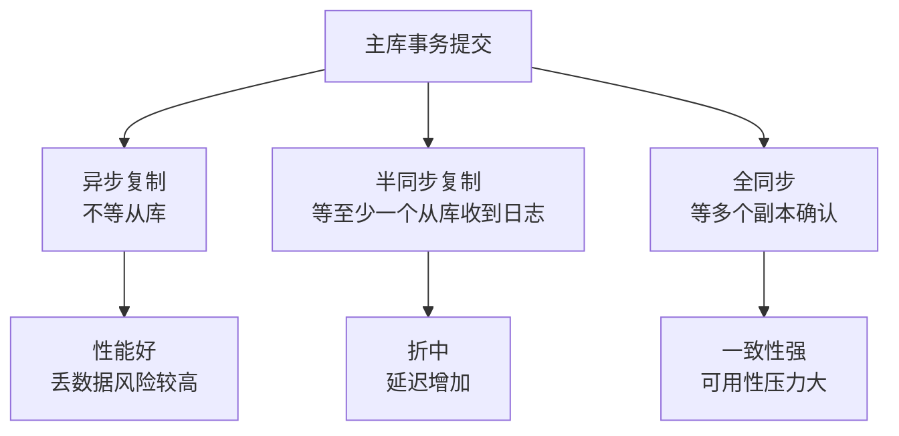

# 主从复制与高可用

> 主从复制解决读扩展和容灾，但默认不是强一致；高可用真正难的是延迟、切换和数据一致性。

## 一、核心原理

### 1. 主从复制流程

MySQL 主从复制基于 binlog。

基本流程：

1. 主库提交事务，写 binlog。
2. 从库 IO 线程拉取主库 binlog。
3. 从库把日志写入 relay log。
4. 从库 SQL 线程读取 relay log 并重放。

简化图：

```text
Master binlog
    |
    | IO thread
    v
Slave relay log
    |
    | SQL thread
    v
Slave data
```


复制本质是日志传输和重放。

### 2. 异步、半同步、全同步

| 模式 | 提交是否等待从库 | 优点 | 风险 |
| --- | --- | --- | --- |
| 异步复制 | 不等待 | 性能好 | 主库宕机可能丢已提交但未复制的数据 |
| 半同步复制 | 等至少一个从库收到日志 | 降低丢数据风险 | 增加延迟，仍不等于从库执行完成 |
| 全同步 | 等多个副本确认提交 | 一致性强 | 延迟高，可用性压力大 |

重点：

> 半同步通常保证至少一个从库“收到日志”，不代表从库已经执行完成。



### 3. 主从延迟

主从延迟来自几个阶段：

- 主库生成 binlog。
- 网络传输。
- 从库写 relay log。
- 从库重放 relay log。

常见原因：

- 大事务。
- 从库机器性能差。
- 从库 SQL 线程重放慢。
- DDL 或锁等待。
- 主库写入压力过大。
- 网络抖动。

### 4. 读写分离

读写分离的基本思路：

- 写请求走主库。
- 普通读请求走从库。
- 强一致读走主库。

适合场景：

- 读多写少。
- 读请求可以接受短暂延迟。
- 能区分强一致读和最终一致读。

不适合盲目使用的场景：

- 写后立刻读必须强一致。
- 从库延迟不可控。
- 读请求本身是复杂慢 SQL，会拖垮从库。

### 5. 高可用切换

高可用不只是搭一主多从，还包括：

- 故障检测。
- 选主。
- 复制位点处理。
- 应用连接切换。
- 防止旧主恢复后继续写入。
- 数据一致性校验。
- 切换演练和回切流程。

常见方案：

- MHA。
- Orchestrator。
- 数据库代理。
- 云数据库 HA 能力。
- 自研控制面。

## 二、高频面试题

### 主从复制原理是什么？

标准回答：

> 主库写 binlog，从库 IO 线程拉取 binlog 写入 relay log，从库 SQL 线程重放 relay log。复制本质是基于 binlog 的异步日志复制和重放。

可以补充：

- Row 格式更利于复制一致性。
- 从库重放慢会产生延迟。
- 主从默认不是强一致。

### 主从延迟怎么排查？

排查方向：

1. 看延迟指标和 relay log 堆积。
2. 看主库是否有大事务、大批量写入。
3. 看从库是否有锁等待、慢 SQL、DDL。
4. 看从库 CPU、IO、磁盘是否瓶颈。
5. 看是否开启并行复制。

优化方向：

- 拆分大事务。
- 优化从库 SQL 重放能力。
- 开启并行复制。
- 避免从库跑重查询。
- 强一致读走主库。

### 写后读从库读不到怎么办？

这是读写分离最常见坑。

解决方式：

- 写后短时间内读主库。
- 用户会话粘滞到主库。
- 根据复制延迟动态路由。
- 关键业务读主库。
- 业务层接受最终一致性并给出状态提示。

具体选哪种取决于业务一致性要求。

### 半同步能保证不丢数据吗？

不能绝对保证。

半同步降低主库宕机时丢数据概率，因为主库提交前等待至少一个从库确认收到日志。但它仍有边界：

- 从库收到日志不代表已经执行。
- 网络异常可能退化。
- 如果确认返回和故障发生在边界时刻，仍要结合具体实现判断。
- 高可用切换时还要选到包含最新日志的从库。

## 三、典型场景

### 场景 1：订单写入后查询不到

现象：

```text
用户提交订单成功，立即刷新订单列表，订单不存在。
```

原因：

- 写请求走主库。
- 读请求走从库。
- 从库还没重放到这条订单的 binlog。

方案：

- 下单后一定时间内订单相关查询读主库。
- 对当前用户做会话级读主。
- 订单详情页读主库，历史列表读从库。
- 前端展示“处理中”并异步刷新。

答题重点：

> 读写分离带来的是读扩展，不是强一致。写后读要单独设计。

### 场景 2：从库延迟突然升高

可能原因：

- 主库执行了大批量更新。
- 有大事务提交。
- 从库执行 DDL 或被长查询阻塞。
- 从库硬件资源不足。
- 网络传输异常。
- 从库并行复制配置不足。

处理：

1. 先确认业务是否受影响，必要时暂停读从库。
2. 找到大事务或阻塞语句。
3. 避免继续向从库打复杂查询。
4. 调整复制配置或资源。
5. 复盘大事务来源。

### 场景 3：主库宕机如何切换？

大致流程：

1. 检测主库不可用。
2. 判断各从库复制进度。
3. 选择数据最新、状态健康的从库提升为主库。
4. 其他从库改为复制新主库。
5. 应用连接切到新主库。
6. 防止旧主恢复后继续接受写入。
7. 校验数据一致性。

风险点：

- 数据未复制完成导致丢失。
- 切换期间双主写入。
- 应用连接缓存旧地址。
- 从库复制位点不一致。

## 四、常见坑

- 认为主从复制是强一致。
- 半同步等同于从库已执行完成。
- 写后读请求走从库，导致读不到新数据。
- 从库用于报表大查询，拖慢复制重放。
- 大事务导致从库长时间追不上。
- 高可用只考虑“切过去”，不考虑旧主恢复和脑裂。
- 没有切换演练，故障时手工操作混乱。

## 五、答题模板

### 问主从复制

```text
MySQL 主从复制基于 binlog。
主库提交事务写 binlog，从库 IO 线程拉取 binlog 写 relay log，
从库 SQL 线程再重放 relay log。
所以主从默认是异步的，可能有延迟；写后读如果走从库，可能读不到刚写的数据。
```

### 问主从延迟

```text
主从延迟通常来自日志传输和从库重放。
常见原因有大事务、从库性能不足、DDL、锁等待、网络抖动、从库复杂查询。
优化上可以拆大事务、开启并行复制、避免从库跑重查询，并对强一致读走主库。
```

### 问高可用

```text
MySQL 高可用不是只搭一主多从。
还要有故障检测、选主、复制位点处理、应用连接切换、防脑裂和数据校验。
核心风险是切换时数据是否完整，以及旧主恢复后是否会继续写入。
```
