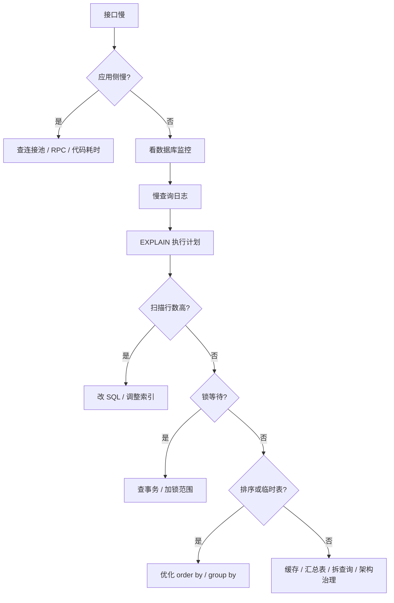

# 慢 SQL 与优化

> 慢 SQL 优化不是“看到慢就加索引”，而是先定位瓶颈：扫描、回表、排序、锁、IO、连接池、主从延迟都有可能。

## 一、核心原理

### 1. 慢 SQL 排查流程

推荐流程：

1. 看监控：QPS、响应时间、CPU、IO、连接数、锁等待。
2. 看慢查询日志：找出高频慢 SQL 和高耗时 SQL。
3. 用 EXPLAIN 看执行计划。
4. 判断扫描行数、索引使用、排序、临时表、回表。
5. 看是否存在锁等待或事务阻塞。
6. 再决定是改 SQL、加索引、拆查询、加缓存还是调整架构。



面试里可以强调：

> SQL 慢不一定是 SQL 本身慢，也可能是等锁、等 IO、等连接、等主从同步。

### 2. EXPLAIN 重点字段

常看字段：

- `type`：访问类型，从好到差大致有 const、ref、range、index、ALL。
- `key`：实际使用的索引。
- `rows`：预估扫描行数。
- `filtered`：过滤比例。
- `Extra`：额外信息，例如 Using index、Using filesort、Using temporary。

常见 Extra：

- `Using index`：覆盖索引。
- `Using where`：Server 层还要过滤。
- `Using filesort`：需要额外排序，不一定是磁盘排序。
- `Using temporary`：使用临时表，常见于 group by、order by、distinct。

### 3. 优化方向

常见优化手段：

- 补充或调整联合索引。
- 改写 SQL，避免函数、隐式转换、无效条件。
- 减少返回字段，避免 `select *`。
- 用覆盖索引减少回表。
- 深分页改游标分页或延迟关联。
- 大查询拆小批次。
- 高频统计用汇总表或异步计算。
- 读多场景加缓存，但要考虑一致性。

### 4. 深分页

```sql
limit 100000, 20
```

慢的原因：

- MySQL 需要扫描前 100000 行。
- 扫描后丢弃，只返回 20 行。
- 如果还要回表，成本更高。

优化：

- 游标分页。
- 延迟关联。
- 限制最大翻页深度。
- 搜索场景交给搜索引擎。

### 5. count(*)

InnoDB 不保存精确总行数，所以 `count(*)` 通常要扫描索引。

优化方式：

- 对实时性要求不高，用缓存或离线统计。
- 业务计数表维护统计值。
- 报表类走数仓或汇总表。
- 带条件 count 要设计合适索引。

## 二、高频面试题

### 慢 SQL 怎么排查？

答题框架：

1. 先从监控确认是数据库慢，还是应用侧慢。
2. 打开慢查询日志，定位具体 SQL。
3. EXPLAIN 看执行计划。
4. 看索引、扫描行数、排序、临时表、回表。
5. 看锁等待和事务。
6. 根据原因选择优化方案。

补充：

> 优化后要压测或灰度验证，不能只靠 EXPLAIN 推断。

### EXPLAIN 里 type=ALL 一定有问题吗？

不一定。

如果表很小，全表扫描可能更快。是否有问题要看：

- 表规模。
- 扫描行数。
- 查询频率。
- 响应时间。
- 是否在核心链路。

但大表核心查询出现 `ALL`，通常需要重点关注。

### Using filesort 一定很慢吗？

不一定。

`Using filesort` 表示 MySQL 需要额外排序，不代表一定落盘，也不代表一定很慢。

是否需要优化取决于：

- 排序数据量。
- 是否有 limit。
- 是否在高频链路。
- 是否可以通过联合索引消除排序。

### 为什么 count(*) 慢？

InnoDB 不维护精确行数，`count(*)` 要扫描索引来统计。大表上精确实时 count 成本高。

如果业务只是展示大概数量，可以考虑：

- 缓存。
- 估算。
- 异步统计。

如果业务必须精确，就要接受成本或设计计数表。

## 三、典型场景

### 场景 1：列表接口慢

SQL：

```sql
select *
from orders
where user_id = ?
  and status = ?
order by created_at desc
limit 20;
```

排查：

- 是否有 `(user_id, status, created_at)`。
- 是否 `select *` 导致大量回表和传输。
- `status` 区分度是否足够。
- 是否有大字段。
- 是否存在主从延迟或锁等待。

优化：

- 只查列表需要字段。
- 建合适联合索引。
- 详情页再查大字段。
- 高访问量场景加缓存或预聚合。

### 场景 2：后台导出拖垮数据库

问题：

- 一次查询太多行。
- 长事务或长连接占用资源。
- 可能造成主从延迟。
- 大量数据传输影响 Buffer Pool。

优化：

- 分页批量导出。
- 使用只读从库或专门报表库。
- 限制导出时间和并发。
- 走异步任务。
- 导出字段最小化。

### 场景 3：大表更新很慢

低效做法：

```sql
update orders set status = 2 where created_at < '2025-01-01';
```

风险：

- 扫描大量数据。
- 锁大量记录。
- 产生大事务。
- binlog 很大。
- 从库延迟。

优化：

- 确保条件有索引。
- 按主键或时间范围分批更新。
- 每批控制行数。
- 避开高峰。
- 监控主从延迟和锁等待。

## 四、常见坑

- 一看到慢 SQL 就加单列索引。
- `select *` 出现在高频列表页。
- 深分页不限制最大页数。
- 报表查询直接打主库。
- 大批量 update/delete 不分批。
- 只看 EXPLAIN，不看实际执行耗时和锁等待。
- 优化 SQL 后不验证业务结果是否一致。
- 把缓存当成 SQL 优化的替代品，忽视缓存一致性。

## 五、答题模板

### 问慢 SQL 排查

```text
我会先确认慢在哪里：应用、数据库、锁、IO、连接池还是主从延迟。
然后看慢查询日志定位 SQL，用 EXPLAIN 看执行计划，
重点看 type、key、rows、Extra。
如果是扫描多，就改索引或 SQL；如果是排序和临时表，就看联合索引和查询改写；
如果是锁等待，就查事务和加锁范围。
```

### 问分页优化

```text
深分页慢是因为 offset 越大，MySQL 要扫描并丢弃的行越多。
优化一般用游标分页，比如基于 last_id 或 created_at,id；
如果必须跳页，可以先用索引查主键，再延迟关联回表。
同时业务上要限制最大翻页深度。
```

### 问大表治理

```text
大表治理先看访问模式和数据生命周期。
能归档的历史数据先归档，核心查询补合适索引，批量操作拆小批次。
如果单库单表容量和写入都成为瓶颈，再考虑分库分表。
大表 DDL 要评估锁、复制延迟、磁盘和回滚方案。
```
