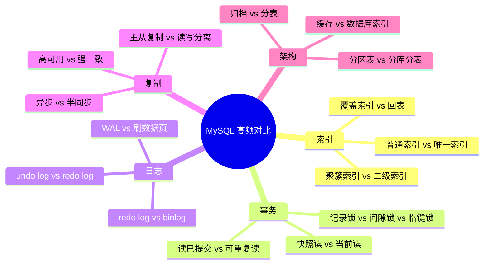

# MySQL 专题对比

> 面试追问常见形式是“两个概念有什么区别”。这类题要按层次、作用、代价和场景对比，不要只给一句定义。

## 一、核心对比图



## 二、高频对比

### 1. redo log vs binlog

| 维度 | redo log | binlog |
| --- | --- | --- |
| 所属层 | InnoDB | Server 层 |
| 内容 | 物理页修改 | SQL 或行变更 |
| 写入方式 | 循环写 | 追加写 |
| 主要作用 | 崩溃恢复 | 主从复制、时间点恢复 |
| 是否跨引擎 | 否 | 是 |

答题关键：

> redo log 保证 InnoDB 崩溃恢复，binlog 保证复制和恢复链路。两者职责不同，所以需要两阶段提交保证一致。

### 2. undo log vs redo log

| 维度 | undo log | redo log |
| --- | --- | --- |
| 解决问题 | 回滚、MVCC | 崩溃恢复 |
| 记录内容 | 修改前版本或反向操作 | 数据页修改 |
| 事务失败 | 用 undo 回滚 | 不负责逻辑回滚 |
| 系统宕机 | 辅助未提交事务回滚 | 重放已提交事务 |

记忆方式：

- undo：后悔药。
- redo：重做记录。

### 3. 聚簇索引 vs 二级索引

| 维度 | 聚簇索引 | 二级索引 |
| --- | --- | --- |
| InnoDB 中对应 | 主键索引 | 非主键索引 |
| 叶子节点 | 整行数据 | 索引列 + 主键 |
| 数量 | 一张表一个 | 可以多个 |
| 查询整行 | 直接拿到 | 通常需要回表 |

核心追问：

- 为什么主键不宜太长？
- 为什么二级索引查整行要回表？
- 覆盖索引为什么能避免回表？

### 4. 普通索引 vs 唯一索引

| 维度 | 普通索引 | 唯一索引 |
| --- | --- | --- |
| 约束 | 不保证唯一 | 保证唯一 |
| 查询 | 可能命中多行 | 命中一行即可停止 |
| 写入 | 维护索引 | 还要检查唯一冲突 |
| 业务作用 | 加速查询 | 加速查询 + 约束业务唯一性 |

坑点：

- 唯一索引允许多个 `NULL`，业务不允许时字段要 `NOT NULL`。
- 幂等、订单号、手机号这类核心唯一性要靠唯一索引兜底。

### 5. 快照读 vs 当前读

| 维度 | 快照读 | 当前读 |
| --- | --- | --- |
| 典型语句 | 普通 `select` | `update`、`delete`、`select for update` |
| 读取内容 | 历史可见版本 | 最新版本 |
| 并发机制 | MVCC | 锁 |
| 是否加锁 | 通常不加锁 | 加锁 |

答题关键：

> 可重复读下普通 select 通常读快照；但 update、delete、select for update 是当前读，会读最新数据并加锁。

### 6. 读已提交 vs 可重复读

| 维度 | 读已提交 | 可重复读 |
| --- | --- | --- |
| Read View | 每次查询创建 | 第一次快照读创建并复用 |
| 是否可能不可重复读 | 可能 | 普通快照读通常不会 |
| MySQL 默认 | 否 | 是 |
| 常见系统 | Oracle 常见 | MySQL InnoDB 默认 |

不要绝对化：

- 讨论幻读时要区分快照读和当前读。
- 当前读涉及锁，不只靠 MVCC。

### 7. 记录锁 vs 间隙锁 vs 临键锁

| 锁 | 锁什么 | 作用 |
| --- | --- | --- |
| 记录锁 | 已存在索引记录 | 防止记录被修改 |
| 间隙锁 | 索引记录之间的范围 | 防止范围内插入 |
| 临键锁 | 记录 + 间隙 | 防止当前读幻读 |

核心表达：

> InnoDB 的行锁基于索引。条件不走索引，可能扫描并锁住更多范围。

### 8. 异步复制 vs 半同步复制

| 维度 | 异步复制 | 半同步复制 |
| --- | --- | --- |
| 主库提交 | 不等从库 | 等至少一个从库收到日志 |
| 性能 | 更好 | 稍差 |
| 丢数据风险 | 更高 | 更低 |
| 从库是否执行完成 | 不保证 | 通常也不保证 |

坑点：

> 半同步不是强一致，也不等于从库已经执行完成。

### 9. 主从复制 vs 读写分离

| 维度 | 主从复制 | 读写分离 |
| --- | --- | --- |
| 本质 | 数据复制机制 | 流量路由策略 |
| 依赖 | binlog / relay log | 主从架构 |
| 解决 | 副本同步、容灾基础 | 读扩展 |
| 风险 | 延迟、数据差异 | 写后读旧数据 |

关系：

> 主从复制是基础能力，读写分离是建立在主从复制上的应用架构。

### 10. 分区表 vs 分库分表

| 维度 | 分区表 | 分库分表 |
| --- | --- | --- |
| 层次 | 单库单表逻辑下的物理分区 | 多表或多库拆分 |
| 应用感知 | 基本无感 | 通常需要感知或中间件 |
| 扩展能力 | 有限 | 更强 |
| 复杂度 | 较低 | 高 |
| 典型问题 | 不带分区键仍可能慢 | 跨分片查询、事务、扩容 |

答题关键：

> 分区表不是分库分表的等价替代。分区主要优化数据管理和部分查询，分库分表解决更大的容量和写入扩展问题。

### 11. 缓存 vs 索引

| 维度 | 缓存 | 索引 |
| --- | --- | --- |
| 位置 | 数据库外或应用内 | 数据库内 |
| 解决 | 减少数据库访问 | 提升数据库检索效率 |
| 风险 | 一致性、穿透、击穿、雪崩 | 写入成本、空间成本 |
| 适合 | 读多、热点、可接受一致性延迟 | 精确查询、排序、范围检索 |

结论：

> 缓存不是索引优化的替代品。SQL 本身很差时，加缓存只能缓解，不能消除根因。

## 三、答题模板

```text
这两个概念我会从层次、解决的问题、实现方式和代价来区分。
比如 redo log 和 binlog：
redo 是 InnoDB 层，解决崩溃恢复；
binlog 是 Server 层，解决复制和时间点恢复。
因为一次事务同时涉及两类日志，所以需要两阶段提交保证一致。
```
