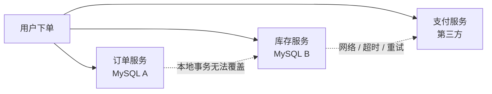
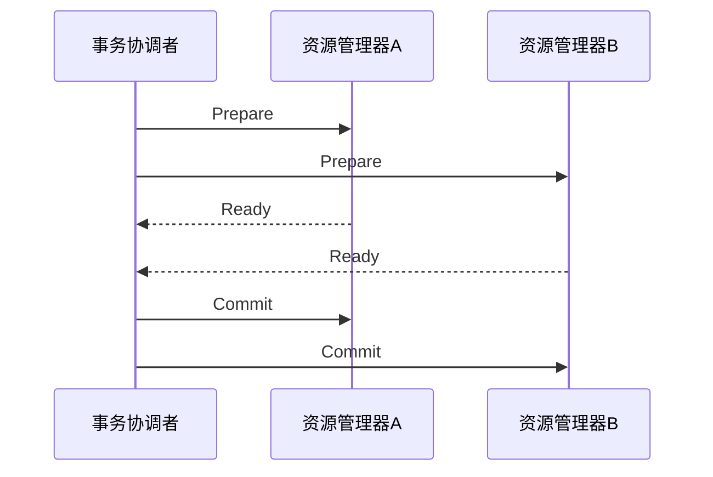
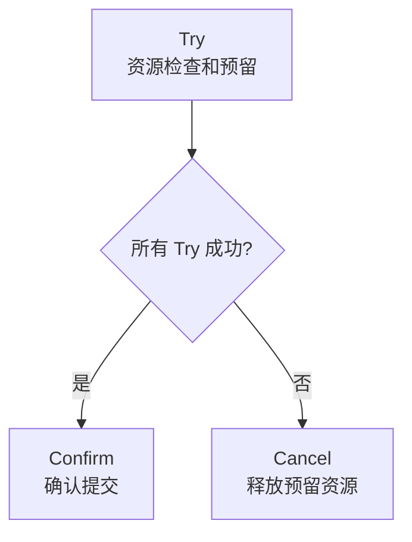
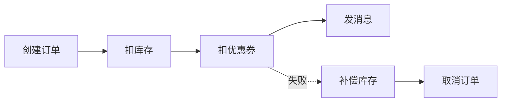
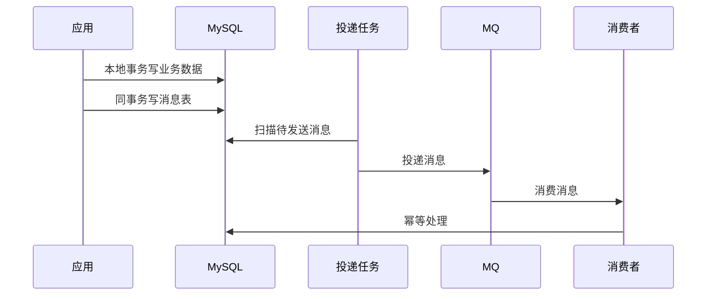
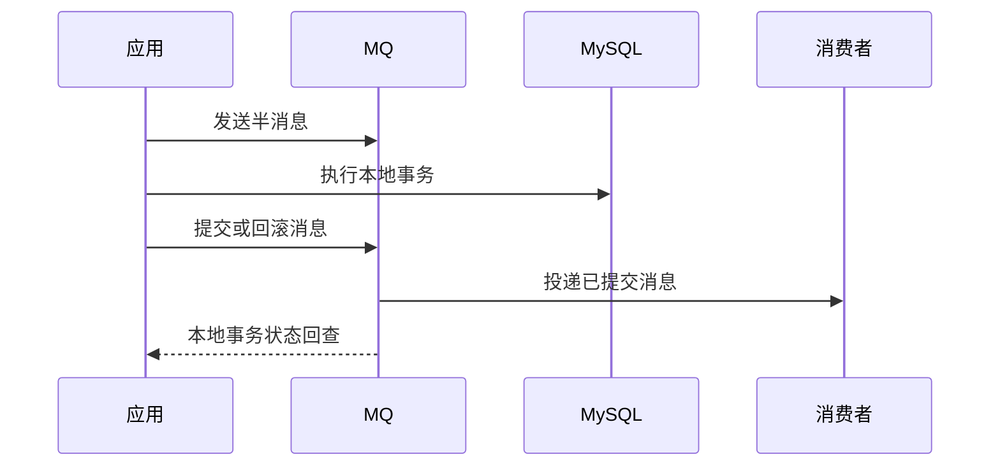

# 分布式事务

> MySQL 单库事务解决的是一个资源管理器内的一致性；跨库、跨服务、跨消息队列后，需要分布式事务或最终一致性方案。

## 一、核心原理

### 1. 问题边界

单库事务：

```text
一个 MySQL 实例内，多张表更新放在同一个本地事务里。
```

分布式事务：

```text
一次业务操作跨多个资源：
MySQL A、MySQL B、Redis、MQ、第三方支付、库存服务、订单服务。
```

难点：

- 多个参与者不能共享同一个本地事务。
- 网络可能超时、重试、乱序。
- 某个参与者成功，另一个参与者失败。
- 业务需要处理悬挂、空回滚、幂等、补偿。



### 2. 分布式事务不是只有强一致

面试里要先说明目标：

- **强一致**：所有参与者要么都成功，要么都失败。
- **最终一致**：允许中间状态，靠重试、补偿、对账最终收敛。
- **业务可接受一致性**：例如支付成功后发货可以异步，但扣款不能重复。

多数互联网业务更常见最终一致，不是所有场景都应该上 XA。

## 二、常见方案

### 1. XA / 2PC

XA 是数据库层面的两阶段提交协议。



两个阶段：

- **Prepare 阶段**：参与者执行本地事务但不提交，锁住资源，返回是否准备好。
- **Commit / Rollback 阶段**：所有参与者准备成功则提交，否则回滚。

优点：

- 一致性强。
- 数据库原生支持。
- 对业务侵入相对低。

缺点：

- 同步阻塞。
- 锁持有时间长。
- 协调者故障会带来复杂恢复。
- 性能和可用性较差。

适合：

- 参与者少。
- 强一致要求高。
- 吞吐要求不极端。

### 2. TCC

TCC 是业务层两阶段提交：

```text
Try -> Confirm / Cancel
```



三个阶段：

- **Try**：检查资源并预留资源，比如冻结余额、预占库存。
- **Confirm**：真正提交，扣减冻结余额、确认库存。
- **Cancel**：取消预留，解冻余额、释放库存。

TCC 必须处理：

- **幂等**：Confirm 或 Cancel 可能重复调用。
- **空回滚**：Try 没执行成功，Cancel 却来了。
- **悬挂**：Cancel 先到，Try 后到。

优点：

- 一致性较强。
- 业务可控。
- 性能通常好于 XA。

缺点：

- 侵入业务。
- 每个参与者都要实现 Try、Confirm、Cancel。
- 异常状态复杂。

适合：

- 资金、库存、权益这类需要明确预留和确认的业务。

### 3. Saga

Saga 把一个长事务拆成多个本地事务，每一步都有补偿动作。



特点：

- 每一步都是本地事务。
- 后续失败时执行补偿。
- 不锁长事务资源。
- 一致性通常是最终一致。

优点：

- 适合长流程。
- 可用性好。
- 不长时间锁资源。

缺点：

- 中间状态对业务可见。
- 补偿逻辑复杂。
- 不适合强隔离要求的场景。

适合：

- 订单流程、审批流程、履约流程。

### 4. 本地消息表

本地消息表解决“数据库更新成功，但消息发送失败”的问题。



流程：

1. 本地事务内同时写业务表和消息表。
2. 后台任务扫描未发送消息。
3. 投递到 MQ。
4. 投递成功后标记消息已发送。
5. 消费方做幂等处理。

优点：

- 实现简单。
- 和 MySQL 本地事务结合紧密。
- 适合最终一致。

缺点：

- 消息投递有延迟。
- 需要定时扫描和补偿。
- 消费方必须幂等。

### 5. 事务消息

事务消息通常由 MQ 提供半消息和回查机制。



关键：

- 本地事务成功，提交消息。
- 本地事务失败，回滚消息。
- 如果应用宕机，MQ 回查本地事务状态。

适合：

- 下单后发积分。
- 支付成功后通知履约。
- 数据变更后异步同步。

## 三、方案对比

| 方案 | 一致性 | 性能 | 业务侵入 | 典型场景 |
| --- | --- | --- | --- | --- |
| XA / 2PC | 强 | 较差 | 较低 | 少量资源、强一致 |
| TCC | 较强 | 中等 | 高 | 资金、库存、权益 |
| Saga | 最终一致 | 较好 | 中高 | 长流程、订单履约 |
| 本地消息表 | 最终一致 | 较好 | 中 | DB + MQ 异步一致 |
| 事务消息 | 最终一致 | 较好 | 中 | 可靠事件发布 |

选择建议：

- 能本地事务解决，就不要上分布式事务。
- 能最终一致，就不要强一致。
- 强一致且参与者少，可以考虑 XA。
- 有明确预留、确认、取消语义，用 TCC。
- 长业务流程，用 Saga。
- 数据库变更后发消息，用本地消息表或事务消息。

## 四、典型场景

### 场景 1：创建订单并扣库存

简单方案：

- 如果订单和库存在同一个库，同一个本地事务解决。

跨服务方案：

- 强一致库存：TCC，Try 预占库存，Confirm 扣减，Cancel 释放。
- 可最终一致：订单创建后发消息，库存服务异步扣减，失败后取消订单。

关键坑：

- 扣库存必须幂等。
- 失败要有补偿。
- 超时不能简单认为失败，可能对方已经成功。

### 场景 2：支付成功后发货

更适合最终一致：

1. 支付回调落库，唯一索引保证幂等。
2. 写本地消息表或提交事务消息。
3. 履约服务消费消息。
4. 履约失败进入重试和人工处理。

原因：

- 支付成功不能因为发货系统短暂失败而回滚。
- 发货可以重试和补偿。
- 整体是最终一致模型。

### 场景 3：跨库转账

如果是核心资金：

- 尽量避免跨库直接转账。
- 可用统一账务服务收敛事务边界。
- 必要时使用 TCC 或强一致事务框架。
- 必须有流水、幂等、对账、补偿、审计。

不要只说“用 MQ 最终一致”。资金场景要说明风险和对账机制。

## 五、常见坑

- 把 MySQL 两阶段提交和分布式 2PC 混为一谈。
- 认为 MQ 能自动保证分布式事务。
- 没有幂等，重试导致重复扣款或重复发货。
- 没有空回滚和悬挂处理，TCC 在异常顺序下出错。
- Saga 补偿动作不可逆，却仍强行套 Saga。
- 只考虑正常流程，不考虑超时、宕机、重复消息。
- 没有对账和人工兜底。

## 六、答题模板

### 问分布式事务怎么选

```text
我会先判断能否收敛成本地事务，因为本地事务最简单可靠。
如果必须跨服务，再看一致性要求。
强一致且参与者少，可以考虑 XA，但性能和阻塞要评估；
有资源预留语义，比如库存和余额，可以用 TCC；
长流程更适合 Saga；
如果是数据库变更后通知其他系统，通常用本地消息表或事务消息保证最终一致。
无论哪种方案，都要做幂等、重试、补偿和对账。
```

### 问 TCC 三个阶段

```text
TCC 是 Try、Confirm、Cancel。
Try 做资源检查和预留；
Confirm 在所有 Try 成功后确认提交；
Cancel 在任一 Try 失败或超时时释放预留资源。
实现 TCC 时必须处理幂等、空回滚和悬挂，否则异常重试下会出错。
```

### 问本地消息表

```text
本地消息表用一个本地事务同时写业务数据和消息记录。
后台任务再扫描消息表投递 MQ，投递成功后标记状态。
这样避免业务数据提交了但消息丢失。
它保证的是最终一致，消费方必须幂等，还要有重试和告警。
```
