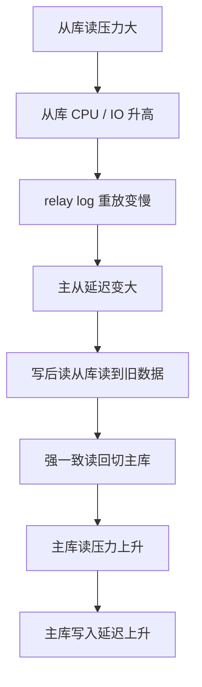
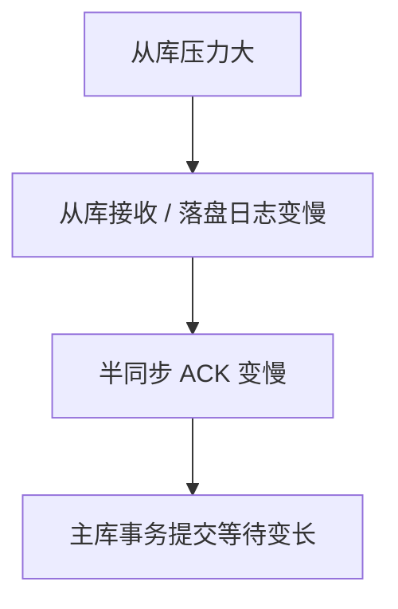
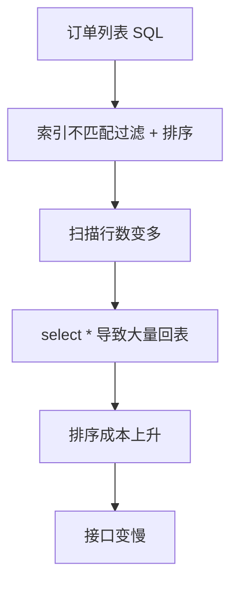
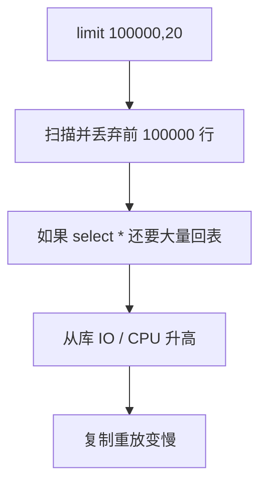
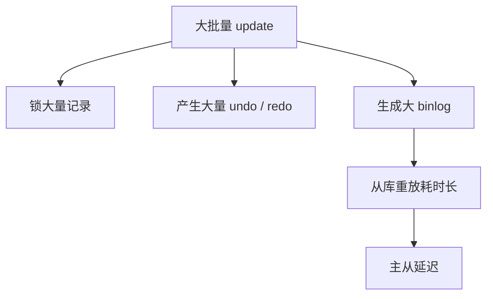
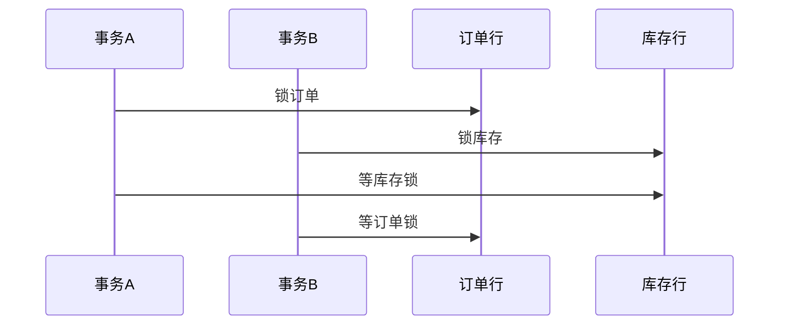
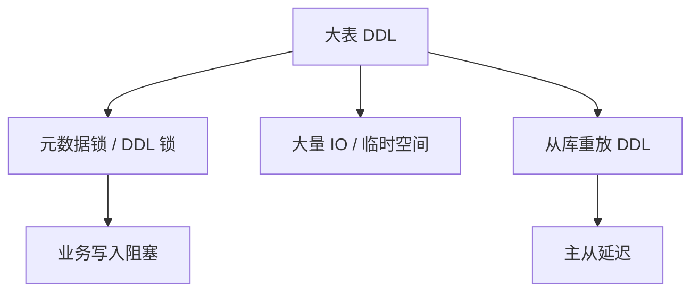
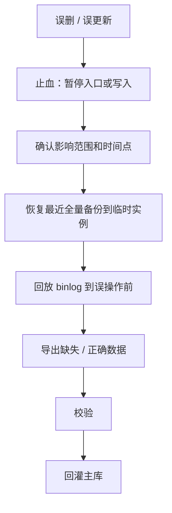
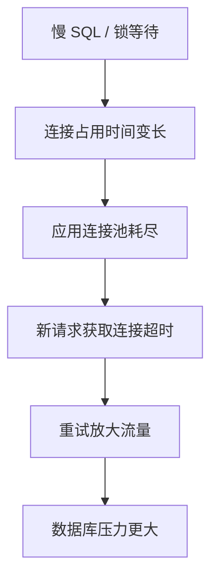
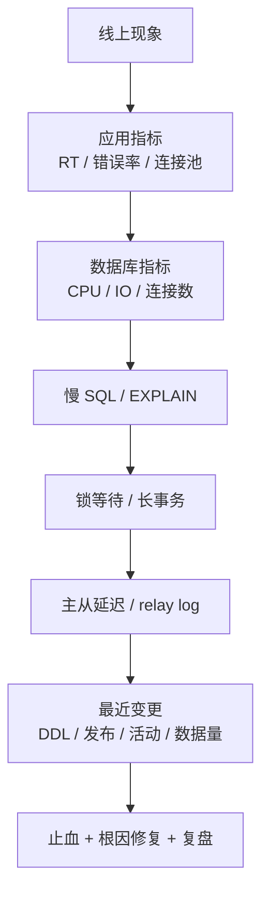

# MySQL 线上案例

> 面试里最有区分度的不是背概念，而是能把线上问题讲成完整链路：现象、误判、根因、排查、解决、复盘。

## 一、案例题答题框架


统一模板：

```text
我们线上遇到过 xxx。
表面现象是 xxx，最开始容易以为是 xxx。
后来排查发现根因链路是 A -> B -> C。
排查时主要看了监控、慢查询、执行计划、锁等待、主从延迟这些指标。
最后通过 xxx 解决，后续又做了 xxx 防止复发。
```

## 二、案例 1：从库读压力过大，间接影响主库

### 现象

订单系统做了读写分离：

- 下单、支付状态更新走主库。
- 订单列表、订单详情、商家后台查询走从库。

活动期间从库 CPU 和 IO 升高，主从延迟变大。随后用户反馈：

- 下单成功后订单列表看不到新订单。
- 支付成功后订单状态短时间仍显示未支付。
- 部分强一致读被切回主库，主库压力也开始上升。

### 错误直觉

容易误判成：

> 从库压力大只会影响从库，不会影响主库。

严格说，从库读压力不会直接把主库 CPU 打高，但会通过复制延迟、读路由回切、半同步确认等链路间接影响主库。

### 根因链路



如果是半同步复制，还可能有另一条链路：



### 排查过程

重点看：

- 从库 CPU、IO、Buffer Pool 命中率。
- 慢查询日志，尤其是订单列表、后台导出、报表查询。
- `EXPLAIN`：是否走联合索引、扫描行数、是否回表、是否 filesort。
- 主从延迟和 relay log 堆积。
- 应用读路由日志：是否大量读请求从从库切回主库。
- 是否开启半同步，提交延迟是否和从库 ACK 相关。

### 解决方案

SQL 层：

- 订单列表补联合索引，例如 `(user_id, status, created_at)`、`(merchant_id, created_at)`。
- 列表页禁止 `select *`，只查必要字段。
- 大字段拆详情表。
- 深分页改游标分页或延迟关联。
- 后台导出改异步任务，分批查询。

架构层：

```text
主库：写入 + 强一致读
从库 A：线上普通读
从库 B：后台导出 / 报表
从库 C：高可用候选，不承担读流量
```

路由层：

- 写后读订单详情走主库。
- 普通历史列表读从库。
- 从库延迟超过阈值时摘除，而不是把全部读流量打回主库。
- 对用户维度做短时间会话粘滞。

复制层：

- 拆大事务。
- 开启并行复制。
- 从库禁止跑长事务和大查询。
- 监控主从延迟、relay log 堆积、复制线程状态。

### 复盘沉淀

- 从库不是“免费读资源”，也会被慢 SQL、深分页、导出拖垮。
- 读写分离必须配合延迟感知路由。
- 高可用候选从库最好不要承载复杂查询。
- 强一致读要显式走主库，不能依赖从库“应该很快追上”。

### 面试表达

```text
我遇到过读写分离下从库读压力过大导致主从延迟的问题。
它不是直接影响主库，而是从库重放 relay log 变慢后，写后读从库读到旧数据，
强一致读和部分降级流量被切回主库，导致主库读写压力一起上升。
如果是半同步，还可能因为从库 ACK 变慢影响主库提交。
最后我们从 SQL 索引、后台查询隔离、延迟感知读路由、强一致读走主库、复制优化几个方向治理。
```

## 三、案例 2：订单列表慢 SQL

### 现象

订单列表接口在高峰期从几十毫秒变成几百毫秒甚至秒级，数据库慢查询日志出现大量订单列表 SQL。

典型 SQL：

```sql
select *
from orders
where user_id = ?
  and status = ?
order by created_at desc
limit 20;
```

### 错误直觉

容易只说：

> 加个 status 索引。

但单列 `status` 区分度低，可能没有明显收益。

### 根因链路



### 排查过程

- 看慢查询日志中 SQL 的执行次数和平均耗时。
- 用 `EXPLAIN` 看 `key`、`rows`、`Extra`。
- 确认是否出现 `Using filesort`、`Using temporary`。
- 看返回字段是否包含大字段。
- 看用户维度、商户维度是否有不同查询模式。

### 解决方案

- 针对用户订单列表建 `(user_id, status, created_at)`。
- 针对商户订单列表建 `(merchant_id, status, created_at)` 或 `(merchant_id, created_at)`。
- 列表页改为只查必要字段。
- 大字段如地址快照、扩展 JSON、备注等放到详情查询。
- 对状态筛选不固定的场景，单独评估 `(user_id, created_at)`。

### 面试表达

```text
订单列表慢 SQL 不能只看 where 里有哪些字段，而要把过滤、排序、分页一起看。
我们当时发现单列索引过滤效果差，还需要 filesort 和大量回表。
最后按用户维度和商户维度分别设计联合索引，列表页减少字段，详情再查大字段，耗时才稳定下来。
```

## 四、案例 3：深分页拖垮从库

### 现象

商家后台支持跳到很靠后的页：

```sql
select *
from orders
where merchant_id = ?
order by id desc
limit 100000, 20;
```

高峰期从库出现大量扫描，接口超时，主从延迟升高。

### 根因链路



### 解决方案

- 改游标分页：

```sql
select id, order_no, status, created_at
from orders
where merchant_id = ?
  and id < ?
order by id desc
limit 20;
```

- 必须跳页时，用延迟关联：

```sql
select o.*
from orders o
join (
  select id
  from orders
  where merchant_id = ?
  order by id desc
  limit 100000, 20
) t on o.id = t.id;
```

- 后台导出走异步任务和报表库。
- 页面限制最大翻页深度。

### 面试表达

```text
深分页慢是因为 offset 越大，数据库扫描并丢弃的行越多。
如果还 select *，会产生大量回表。
我们把用户侧列表改成游标分页，后台必须跳页的场景用延迟关联，并限制最大翻页深度。
```

## 五、案例 4：大事务导致主从延迟

### 现象

运营执行批量更新：

```sql
update orders
set status = 9
where created_at < '2025-01-01';
```

主库执行时间长，从库延迟明显升高，部分读请求读到旧状态。

### 根因链路



### 解决方案

- 确保过滤条件走索引。
- 按主键或时间范围分批更新。
- 每批控制行数，例如 500 或 1000。
- 批次之间短暂 sleep，观察主从延迟。
- 低峰执行，必要时走工具平台审批。
- 对历史数据优先归档，不在热表上大范围更新。

### 面试表达

```text
大事务的问题不只是执行慢，还会持有锁、产生大量 undo/redo/binlog，并导致从库长时间重放。
我们处理这类问题会先确认索引，然后按主键范围拆小批，执行时监控锁等待和主从延迟。
```

## 六、案例 5：死锁频发

### 现象

订单支付链路偶发死锁，应用日志出现 deadlock，部分请求失败。

### 错误直觉

容易误判为数据库不稳定。实际上死锁通常是业务并发加锁顺序不一致。

### 根因链路



### 排查过程

- 查看 MySQL 死锁日志。
- 找出两个事务分别持有哪些锁、等待哪些锁。
- 对照业务代码，确认加锁顺序。
- 看 SQL 是否命中索引，避免锁范围扩大。

### 解决方案

- 固定加锁顺序，例如都先锁订单再锁库存。
- 缩短事务，不在事务内调用外部服务。
- 更新条件必须走索引。
- 批量处理按主键排序。
- 应用捕获死锁错误并有限重试。

### 面试表达

```text
死锁不是简单的数据库异常，而是多个事务加锁顺序形成环路。
我们通过死锁日志定位到订单和库存加锁顺序不一致，后来统一加锁顺序，
并把事务内的外部调用移出去，同时业务层对死锁做有限重试。
```

## 七、案例 6：线上 DDL 导致写入阻塞

### 现象

给订单大表加字段或加索引时，线上写入变慢，主从延迟升高。

### 根因链路



### 解决方案

- 变更前确认 MySQL 版本和 DDL 算法。
- 评估表大小、索引数量、写入峰值。
- 大表使用在线 DDL 工具或云数据库变更能力。
- 应用先兼容新旧字段，再灰度上线。
- 变更时监控锁等待、磁盘、主从延迟。

### 面试表达

```text
线上 DDL 风险主要是锁、IO、磁盘和主从延迟。
我们不会直接在高峰期对大表执行 DDL，而是先验证 DDL 行为，必要时用在线变更工具，
并让应用代码先兼容新旧结构，执行过程中监控锁等待和复制延迟。
```

## 八、案例 7：误删数据恢复

### 现象

误执行 delete 或 update，影响线上订单、用户或配置数据。

### 处理链路



### 解决方案

- 先止血，不要继续覆盖数据。
- 找误操作 SQL、时间点、影响库表。
- 用全量备份恢复临时实例。
- 用 binlog 做时间点恢复。
- 校验后回灌。
- 复盘权限、SQL 审核、备份演练、延迟从库。

### 面试表达

```text
误删数据第一步不是立刻在主库反向操作，而是先止血和确认影响范围。
恢复通常依赖全量备份加 binlog，在临时实例恢复到误操作前，再校验并回灌。
这类问题平时必须做备份恢复演练，否则有备份也不一定能真正恢复。
```

## 九、案例 8：连接池打满

### 现象

应用报获取数据库连接超时，MySQL 连接数升高，接口整体变慢。

### 根因链路



### 排查过程

- 看应用连接池指标：活跃连接、等待连接、等待时间。
- 看 MySQL 当前连接和执行中的 SQL。
- 看慢查询、锁等待、长事务。
- 看是否有请求超时后重试放大。

### 解决方案

- 先定位并优化慢 SQL 或锁等待。
- 设置合理的连接池大小和超时时间。
- 避免无限重试。
- 慢接口做限流和降级。
- 事务内不做外部调用，尽快释放连接。

### 面试表达

```text
连接池打满通常是结果，不是根因。
我们会先看连接被谁长时间占用，是慢 SQL、锁等待还是长事务。
处理时一方面优化 SQL 和事务，另一方面限制重试、设置连接池超时和降级，避免请求堆积把数据库打得更慢。
```

## 十、总结：线上 MySQL 问题的通用排查顺序



面试最后可以收束成：

```text
MySQL 线上问题我一般不会直接归因到某个 SQL。
会先从应用、数据库、慢查询、锁等待、主从复制、最近变更这几个维度看链路。
先止血，比如摘从库、限流、切主读、暂停任务；
再做根因修复，比如改索引、拆事务、隔离报表、调整路由；
最后沉淀监控、规范和演练。
```
