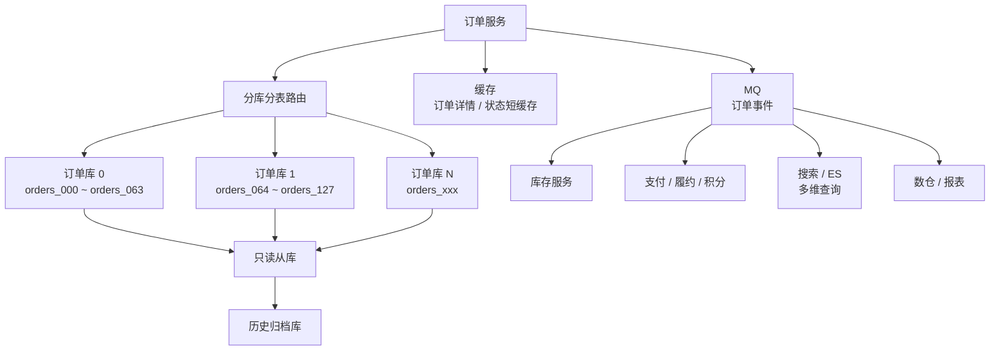
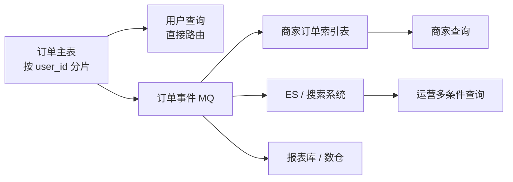
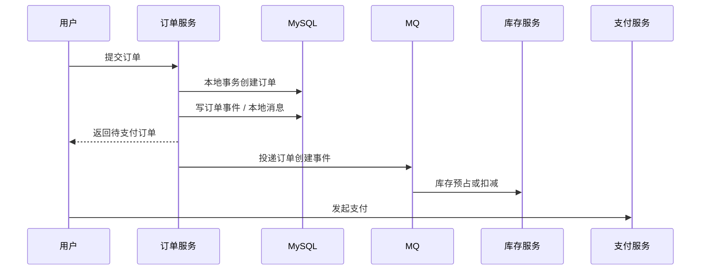
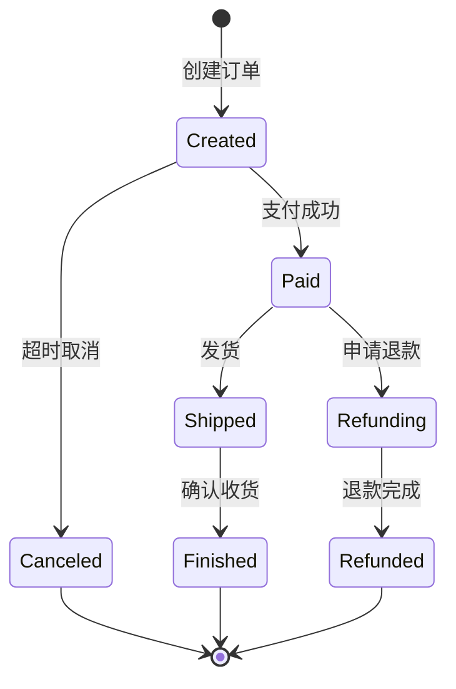
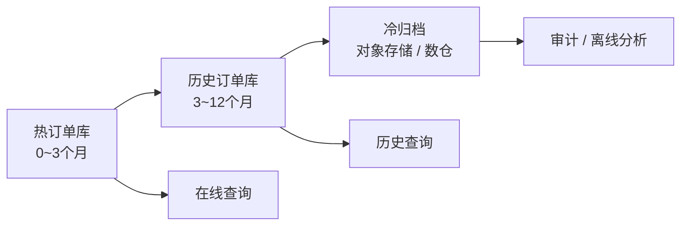

# 订单系统设计：每日 2000 万订单

> 这类题不是让你背“分库分表”，而是考察容量估算、数据模型、查询路径、事务边界、冷热治理和风险取舍。

## 一、题目理解

题目：

```text
设计一个订单系统，每日 2000 万订单，使用 MySQL 如何设计？
```

先不要直接回答“分 1024 张表”。要先澄清几个关键点：

- 订单类型：电商订单、外卖订单、打车订单还是支付订单？
- 写入峰值：2000 万是均匀写入，还是活动高峰集中写入？
- 查询路径：用户查订单多，商家查订单多，还是运营后台查订单多？
- 一致性要求：下单、支付、扣库存、发货是否强一致？
- 数据保留：热数据保留多久？历史订单是否频繁查询？
- 报表需求：实时统计还是离线统计？

面试可以假设：

```text
电商订单系统，日订单量 2000 万。
核心链路包括下单、支付回调、订单列表、订单详情、商家发货、售后。
用户侧读多写少，写后读要求较强一致。
历史订单允许走归档或离线链路。
```

## 二、容量估算

### 1. 写入量

日订单量：

```text
2000 万 / 天
```

平均 TPS：

```text
20,000,000 / 86,400 ≈ 231 单 / 秒
```

但系统不能按平均值设计。活动峰值可能是平均的 10 到 50 倍：

```text
峰值下单 TPS：2,000 ~ 10,000+
```

订单还会带来多张表写入：

- 订单主表。
- 订单明细表。
- 订单状态流水。
- 支付单。
- 优惠明细。
- 库存流水。
- 消息表或事件表。

所以数据库实际写入 QPS 会远高于订单 TPS。

### 2. 数据量

假设订单主表单行 1 KB：

```text
2000 万 * 1 KB ≈ 20 GB / 天
```

加上索引、明细、流水、binlog、备份，实际可能是数倍。

如果热数据保留 90 天：

```text
20 GB * 90 = 1.8 TB 订单主表数据
```

再考虑索引和明细，单表肯定不可控，需要拆分和冷热治理。

## 三、整体架构



核心思路：

- MySQL 承担核心交易数据。
- 分库分表承担写入和容量扩展。
- MQ 承担异步事件和削峰。
- 搜索系统支持复杂多维查询。
- 数仓或报表库承接统计和导出。
- 历史订单归档，避免热表无限膨胀。

## 四、数据模型

### 1. 订单主表

主表只放订单核心字段：

```sql
create table orders_xxx (
    id bigint not null,
    order_no varchar(64) not null,
    user_id bigint not null,
    merchant_id bigint not null,
    total_amount bigint not null,
    pay_amount bigint not null,
    status tinyint not null,
    pay_status tinyint not null,
    source tinyint not null,
    created_at datetime not null,
    updated_at datetime not null,
    paid_at datetime null,
    primary key (id),
    unique key uk_order_no (order_no),
    key idx_user_created (user_id, created_at),
    key idx_merchant_created (merchant_id, created_at),
    key idx_status_created (status, created_at)
);
```

说明：

- 金额用整数分，避免浮点误差。
- `order_no` 对外展示，唯一。
- `id` 可以是雪花 ID 或号段 ID。
- 大字段不要放主表。
- 状态字段要配合状态机控制。

### 2. 订单明细表

```sql
create table order_items_xxx (
    id bigint not null,
    order_id bigint not null,
    order_no varchar(64) not null,
    sku_id bigint not null,
    sku_name varchar(255) not null,
    quantity int not null,
    price bigint not null,
    created_at datetime not null,
    primary key (id),
    key idx_order_id (order_id),
    key idx_order_no (order_no)
);
```

订单明细通常和订单主表使用同样分片规则，保证同一订单的主表和明细落在同一分片，减少跨库查询。

### 3. 订单状态流水

```sql
create table order_status_logs_xxx (
    id bigint not null,
    order_id bigint not null,
    from_status tinyint not null,
    to_status tinyint not null,
    operator_type tinyint not null,
    operator_id bigint not null,
    reason varchar(255) not null,
    created_at datetime not null,
    primary key (id),
    key idx_order_id_created (order_id, created_at)
);
```

用途：

- 排查订单状态变更。
- 对账和审计。
- 支持客服查询。

## 五、分库分表设计

### 1. 分片键选择

订单系统最难点是多查询维度：

- 用户查自己的订单：适合按 `user_id` 分片。
- 商家查自己的订单：适合按 `merchant_id` 分片。
- 根据订单号查详情：适合订单号携带分片信息。
- 运营后台多条件查询：不适合直接扫分片。

常见选择：

```text
主订单表按 user_id 或 order_id 分片。
订单号中嵌入分片位，详情查询可直接路由。
商家维度查询通过冗余索引表或搜索系统支持。
```

### 2. 分片方案

示例：

```text
32 个库 * 每库 64 张表 = 2048 张表
```

路由：

```text
shard = user_id % 2048
db = shard / 64
table = shard % 64
```

注意：

- 具体数量要根据机器规格、峰值写入、数据保留周期评估。
- 不要在面试里死背固定数字。
- 要预留扩容空间。

### 3. 订单号设计

订单号可以包含：

```text
时间 + 分片号 + 序列号 + 校验位
```

好处：

- 根据订单号快速定位分片。
- 避免查详情时广播所有库表。
- 支持按时间大致排序。

但要注意：

- 不要暴露过多业务信息。
- 防止订单号可被枚举。
- 对外订单号和内部主键可以分离。

### 4. 多维查询怎么解决

用户维度：

- 主订单表按用户分片。
- 用户查订单天然路由。

商家维度：

- 建商家订单索引表：

```text
merchant_order_index
merchant_id, order_id, order_no, user_id, status, created_at
```

- 或同步到搜索系统。

运营后台：

- 不直接扫线上分库分表。
- 使用 ES、ClickHouse、数仓、报表库。
- 复杂导出走异步任务。



## 六、核心链路设计

### 1. 下单链路

简化流程：



关键点：

- 创建订单本身用本地事务。
- 订单号唯一索引兜底幂等。
- 库存可以同步预占，也可以异步扣减，取决于业务一致性。
- 订单事件用本地消息表或事务消息保证可靠投递。

### 2. 支付回调

支付回调特点：

- 第三方可能重复通知。
- 回调可能乱序。
- 业务必须幂等。

处理方式：

```sql
update orders_xxx
set pay_status = 1,
    status = 2,
    paid_at = now()
where order_no = ?
  and pay_status = 0;
```

判断影响行数：

- 1：首次支付成功。
- 0：重复回调或状态已变更。

同时：

- 支付流水表对第三方交易号建唯一索引。
- 支付成功事件写本地消息表。
- 履约、积分、通知异步消费。

### 3. 状态流转

状态机示例：



状态更新要带前置状态：

```sql
update orders_xxx
set status = ?
where order_no = ?
  and status = ?;
```

这样可以避免并发状态乱跳。

## 七、读写设计

### 1. 写入

写入主库：

- 创建订单。
- 支付状态更新。
- 发货状态更新。
- 售后状态更新。

写入优化：

- 核心链路 SQL 简单化。
- 事务短小。
- 不在事务内调用外部服务。
- 通过 MQ 异步处理非核心动作。

### 2. 读取

用户订单详情：

- 写后读强一致，优先读主库或做短时间会话粘滞。

用户订单列表：

- 可读从库。
- 使用 `(user_id, created_at)` 或 `(user_id, status, created_at)`。
- 游标分页。

商家后台：

- 读索引表、搜索系统或报表库。
- 不直接扫主订单分片。

运营报表：

- 走数仓、ClickHouse、ES，不打线上主库。

## 八、冷热数据治理

订单有明显生命周期：

```text
0 ~ 3 个月：热数据，频繁查询和售后
3 ~ 12 个月：温数据，低频查询
1 年以上：冷数据，主要用于审计和客服
```

治理方式：

- 热表只保留近期订单。
- 历史订单归档到历史库或对象存储。
- 用户查历史订单时走历史链路。
- 报表走离线数仓。
- 归档任务分批执行，避免大事务。



## 九、高可用和一致性

### 1. 主从和读写分离

- 主库负责写。
- 从库承担读。
- 强一致读走主库。
- 延迟高的从库自动摘除。
- 高可用候选从库不跑复杂查询。

### 2. 幂等

必须幂等的点：

- 创建订单。
- 支付回调。
- 库存扣减。
- 消息消费。
- 发货通知。

常见手段：

- 唯一索引。
- 幂等表。
- 状态机前置条件。
- 消息消费记录。

### 3. 分布式一致性

订单、库存、支付一般不建议放在一个巨大分布式强事务里。

常见选择：

- 创建订单：订单库本地事务。
- 库存：预占库存可以用 TCC 或库存服务本地事务。
- 支付成功后履约：本地消息表 / 事务消息，最终一致。
- 异常：补偿、关单、对账。

## 十、常见坑

- 按平均 231 TPS 设计，忽略峰值。
- 只按 `order_id` 分片，导致用户列表查询无法路由。
- 只按 `user_id` 分片，忽略商家后台查询。
- 后台报表直接扫线上分库分表。
- 订单表放太多大字段，列表查询回表和 IO 过重。
- 支付回调不幂等，重复通知导致重复履约。
- 状态更新不带前置状态，导致并发状态乱跳。
- 历史订单不归档，热表无限增长。
- 分库分表后没有扩容迁移方案。

## 十一、面试答题模板

```text
每日 2000 万订单，我不会只按平均 TPS 设计，因为活动峰值可能是平均的几十倍。
我会先做容量估算，然后把订单主表、明细表、状态流水拆开。
核心订单表按用户或订单号做分库分表，订单号携带分片信息，避免详情查询广播。
用户订单列表走主分片，商家维度通过索引表或搜索系统支持，运营报表走数仓或报表库。
写链路上，创建订单用本地事务，支付回调用唯一索引和状态机保证幂等，
库存、履约、积分等通过 MQ、本地消息表或事务消息做最终一致。
读链路上，强一致读走主库，普通列表读从库，并做延迟感知路由。
历史订单按生命周期归档，避免热表无限增长。
最后要补充高可用、主从延迟、幂等、分布式一致性和扩容迁移这些风险点。
```

## 十二、简版回答

如果面试官只给 3 分钟，可以这样答：

```text
我会先估算容量：2000 万每天平均 231 TPS，但峰值可能到几千甚至上万。
订单主表不能无限单表增长，需要分库分表和冷热归档。
主表只放核心字段，明细、流水、大字段拆开。
分片键要围绕核心查询，通常用户订单列表按 user_id 路由，订单号里带分片信息支持详情查询。
商家和运营多维查询不直接扫订单分片，而是通过索引表、ES 或报表库。
写入走主库，本地事务保证订单创建，支付回调和消息消费都要幂等。
库存、履约、积分通过 MQ 或 TCC/Saga 做最终一致。
读写分离要处理主从延迟，写后读和强一致读走主库。
历史订单要归档，后台导出和报表不能打线上主库。
```
