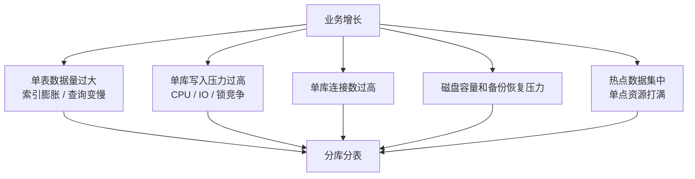
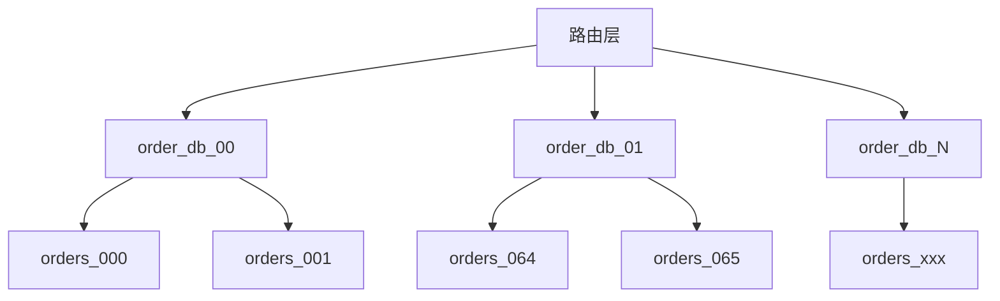
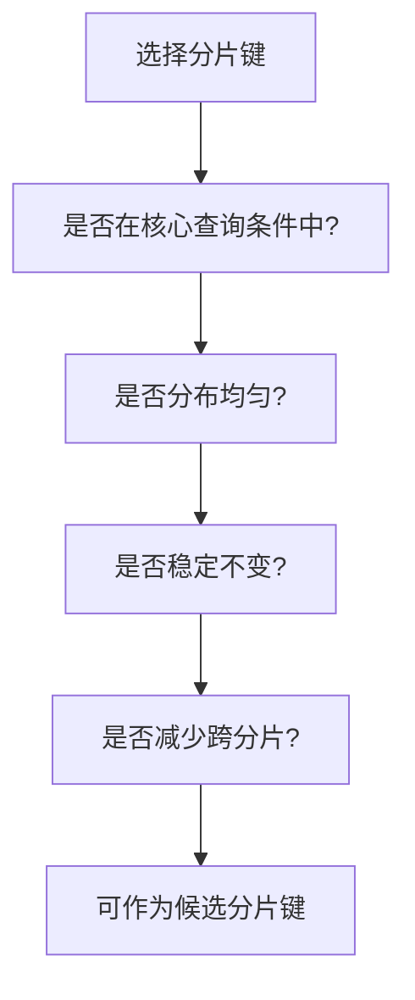
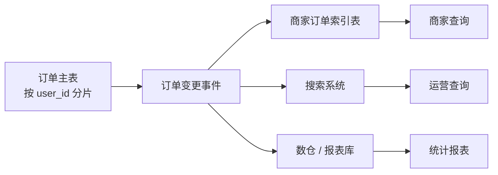
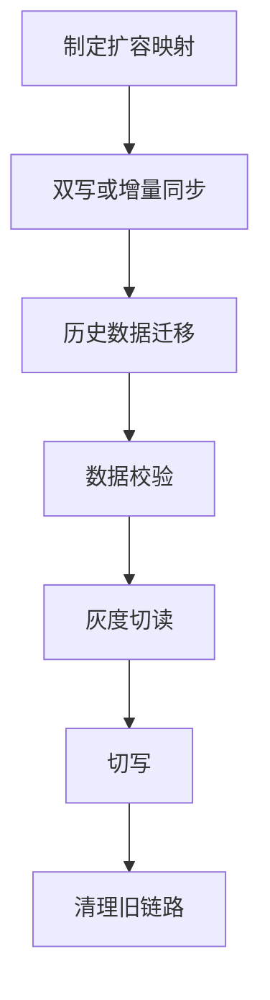

# 分库分表

> 分库分表不是“数据大了就拆”，而是在单库、单表、单机资源或查询模型已经成为瓶颈后，用复杂度换容量和吞吐。

## 一、为什么分库分表

MySQL 单表和单库会遇到几类瓶颈：



分库分表解决的核心问题：

- **容量扩展**：单表、单库装不下或维护成本太高。
- **写入扩展**：单库写 QPS 到瓶颈。
- **索引治理**：单表索引太大，查询和维护成本变高。
- **故障隔离**：不同分片压力隔离，降低单点爆炸半径。
- **数据生命周期治理**：和冷热归档结合，控制热数据规模。

但它带来的复杂度也很明显：

- 跨库事务。
- 跨分片查询。
- 跨分片排序分页。
- 全局唯一 ID。
- 扩容迁移。
- 数据倾斜。
- 运维和排障复杂度上升。

所以答题时要先说：

> 分库分表是后置手段。能通过 SQL 优化、索引优化、冷热归档、读写分离解决的，不要一上来就分库分表。

## 二、何时分表，何时分库

### 1. 只分表

只分表通常解决的是**单表过大**问题。

适合场景：

- 单库资源还够。
- 写入压力没有打满单库。
- 单表数据量太大，索引维护成本高。
- 想降低单表 DDL、备份、查询扫描压力。

例子：

```text
order_000
order_001
...
order_127
```

仍然在同一个数据库实例里。

优点：

- 改造成本比分库低。
- 事务、连接、运维复杂度相对低。
- 应用路由相对简单。

缺点：

- 单库 CPU、IO、连接数仍是瓶颈。
- 不能真正扩展写入能力。
- 表数量过多后，单实例元数据和运维也会变复杂。

### 2. 分库

分库解决的是**单库资源瓶颈**问题。

适合场景：

- 单库 CPU、IO、磁盘、连接数成为瓶颈。
- 写入 QPS 单实例扛不住。
- 单库备份恢复窗口过长。
- 需要把数据和流量分散到多台机器。

例子：

```text
order_db_00
order_db_01
...
order_db_31
```

每个库里再有若干张表。

优点：

- 能横向扩展写入和存储。
- 故障影响面缩小。
- 单库备份恢复压力下降。

缺点：

- 跨库事务复杂。
- 跨库查询复杂。
- 扩容迁移复杂。
- 需要路由层或分库分表中间件。

### 3. 分库分表

分库分表通常同时解决容量和吞吐。



常见配置：

```text
32 库 * 64 表 = 2048 张表
```

注意：

- 数量不是越多越好。
- 要结合数据量、峰值写入、机器规格、扩容周期。
- 表太多会增加运维、DDL、统计和路由复杂度。

## 三、拆分类型

### 1. 垂直拆分

按业务边界拆。

```text
用户库
订单库
支付库
库存库
营销库
```

适合：

- 不同业务模块耦合太重。
- 表很多，单库管理复杂。
- 不同业务的 QPS、容量、权限、生命周期不同。

优点：

- 业务边界清晰。
- 降低单库复杂度。
- 便于服务化。

问题：

- 跨业务 join 不再方便。
- 跨库事务变复杂。
- 需要接口或事件协作。

### 2. 水平拆分

按某个分片键把同一张逻辑表拆到多个库表。

```text
orders_000
orders_001
orders_002
```

适合：

- 单表数据量过大。
- 单业务写入压力过大。
- 需要水平扩容。

常见分片键：

- `user_id`
- `merchant_id`
- `order_id`
- `tenant_id`

## 四、分片键怎么选

好的分片键要满足：

- 高频查询一定带上。
- 分布均匀，避免热点。
- 稳定不变。
- 能减少跨分片查询。
- 最好和业务归属一致。



订单系统分片键取舍：

| 分片键 | 优点 | 问题 |
| --- | --- | --- |
| user_id | 用户查订单天然路由 | 商家查订单不方便 |
| merchant_id | 商家后台天然路由 | 用户查订单不方便 |
| order_id | 详情查询方便，分布均匀 | 用户/商家列表需要二级索引表 |
| tenant_id | 多租户隔离清晰 | 大租户可能热点 |

常见方案：

- 主订单表按 `user_id` 分片，满足用户侧核心查询。
- 订单号携带分片信息，订单详情可直接路由。
- 商家维度用索引表、ES 或报表库支持。

不要：

- 选择低区分度字段，比如 `status`。
- 选择会变更的字段。
- 选择核心查询不带的字段。
- 只考虑写入均匀，不考虑读取路由。

## 五、分库分表后怎么查询

### 1. 精确查询

如果查询带分片键：

```sql
select *
from orders
where user_id = ?
  and order_id = ?;
```

可以直接路由到目标库表。

这是最理想的情况。

### 2. 根据订单号查询

订单号可以设计为携带分片信息：

```text
时间 + 分片号 + 序列号 + 校验位
```

这样查订单详情时不需要广播所有分片。

### 3. 多维查询

例如商家查订单、运营按手机号/状态/时间查询。

不要直接扫所有分片。常见方案：

- 冗余索引表。
- ES / OpenSearch。
- ClickHouse / 数仓。
- 报表库。



## 六、分库分表后的事务

### 1. 尽量让一次业务落在一个分片

例如同一用户的一笔订单主表、明细表、状态流水使用相同分片键。

```text
orders_xxx
order_items_xxx
order_status_logs_xxx
```

都按 `user_id` 或 `order_id` 路由到同一库表组。

这样创建订单可以用本地事务完成。

### 2. 跨分片事务要慎重

跨分片更新会引入分布式事务。

常见处理：

- 能避免就避免。
- 用业务流程拆分。
- 用本地消息表或事务消息做最终一致。
- 资金、库存等强一致场景考虑 TCC 或专门服务收敛事务边界。

### 3. 订单系统例子

```text
订单创建：订单库本地事务
库存扣减：库存服务本地事务或 TCC
支付成功后履约：事务消息 / 本地消息表
积分发放：异步最终一致
```

不要把所有动作强行塞进一个巨大分布式事务里。

## 七、分页、排序、聚合怎么处理

### 1. 单分片分页

带分片键的列表：

```sql
where user_id = ?
order by created_at desc
limit 20
```

可以在单分片内完成。

### 2. 跨分片分页

如果不带分片键，需要多个分片查数据再归并排序。

问题：

- 性能差。
- 实现复杂。
- 页码越深越难处理。

解决：

- 避免线上跨分片分页。
- 使用搜索系统。
- 使用报表库。
- 限制查询条件和时间范围。

### 3. 聚合统计

不要在线上分片库直接做复杂聚合。

更合理：

- 实时计数表。
- 异步汇总表。
- ClickHouse / 数仓。
- 流式计算。

## 八、扩容迁移

分库分表最容易被忽略的是扩容。

### 1. 取模方案的问题

```text
shard = user_id % 1024
```

如果扩到 2048，大量数据要重新映射。

### 2. 扩容方式

常见方式：

- 预留足够分片数，先逻辑分片，后物理迁移。
- 使用一致性哈希或虚拟分片。
- 双写新旧库，校验后切流。
- 后台迁移历史数据。

扩容流程：



### 3. 迁移风险

- 数据丢失。
- 双写不一致。
- 增量同步延迟。
- 切流回滚困难。
- 业务代码路由兼容问题。

所以分库分表设计时要提前考虑扩容，不要等满了再想。

## 九、何时不该分库分表

不该分的情况：

- 只是 SQL 没优化。
- 索引设计明显不合理。
- 慢在深分页、`select *`、大字段。
- 历史数据可以归档但没做。
- 报表查询直接打主库。
- 单库资源还很充足。
- 团队没有运维和迁移能力。

优先顺序通常是：

```text
SQL 优化
  -> 索引优化
  -> 缓存 / 汇总表
  -> 冷热归档
  -> 读写分离
  -> 垂直拆分
  -> 水平分库分表
```

## 十、常见坑

- 只按数据量判断，不看查询模型和写入压力。
- 一上来就分库分表，复杂度暴涨。
- 分片键选错，核心查询不得不广播。
- 只考虑用户查询，忽略商家和运营查询。
- 分片数量设计过少，很快二次扩容。
- 分片数量设计过多，运维和 DDL 成本过高。
- 跨分片 join、排序、分页没有替代方案。
- 没有全局唯一 ID 方案。
- 没有扩容迁移方案。
- 没有数据校验和回滚方案。

## 十一、面试答题模板

### 为什么分库分表

```text
分库分表主要是为了解决单表容量、索引膨胀、单库写入、连接数、磁盘和备份恢复这些瓶颈。
但它会带来跨库事务、跨分片查询、分页排序、扩容迁移等复杂度，
所以我不会一上来就分，而是先做 SQL、索引、冷热归档和读写分离。
当单表或单库真的成为瓶颈时，再做分库分表。
```

### 何时分表，何时分库

```text
如果主要问题是单表太大、索引维护成本高，但单库资源还够，可以先只分表。
如果单库 CPU、IO、磁盘、连接数或写入 QPS 到瓶颈，就需要分库。
如果容量和吞吐都成为瓶颈，通常会分库分表一起做。
```

### 分片键怎么选

```text
分片键要看核心查询路径。
好的分片键应该高频查询带上、分布均匀、稳定不变，并且能减少跨分片查询。
订单系统里如果用户查订单是核心，可以按 user_id 分片；
订单详情可以让订单号携带分片信息；
商家和运营多维查询则通过索引表、搜索系统或报表库解决。
```

### 分库分表后最大的问题

```text
最大的问题不是怎么把表拆开，而是拆开之后怎么查、怎么保证一致性、怎么扩容。
跨分片查询、跨库事务、分页排序、全局 ID、数据迁移和一致性校验，都要提前设计。
```
