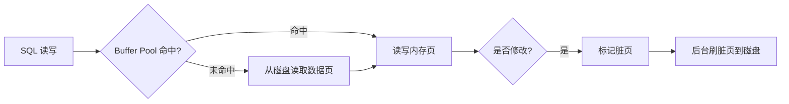
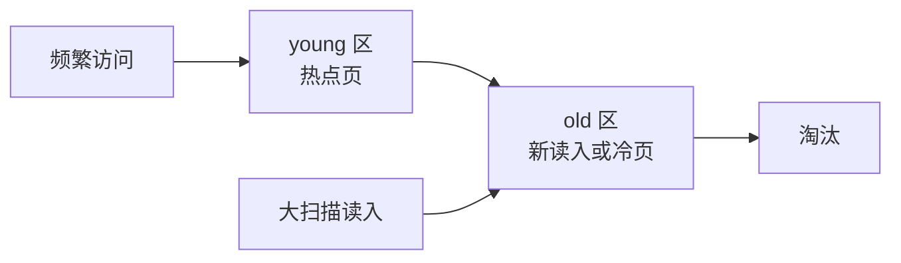
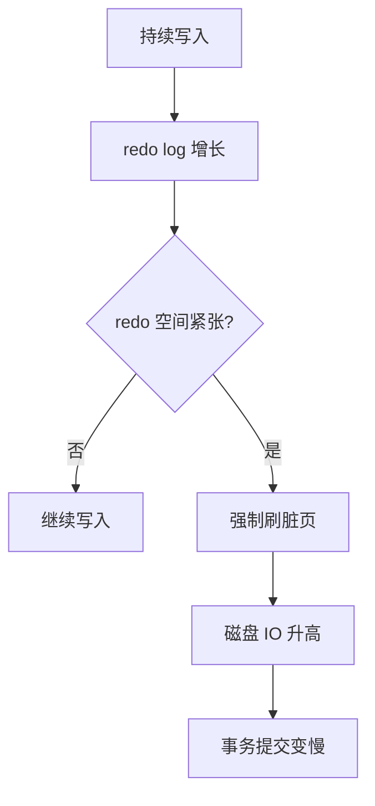

# InnoDB Buffer Pool

> Buffer Pool 是 InnoDB 性能的核心：MySQL 不是每次都直接读写磁盘，而是尽量在内存页里完成读写，再异步刷盘。

## 〇、核心提炼（5 段式）

### 核心机制（4 条必背）

1. **以 16KB 页为单位** - 所有数据 / 索引都以"页"为粒度读入 Buffer Pool（不是按行）
2. **改进 LRU（young/old 区域分离）** - 防全表扫描污染热点（新页先进 old 区，1s 后才升 young）
3. **WAL + 脏页延迟刷盘** - 修改先写 redo log + 改 Buffer Pool 中的页（脏页），异步刷盘
4. **Change Buffer + Adaptive Hash Index** - 非唯一二级索引插入暂存到 Change Buffer，热点 page 自建 Hash 索引

### 核心本质（必懂）

> Buffer Pool 的本质是 **"内存换性能"**，把磁盘 IO 转成内存访问：
>
> - **MySQL 不直接读写磁盘**：所有操作先在 Buffer Pool 完成，磁盘只在缺页和刷盘时介入
> - **命中率决定性能**：> 99% 是健康水位，< 95% 必有问题（内存小 / 全表扫频繁）
> - **WAL（Write-Ahead Log）让"写"不阻塞**：redo log 先持久化 → 脏页可以慢慢刷
>
> **关键事实**：
> - **不是 OS PageCache**：InnoDB 有自己的 Buffer Pool（绕过 OS），更精细控制
> - **改进 LRU 解决全表扫描问题**：传统 LRU 一次全表扫就把热点页挤出
> - **脏页刷盘是后台任务**：用户感知不到，但内存不够 / redo log 满会强制刷（业务卡顿根因）
>
> **CAP 视角**：
> - Buffer Pool 是性能优化层，不是数据安全保证
> - 真正的"持久"靠 redo log + binlog
> - Buffer Pool 挂了重启 → 从磁盘 + redo 恢复

### 完整流程（面试必背）

```
读路径（SELECT）:
  1. 查 Buffer Pool 哈希表（key=表空间 + 页号）
  2. 命中 → 直接返回（O(1)，~ns）
  3. 未命中（缺页）:
     a. 从 Free List 取一个空闲页（或从 LRU 尾淘汰一个）
     b. 从磁盘读取 16KB 页（~ms）
     c. 放入 LRU 的 old 区域中部（不是头部）
     d. 1 秒后再访问该页 → 才提升到 young 区
  4. 返回数据

写路径（UPDATE）:
  1. 找到（或加载）目标页到 Buffer Pool
  2. 修改内存中的页（变成脏页）
  3. 写 redo log buffer（WAL）
  4. 把页加入 Flush List（按 oldest modification LSN 排序）
  5. 返回用户成功（不等刷盘）

  脏页刷盘（异步）:
  - LRU 淘汰时刷
  - Checkpoint 推进时刷
  - 主线程定期检查脏页比例（innodb_max_dirty_pages_pct=75）
  - shutdown 前强制刷

崩溃恢复:
  Buffer Pool 全部丢失（在内存）
  → 从磁盘读取数据页（旧版本）
  → 应用 redo log → 恢复到崩溃前状态
  → undo log 回滚未提交事务
```

### 4 条核心机制 - 逐点讲透

#### 1. 16KB 页（InnoDB 最小 IO 单位）

```
为什么 16KB:
  - 磁盘扇区通常 4KB，16KB = 4 扇区（原子写）
  - 够大: 一页装多行（减少 IO 次数）
  - 够小: 单页加锁粒度不过粗

innodb_page_size 可配（4K/8K/16K/32K/64K）:
  默认 16K，一般不改
  改要 initdb 时配置，运行后不能改

页结构:
  File Header (38B)
  Page Header (56B)
  Infimum + Supremum (26B)  虚拟最小/最大记录（哨兵）
  User Records (变长)
  Free Space
  Page Directory (4B × N)    稀疏索引（4-8 行一组）
  File Trailer (8B)

为什么单页内有 Page Directory:
  二分查找定位 4-8 行的组
  组内链表扫描
  → 减少链表遍历
```

#### 2. 改进 LRU（young/old 区域分离）

```
传统 LRU 问题:
  全表扫描读入大量冷数据
  → 把热点页挤出 LRU 头部
  → Buffer Pool 被污染
  → 后续业务慢

InnoDB 改进:
  LRU 分两段:
    young 区域 (5/8) - 真正热点
    old 区域   (3/8) - 新读入 / 全表扫候选

关键参数:
  innodb_old_blocks_pct = 37      # old 区域占比
  innodb_old_blocks_time = 1000   # 新 page 在 old 区域待 1s 才能进 young

逻辑:
  新页 → 进 old 区域中部
  1s 内再访问 → 仍在 old（不提升）
  1s 后再访问 → 提升到 young 头部

为什么:
  全表扫描的页通常只被访问 1 次（且在 1s 内）
  → 留在 old 区域
  → 不污染 young 区域的热点页
```

#### 3. WAL + 脏页延迟刷盘

```
WAL（Write-Ahead Log）:
  规则: 修改数据前必须先写 redo log
  目的: redo 持久化后，即使脏页没刷盘，crash 后也能恢复

为什么不立即刷脏页:
  - 磁盘随机写贵（HDD ~10ms / SSD ~100us）
  - WAL 是顺序写（HDD 也很快）
  - 多次修改同一页合并为一次刷盘 → 性能提升 10-100x

刷盘时机（4 种）:
  1. LRU 淘汰: LRU 尾部脏页 → 先刷再淘汰
  2. Checkpoint: 周期推进 LSN，刷 Flush List 头部脏页
  3. 主线程定期: 检查脏页比例，超 innodb_max_dirty_pages_pct=75 强制刷
  4. shutdown: 完全刷完

风险（业务卡顿根因）:
  - 脏页比例突然升高 → 主线程拼命刷 → 业务受影响
  - redo log 满 → 必须刷脏页推进 checkpoint → 业务等待
  → 监控 Innodb_buffer_pool_pages_dirty / Innodb_log_waits
```

#### 4. Change Buffer + AHI（高级优化）

```
Change Buffer:
  目的: 非唯一二级索引更新的优化
  
  问题:
    UPDATE 非主键索引列时:
    - 目标页可能不在 Buffer Pool
    - 要先读 page（随机 IO）才能修改

  优化:
    不读页 → 把变更缓存到 Change Buffer
    后续读到该页时合并
    → 减少随机 IO

  适用:
    ✓ 二级索引（非主键、非唯一）
    ✗ 主键 / 唯一索引（必须立即读 page 校验唯一性）

  参数:
    innodb_change_buffer_max_size = 25  # Buffer Pool 中 CB 占比上限

Adaptive Hash Index (AHI):
  目的: 高频热点查找的优化
  
  InnoDB 监控访问模式:
    - 某页被频繁等值查询
    - 自动为该页某列建 Hash 索引
    - B+ 查找 O(log N) → O(1)

  完全自动:
    无需配置 / 索引定义
    innodb_adaptive_hash_index = ON (默认)

  有效场景:
    ✓ 等值查询频繁
    ✗ LIKE / 范围查询用不上
    ✗ AHI latch 高竞争时反而拖累
```

### 一句话总结

> Buffer Pool 的核心是：**16KB 页缓存 + 改进 LRU（young/old）+ WAL + 脏页延迟刷盘 + Change Buffer/AHI 优化**，
> 本质是 **"内存换性能"**：所有操作先在内存完成，磁盘只在缺页和刷盘时介入。
> **命中率 > 99% 是健康水位**，< 95% 必有问题。
> 改进 LRU 防全表扫描污染（新页 old 区滞留 1s），WAL 让写不阻塞（redo 持久化 + 脏页异步刷）。
> 业务卡顿常见根因：**脏页比例突升 / redo log 满 / 大事务持锁**。

---

## 一、核心原理

### 1. Buffer Pool 是什么

Buffer Pool 是 InnoDB 的内存缓存区，用来缓存：

- 数据页。
- 索引页。
- undo 页。
- 插入缓冲、自适应哈希索引等内部结构。

简化理解：

```text
磁盘上的表和索引被切成一页一页。
查询时先看 Buffer Pool。
命中就直接读内存。
未命中再从磁盘读页进 Buffer Pool。
更新时先改 Buffer Pool 中的页，并把页标记为脏页。
```



### 2. 页和脏页

InnoDB 以页为基本 IO 单位，常见页大小是 16KB。

脏页：

```text
Buffer Pool 中的数据页已经被修改，但还没刷回磁盘。
```

为什么可以不立刻刷盘？

- 事务提交时 redo log 已经记录了修改。
- 宕机后可以用 redo log 恢复。
- 数据页随机写成本高，延迟刷盘能提升性能。

### 3. LRU 和冷热数据

Buffer Pool 容量有限，需要淘汰旧页。

普通 LRU 的问题：

- 一次大查询可能把大量冷数据读入 Buffer Pool。
- 热点页被挤出去。
- 后续核心查询命中率下降。

InnoDB 使用改进版 LRU，把链表分为 young 区和 old 区，减少全表扫描对热点页的冲击。



### 4. 刷脏页

脏页会在后台刷盘，但某些情况下会触发明显抖动：

- redo log 空间快写满，需要推进 checkpoint。
- Buffer Pool 空闲页不足，需要淘汰脏页。
- 脏页比例过高。
- MySQL 正常关闭。

redo log 写满时，InnoDB 必须把一部分脏页刷回磁盘，释放 redo log 可覆盖空间。这个过程可能导致写入突然变慢。



## 二、高频面试题

### Buffer Pool 为什么能提升性能？

因为数据库访问有大量局部性：

- 热点数据会被反复访问。
- 索引页频繁使用。
- 内存访问远快于磁盘 IO。

Buffer Pool 让读请求尽量命中内存，让写请求先写内存和 redo log，减少同步随机写数据页。

### 脏页什么时候刷盘？

常见时机：

- 后台线程周期性刷。
- 脏页比例过高。
- redo log 空间不足。
- Buffer Pool 空闲页不足。
- 正常关闭实例。

答题要点：

> 事务提交不等于数据页立刻落盘，只要 redo log 按策略持久化，就可以保证崩溃恢复。

### MySQL 为什么会突然变慢？

一个常见原因是刷脏页压力突然上来：

- 写入高峰导致 redo log 快满。
- 后台刷脏页跟不上。
- InnoDB 被迫同步刷脏页。
- 磁盘 IO 飙升。
- 事务提交延迟上升。

其他原因还包括：

- Buffer Pool 命中率下降。
- 大查询冲刷缓存。
- 锁等待。
- 主从延迟。
- 连接池耗尽。

### 全表扫描为什么可能影响线上？

全表扫描会读入大量数据页：

- 占用 Buffer Pool。
- 挤出热点页。
- 增加磁盘 IO。
- 导致核心查询命中率下降。

所以大查询、报表、导出不应该直接跑在线上主库或核心从库。

## 三、典型场景

### 场景 1：活动后数据库写入突然抖动

现象：

- 写入 RT 突然升高。
- 磁盘 IO 飙升。
- CPU 不一定最高。
- 慢 SQL 不一定明显增加。

可能链路：

```text
写入高峰
  -> 脏页快速增加
  -> redo log 空间紧张
  -> checkpoint 推进
  -> 同步刷脏页
  -> 写入抖动
```

排查：

- 看磁盘 IO。
- 看 Buffer Pool 命中率。
- 看脏页比例。
- 看 redo log checkpoint 推进相关指标。
- 看是否有大事务、大批量写入。

处理：

- 拆大事务。
- 控制批量写入速度。
- 提升磁盘 IO 能力。
- 调整刷脏页相关参数。
- 削峰填谷，避免瞬时写爆。

### 场景 2：报表查询影响核心接口

现象：

- 报表查询执行期间，核心接口变慢。
- Buffer Pool 命中率下降。
- 从库复制延迟或查询延迟升高。

原因：

- 大范围扫描把冷数据读入 Buffer Pool。
- 热点页被淘汰。
- 磁盘 IO 被报表查询占用。

解决：

- 报表走专用从库。
- 复杂查询同步到数仓或 ClickHouse。
- 导出任务异步分批。
- 限制查询时间范围和并发。

## 四、常见坑

- 认为事务提交就是数据页立刻刷盘。
- 只看 SQL，不看 Buffer Pool 和磁盘 IO。
- 在线上主库跑大查询、导出、报表。
- 大批量写入不拆批，导致 redo 和脏页压力集中。
- 只关注 CPU，不关注 IO、脏页比例、命中率。

## 五、答题模板

```text
InnoDB 通过 Buffer Pool 缓存数据页和索引页。
读请求先查 Buffer Pool，命中就读内存；未命中才读磁盘。
更新时先改内存页并标记为脏页，同时写 redo log。
事务提交不要求数据页立刻刷盘，因为宕机后可以通过 redo log 恢复。
如果写入太快导致 redo 空间紧张或脏页比例过高，InnoDB 会强制刷脏页，这时 MySQL 可能突然抖动。
```
